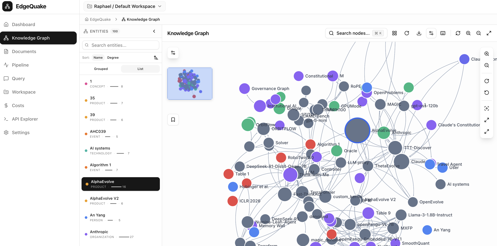

# EdgeQuake

<a href="https://trendshift.io/repositories/20893" target="_blank"></a>

> **Graph-RAG in Rust: one binary, one Postgres, any LLM — cloud or fully local.**  
> Turn documents into a knowledge graph and get answers with sources, not just similar chunks.

[](CHANGELOG.md)
[](https://github.com/raphaelmansuy/edgequake/actions/workflows/ci.yml)
[](https://www.rust-lang.org)
[](LICENSE)
[](https://github.com/raphaelmansuy/edgequake/stargazers)
[](docs/README.md)



**[Quick start](#quick-start) · [Pick your LLM](#pick-your-llm) · [How it works](#how-it-works) · [Honest numbers](#honest-numbers) · [Docs](docs/README.md)**

---

## Quick start

> Needs Docker. Nothing else to install: no Rust, no Node.js, no build.

```bash
curl -fsSL https://raw.githubusercontent.com/raphaelmansuy/edgequake/edgequake-main/quickstart.sh | sh
```

Then open **http://localhost:3000**. The wizard detects local servers (Ollama, LM Studio, oMLX, MLX-LM, llama.cpp) or takes an OpenAI / Anthropic key. Ports bind to `127.0.0.1` only.

```bash
# Headless / CI
quickstart.sh --yes --provider ollama
quickstart.sh --yes --provider omlx --base-url http://host.docker.internal:9050
```

**Ask your first question** (after dropping a PDF into the UI, or via the API):

```bash
curl -X POST http://localhost:8080/api/v1/documents/upload -F "file=@your-document.pdf"

curl -X POST http://localhost:8080/api/v1/query \
  -H "Content-Type: application/json" \
  -d '{"query": "What are the main concepts?", "mode": "hybrid"}'
```

> **Heads-up:** the Ollama path pulls chat and embedding models (multiple GB the first time). Use a cloud key if you want the fastest first answer.

| Service | Docker quickstart | `make dev` |
|---------|-------------------|------------|
| Web UI | http://localhost:3000 | http://localhost:3010 |
| REST API / Swagger | http://localhost:8080 · `/swagger-ui` | see `make status` |
| Health | http://localhost:8080/health | see `make status` |

Pin a version: `EDGEQUAKE_VERSION=0.32.2 sh quickstart.sh`. More options: [Docker deployment options](docs/operations/docker-deployment-options.md) · [Enable login](docs/operations/auth-quickstart.md).

---

## Pick your LLM

EdgeQuake is not tied to one vendor. Configure a **Connection** (URL + key, encrypted at rest) in **Settings → Connections**, or by environment variable.

| You want | Use | Guide |
|----------|-----|-------|
| Best quality, no hardware | OpenAI, Anthropic, Gemini, Mistral | [providers](docs/providers/index.md) |
| Private, runs on your Mac/PC | Ollama, LM Studio, oMLX, MLX-LM, llama.cpp, vLLM-MLX | [Ollama](docs/providers/ollama.md) · [oMLX](docs/providers/omlx.md) |
| Cloud LLM + local embeddings | Hybrid (`EDGEQUAKE_EMBEDDING_PROVIDER`) | [model roles](docs/providers/roles.md) |
| Your own gateway | Any OpenAI- or Anthropic-shaped server | [generic](docs/providers/openai-compatible.md) |

Each workspace can assign a different model to every role (extract, query, keyword, summary, embedding, vision). `POST /api/v1/providers/test` and `edgequake doctor` tell you what is actually reachable instead of guessing.

> Connections, `doctor`, and encrypted keys land with **v0.33.0** (schema 169, already on `main`). See [upgrade-to-0.33.0](docs/operations/upgrade-to-0.33.0.md).

---

## Why Graph-RAG

Vector search finds *similar text*. It struggles when the answer lives in the **relationships** between things: "who reports to whom", "which contract affects which product", "what themes run across these 200 papers".

EdgeQuake implements the [LightRAG algorithm](https://arxiv.org/abs/2410.05779) in Rust. Documents become entities and relationships; at query time it combines vector search with graph traversal.

## How it works

```text
Document ─► chunks ─► LLM entity + relation extraction ─► knowledge graph
                                                   │            │
                                          pgvector (embeddings) + Apache AGE (graph)
                                                   │            │
Question ─► keywords ─► vector search + graph walk ─► LLM ─► answer with sources
```

| Mode | Best for |
|------|----------|
| `naive` | Keyword-like lookups |
| `local` | Specific entities and their neighbours |
| `global` | Themes and high-level questions |
| `hybrid` *(default)* | Balanced, comprehensive answers |
| `mix` | Weighted vector + graph blend |
| `bypass` | Direct LLM, no retrieval |

Details: [feature tour](docs/concepts/feature-tour.md) · [LightRAG deep dive](docs/deep-dives/lightrag-algorithm.md) · [architecture](docs/architecture/overview.md).

---

## Honest numbers

We publish what we measured, including where we tie. Benchmark: GraphRAG-Bench medical-mid, EdgeQuake vs LightRAG, same corpus and models (`make bench`, n=200).

| Metric | EdgeQuake | LightRAG (Python) | Verdict |
|--------|-----------|-------------------|---------|
| Answer accuracy (Acc) | 0.792 | 0.786 | **Statistical tie** (95% CI includes 0) |
| Cold query p50 | 4447 ms | 4359 ms | ≈ tied (1.02×) |
| Warm query p50 (LLM + embed cache) | **82 ms** | 993 ms | EdgeQuake faster when cached |
| Evidence recall | 0.932 | 0.949 | LightRAG ahead |

So the pitch is not "more accurate than LightRAG". It is **the same retrieval quality, productionised**: a single Rust binary, Postgres as the only datastore, multi-tenant isolation, auth, a web UI, MCP, SDKs, and explicit, tested upgrades. Methodology and caveats: [EQ vs LightRAG](docs/comparisons/eq-vs-lightrag-acc-bench.md) · [vs GraphRAG](docs/comparisons/vs-graphrag.md) · [vs traditional RAG](docs/comparisons/vs-traditional-rag.md).

---

## Built for production

- **One datastore.** PostgreSQL 16/17/18 with pgvector + Apache AGE. No separate vector DB or graph DB to run.
- **Safe upgrades.** The API never migrates your database. `edgequake migrate` is explicit, progressive, and replay-tested from every published release ([SPEC-150](specs/150-reliable-migration-system/README.md), [upgrading](docs/operations/upgrading.md)).
- **Secure defaults.** Quickstart binds to loopback; secrets are generated; connection keys are AES-256-GCM encrypted and write-only ([SECURITY.md](SECURITY.md), [SPEC-163](specs/163-onboarding-provider-config/README.md)).
- **Multi-tenant.** Fail-closed workspace isolation for query, delete, and recovery. Built-in auth, SSO (Keycloak/OIDC), and audit logging.
- **PDF vision pipeline.** Text mode by default (pdfium embedded); vision mode for tables, scans, and complex layouts, with automatic fallback.
- **Honest health.** `/health` probes real providers; `edgequake doctor` checks DB, schema, roles, and security posture.
- **Multi-arch images.** `linux/amd64` + `linux/arm64` on GHCR, every release.

## Integrations

| | |
|---|---|
| **SDKs** | [Python](sdks/python/README.md) · [TypeScript](sdks/typescript/README.md) · [Rust](sdks/rust/README.md) · [Go, Java, Kotlin, C#, PHP, Ruby, Swift](sdks/) |
| **AI agents** | [MCP server](mcp/) |
| **Apps** | [OpenWebUI](docs/integrations/open-webui.md) · [LangChain](docs/integrations/langchain.md) |
| **API** | OpenAPI 3.0, SSE streaming, batch ingestion · [REST reference](docs/api-reference/rest-api.md) |

---

## Documentation

| I want to… | Read |
|------------|------|
| Get running | [Getting started](docs/getting-started/index.md) · [First RAG app](docs/tutorials/first-rag-app.md) |
| Choose / configure a model | [Providers](docs/providers/index.md) · [Env reference](docs/operations/env-reference.md) |
| Deploy | [Deployment](docs/operations/deployment.md) · [Docker options](docs/operations/docker-deployment-options.md) · [Configuration](docs/operations/configuration.md) |
| Upgrade | [Upgrading](docs/operations/upgrading.md) · [What's new](docs/whats-new.md) · [CHANGELOG](CHANGELOG.md) |
| Operate | [Monitoring](docs/operations/monitoring.md) · [Runtime auth](docs/operations/runtime-auth-hardening.md) · [Troubleshooting](docs/troubleshooting/) |
| Understand | [Architecture](docs/architecture/overview.md) · [Deep dives](docs/deep-dives/lightrag-algorithm.md) · [FAQ](docs/faq.md) |

## Contributing

Contributions are welcome, from typo fixes to new providers. Start with [CONTRIBUTING.md](CONTRIBUTING.md); for a local build run `make install && make dev` (see [AGENTS.md](AGENTS.md) and the [pre-delivery checklist](docs/operations/pre-delivery-checklist.md)).

- **Found a bug or want a feature?** [Open an issue](https://github.com/raphaelmansuy/edgequake/issues).
- **Questions or show-and-tell?** [GitHub Discussions](https://github.com/raphaelmansuy/edgequake/discussions).
- **Like it?** A ⭐ helps others find the project.

## Acknowledgments

EdgeQuake implements the [LightRAG algorithm](https://arxiv.org/abs/2410.05779) by Zirui Guo, Lianghao Xia, Yanhua Yu, Tu Ao, and Chao Huang. Also inspired by Microsoft's [GraphRAG](https://arxiv.org/abs/2404.16130).

## License

Apache License 2.0, see [LICENSE](LICENSE). **Copyright 2024-2026 Raphaël MANSUY**

## Star History

[](https://star-history.dera.page/#raphaelmansuy/edgequake&type=date&legend=top-left)
