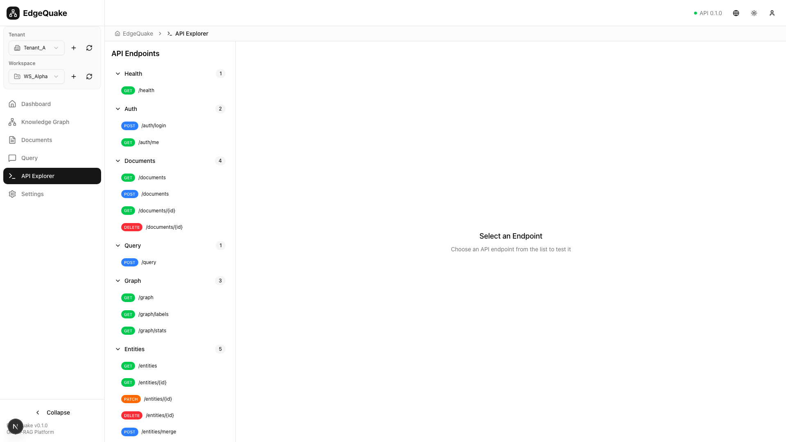

# API Explorer Page UX/UI Audit

## 1. What I Reviewed

- **Route**: `/api-explorer`
- **Key UI Regions**:
  - Left panel: API endpoint tree organized by category
  - Right panel: Endpoint detail/testing area
  - Category headers with endpoint counts
  - HTTP method badges (GET, POST, DELETE, PATCH)
- **Components**: `ApiExplorer` (shared component)

### Screenshots

| State     | Screenshot                                                         |
| --------- | ------------------------------------------------------------------ |
| Full Page |          |
| Viewport  |  |
| Endpoints |             |

---

## 2. Issues

### Critical

1. **No Request/Response Panel**

   - Right panel shows "Select an Endpoint" placeholder
   - No visible way to actually test API endpoints
   - Endpoint details, parameters, and response schema not visible
   - Defeats the purpose of an API Explorer

2. **No Authentication Context**
   - API Explorer doesn't show current auth state
   - No way to add/modify authorization headers
   - Users can't test authenticated endpoints

### Major

3. **Endpoint List Lacks Details**

   - Shows only method and path (e.g., "GET /documents")
   - No description of what each endpoint does
   - No indication of required parameters
   - No response type hints

4. **Categories All Expanded by Default**

   - 8 categories × multiple endpoints = long scrolling list
   - Makes it hard to find specific endpoints
   - No collapse-all / expand-all controls

5. **HTTP Method Badges Small**

   - GET (green), POST (blue), DELETE (red), PATCH (orange)
   - Badges are small (text only, no background)
   - Could benefit from more visual distinction

6. **No Search/Filter**
   - Can't search for endpoints by name or path
   - No way to filter by HTTP method
   - No way to filter by category

### Minor

7. **Category Icons Missing**

   - Categories have expand/collapse arrows only
   - No icons to visually distinguish Health vs Auth vs Documents
   - Harder to scan quickly

8. **Endpoint Count Badges**

   - Each category shows count (e.g., "Documents 4")
   - Count badge styling is subtle
   - Could be more prominent

9. **No Copy to Clipboard**
   - Can't copy endpoint paths
   - No curl command generation
   - No code snippets for integration

---

## 3. Recommendations

### Full Request/Response Panel

```
┌───────────────────────────────────────────────────────────────────────────────┐
│ POST /documents                                                         [▼]  │
├───────────────────────────────────────────────────────────────────────────────┤
│ Upload a new document for knowledge graph extraction                          │
│                                                                               │
│ REQUEST                                                                       │
│ ─────────────────────────────────────────────────────────────────────────    │
│ Headers                                                                       │
│ ┌─────────────────────────────────────────────────────────────────────────┐  │
│ │ Content-Type: application/json                                          │  │
│ │ Authorization: Bearer [token...] 🔓                                     │  │
│ └─────────────────────────────────────────────────────────────────────────┘  │
│                                                                               │
│ Body                                                                          │
│ ┌─────────────────────────────────────────────────────────────────────────┐  │
│ │ {                                                                       │  │
│ │   "title": "My Document",                                               │  │
│ │   "content": "Document content here...",                                │  │
│ │   "metadata": {}                                                        │  │
│ │ }                                                                       │  │
│ └─────────────────────────────────────────────────────────────────────────┘  │
│                                                                               │
│ [▶ Send Request]                                                    [📋 Copy]│
├───────────────────────────────────────────────────────────────────────────────┤
│ RESPONSE                                                  Status: 201 ✓      │
│ ─────────────────────────────────────────────────────────────────────────    │
│ ┌─────────────────────────────────────────────────────────────────────────┐  │
│ │ {                                                                       │  │
│ │   "id": "doc_123",                                                      │  │
│ │   "title": "My Document",                                               │  │
│ │   "status": "processing"                                                │  │
│ │ }                                                                       │  │
│ └─────────────────────────────────────────────────────────────────────────┘  │
│                                                     Time: 245ms | Size: 142B │
└───────────────────────────────────────────────────────────────────────────────┘
```

1. **Full request builder** with headers, body, params
2. **Response viewer** with syntax highlighting
3. **Status, timing, and size metrics**
4. **Copy as curl/fetch/Python**

### Enhanced Endpoint List

```
Current:                           Recommended:
┌─────────────────────────┐       ┌─────────────────────────────────────────┐
│ GET /documents          │       │ 📄 GET /documents                       │
│                         │       │    List all documents with pagination   │
│                         │       │    Params: page, page_size, status      │
└─────────────────────────┘       └─────────────────────────────────────────┘
```

1. **Endpoint descriptions** visible in list
2. **Parameter hints** showing required/optional params
3. **Response type** indicator (JSON, Stream, etc.)

### Search and Filter

```
┌─────────────────────────────────────────────────────────────────────────────┐
│ 🔍 Search endpoints...                  [All ▼] [GET ▼] [POST ▼] [More ▼]  │
├─────────────────────────────────────────────────────────────────────────────┤
│ [Collapse All]  [Expand All]                                                │
│                                                                             │
│ ▼ 📁 Documents (4)                                                          │
│     GET  /documents              List all documents                         │
│     POST /documents              Upload new document                        │
│     GET  /documents/{id}         Get document by ID                         │
│     DEL  /documents/{id}         Delete document                            │
│                                                                             │
│ ▼ 📁 Query (1)                                                              │
│     POST /query                  Execute knowledge graph query              │
└─────────────────────────────────────────────────────────────────────────────┘
```

1. **Text search** filters endpoints in real-time
2. **Method filters** (GET, POST, DELETE, etc.)
3. **Collapse/Expand all** buttons
4. **Category icons** for visual distinction

### Authentication Panel

```
┌─────────────────────────────────────────────────────────────────────────────┐
│ 🔐 Authentication                                          [Logged in ✓]   │
├─────────────────────────────────────────────────────────────────────────────┤
│ Token: Bearer eyJhbG...             [Copy] [Refresh] [Clear]                │
│ User: admin@example.com             Expires: 2 hours                        │
└─────────────────────────────────────────────────────────────────────────────┘
```

1. **Current auth state** visible
2. **Token management** (copy, refresh, clear)
3. **Auto-include** in requests

### Code Generation

```
┌─────────────────────────────────────────────────────────────────────────────┐
│ 📋 Copy as...                                                               │
├─────────────────────────────────────────────────────────────────────────────┤
│ [curl]  [fetch]  [Python]  [Rust]  [TypeScript]                            │
├─────────────────────────────────────────────────────────────────────────────┤
│ curl -X POST http://localhost:8080/documents \                              │
│   -H "Content-Type: application/json" \                                     │
│   -H "Authorization: Bearer $TOKEN" \                                       │
│   -d '{"title": "My Document", "content": "..."}'                          │
└─────────────────────────────────────────────────────────────────────────────┘
```

---

## 4. Rationale

- **Request/Response Panel**: API Explorers exist to test APIs - this is the core functionality
- **Endpoint Descriptions**: Self-documenting API reference reduces need for external docs
- **Search/Filter**: Developer productivity requires fast navigation
- **Authentication**: Real-world API testing requires proper auth handling
- **Code Generation**: Copy-paste workflow is the primary use case for API explorers

---

## 5. Acceptance Criteria

- [ ] Clicking an endpoint opens a request builder panel
- [ ] Request builder includes headers, body, and query params editors
- [ ] Send Request button executes the request and shows response
- [ ] Response shows status code, timing, and size
- [ ] Endpoint list shows descriptions (not just paths)
- [ ] Search input filters endpoints in real-time
- [ ] Method filter buttons work (GET, POST, DELETE)
- [ ] Collapse/Expand all buttons exist and work
- [ ] Authentication panel shows current auth state
- [ ] Copy as curl/fetch/Python buttons generate code

---

## 6. Layout Representation

### Current Layout

```
┌──────────────────────────────────────────────────────────────────────────────┐
│ Sidebar │  🏠 > 🔌 API Explorer                                              │
│         ├────────────────────────────────────────────────────────────────────┤
│         │ API Endpoints              │  Select an Endpoint                  │
│         │ ──────────────────────────│                                       │
│         │ ▼ Health                1 │  Choose an API endpoint from the     │
│         │   GET /health             │  list to test it                      │
│         │ ▼ Auth                  2 │                                       │
│         │   POST /auth/login        │                                       │
│         │   GET  /auth/me           │                                       │
│         │ ▼ Documents             4 │                                       │
│         │   GET  /documents         │                                       │
│         │   POST /documents         │                                       │
│         │   GET  /documents/{id}    │                                       │
│         │   DEL  /documents/{id}    │                                       │
│         │ ▼ Query                 1 │                                       │
│         │   POST /query             │                                       │
│         │ ▼ Graph                 3 │                                       │
│         │   GET  /graph             │                                       │
│         │   GET  /graph/labels      │                                       │
│         │   GET  /graph/stats       │                                       │
│         │ ▼ Entities              5 │                                       │
│         │   ...                     │                                       │
│         │ ▼ Relationships         2 │                                       │
│         │   ...                     │                                       │
│         │ ▼ Pipeline              1 │                                       │
│         │   GET  /pipeline/status   │                                       │
└─────────┴───────────────────────────┴────────────────────────────────────────┘

Left panel: ~350px (endpoint list)
Right panel: ~1058px (empty placeholder)
```

### Recommended Layout

```
┌──────────────────────────────────────────────────────────────────────────────┐
│ Sidebar │  🏠 > 🔌 API Explorer                         [🔐 Logged in ✓]    │
│         ├────────────────────────────────────────────────────────────────────┤
│         │ [🔍 Search endpoints...]                                          │
│         │ [All] [GET] [POST] [DELETE]        [Collapse All] [Expand All]   │
│         ├─────────────────────────┬──────────────────────────────────────────┤
│         │ ▼ 📄 Documents (4)      │ POST /documents                    [📋] │
│         │   GET  /documents       │ ──────────────────────────────────────── │
│         │   List all documents    │ Upload a new document for KG extraction │
│         │   ────────────────────  │                                          │
│         │   POST /documents    ✓ │ REQUEST                                   │
│         │   Upload new document   │ ┌────────────────────────────────────┐   │
│         │   ────────────────────  │ │ Headers | Body | Params            │   │
│         │   GET  /documents/{id}  │ │ ──────────────────────────────────│   │
│         │   Get by ID             │ │ Content-Type: application/json    │   │
│         │   ────────────────────  │ │                                    │   │
│         │   DEL  /documents/{id}  │ │ {                                  │   │
│         │   Delete document       │ │   "title": "string",               │   │
│         │                         │ │   "content": "string"              │   │
│         │ ▶ 📁 Query (1)         │ │ }                                  │   │
│         │ ▶ 📁 Graph (3)         │ └────────────────────────────────────┘   │
│         │ ▶ 📁 Entities (5)      │                                          │
│         │ ▶ 📁 Relationships (2) │ [▶ Send Request]                   [📋] │
│         │ ▶ 📁 Pipeline (1)      │ ──────────────────────────────────────── │
│         │                         │ RESPONSE                                 │
│         │                         │ ┌────────────────────────────────────┐   │
│         │                         │ │ Status: 201 Created   Time: 245ms │   │
│         │                         │ │ {                                  │   │
│         │                         │ │   "id": "doc_123",                 │   │
│         │                         │ │   "status": "processing"           │   │
│         │                         │ │ }                                  │   │
│         │                         │ └────────────────────────────────────┘   │
└─────────┴─────────────────────────┴──────────────────────────────────────────┘
```

---

## Implementation Priority

| Issue                  | Effort | Impact   | Priority           |
| ---------------------- | ------ | -------- | ------------------ |
| Request/Response panel | High   | Critical | **P1 - Must Have** |
| Endpoint descriptions  | Medium | High     | **P2 - Next**      |
| Search/filter          | Medium | Medium   | **P2 - Next**      |
| Auth panel             | Medium | High     | **P2 - Next**      |
| Code generation        | Medium | Medium   | **P3 - Later**     |
| Collapse/Expand all    | Low    | Low      | **P1 - Quick Win** |
| Category icons         | Low    | Low      | **P3 - Later**     |
