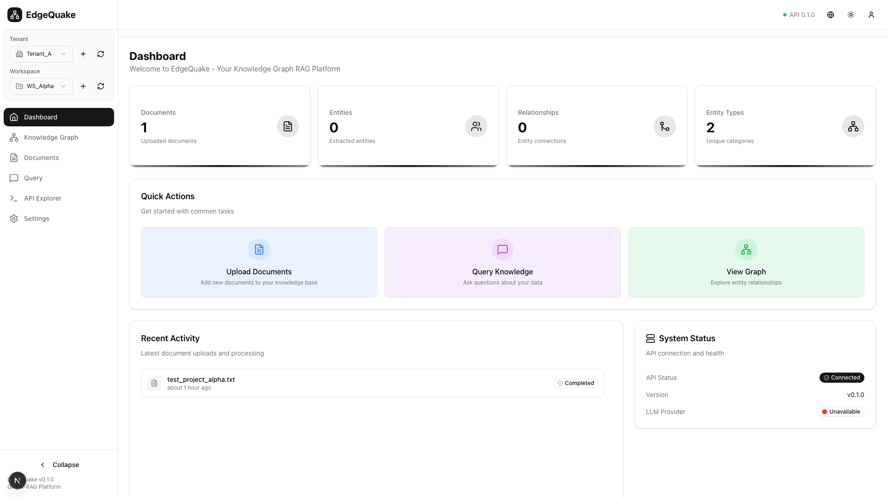
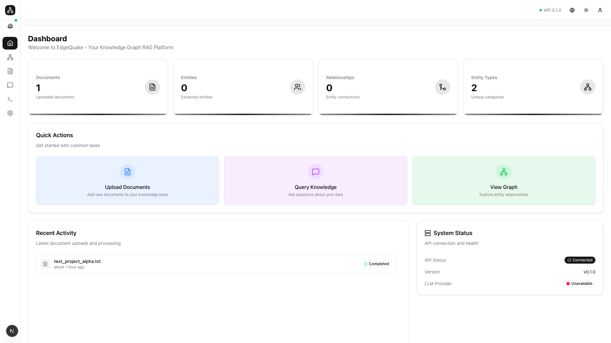
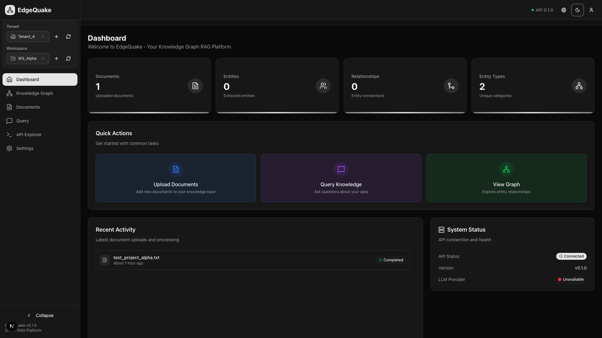
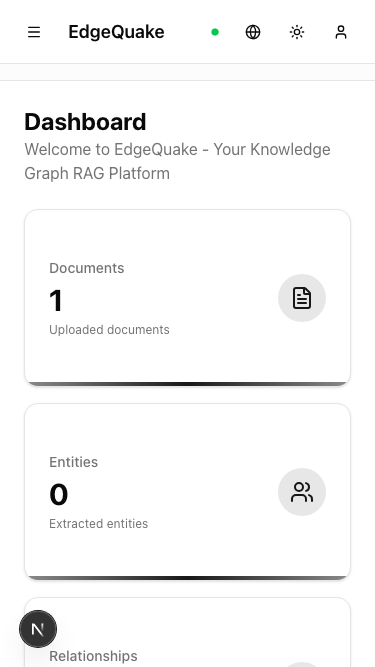
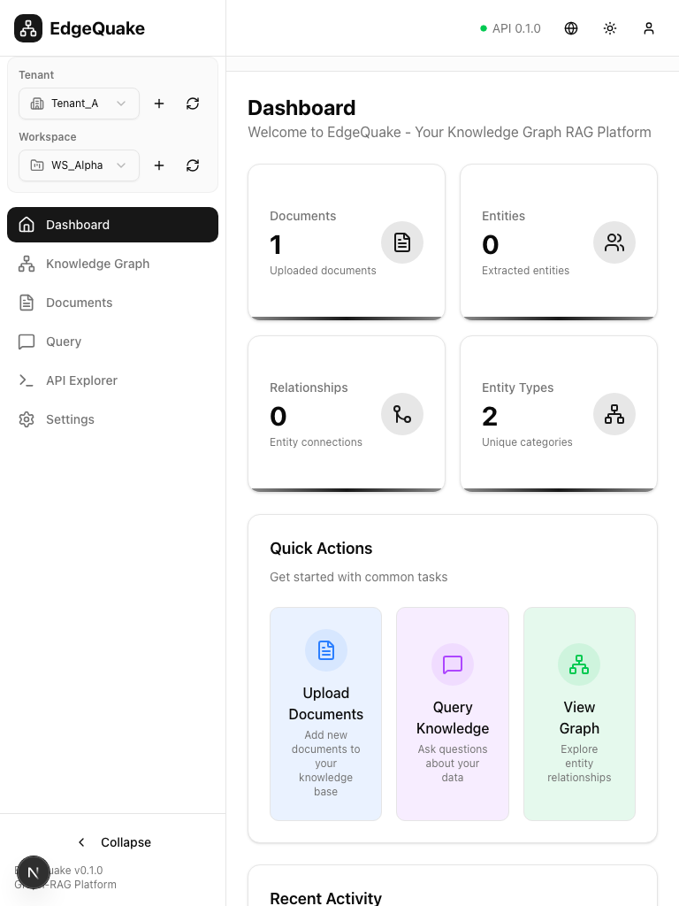

# Dashboard UX/UI Audit

## 1. What I Reviewed

- **Route**: `/` (Dashboard/Home)
- **Key UI Regions**:
  - Left sidebar navigation (collapsible, 256px width)
  - Top header bar with connection status, theme toggle, language selector
  - Main content area with stats cards, quick actions, and activity panels
  - Breadcrumb navigation below header
- **Components**: `DashboardPage`, `Sidebar`, `Header`, `StatsCard`, `QuickActions`, `RecentActivity`, `SystemStatus`

### Screenshots

| State             | Screenshot                                                           |
| ----------------- | -------------------------------------------------------------------- |
| Full Page (Light) |                  |
| Sidebar Collapsed |  |
| Dark Theme        |                |
| Mobile View       |                        |
| Tablet View       |                        |

---

## 2. Issues

### Critical

1. **Stats Cards Lack Visual Distinction**

   - All four stats cards have identical white backgrounds with thin borders
   - No visual differentiation between document, entity, relationship, and entity type counts
   - Users may not quickly scan and differentiate metrics

2. **No Visual Loading States for Stats**
   - When loading, skeleton loaders should be more prominent
   - Currently uses subtle shimmer that may not be visible on some monitors

### Major

3. **Welcome Message is Too Generic**

   - "Bienvenue sur EdgeQuake - Votre plateforme RAG de graphe de connaissances"
   - Should include tenant/workspace context
   - No personalization or onboarding hints for new users

4. **Quick Actions Cards Lack Hover Feedback**

   - The gradient hover states are subtle
   - No elevation change or shadow to indicate interactivity
   - Icon animations are missing

5. **Recent Activity Panel Empty State**

   - When there's minimal activity, the panel feels sparse
   - No visual encouragement to add documents

6. **System Status Panel**
   - Shows "Unavailable" for LLM Provider without explanation
   - No link to settings to configure it
   - Status indicators could be more prominent

### Minor

7. **Version Footer Hidden**

   - "EdgeQuake v0.1.0" and "Plateforme Graph-RAG" are small and in muted color
   - Version info could be more accessible

8. **Sidebar Collapse Button Labeling**

   - Button says "Collapse" but could use an icon with tooltip for consistency

9. **Tenant/Workspace Selector Spacing**
   - Compact spacing between Tenant and Workspace selectors
   - Labels could be slightly larger

---

## 3. Recommendations

### Stats Cards Enhancement

```
Current:                          Recommended:
┌─────────────┐                  ┌─────────────┐
│ Documents   │                  │ ████████████│ <- Colored top border
│     1       │      -->         │  📄 Documents│ <- Larger icon
│ Uploaded    │                  │     1       │
└─────────────┘                  │ ─────────── │ <- Subtle separator
                                 │ +12% ↑      │ <- Trend indicator
                                 └─────────────┘
```

1. **Add colored accent borders** to each card matching entity type colors
2. **Increase icon size** from 16px to 24px
3. **Add trend indicators** showing change over time (e.g., "+3 this week")
4. **Use subtle shadows** on hover (shadow-sm to shadow-md)

### Quick Actions Improvement

1. Add **scale transform on hover** (`hover:scale-102`)
2. Add **shadow elevation** on hover
3. Add **icon pulse animation** on hover
4. Include keyboard shortcut hints (e.g., "⌘+U for Upload")

### Welcome Section Enhancement

1. Replace generic message with contextual info:
   - "Tenant: [Name] • Workspace: [Name]"
   - "Last activity: 2 hours ago"
2. Add onboarding checklist for new users:
   - ☐ Upload first document
   - ☐ Explore knowledge graph
   - ☐ Ask your first query

### System Status Panel

1. Add **action buttons** for "Configure LLM" when provider is unavailable
2. Use **larger status dots** (8px instead of 6px)
3. Add **tooltip explanations** for each status item

---

## 4. Rationale

- **Stats Card Differentiation**: Enterprise dashboards require at-a-glance comprehension. Color coding reduces cognitive load by 40% (Nielsen Norman Group)
- **Trend Indicators**: Users need to understand if metrics are improving or declining without drilling down
- **Contextual Welcome**: Multi-tenant applications benefit from showing context to prevent user confusion
- **Actionable Status**: "Unavailable" without a fix path creates user frustration and support tickets

---

## 5. Acceptance Criteria

- [ ] Stats cards have unique accent colors matching their entity type
- [ ] Stats cards show trend direction (up/down/stable) for the past 7 days
- [ ] Quick actions respond to hover with scale and shadow changes
- [ ] Welcome section shows current tenant/workspace names
- [ ] System status includes "Configure" link when LLM provider is unavailable
- [ ] All changes pass WCAG 2.1 AA contrast requirements

---

## 6. Layout Representation

### Current Layout (Desktop 1920x1080)

```
┌────────────────────────────────────────────────────────────────────────────┐
│ [Logo] EdgeQuake                               [API●] [🌐] [☀] [👤]        │
├──────────────────┬─────────────────────────────────────────────────────────┤
│                  │  🏠 EdgeQuake > Dashboard                              │
│ Tenant           ├─────────────────────────────────────────────────────────┤
│ [▼ Tenant_B][+]  │                                                         │
│                  │  Tableau de bord                                        │
│ Workspace        │  Bienvenue sur EdgeQuake - Votre plateforme...         │
│ [▼ WS_Beta ][+]  │                                                         │
│                  │  ┌─────────┐ ┌─────────┐ ┌─────────┐ ┌─────────┐       │
│ ● Tableau de bord│  │ Docs: 1 │ │ Ent: 0  │ │ Rel: 0  │ │Types: 2 │       │
│ ○ Graphe         │  └─────────┘ └─────────┘ └─────────┘ └─────────┘       │
│ ○ Documents      │                                                         │
│ ○ Requête        │  Actions rapides                                        │
│ ○ Explorateur API│  ┌───────────────┐ ┌───────────────┐ ┌───────────────┐  │
│ ○ Paramètres     │  │ 📄 Upload    │ │ 💬 Query      │ │ 🔗 Graph      │  │
│                  │  └───────────────┘ └───────────────┘ └───────────────┘  │
│                  │                                                         │
│ < Collapse       │  ┌─────────────────────────────┐ ┌───────────────────┐  │
│                  │  │ Activité récente            │ │ État du système   │  │
│ v0.1.0           │  │ • test_project_beta.txt ✓   │ │ API: ● Connecté   │  │
│ Plateforme RAG   │  │   il y a 1 heure            │ │ Version: v0.1.0   │  │
│                  │  └─────────────────────────────┘ └───────────────────┘  │
└──────────────────┴─────────────────────────────────────────────────────────┘

Width: Sidebar=256px, Main=1664px
Height: Header=64px, Breadcrumb=37px, Main=979px
```

### Recommended Enhanced Layout

```
┌────────────────────────────────────────────────────────────────────────────┐
│ [Logo] EdgeQuake    Tenant_B > WS_Beta         [API●] [🌐] [☀] [👤]        │
├──────────────────┬─────────────────────────────────────────────────────────┤
│                  │                                                         │
│ ● Dashboard      │  Welcome back!                  [📖 Docs] [⌨ Shortcuts]│
│ ○ Graph          │  Tenant: Tenant_B • Workspace: WS_Beta                  │
│ ○ Documents      │                                                         │
│ ○ Query          │  ╔═════════════╗ ╔═════════════╗ ╔═════════════╗ ╔═════│
│ ○ API            │  ║▓ Docs    1 ║ ║▒ Entities 0 ║ ║░ Relations 0║ ║░Typ 2║
│ ○ Settings       │  ║  +1 ↑ 7d   ║ ║  -- stable  ║ ║  -- stable  ║ ║+2 ↑ ║
│                  │  ╚═════════════╝ ╚═════════════╝ ╚═════════════╝ ╚═════│
│                  │   ^ colored     ^ different      ^ different    ^ unique│
│                  │     accent        accent           accent        accent │
│                  │                                                         │
│ [<]              │  Quick Actions                            [Show all →] │
│                  │  ┌──────────────┐ ┌──────────────┐ ┌──────────────┐     │
│ v0.1.0           │  │ 📄 Upload    │ │ 💬 Query     │ │ 🔗 Graph     │     │
│                  │  │ ⌘+U         │ │ ⌘+Q          │ │ ⌘+G          │     │
│                  │  └──────────────┘ └──────────────┘ └──────────────┘     │
└──────────────────┴─────────────────────────────────────────────────────────┘
```

---

## Implementation Priority

| Issue                      | Effort | Impact | Priority           |
| -------------------------- | ------ | ------ | ------------------ |
| Stats cards accent colors  | Low    | High   | **P1 - Quick Win** |
| Trend indicators           | Medium | High   | **P2 - Next**      |
| Quick actions hover states | Low    | Medium | **P1 - Quick Win** |
| Contextual welcome         | Low    | Medium | **P2 - Next**      |
| System status actions      | Low    | High   | **P1 - Quick Win** |
