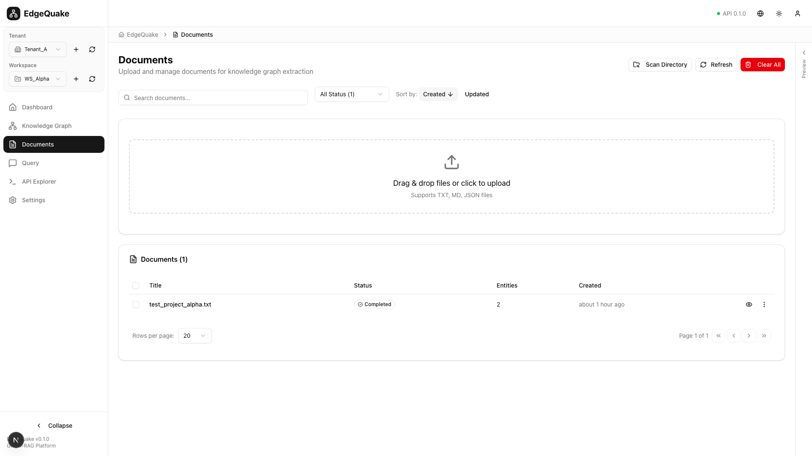
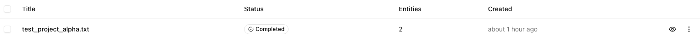
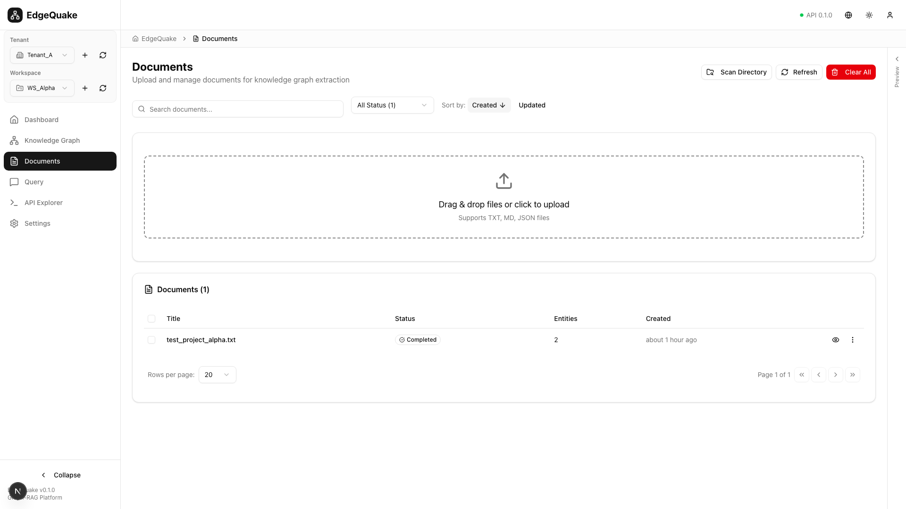
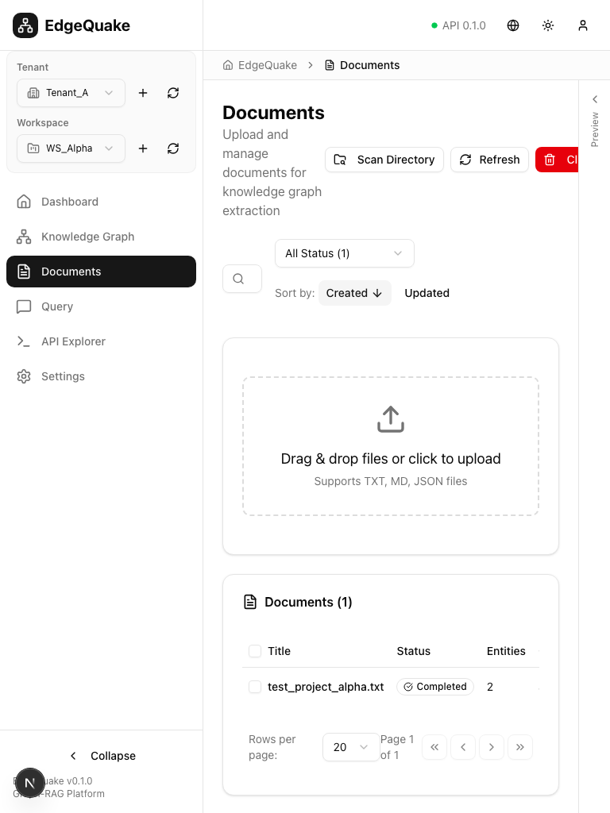

# Documents Page UX/UI Audit

## 1. What I Reviewed

- **Route**: `/documents`
- **Key UI Regions**:
  - Header with title and action buttons (Scan Directory, Refresh, Clear All)
  - Search and filter bar
  - Drag & drop upload zone
  - Documents table with selection, status, and actions
  - Right panel (collapsible preview panel)
  - Pagination controls
- **Components**: `DocumentManager`, `DocumentFilters`, `PaginationControls`, `DocumentPreviewPanel`, `RightPanel`

### Screenshots

| State        | Screenshot                                                 |
| ------------ | ---------------------------------------------------------- |
| Full Page    |        |
| Table Area   |                |
| Upload Hover |  |
| Tablet View  |              |

---

## 2. Issues

### Critical

1. **Upload Zone Too Tall**

   - The drag & drop area takes up ~150px of vertical space
   - Pushes the document table below the fold on smaller screens
   - Users must scroll to see their documents after landing on the page

2. **Clear All Button is Destructive Without Warning**
   - "Clear All" button is styled in red, which is correct
   - However, it's visually prominent and close to other actions
   - Risk of accidental clicks on mobile/touch devices

### Major

3. **Table Header Alignment Issues**

   - "Select all" checkbox column is narrow but header text is clipped
   - "Title" column doesn't have consistent width behavior
   - "Created" date format ("about 1 hour ago") varies in length

4. **Status Column Visual Hierarchy**

   - All statuses use similar badge styling
   - "Completed" in green is clear, but "Processing" animation may be too subtle
   - No progress percentage visible during processing

5. **Missing Bulk Action Bar**

   - When documents are selected, no floating action bar appears
   - Users can't bulk delete or reprocess selected documents
   - Selection checkboxes seem underutilized

6. **Preview Panel Hidden by Default**
   - The "Expand Preview" button is a vertical strip on the right edge
   - Easy to miss - many users won't discover it
   - No preview on click/select of document row

### Minor

7. **Search Placeholder Text**

   - "Search documents..." is in English even when UI is in French
   - Should be internationalized

8. **Sort Controls Unclear**

   - "Trier par: Créé" and "Mis à jour" buttons look like tabs
   - Active state is not visually distinct enough
   - Missing arrow indicator for sort direction

9. **Pagination Position**
   - "Lignes par page: 20" is on the left
   - Page navigation is on the right
   - Creates visual disconnect

---

## 3. Recommendations

### Compact Upload Zone

```
Current (150px):                    Recommended (80px):
┌─────────────────────────────┐    ┌─────────────────────────────────────────┐
│                             │    │ ↑ Drag & drop files or [Browse Files]   │
│        ↑ Upload Icon        │    │   Supports TXT, MD, JSON              + │
│                             │    └─────────────────────────────────────────┘
│  Drag & drop files or click │
│  Supports TXT, MD, JSON     │
│                             │
└─────────────────────────────┘
```

1. **Reduce upload zone height** to 80px maximum
2. **Inline upload button** with browse action
3. **Expandable on drag** - grows when files are dragged over

### Bulk Action Bar

```
When items selected:
┌───────────────────────────────────────────────────────────────────────────┐
│ ☑ 3 documents selected    [🔄 Reprocess] [📥 Download] [🗑️ Delete]  [✕]  │
└───────────────────────────────────────────────────────────────────────────┘
```

1. **Sticky bottom bar** appears when 1+ items selected
2. **Actions**: Reprocess, Download (if applicable), Delete
3. **Dismiss button** to clear selection

### Enhanced Status Column

```
Current:               Recommended:
┌──────────────┐      ┌──────────────────────────────┐
│ ✓ Completed  │      │ ✓ Completed                  │
└──────────────┘      │   Extracted 12 entities      │ <- Entity count
                      └──────────────────────────────┘

┌──────────────┐      ┌──────────────────────────────┐
│ ⟳ Processing │      │ ⟳ Processing 67%             │ <- Progress %
└──────────────┘      │   ██████████░░░░░░░░░░░░░░░░ │ <- Progress bar
                      └──────────────────────────────┘
```

1. **Show entity count** for completed documents
2. **Show progress percentage** for processing
3. **Show error message preview** for failed

### Document Row Click Behavior

1. **Single click** → Open preview panel with document details
2. **Double click** → Navigate to graph view filtered by document
3. **Checkbox click** → Toggle selection (current behavior)

### Sort Controls Improvement

```
Current: [Créé] [Mis à jour]

Recommended: Sort by: [Created ↓ ▾]
             (dropdown with arrow indicator)
```

---

## 4. Rationale

- **Compact Upload Zone**: Progressive disclosure principle - show more functionality when needed (on drag)
- **Bulk Actions**: Users with many documents need efficient batch operations
- **Entity Count**: Documents exist to extract entities - showing count validates upload success
- **Progress Indication**: Reduces anxiety during long processing operations
- **Click Preview**: Discovery pattern - clicking should reveal details

---

## 5. Acceptance Criteria

- [ ] Upload zone height ≤ 80px in default state
- [ ] Upload zone expands to 150px when files are dragged over
- [ ] Bulk action bar appears when ≥1 document is selected
- [ ] Document status shows entity count when completed
- [ ] Processing status shows progress percentage
- [ ] Single-click on document row opens preview panel
- [ ] Sort dropdown shows direction indicator (↑/↓)
- [ ] All text is internationalized (no English in French mode)

---

## 6. Layout Representation

### Current Layout

```
┌────────────────────────────────────────────────────────────────────────────┐
│ 🏠 > 📄 Documents                                                          │
├────────────────────────────────────────────────────────────────────────────┤
│                                                                            │
│ Documents                                    [Scan] [Refresh] [Clear All]  │
│ Téléchargez et gérez les documents...                                      │
│                                                                            │
│ [🔍 Search...]  [Status ▼]  Trier par: [Créé ↓] [Mis à jour]              │
│                                                                            │
│ ┌────────────────────────────────────────────────────────────────────┐    │
│ │                                                                    │ [▶ │
│ │                    ↑ Drag & drop files                            │  P  │
│ │                    Supports TXT, MD, JSON                         │  r  │
│ │                                                                    │  e  │
│ └────────────────────────────────────────────────────────────────────┘  v  │
│                                                                        i   │
│ ┌────────────────────────────────────────────────────────────────────┐  e  │
│ │ 📄 Documents (1)                                                   │  w  │
│ ├────┬──────────────────────┬───────────┬──────────┬─────────────┬───│  ]  │
│ │ ☐  │ Title                │ Status    │ Entities │ Created     │...│    │
│ ├────┼──────────────────────┼───────────┼──────────┼─────────────┼───│    │
│ │ ☐  │ test_project_beta.txt│ ✓Complete │    2     │ about 1 hr  │👁🗑│    │
│ └────┴──────────────────────┴───────────┴──────────┴─────────────┴───┘    │
│                                                                            │
│ Lignes par page: [20 ▼]                          Page 1 sur 1 [<< < > >>] │
└────────────────────────────────────────────────────────────────────────────┘
```

### Recommended Layout

```
┌────────────────────────────────────────────────────────────────────────────┐
│ 🏠 > 📄 Documents                                                          │
├────────────────────────────────────────────────────────────────────────────┤
│                                                                            │
│ Documents                                    [Scan] [Refresh] [Clear All]  │
│ 1 document • 2 entities extracted                                          │
│                                                                            │
│ [🔍 Search...]  [Status ▼]  Sort: [Created ↓ ▼]                           │
│                                                                            │
│ [↑ Drop files or Browse  •  TXT, MD, JSON                              +] │ <- 80px
│                                                                            │
│ ┌────────────────────────────────────────────────────────────────────┐    │
│ │ ☐ │ Title                │ Status           │ Entities │ Created   │    │
│ ├───┼──────────────────────┼──────────────────┼──────────┼───────────┤    │
│ │ ☐ │ test_project_beta.txt│ ✓ Complete (2)   │    2     │ 1 hour ago│    │
│ └───┴──────────────────────┴──────────────────┴──────────┴───────────┘    │
│                                                                            │
│ Showing 1 of 1                               [20 ▼] [<< < 1 > >>]         │
└────────────────────────────────────────────────────────────────────────────┘

When selected:
┌────────────────────────────────────────────────────────────────────────────┐
│ ☑ 1 selected                    [🔄 Reprocess] [🗑️ Delete]        [✕ Clear]│
└────────────────────────────────────────────────────────────────────────────┘
```

---

## Implementation Priority

| Issue               | Effort | Impact | Priority           |
| ------------------- | ------ | ------ | ------------------ |
| Compact upload zone | Medium | High   | **P1 - Quick Win** |
| Bulk action bar     | Medium | High   | **P2 - Next**      |
| Status entity count | Low    | Medium | **P1 - Quick Win** |
| Processing progress | Medium | Medium | **P2 - Next**      |
| Row click preview   | Low    | High   | **P1 - Quick Win** |
| Sort dropdown       | Low    | Low    | **P3 - Later**     |
| I18n fix            | Low    | Medium | **P1 - Quick Win** |
