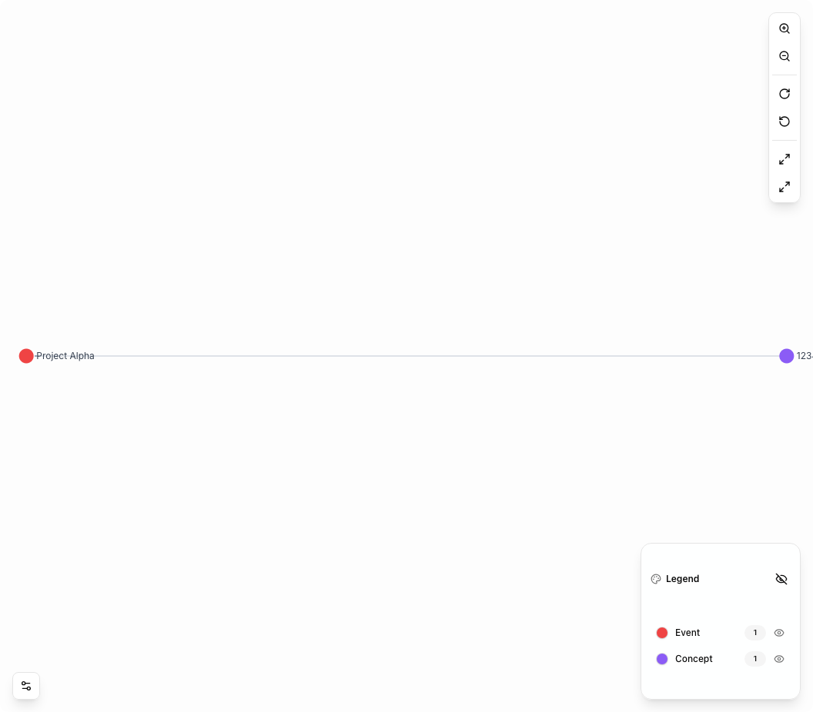
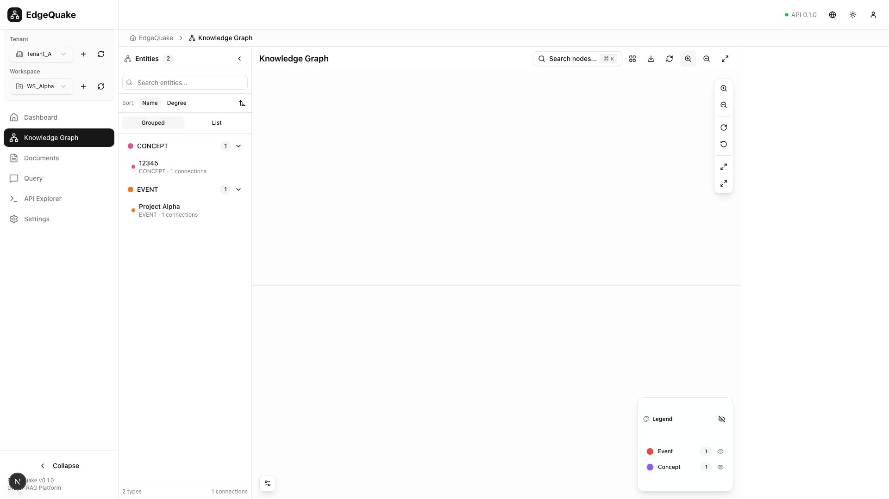
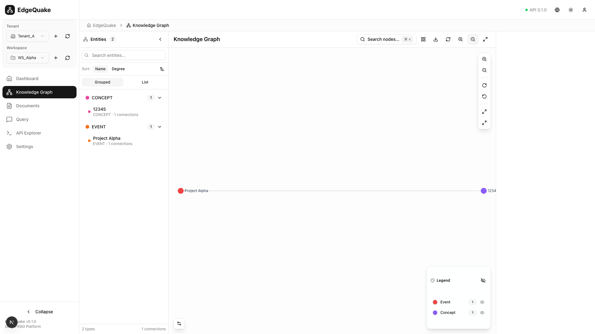
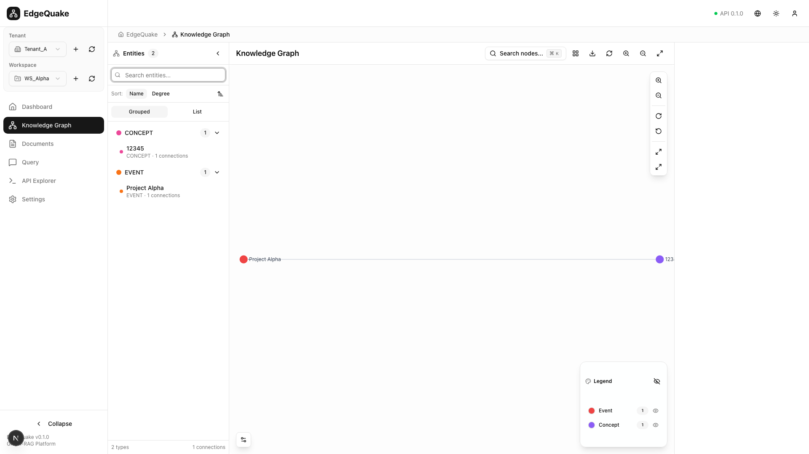
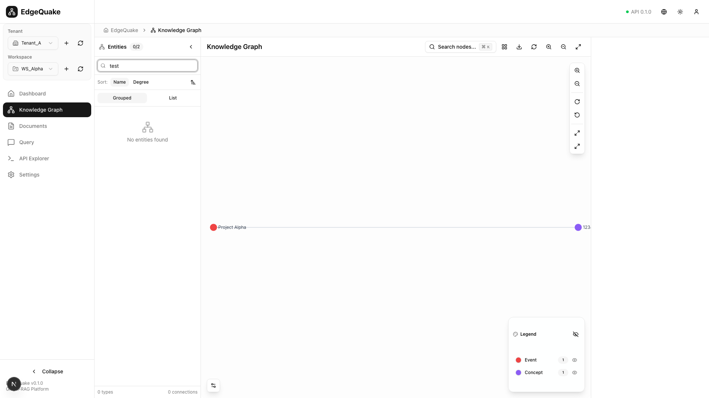
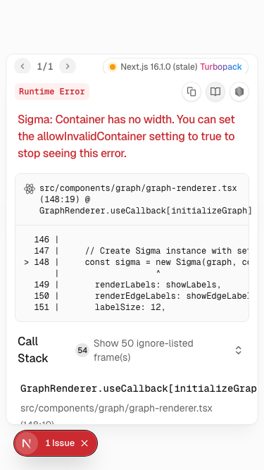
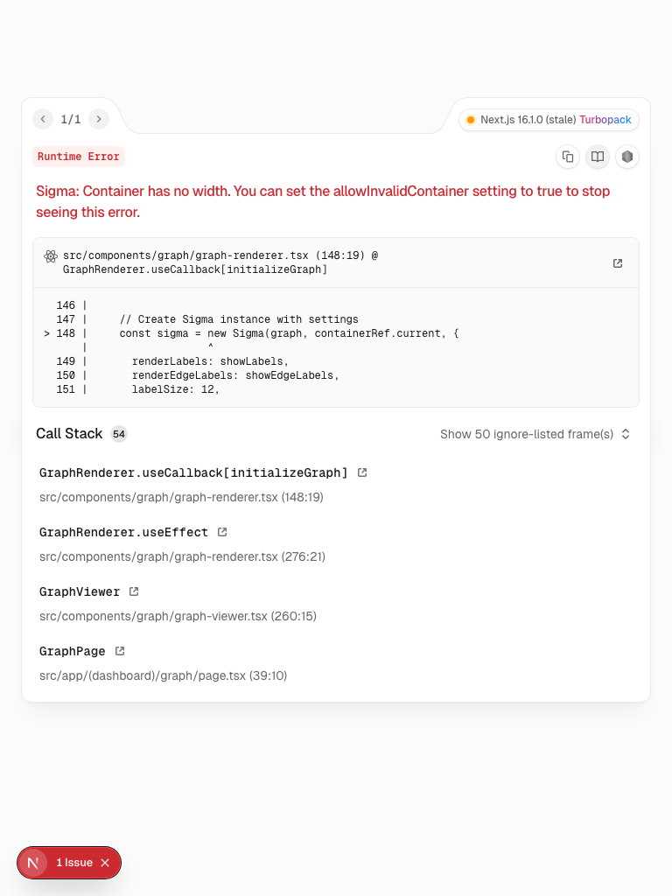

# Graph Page UX/UI Audit

## 1. What I Reviewed

- **Route**: `/graph`
- **Key UI Regions**:
  - Left entity browser panel (collapsible, ~230px)
  - Main graph canvas (Sigma.js rendering)
  - Top toolbar with search, layout, export, zoom controls
  - Right zoom controls (vertical strip)
  - Bottom-right legend panel
  - Graph filter controls
- **Components**: `GraphViewer`, `GraphRenderer`, `EntityBrowserPanel`, `GraphControls`, `GraphLegend`, `GraphSearch`, `ZoomControls`, `NodeDetails`

### Screenshots

| State          | Screenshot                                                  |
| -------------- | ----------------------------------------------------------- |
| Full Page      |                 |
| Graph Canvas   |                   |
| Zoomed In      |             |
| Zoomed Out     |           |
| Search Focused |           |
| Search Query   |  |
| Mobile View    |                   |
| Tablet View    |                   |

---

## 2. Issues

### Critical

1. **Graph is Mostly Empty Canvas**

   - With only 2 nodes, the graph appears sparse and underwhelming
   - Nodes are tiny dots at default zoom
   - Edge labels are truncated ("SECR..." visible in screenshot)
   - No visual cue about graph capabilities when empty

2. **Entity Browser Panel Lacks Visual Hierarchy**
   - Entity types (CONCEPT, PRODUCT) shown as expandable sections
   - But entities within sections look identical
   - No visual differentiation by importance (degree centrality)
   - Color dots are small (8px) and hard to distinguish

### Major

3. **Duplicate Zoom Controls**

   - Zoom buttons in top toolbar (Zoom In, Zoom Out, Reset View)
   - AND zoom buttons in right vertical strip (same controls)
   - Creates confusion and wastes space
   - Inconsistent icon styling between the two

4. **Legend Panel Placement**

   - Bottom-right corner overlaps potential graph content
   - Small and easy to miss
   - "Collapse" button is unclear
   - No ability to filter by clicking legend items

5. **Toolbar Overcrowded**

   - Too many icons in a single row
   - Search, Layout, Export, Refresh, Zoom (x3) = 7 actions
   - Small hit targets for touch devices
   - No grouping or visual separation

6. **Node Labels Truncated**
   - "SECR..." instead of "SECRET9876"
   - Label truncation removes useful information
   - No hover to reveal full label

### Minor

7. **Entity Browser Footer Stats**

   - "2 types • 1 connections" at bottom
   - "1 connections" is grammatically incorrect
   - Stats could be more prominent

8. **Search Keyboard Shortcut**

   - Shows "⌘K" but no tooltip explaining what it does
   - Search input placeholder is in French ("Rechercher des nœuds...")
   - Inconsistent with English labels elsewhere

9. **Graph Background**
   - Pure white background makes nodes hard to see
   - No grid or subtle pattern for spatial reference
   - Zoom level indicator missing

---

## 3. Recommendations

### Empty/Sparse Graph State

```
When < 5 nodes:
┌──────────────────────────────────────────────────────────────────────────────┐
│                                                                              │
│                        🕸️  Your Knowledge Graph                             │
│                                                                              │
│                        ┌───────────────────────┐                            │
│                        │   🔵 ──────── 🟡      │                            │
│                        │  Project    SECRET    │                            │
│                        │   Beta      9876      │                            │
│                        └───────────────────────┘                            │
│                                                                              │
│                   Add more documents to grow your graph                      │
│                           [📄 Upload Documents]                              │
│                                                                              │
└──────────────────────────────────────────────────────────────────────────────┘
```

1. **Center nodes** in viewport when count < 10
2. **Show node labels larger** when space permits
3. **Add call-to-action** for adding documents
4. **Animated intro** when graph first loads

### Consolidated Zoom Controls

```
Current:                               Recommended:
┌─────────────────────────────────────┐ ┌─────────────────────────────────────┐
│ [🔍][📐][⬇][🔄][+][-][⊙]          │ │ [🔍 Search...⌘K] [📐▼] [⬇▼] [🔄]   │
│                           [+]       │ │                                     │
│                           [-]       │ │                                     │
│                           [↻]       │ │                              [+]    │
│                           [↺]       │ │                              [-]    │
│                           [⊙]       │ │                      50%    [⊙]    │
│                           [⛶]       │ │                              [⛶]    │
└─────────────────────────────────────┘ └─────────────────────────────────────┘
^ Duplicate controls                    ^ Single set + zoom level indicator
```

1. **Remove duplicate toolbar zoom** - keep only right strip
2. **Add zoom level indicator** (50%, 100%, 200%)
3. **Group toolbar into dropdowns** (Layout ▼, Export ▼)

### Enhanced Entity Browser

```
Current:                           Recommended:
┌─────────────────────────────┐   ┌─────────────────────────────────────────┐
│ ● CONCEPT           1  ▼    │   │ 🔵 CONCEPT (1)                      ▼ 👁│
│   ● Project Beta            │   │   ├─ Project Beta                      │
│     CONCEPT · 1 connections │   │   │   ★★☆ 1 connection                 │
│                             │   │   │   [🔍 Find in graph]               │
│ ● PRODUCT           1  ▼    │   │                                        │
│   ● SECRET9876              │   │ 🟡 PRODUCT (1)                     ▼ 👁│
│     PRODUCT · 1 connections │   │   ├─ SECRET9876                        │
│                             │   │       ★☆☆ 1 connection                 │
│                             │   │       [🔍 Find in graph]               │
└─────────────────────────────┘   └─────────────────────────────────────────┘
                                  ^ Larger colors, importance stars,
                                    eye toggle for visibility
```

1. **Larger entity type color indicators** (16px instead of 8px)
2. **Importance/centrality indicator** (stars or bar)
3. **Eye icon** to toggle entity type visibility
4. **Find in graph** button to center camera on entity

### Interactive Legend

```
Current:                           Recommended:
┌──────────────────────┐          ┌──────────────────────────────────┐
│ 🔗 Légende       [👁] │          │ Legend                   [pin📌] │
│ 🔵 Concept   1    👁 │          ├──────────────────────────────────│
│ 🟡 Product   1    👁 │          │ Click to filter:                 │
└──────────────────────┘          │ [🔵 Concept ✓] [🟡 Product ✓]    │
                                  │                                  │
                                  │ 2 nodes · 1 edge · 2 types       │
                                  └──────────────────────────────────┘
```

1. **Clickable legend items** toggle visibility
2. **Pinnable position** (stays in corner or follows mouse)
3. **Graph stats summary** in legend

### Node Label Improvements

1. **Smart label sizing** - increase label size when zoomed out
2. **Label on hover** - show full label tooltip on mouse hover
3. **Label priority** - show labels for high-degree nodes first
4. **Truncation ellipsis** - use proper ellipsis character (…)

---

## 4. Rationale

- **Empty State Guidance**: New users need to understand what a knowledge graph looks like when populated
- **Consolidated Controls**: Duplicate UI creates confusion and violates consistency principle
- **Interactive Legend**: Legends should be controls, not just references
- **Entity Browser Enhancement**: Node importance helps users focus on key entities
- **Label Visibility**: Truncated labels lose essential information - knowledge graphs are about names

---

## 5. Acceptance Criteria

- [ ] Sparse graphs (< 5 nodes) show centered, larger nodes with visible labels
- [ ] Empty graph shows onboarding with document upload CTA
- [ ] Only one set of zoom controls exists (right strip)
- [ ] Zoom level indicator shows current percentage (50%, 100%, etc.)
- [ ] Entity browser shows importance indicator (stars or connections)
- [ ] Entity browser has "Find in graph" action per entity
- [ ] Legend items are clickable to toggle visibility
- [ ] Node labels show full text on hover
- [ ] Edge labels don't truncate when space permits

---

## 6. Layout Representation

### Current Layout

```
┌──────────────────────────────────────────────────────────────────────────────┐
│ Sidebar │  🏠 > 🕸️ Knowledge Graph                                           │
│         ├───────────────────────────────────────────────────────────────────┤
│         │ 🔎 Entities 2  <│ Knowledge Graph     [🔍...⌘K][📐][⬇][🔄][+][-][⊙]│
│         ├─────────────────┼──────────────────────────────────────────────────┤
│         │ [🔍 Search...]  │                                          [+]    │
│         │ Sort: [Name][°] │                                          [-]    │
│         │ [Grouped][List] │                                          [↻]    │
│         │                 │                                          [↺]    │
│         │ ● CONCEPT  1  ▼ │    🔵 Project Beta ─────────── 🟡 SECR  [⊙]    │
│         │   ● Project Beta│                                          [⛶]    │
│         │     CONCEPT 1   │                                                  │
│         │ ● PRODUCT  1  ▼ │                                                  │
│         │   ● SECRET9876  │                           ┌──────────────────┐   │
│         │     PRODUCT 1   │                           │ 🔗 Légende   [👁]│   │
│         │                 │                           │ 🔵 Concept 1  👁 │   │
│         ├─────────────────┤                           │ 🟡 Product 1  👁 │   │
│         │ 2 types 1 conn. │                           └──────────────────┘   │
└─────────┴─────────────────┴──────────────────────────────────────────────────┘

Entity browser: 230px
Main canvas: ~1178px
```

### Recommended Layout

```
┌──────────────────────────────────────────────────────────────────────────────┐
│ Sidebar │  🏠 > 🕸️ Knowledge Graph                                           │
│         │  2 nodes · 1 edge                    [🔍 Search...⌘K] [📐▼] [⬇▼]  │
│         ├───────────────────────────────────────────────────────────────────┤
│         │ Entities (2)         │                                             │
│         │ [🔍 Search entities] │                                     [🔄]   │
│         ├──────────────────────┤                                             │
│         │ 🔵 CONCEPT (1)    👁 │                                     [+]    │
│         │   ├─ Project Beta    │            ┌─────────────┐          [-]    │
│         │   │  ★★☆ 1 conn      │            │             │          100%   │
│         │   │  [🔍 Find]       │        🔵 ──────────── 🟡           [⊙]    │
│         │                      │      Project         SECRET          [⛶]    │
│         │ 🟡 PRODUCT (1)    👁 │        Beta          9876                   │
│         │   ├─ SECRET9876      │            │             │                  │
│         │   │  ★☆☆ 1 conn      │            └─────────────┘                  │
│         │   │  [🔍 Find]       │                                             │
│         ├──────────────────────┤   ┌─────────────────────────────────────┐   │
│         │ Total: 2 entities    │   │ Legend [pin]                        │   │
│         │ Types: 2             │   │ [🔵 Concept ✓] [🟡 Product ✓]       │   │
│         │ Connections: 1       │   │ 2 nodes · 1 edge                    │   │
│         │                      │   └─────────────────────────────────────┘   │
└─────────┴──────────────────────┴─────────────────────────────────────────────┘
```

---

## Implementation Priority

| Issue                     | Effort | Impact | Priority           |
| ------------------------- | ------ | ------ | ------------------ |
| Remove duplicate zoom     | Low    | Medium | **P1 - Quick Win** |
| Add zoom level indicator  | Low    | Medium | **P1 - Quick Win** |
| Center sparse graphs      | Medium | High   | **P2 - Next**      |
| Interactive legend        | Medium | Medium | **P2 - Next**      |
| Entity browser importance | Medium | Medium | **P2 - Next**      |
| Find in graph action      | Low    | High   | **P1 - Quick Win** |
| Node label hover          | Low    | Medium | **P1 - Quick Win** |
| Empty state CTA           | Low    | High   | **P1 - Quick Win** |
| Smart label sizing        | High   | Medium | **P3 - Later**     |
