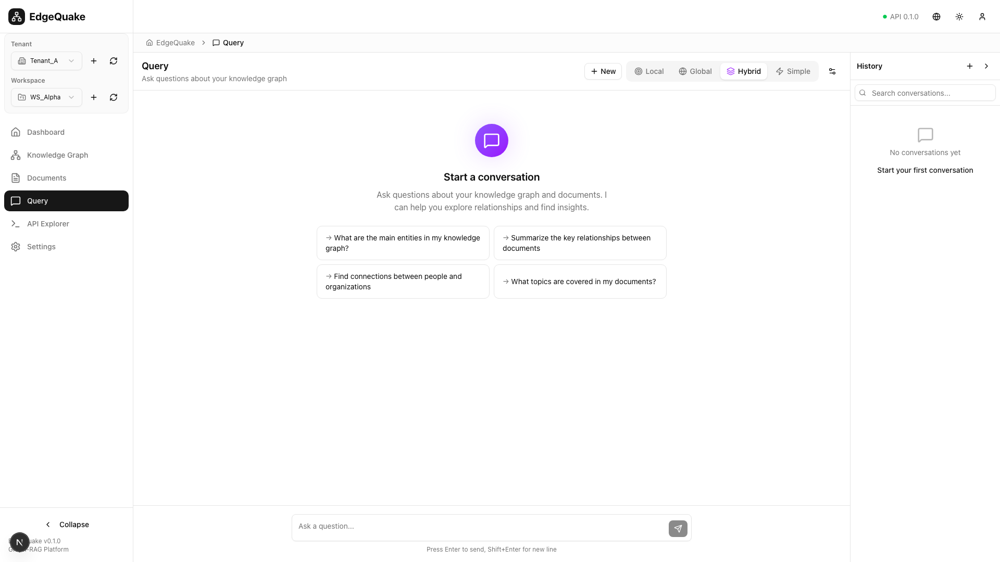
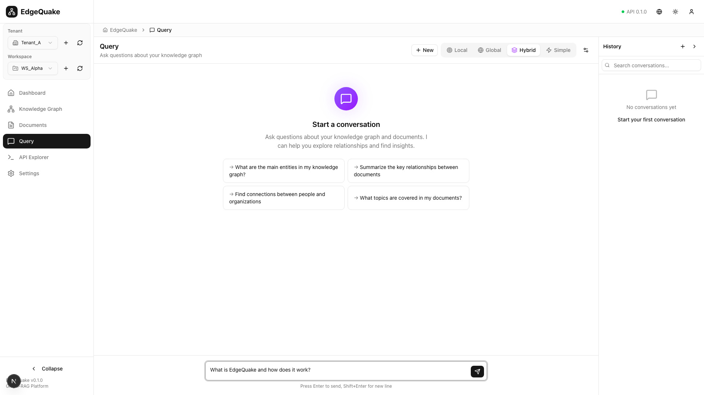
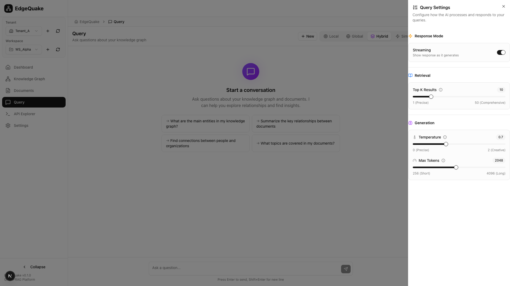
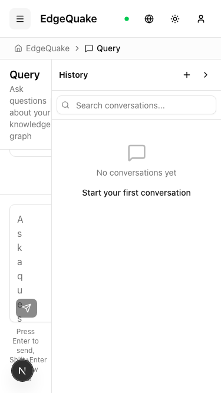
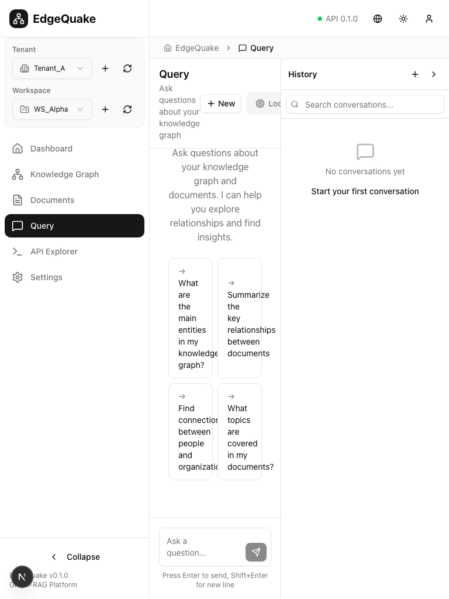

# Query Page UX/UI Audit

## 1. What I Reviewed

- **Route**: `/query`
- **Key UI Regions**:
  - Left sidebar (shared with other pages)
  - Header with query mode selector (Local, Global, Hybrid, Simple)
  - Main chat/conversation area with welcome state
  - Query input area at bottom with send button
  - Right panel: Conversation history with search
- **Components**: `QueryInterface`, `QueryModeSelector`, `ConversationHistoryPanel`, `MarkdownRenderer`, `SourceCitations`, `ChatMessage`

### Screenshots

| State          | Screenshot                                                 |
| -------------- | ---------------------------------------------------------- |
| Initial State  |     |
| Input Area     |          |
| With Input     |          |
| Settings Panel |  |
| Mobile View    |                  |
| Tablet View    |                  |

---

## 2. Issues

### Critical

1. **Query Mode Selection Not Explained**

   - Four mode buttons: Local, Global, Hybrid, Simple
   - No tooltips or descriptions explaining what each mode does
   - Users cannot make informed decisions about which mode to use
   - "Hybrid" is selected but user doesn't know why it's the default

2. **History Panel Takes Excessive Width**
   - Right conversation history panel is ~320px wide
   - Reduces main query area to ~768px on 1920px screens
   - For a chat interface, this is too narrow for comfortable reading

### Major

3. **Empty State Lacks Engagement**

   - Welcome message is plain with generic suggestions
   - Suggested queries are text buttons without visual appeal
   - No visual cues about the RAG capabilities

4. **Input Area Design Issues**

   - Textarea is single-line by default (52px height)
   - Send button is small and icon-only
   - "Press Enter to send" hint is duplicated below input
   - No visual feedback when typing

5. **Conversation History Items Lack Detail**

   - All chats show "Chat 12/25/2025 - 0 messages"
   - No preview of first message content
   - Can't distinguish between conversations at a glance

6. **No Sources/Citations Panel**
   - RAG systems should show source citations
   - No visible area for displaying retrieved context
   - Users can't verify answer provenance

### Minor

7. **"New" Button Placement**

   - "+New" button is in the header area
   - Feels disconnected from conversation flow
   - Should be more prominent

8. **Settings Icon Not Labeled**

   - Small gear/sliders icon on the right side of header
   - Easy to miss
   - No tooltip on hover

9. **Mode Toggle Button Group Styling**
   - Buttons look like radio/toggle group
   - Active state (Hybrid) is visually distinct
   - But disabled appearance for others may confuse users

---

## 3. Recommendations

### Query Mode Tooltips

```tsx
// Add tooltips to mode buttons
<TooltipProvider>
  <Tooltip>
    <TooltipTrigger asChild>
      <Button variant={mode === "local" ? "default" : "ghost"}>
        <Brain /> Local
      </Button>
    </TooltipTrigger>
    <TooltipContent side="bottom" className="max-w-xs">
      <p className="font-semibold">Local Search</p>
      <p className="text-muted-foreground">
        Fast search within directly connected entities. Best for specific,
        targeted queries.
      </p>
    </TooltipContent>
  </Tooltip>
</TooltipProvider>
```

### Collapsible History Panel

```
Current:                              Recommended:
┌─────────┬───────────────┬─────────┐ ┌─────────────────────────────┬──────┐
│ Sidebar │  Chat Area    │ History │ │    Chat Area (wider)        │ [≡] │
│         │  (narrow)     │  (wide) │ │                             │     │
│         │               │         │ │                             │     │
└─────────┴───────────────┴─────────┘ └─────────────────────────────┴──────┘
                                       ^ History collapses to icon strip
```

1. **Collapsible history panel** - default to collapsed
2. **Icon strip mode** - shows last 5 conversations as icons
3. **Expand on demand** - click to reveal full panel
4. **Persist preference** in localStorage

### Enhanced Conversation History Items

```
Current:                           Recommended:
┌──────────────────────────┐      ┌──────────────────────────────────┐
│ 💬 Chat 12/25/2025       │      │ 💬 What are the main entities?   │
│    0 messages · 10:10 PM │      │    "The main entities include... │
│                          │      │    2 msgs · Today 10:10 PM       │
└──────────────────────────┘      └──────────────────────────────────┘
```

1. **Show first message** as title (truncated)
2. **Show preview** of last response
3. **Relative time** (Today, Yesterday, Last week)

### Input Area Enhancement

```
Current (52px height):
┌──────────────────────────────────────────────────────────────────┐
│ Posez une question...                                        [↗]│
└──────────────────────────────────────────────────────────────────┘

Recommended (100px min, auto-expand):
┌──────────────────────────────────────────────────────────────────┐
│ Ask anything about your knowledge graph...                       │
│                                                                  │
│ [📎 Attach] [⚙ Mode: Hybrid ▼]                      [Send ↗]    │
└──────────────────────────────────────────────────────────────────┘
```

1. **Larger default height** (100px minimum)
2. **Auto-expand** as user types multi-line
3. **Mode selector inline** in input area
4. **Attach file** option for inline document upload
5. **Labeled send button** ("Send" not just icon)

### Sources Panel

```
┌─────────────────────────────────────────┐
│ 📚 Sources (3)              [Collapse ▼]│
├─────────────────────────────────────────┤
│ 1. test_project_beta.txt                │
│    "Project Beta uses SECRET9876..."    │
│    Relevance: 0.92 ████████████░░       │
│                                         │
│ 2. tech_docs.md                         │
│    "The architecture diagram shows..."   │
│    Relevance: 0.78 ██████████░░░░       │
└─────────────────────────────────────────┘
```

1. **Inline sources panel** below each response
2. **Expandable citations** with relevance scores
3. **Click to open** document in preview

---

## 4. Rationale

- **Mode Explanation**: LLM query modes are technical concepts - users need guidance
- **Collapsible History**: Progressive disclosure - show full history when needed
- **Input Size**: Chat interfaces benefit from multiline input for complex queries
- **Sources Panel**: Trust requires transparency - users must verify RAG answers
- **Conversation Previews**: Recognition over recall - help users find past conversations

---

## 5. Acceptance Criteria

- [ ] Each query mode button has a tooltip explaining its function
- [ ] History panel is collapsible with preference persistence
- [ ] Conversation items show first message as title
- [ ] Input area has minimum 100px height and auto-expands
- [ ] Send button is labeled "Send" (not just icon)
- [ ] Response messages include expandable sources panel
- [ ] Sources show document name, preview, and relevance score
- [ ] Mode selector is accessible from input area

---

## 6. Layout Representation

### Current Layout

```
┌──────────────────────────────────────────────────────────────────────────────┐
│ Sidebar │  🏠 > Query                                  [+New] [L][G][H][S][⚙]│
│         ├────────────────────────────────────────────┬───────────────────────┤
│         │                                            │ Historique        +  >│
│         │                                            │ ┌─────────────────────│
│         │            💬 Start a conversation         │ │ 🔍 Search...        │
│         │                                            │ ├─────────────────────│
│         │   Ask questions about your knowledge       │ │ 💬 Chat 12/25       │
│         │   graph and documents...                   │ │    0 msgs · 10:10   │
│         │                                            │ │ 💬 Chat 12/25       │
│         │   → What are the main entities?            │ │    0 msgs · 10:10   │
│         │   → Summarize key relationships            │ │ 💬 What are main?   │
│         │   → Find connections between...            │ │    2 msgs · 09:55   │
│         │   → What topics are covered?               │ └─────────────────────│
│         │                                            │                       │
│         │                                            │                       │
│         │                                            │                       │
│         ├────────────────────────────────────────────┤                       │
│         │ [Posez une question...               ] [↗] │                       │
│         │ Press Enter to send, Shift+Enter for line  │                       │
└─────────┴────────────────────────────────────────────┴───────────────────────┘

Main chat area: ~768px (too narrow)
History panel: ~320px (too wide)
```

### Recommended Layout

```
┌──────────────────────────────────────────────────────────────────────────────┐
│ Sidebar │  🏠 > Query                                                        │
│         │  Ask questions about your knowledge graph    [+New] [Mode: Hybrid ▼]│
│         ├───────────────────────────────────────────────────────────────┬────┤
│         │                                                               │[≡] │
│         │                                                               │    │
│         │            💬 Start a conversation                           │ 📝 │
│         │                                                               │ 📝 │
│         │   EdgeQuake can help you explore your knowledge graph.       │ 📝 │
│         │                                                               │    │
│         │   ┌─────────────────────┐ ┌─────────────────────┐            │    │
│         │   │ 📊 Main entities?   │ │ 🔗 Key relationships│            │    │
│         │   └─────────────────────┘ └─────────────────────┘            │    │
│         │   ┌─────────────────────┐ ┌─────────────────────┐            │    │
│         │   │ 👥 Find connections │ │ 📚 Topics covered   │            │    │
│         │   └─────────────────────┘ └─────────────────────┘            │    │
│         │                                                               │    │
│         ├───────────────────────────────────────────────────────────────┤    │
│         │ Ask anything about your knowledge graph...                    │    │
│         │                                                               │    │
│         │ [📎 Attach]                                       [Send ↗]   │    │
└─────────┴───────────────────────────────────────────────────────────────┴────┘

Main chat area: ~1088px (wider)
History icon strip: ~48px (collapsed by default)
```

---

## Implementation Priority

| Issue                 | Effort | Impact | Priority           |
| --------------------- | ------ | ------ | ------------------ |
| Mode tooltips         | Low    | High   | **P1 - Quick Win** |
| Collapsible history   | Medium | High   | **P2 - Next**      |
| Conversation previews | Low    | Medium | **P2 - Next**      |
| Input area expansion  | Low    | Medium | **P1 - Quick Win** |
| Sources panel         | High   | High   | **P2 - Next**      |
| Suggested query cards | Low    | Medium | **P1 - Quick Win** |
| Inline mode selector  | Medium | Medium | **P3 - Later**     |
