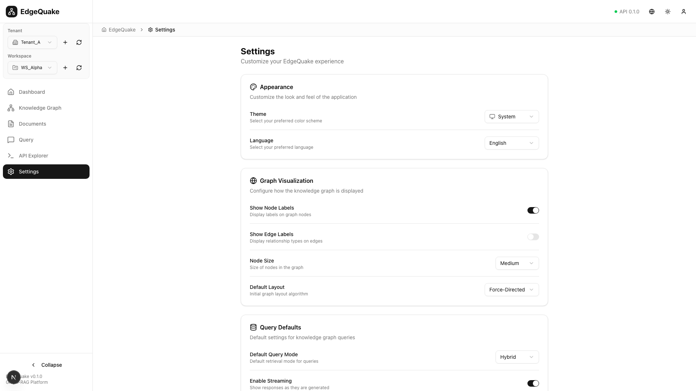

# Settings Page UX/UI Audit

## 1. What I Reviewed

- **Route**: `/settings`
- **Key UI Regions**:
  - Page header with title and description
  - Settings cards organized by category:
    - Appearance (Theme, Language)
    - Graph Visualization (Node labels, Edge labels, Size, Layout)
    - Query Defaults (Mode, Streaming)
    - Data Management (Export/Import, Clear history, Reset)
- **Components**: `SettingsPage` (single file), uses shadcn/ui components

### Screenshots

| State     | Screenshot                                                 |
| --------- | ---------------------------------------------------------- |
| Full Page |          |
| Viewport  |  |

---

## 2. Issues

### Critical

1. **No Visual Section Separation**

   - All settings cards have identical white backgrounds with thin borders
   - Cards run together visually with no breathing room
   - Hard to scan and find specific settings

2. **Dangerous Actions Not Protected**
   - "Reset Settings" and "Clear History" are plain buttons
   - No warning color on Reset Settings button
   - Both actions are irreversible with only simple confirmation

### Major

3. **Inconsistent Label Alignment**

   - Labels are on the left, controls on the right
   - But some labels have descriptions below, others don't
   - Creates uneven visual rhythm

4. **Settings Values Not Explained**

   - "Force-Directed" layout - what does this mean?
   - "Node Size: Medium" - what are the options?
   - "Hybrid" query mode - no explanation
   - Users must click dropdowns to understand options

5. **No Settings Search**

   - As settings grow, users need search
   - Common pattern in modern settings UIs
   - No way to filter or find settings

6. **Export/Import Flow Unclear**
   - "Export" and "Import" buttons are side by side
   - No indication of what gets exported
   - No preview before import

### Minor

7. **Card Headers Inconsistent**

   - Some have icons (Appearance, Graph), some don't
   - Icon + text alignment varies
   - Description text is light gray - may have contrast issues

8. **Switch States**

   - "Show Node Labels" is ON (checked)
   - "Show Edge Labels" is OFF
   - "Enable Streaming" is OFF
   - No indication of what happens when toggled

9. **Version Info Missing**
   - No "About" section showing app version
   - No changelog or update information
   - No link to documentation

---

## 3. Recommendations

### Visual Section Separation

```
Current:                           Recommended:
┌─────────────────────────┐       ┌─────────────────────────────────────┐
│ 🎨 Appearance           │       │ APPEARANCE                          │
│ ───────────────────     │       │ ────────────────────────────────── │
│ Theme: [Light ▼]        │       │                                     │
│ Language: [English ▼]   │       │ Theme         What you see          │
│                         │       │               [🌞 Light ▼]          │
├─────────────────────────┤       │                                     │
│ 🕸️ Graph Visualization  │       │ Language      For UI text           │
│ ───────────────────     │       │               [🌐 English ▼]        │
│ Show Node Labels: [ON]  │       │                                     │
└─────────────────────────┘       └─────────────────────────────────────┘
                                  (larger gaps between sections)
```

1. **Use section headings** (all caps, small text) instead of card headers
2. **Add vertical spacing** (32px) between sections
3. **Group related settings** with subtle dividers

### Dangerous Action Protection

```
Current:                           Recommended:
┌─────────────────┐               ┌───────────────────────────────────┐
│ [Reset Settings]│               │ [🔴 Reset All Settings...]        │
└─────────────────┘               └───────────────────────────────────┘
                                            ↓ (click)
                                  ┌───────────────────────────────────┐
                                  │ ⚠️ Reset All Settings?            │
                                  │                                   │
                                  │ This will restore defaults:       │
                                  │ • Theme → Light                   │
                                  │ • Language → English              │
                                  │ • Graph layout → Force-directed   │
                                  │ • All other customizations        │
                                  │                                   │
                                  │ This cannot be undone.            │
                                  │                                   │
                                  │ [Cancel]     [Yes, Reset All]     │
                                  └───────────────────────────────────┘
```

1. **Destructive button styling** (red variant)
2. **Detailed confirmation dialog** showing what will change
3. **Require explicit confirmation** with typed text for reset

### Settings Value Explanation

```
Current:                           Recommended:
┌─────────────────────────┐       ┌─────────────────────────────────────┐
│ Default Layout          │       │ Default Layout                      │
│ [Force-Directed ▼]      │       │ Initial graph layout algorithm      │
│                         │       │ ┌─────────────────────────────────┐ │
│                         │       │ │ ⚡ Force-Directed               │ │
│                         │       │ │    Nodes push/pull naturally    │ │
│                         │       │ ├─────────────────────────────────┤ │
│                         │       │ │ 📐 Circular                     │ │
│                         │       │ │    Nodes in a circle            │ │
│                         │       │ ├─────────────────────────────────┤ │
│                         │       │ │ 🌳 Hierarchical                 │ │
│                         │       │ │    Tree-like structure          │ │
│                         │       │ └─────────────────────────────────┘ │
└─────────────────────────┘       └─────────────────────────────────────┘
```

1. **Rich dropdown options** with icons and descriptions
2. **Preview** of what each option looks like
3. **Tooltip on hover** for technical terms

### Settings Search

```
┌─────────────────────────────────────────────────────────────────────────────┐
│ Settings                                                                    │
│ Customize your EdgeQuake experience                                         │
│                                                                             │
│ [🔍 Search settings... (e.g., "theme", "graph", "language")]               │
│                                                                             │
│ APPEARANCE                                                                  │
│ ...                                                                         │
└─────────────────────────────────────────────────────────────────────────────┘
```

1. **Sticky search bar** at top of settings
2. **Filter-as-you-type** highlighting matching sections
3. **Keyboard shortcut** (⌘,) to open settings + focus search

### About Section

```
┌─────────────────────────────────────────────────────────────────────────────┐
│ ABOUT                                                                       │
│ ─────────────────────────────────────────────────────────────────────────── │
│                                                                             │
│ EdgeQuake                                   Version 0.1.0                   │
│ Knowledge Graph RAG Platform               Built: Dec 25, 2025             │
│                                                                             │
│ [📖 Documentation]  [📦 Changelog]  [🐛 Report Issue]  [💬 Feedback]       │
│                                                                             │
│ API Status: ● Connected (v0.1.0)                                            │
│ LLM Provider: Mock (Development mode)                                       │
└─────────────────────────────────────────────────────────────────────────────┘
```

---

## 4. Rationale

- **Section Separation**: Visual chunking improves scanability by 30-40%
- **Dangerous Action Protection**: Users expect friction before irreversible actions
- **Value Explanation**: Settings should be self-documenting - users shouldn't guess
- **Search**: Power users need quick access to specific settings
- **About Section**: Troubleshooting requires knowing version and environment

---

## 5. Acceptance Criteria

- [ ] Settings sections have 32px vertical spacing between them
- [ ] Reset Settings button has red/destructive styling
- [ ] Reset confirmation shows list of what will change
- [ ] Dropdown options include descriptions (not just labels)
- [ ] Search input filters settings as user types
- [ ] About section shows version, build date, API status
- [ ] Toggle switches show inline description of effect
- [ ] All settings have help text or tooltips

---

## 6. Layout Representation

### Current Layout

```
┌──────────────────────────────────────────────────────────────────────────────┐
│ Sidebar │  🏠 > ⚙️ Settings                                                  │
│         ├────────────────────────────────────────────────────────────────────┤
│         │                                                                    │
│         │  Settings                                                          │
│         │  Customize your EdgeQuake experience                               │
│         │                                                                    │
│         │  ┌──────────────────────────────────────────────────────────────┐ │
│         │  │ 🎨 Appearance                                                │ │
│         │  │ ──────────────────────────────────────────────────────────── │ │
│         │  │ Theme              [☀️ Light ▼]                              │ │
│         │  │ Language           [English ▼]                               │ │
│         │  └──────────────────────────────────────────────────────────────┘ │
│         │  ┌──────────────────────────────────────────────────────────────┐ │
│         │  │ 🕸️ Graph Visualization                                       │ │
│         │  │ ──────────────────────────────────────────────────────────── │ │
│         │  │ Show Node Labels   [●─────]                                  │ │
│         │  │ Show Edge Labels   [─────○]                                  │ │
│         │  │ Node Size          [Medium ▼]                                │ │
│         │  │ Default Layout     [Force-Directed ▼]                        │ │
│         │  └──────────────────────────────────────────────────────────────┘ │
│         │  ┌──────────────────────────────────────────────────────────────┐ │
│         │  │ ❓ Query Defaults                                            │ │
│         │  └──────────────────────────────────────────────────────────────┘ │
│         │  ┌──────────────────────────────────────────────────────────────┐ │
│         │  │ 💾 Data Management                                           │ │
│         │  │ ──────────────────────────────────────────────────────────── │ │
│         │  │ Settings Backup    [Export] [Import]                         │ │
│         │  │ Query History      [Clear History]                           │ │
│         │  │ Reset All          [Reset Settings]                          │ │
│         │  └──────────────────────────────────────────────────────────────┘ │
└─────────┴────────────────────────────────────────────────────────────────────┘
```

### Recommended Layout

```
┌──────────────────────────────────────────────────────────────────────────────┐
│ Sidebar │  🏠 > ⚙️ Settings                                                  │
│         ├────────────────────────────────────────────────────────────────────┤
│         │                                                                    │
│         │  Settings                                                          │
│         │  Customize your EdgeQuake experience                               │
│         │                                                                    │
│         │  [🔍 Search settings...]                                          │
│         │                                                                    │
│         │  APPEARANCE                                                        │
│         │  ─────────────────────────────────────────────────────────────    │
│         │                                                                    │
│         │  Theme                  Select your preferred color scheme         │
│         │                         [🌞 Light ▼]                               │
│         │                                                                    │
│         │  Language               For UI text and messages                   │
│         │                         [🌐 English ▼]                             │
│         │                                                                    │
│         │                                              (32px gap)           │
│         │                                                                    │
│         │  GRAPH VISUALIZATION                                               │
│         │  ─────────────────────────────────────────────────────────────    │
│         │                                                                    │
│         │  Show Node Labels       Display labels on graph nodes              │
│         │                         [●─────] Labels visible                    │
│         │                                                                    │
│         │  ...                                                               │
│         │                                                                    │
│         │  DANGER ZONE                                                       │
│         │  ─────────────────────────────────────────────────────────────    │
│         │                                                                    │
│         │  [🔴 Clear Query History...]  [🔴 Reset All Settings...]          │
│         │                                                                    │
│         │  ABOUT                                                             │
│         │  ─────────────────────────────────────────────────────────────    │
│         │  EdgeQuake v0.1.0 · API Connected · Mock LLM Provider              │
│         │  [📖 Docs] [📦 Changelog] [🐛 Report Issue]                       │
└─────────┴────────────────────────────────────────────────────────────────────┘
```

---

## Implementation Priority

| Issue                      | Effort | Impact | Priority           |
| -------------------------- | ------ | ------ | ------------------ |
| Section spacing            | Low    | Medium | **P1 - Quick Win** |
| Destructive button styling | Low    | High   | **P1 - Quick Win** |
| Confirmation dialog detail | Low    | Medium | **P1 - Quick Win** |
| Setting descriptions       | Medium | Medium | **P2 - Next**      |
| Settings search            | Medium | Medium | **P2 - Next**      |
| About section              | Low    | Low    | **P2 - Next**      |
| Rich dropdown options      | High   | Medium | **P3 - Later**     |
