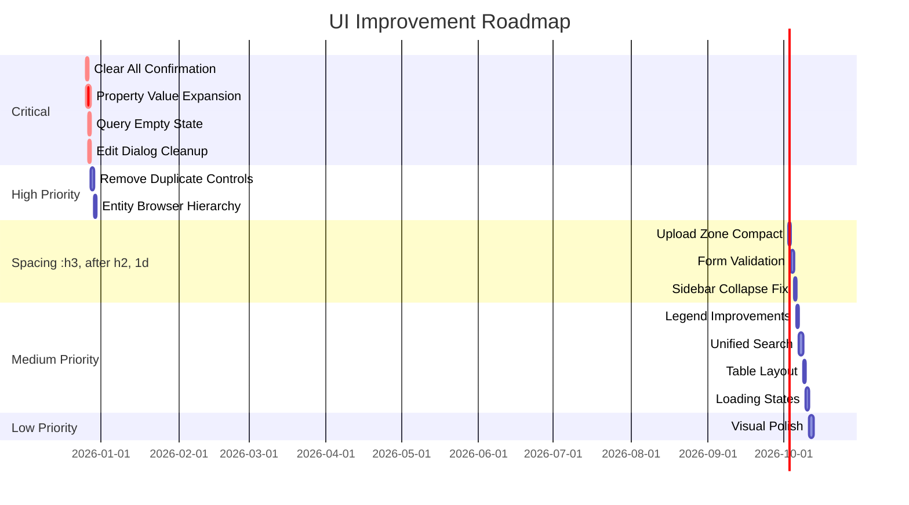

# UI Audit Summary: EdgeQuake WebUI

**Audit Date:** 2025-12-25  
**Version Audited:** v0.1.0  
**Screens Analyzed:** 6

---

## Executive Summary

This comprehensive UI audit analyzed 6 key screens of the EdgeQuake WebUI based on provided screenshots. The audit identified **52 total issues** across critical, high, medium, and low priority levels.

### Issue Distribution

| Severity    | Count  | %    |
| ----------- | ------ | ---- |
| 🔴 Critical | 8      | 15%  |
| 🟠 High     | 18     | 35%  |
| 🟡 Medium   | 17     | 33%  |
| 🟢 Low      | 9      | 17%  |
| **Total**   | **52** | 100% |

### Top Issues by Impact

1. **Destructive actions lack safeguards** - "Clear All" button is one-click delete with no confirmation
2. **Truncated property values** - UUIDs and long text cut off without copy/expand options
3. **Empty states lack guidance** - Query page shows spinner with no context or onboarding
4. **Duplicate controls** - Zoom/refresh controls appear in multiple places
5. **FAB/button purposes unclear** - Floating action buttons lack labels or tooltips

---

## Audit Documents

| Document                                                 | Screen              | Priority |
| -------------------------------------------------------- | ------------------- | -------- |
| [01-node-details-panel.md](01-node-details-panel.md)     | Entity/Node Details | High     |
| [02-knowledge-graph-page.md](02-knowledge-graph-page.md) | Knowledge Graph     | High     |
| [03-sidebar-footer.md](03-sidebar-footer.md)             | Sidebar Footer      | Medium   |
| [04-edit-entity-dialog.md](04-edit-entity-dialog.md)     | Edit Entity Dialog  | High     |
| [05-documents-page.md](05-documents-page.md)             | Documents Page      | High     |
| [06-query-page.md](06-query-page.md)                     | Query Page          | High     |

---

## Prioritized Improvement Roadmap

### 🔴 Week 1: Critical Fixes (Safety & Usability)

These issues can cause data loss or severely impact usability.

| ID        | Issue                                                        | Screen       | Effort |
| --------- | ------------------------------------------------------------ | ------------ | ------ |
| DOC-01/02 | Add confirmation dialog for "Clear All" with type-to-confirm | Documents    | 4h     |
| NDP-01/02 | Add expandable property values with copy buttons             | Node Details | 6h     |
| QRY-01/02 | Create empty state with graph stats and suggestions          | Query        | 4h     |
| EED-01/02 | Separate editable vs read-only fields, remove duplicates     | Edit Dialog  | 3h     |

**Week 1 Total: ~17 hours**

### 🟠 Week 2: High Priority (Core Experience)

These issues significantly impact the user experience.

| ID        | Issue                                                     | Screen          | Effort |
| --------- | --------------------------------------------------------- | --------------- | ------ |
| KG-03     | Remove duplicate toolbar controls                         | Knowledge Graph | 2h     |
| KG-02/05  | Improve entity browser visual hierarchy and selection     | Knowledge Graph | 4h     |
| NDP-03/04 | Standardize section spacing, improve entity badge         | Node Details    | 3h     |
| DOC-03    | Compact upload zone (reduce height)                       | Documents       | 2h     |
| EED-03/04 | Add form validation, loading states, dirty state handling | Edit Dialog     | 4h     |
| SF-01/02  | Fix collapse button behavior in collapsed state           | Sidebar         | 2h     |

**Week 2 Total: ~17 hours**

### 🟡 Week 3: Medium Priority (Polish)

These issues improve consistency and refinement.

| ID        | Issue                                                      | Screen          | Effort |
| --------- | ---------------------------------------------------------- | --------------- | ------ |
| KG-04/11  | Improve legend positioning and toggle clarity              | Knowledge Graph | 3h     |
| KG-07     | Consolidate search into single global search               | Knowledge Graph | 4h     |
| NDP-05/06 | Clarify relationship direction, consistent section styling | Node Details    | 2h     |
| DOC-08/09 | Improve table layout, clarify action icons                 | Documents       | 3h     |
| QRY-03/04 | Add contextual loading states                              | Query           | 2h     |
| SF-04/05  | Improve collapse button styling and alignment              | Sidebar         | 2h     |

**Week 3 Total: ~16 hours**

### 🟢 Week 4: Low Priority (Enhancement)

These issues are nice-to-haves and visual polish.

| ID           | Issue                                          | Screen          | Effort |
| ------------ | ---------------------------------------------- | --------------- | ------ |
| NDP-12/13    | Larger entity name, explain dot indicator      | Node Details    | 1h     |
| KG-13/14/15  | Improve toggle styling, floating toolbar icons | Knowledge Graph | 2h     |
| EED-12/13    | Visual improvements to properties display      | Edit Dialog     | 2h     |
| DOC-14/15/16 | Clean up row actions, improve pagination       | Documents       | 2h     |
| QRY-09/10    | Branded loading animation, FAB elevation       | Query           | 2h     |

**Week 4 Total: ~9 hours**

---

## Consolidated Design Tokens Required

```css
/* Add to design-tokens.css */

/* Panel & Sidebar */
--panel-header-padding: 20px;
--panel-section-gap: 24px;
--property-label-width: 120px;
--property-row-gap: 8px;

/* Badges & Tags */
--badge-padding-x: 12px;
--badge-padding-y: 6px;
--badge-border-radius: 9999px;

/* Interactive Elements */
--touch-target-min: 44px;
--button-height-sm: 32px;
--button-height-md: 40px;
--button-height-lg: 48px;

/* Upload Zone */
--upload-zone-height: 80px;
--upload-zone-height-active: 120px;

/* Dialog */
--dialog-width-sm: 400px;
--dialog-width-md: 500px;
--dialog-width-lg: 640px;

/* Graph Canvas */
--graph-edge-width: 2px;
--graph-edge-hover-width: 3px;
--graph-node-size: 32px;
--graph-node-selected-size: 40px;
```

---

## Accessibility Requirements

### WCAG 2.1 AA Compliance Checklist

| Requirement           | Status     | Action Needed                               |
| --------------------- | ---------- | ------------------------------------------- |
| Touch targets 44px    | ⚠️ Partial | Fix sidebar buttons, table actions          |
| Color contrast 4.5:1  | ⚠️ Partial | Check muted text, relationship arrows       |
| Focus visible         | ⚠️ Partial | Add focus rings to all interactive elements |
| ARIA labels           | ❌ Missing | Add to FAB, sidebar, dialogs                |
| Keyboard navigation   | ⚠️ Partial | Add shortcuts, trap focus in dialogs        |
| Screen reader support | ❌ Missing | Add live regions, announcements             |

### Priority A11y Fixes

1. **FAB Accessibility** - Add `aria-label`, tooltip, keyboard shortcut
2. **Dialog Focus Trap** - Trap focus when dialog opens
3. **Table Navigation** - Arrow keys for row navigation
4. **Live Regions** - Announce state changes (loading, success, error)

---

## Implementation Order



---

## Testing Checklist

### Functional Testing

- [ ] Clear All requires confirmation and type-to-confirm
- [ ] Property values expandable and copyable
- [ ] Query page shows suggestions when empty
- [ ] Edit dialog shows validation errors
- [ ] Sidebar collapse/expand works correctly
- [ ] All buttons have visible loading states

### Visual Regression Testing

- [ ] Capture screenshots after each phase
- [ ] Compare against current state
- [ ] Verify spacing consistency
- [ ] Check responsive breakpoints

### Accessibility Testing

- [ ] Screen reader walkthrough (VoiceOver/NVDA)
- [ ] Keyboard-only navigation
- [ ] Color contrast check (axe DevTools)
- [ ] Touch target measurement

---

## Success Metrics

| Metric                      | Current | Target | Measurement       |
| --------------------------- | ------- | ------ | ----------------- |
| Critical issues             | 8       | 0      | Manual audit      |
| WCAG AA compliance          | ~60%    | 100%   | axe DevTools      |
| Component consistency       | Low     | High   | Design review     |
| User task completion        | Unknown | >90%   | Usability testing |
| Time to complete core tasks | Unknown | <30s   | Analytics         |

---

## Files Modified (Estimated)

| File                                              | Changes                                  |
| ------------------------------------------------- | ---------------------------------------- |
| `components/graph/node-details.tsx`               | Property expansion, copy buttons         |
| `components/graph/graph-viewer.tsx`               | Remove duplicate toolbar, improve legend |
| `components/graph/entity-browser.tsx`             | Visual hierarchy, selection state        |
| `components/documents/document-manager.tsx`       | Compact upload, confirmation dialog      |
| `components/documents/clear-documents-dialog.tsx` | Type-to-confirm                          |
| `components/query/query-interface.tsx`            | Empty state, loading states              |
| `components/query/empty-query-state.tsx`          | New component                            |
| `components/graph/edit-entity-dialog.tsx`         | Form validation, field separation        |
| `components/layout/sidebar.tsx`                   | Collapse button improvements             |
| `app/design-tokens.css`                           | New tokens                               |

---

## Next Steps

1. **Review this audit** with stakeholders
2. **Prioritize** based on user impact and development capacity
3. **Create tickets** for each improvement phase
4. **Implement** in priority order (Critical → High → Medium → Low)
5. **Test** after each phase
6. **Document** changes in changelog

---

## Appendix: Screenshot Reference

| Screenshot | Description                 | Key Issues                      |
| ---------- | --------------------------- | ------------------------------- |
| Image 1    | Node details panel (mobile) | Truncated values, spacing       |
| Image 2    | Knowledge graph (desktop)   | Duplicate controls, empty graph |
| Image 3    | Sidebar footer              | Collapse button UX              |
| Image 4    | Edit entity dialog          | Form validation, duplicates     |
| Image 5    | Documents page              | Clear All safety, upload height |
| Image 6    | Query page                  | Empty state, FAB clarity        |
