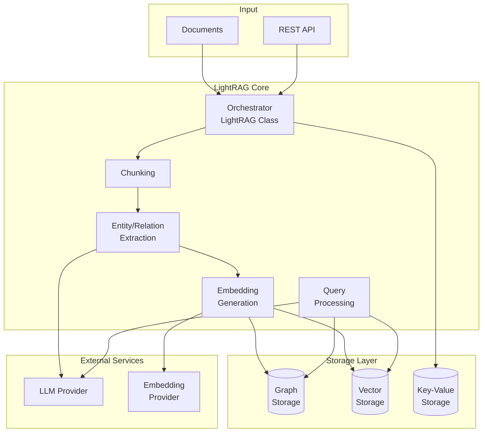

# LightRAG Executive Summary

## What LightRAG Does

LightRAG is an advanced **Retrieval-Augmented Generation (RAG)** framework that transforms unstructured text into a queryable knowledge graph. Unlike traditional RAG systems that simply match query embeddings to document chunks, LightRAG extracts entities and relationships from documents to build a semantic knowledge graph, enabling more intelligent and contextual responses to natural language queries.

**Primary Function**: Convert documents into a knowledge graph and answer questions by intelligently traversing both the graph structure and vector embeddings.

**Key Differentiators**:
- **Graph-based knowledge representation** instead of flat vector stores
- **Multi-mode querying** (naive, local, global, hybrid) for different use cases
- **Flexible storage backends** supporting 10+ database implementations
- **LLM-agnostic design** working with OpenAI, Anthropic, Ollama, and more

**What LightRAG Does NOT Do**:
- Real-time document streaming (batch processing only)
- Image or multimodal content processing (text-only)
- Pre-trained model fine-tuning

---

## User Personas & Use Cases

| Persona | Primary Use Case | Success Criteria |
|---------|------------------|------------------|
| **Data Engineer** | Ingest documents into knowledge graph | Documents indexed with entities/relations extracted within reasonable time |
| **Application Developer** | Query knowledge via REST API | Response latency < 5 seconds for typical queries |
| **DevOps Engineer** | Deploy and scale LightRAG | Horizontal scaling with multiple workers, configurable backends |
| **Researcher** | Analyze document relationships | Graph visualization and exploration capabilities |
| **Enterprise Architect** | Multi-tenant knowledge management | Tenant isolation and knowledge base organization |

---

## Key Value Propositions

### 1. Superior Query Context
Traditional RAG retrieves document chunks by vector similarity. LightRAG additionally traverses the knowledge graph to find related entities and relationships, providing richer context for LLM response generation.

### 2. Flexible Backend Architecture
One codebase supports:
- **Vector Storage**: FAISS, Milvus, Qdrant, NanoVectorDB, ChromaDB
- **Graph Storage**: NetworkX, Neo4j, Memgraph, MongoDB
- **Key-Value Storage**: JSON files, Redis, PostgreSQL, MongoDB

### 3. Production-Ready Features
- Multi-tenancy with tenant isolation
- Async processing with pipeline management
- REST API with OpenAPI documentation
- Gunicorn support for multi-worker deployment

### 4. LLM Provider Agnostic
Works with any LLM provider:
- OpenAI (GPT-4, GPT-4o, GPT-4o-mini)
- Anthropic (Claude 3.x)
- Google (Gemini)
- AWS Bedrock
- Local models via Ollama
- Any OpenAI-compatible API

---

## Quick Integration Example

```python
from lightrag import LightRAG, QueryParam

# Initialize with default storage (file-based)
rag = LightRAG(working_dir="./rag_storage")

# Ingest documents
await rag.ainsert("Your document text here...")

# Query the knowledge graph
result = await rag.aquery(
    "What entities are mentioned in the documents?",
    param=QueryParam(mode="hybrid")
)

print(result.content)
```

---

## System Architecture at a Glance



---

## Technology Stack (Current Implementation)

| Layer | Technology | Purpose |
|-------|------------|---------|
| Language | Python 3.10+ | Core implementation |
| Web Framework | FastAPI | REST API |
| Async | asyncio | Concurrent processing |
| Default Vector DB | NanoVectorDB/FAISS | Embedding storage |
| Default Graph DB | NetworkX | Knowledge graph |
| Default KV Store | JSON files | Caching and status |

**Note**: All storage backends are abstracted. A rebuild can use equivalent technologies in any language.

---

## Repository Structure

```
lightrag/
├── lightrag.py          # Main orchestrator (3700+ lines)
├── base.py              # Abstract base classes
├── operate.py           # Core pipeline operations
├── types.py             # Type definitions
├── constants.py         # Configuration constants
├── kg/                  # Storage implementations
│   ├── *_impl.py       # Backend-specific implementations
│   └── shared_storage.py
├── llm/                 # LLM provider bindings
├── api/                 # FastAPI REST service
│   ├── lightrag_server.py
│   └── routers/
├── models/              # Multi-tenancy models
├── services/            # Business logic services
└── tools/               # CLI utilities
```

---

## Next Steps

- **[Architecture Overview](02-architecture.md)**: Detailed system design
- **[Domain Model](03-domain-model.md)**: Entity and relationship definitions
- **[API Contracts](04-api-contracts.md)**: Complete API specification
