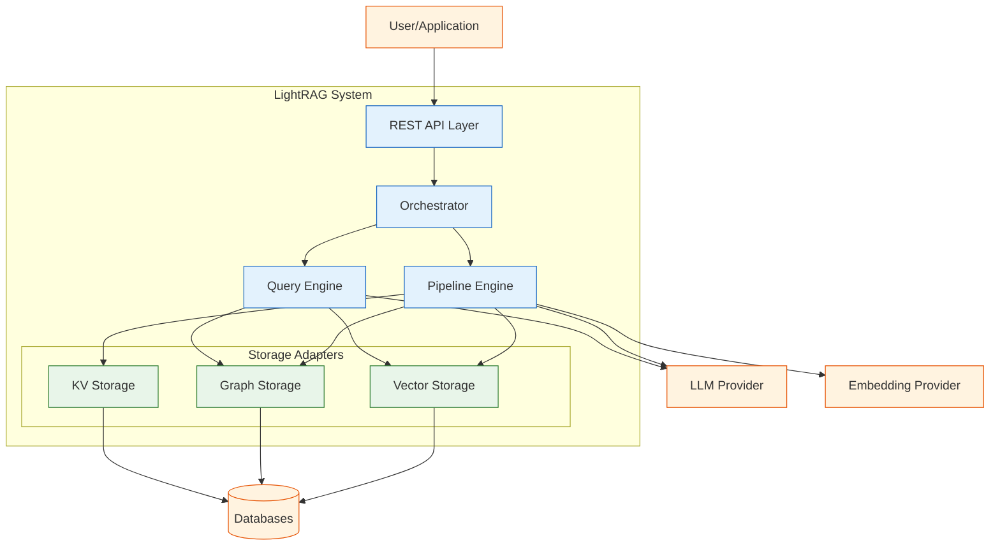
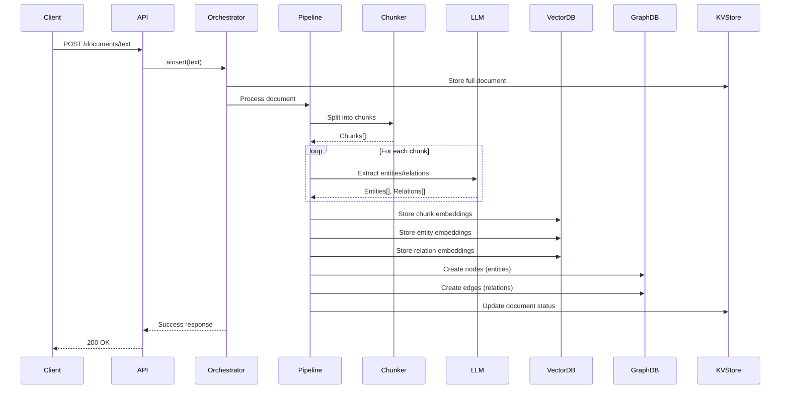
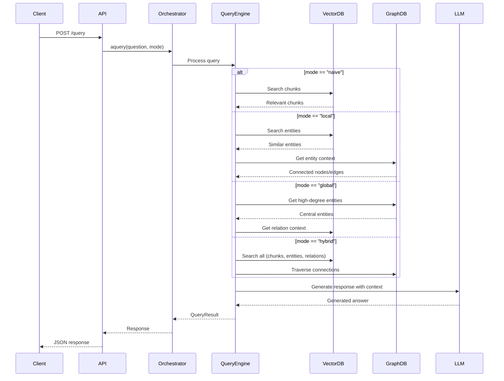
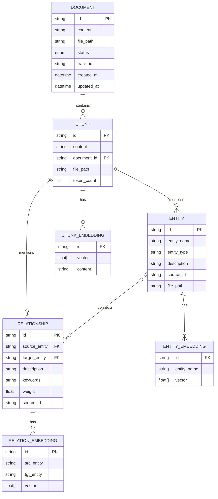
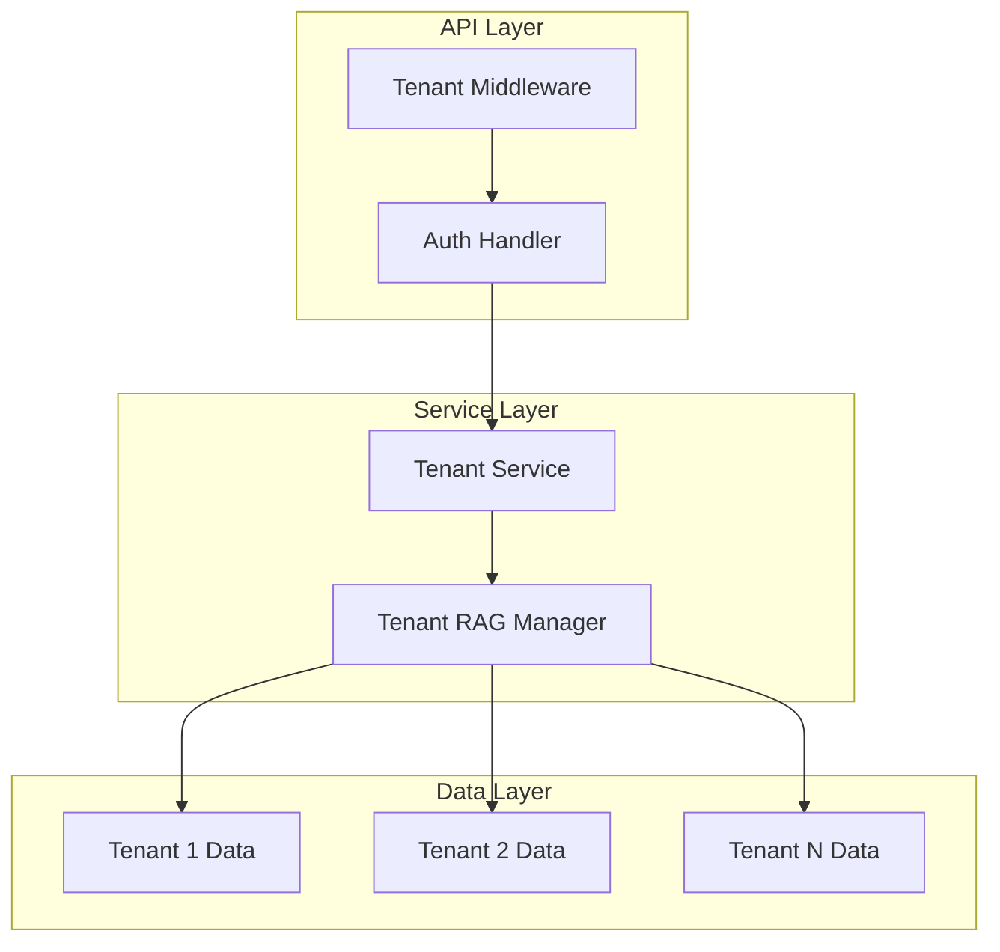
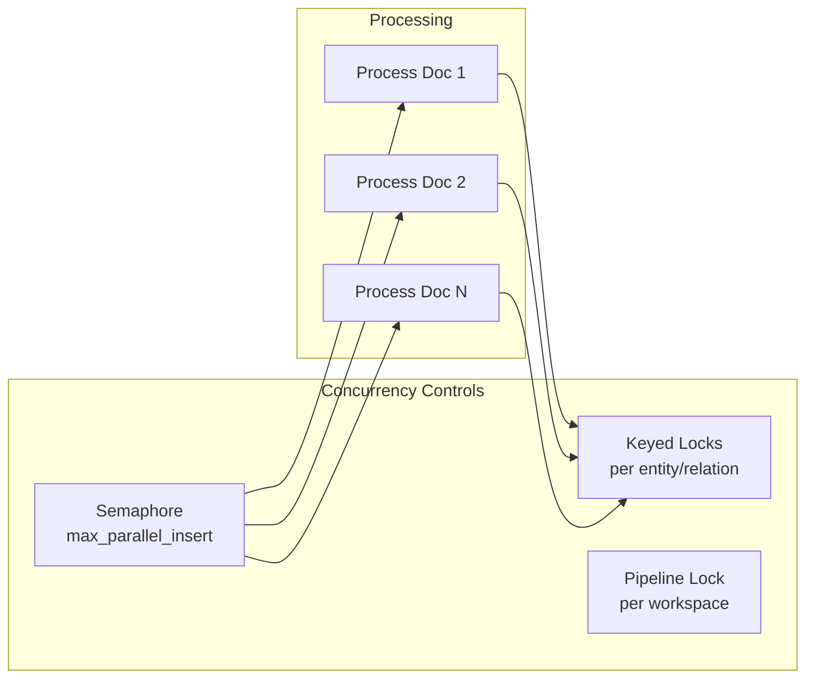
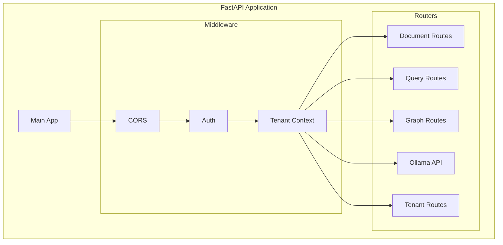
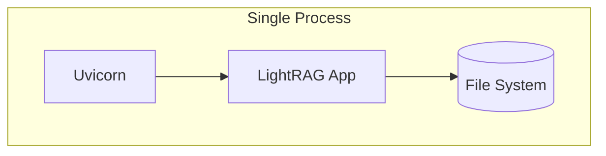
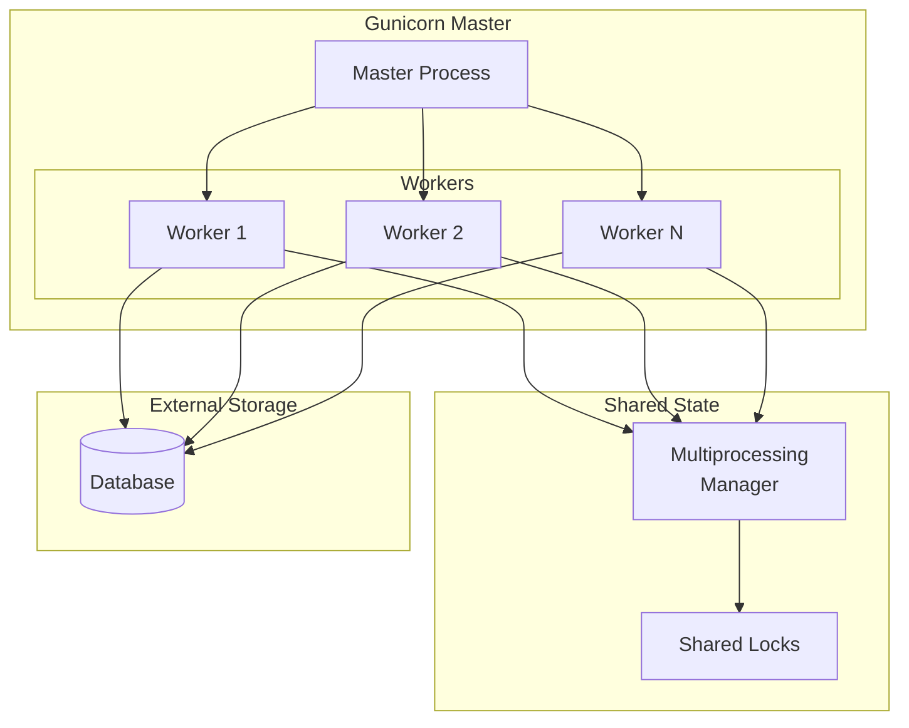

# LightRAG Architecture Overview

## System Purpose & Boundaries

### What This System Does
LightRAG is a Retrieval-Augmented Generation framework that:
1. **Ingests documents** by chunking text and extracting entities/relationships using LLMs
2. **Builds a knowledge graph** connecting entities with typed relationships
3. **Answers queries** by combining graph traversal with vector similarity search
4. **Generates responses** using LLM with retrieved context

### What It Explicitly Does NOT Do
- Real-time streaming ingestion
- Image/audio/video processing
- Model training or fine-tuning
- Document format conversion (expects plain text)
- Authentication/authorization (relies on external auth)

---

## Level 1: 10,000-Foot View

### Component Summary
| Component | Responsibility |
|-----------|---------------|
| **REST API Layer** | HTTP endpoints for document and query operations |
| **Orchestrator** | Coordinates all operations, manages storage lifecycle |
| **Pipeline Engine** | Document ingestion, chunking, entity extraction |
| **Query Engine** | Multi-mode query processing, context retrieval |
| **Vector Storage** | Embedding storage and similarity search |
| **Graph Storage** | Knowledge graph with entities and relationships |
| **KV Storage** | Caching, document status, LLM response cache |

---

## Level 2: Component Interaction

### Document Ingestion Flow

### Query Processing Flow

---

## Level 3: Data Flow & Storage

### Entity Relationship Diagram

---

## Storage Architecture

### Storage Type Mapping

| Namespace | Storage Type | Purpose |
|-----------|-------------|---------|
| `full_docs` | KV Storage | Complete document content |
| `doc_status` | KV Storage | Document processing status |
| `text_chunks` | KV Storage | Chunked document segments |
| `llm_response_cache` | KV Storage | Cached LLM responses |
| `chunk_entity_relation_graph` | Graph Storage | Knowledge graph |
| `entities_vdb` | Vector Storage | Entity embeddings |
| `relationships_vdb` | Vector Storage | Relationship embeddings |
| `chunks_vdb` | Vector Storage | Chunk embeddings |

### Storage Backend Options

```mermaid
graph TD
    subgraph "Storage Abstractions"
        BKV[BaseKVStorage]
        BVS[BaseVectorStorage]
        BGS[BaseGraphStorage]
    end
    
    subgraph "KV Implementations"
        JSON[JsonKVStorage]
        REDIS[RedisKVStorage]
        PG_KV[PostgresKVStorage]
        MONGO_KV[MongoKVStorage]
    end
    
    subgraph "Vector Implementations"
        NANO[NanoVectorDBStorage]
        FAISS[FAISSVectorDBStorage]
        QDRANT[QdrantVectorDBStorage]
        MILVUS[MilvusVectorDBStorage]
        MONGO_V[MongoVectorDBStorage]
    end
    
    subgraph "Graph Implementations"
        NX[NetworkXStorage]
        NEO4J[Neo4JStorage]
        MEM[MemgraphStorage]
        MONGO_G[MongoGraphStorage]
    end
    
    BKV --> JSON
    BKV --> REDIS
    BKV --> PG_KV
    BKV --> MONGO_KV
    
    BVS --> NANO
    BVS --> FAISS
    BVS --> QDRANT
    BVS --> MILVUS
    BVS --> MONGO_V
    
    BGS --> NX
    BGS --> NEO4J
    BGS --> MEM
    BGS --> MONGO_G
```

---

## Multi-Tenancy Architecture

### Tenant Isolation
- Each tenant has isolated storage namespaces
- Knowledge bases within tenants provide further isolation
- Workspace-based directory separation for file storage
- Context variables track current tenant through request lifecycle

---

## Concurrency Model

### Pipeline Concurrency

### Key Concurrency Mechanisms
1. **Semaphore**: Limits parallel document processing (`max_parallel_insert`)
2. **Keyed Locks**: Fine-grained locks for entity/relationship updates
3. **Pipeline Lock**: Ensures single worker processes queue per workspace
4. **Async/Await**: Non-blocking I/O throughout

---

## API Layer Architecture

---

## Deployment Topologies

### Single Process (Development)

### Multi-Worker (Production)

---

## Cross-References

- [Domain Model](03-domain-model.md) - Detailed entity definitions
- [API Contracts](04-api-contracts.md) - REST API specifications
- [Storage Contracts](06-storage-contracts.md) - Backend interface details
- [Configuration](08-configuration.md) - All configuration options
