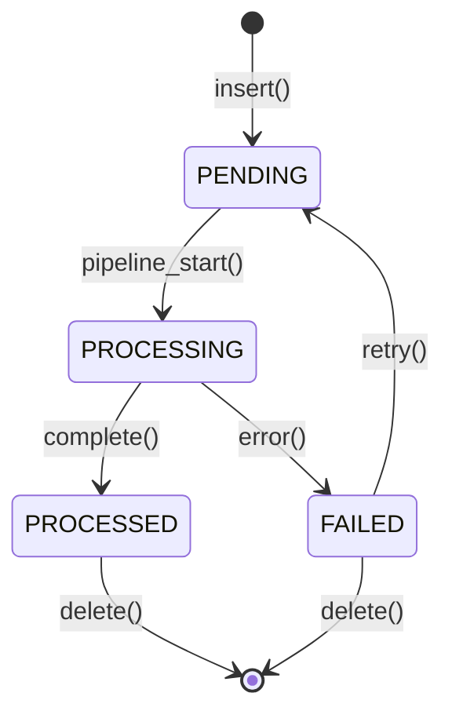

# LightRAG Domain Model

## Overview

This document defines all domain entities and their relationships in a stack-agnostic manner. Any implementation in any language should be able to recreate these entities following these definitions.

---

## Entity Definitions

### Entity: Document

```yaml
name: Document
description: A unit of text content to be processed and indexed into the knowledge graph
attributes:
  - name: id
    type: string
    required: true
    constraints: 
      - Unique MD5 hash of content
      - Immutable after creation
    purpose: Primary identifier for document deduplication
    
  - name: content
    type: string
    required: true
    constraints:
      - UTF-8 encoded
      - Max practical size depends on chunking
    purpose: Raw text content to be processed
    
  - name: file_path
    type: string
    required: false
    constraints:
      - Valid file path or URL
      - Max length 32768 characters
    purpose: Source location for traceability
    
  - name: status
    type: enum
    required: true
    values: [PENDING, PROCESSING, PROCESSED, FAILED]
    default: PENDING
    purpose: Track document processing state
    
  - name: track_id
    type: string
    required: false
    constraints:
      - UUID format
    purpose: Group related documents for batch tracking
    
  - name: created_at
    type: datetime
    required: true
    purpose: Document creation timestamp
    
  - name: updated_at
    type: datetime
    required: true
    purpose: Last modification timestamp
    
  - name: chunks_count
    type: integer
    required: false
    purpose: Number of chunks generated from this document
    
  - name: error
    type: string
    required: false
    purpose: Error message if processing failed
    
invariants:
  - "id is MD5 hash of content - same content always produces same id"
  - "status transitions follow state machine (see below)"
  - "content cannot be empty"
  - "file_path cannot contain path traversal sequences"
  
lifecycle:
  created_by: insert(), ainsert(), batch_insert()
  transitions:
    - PENDING → PROCESSING: When pipeline starts processing
    - PROCESSING → PROCESSED: When entity extraction completes
    - PROCESSING → FAILED: When any error occurs
    - FAILED → PENDING: When retry is requested
  deleted_by: delete_by_doc_id() with cascade to chunks/entities
```

### Document State Machine



---

### Entity: Chunk

```yaml
name: Chunk
description: A segment of a document, sized for LLM context windows
attributes:
  - name: id
    type: string
    required: true
    constraints:
      - MD5 hash of content
      - Unique within document
    purpose: Primary identifier
    
  - name: content
    type: string
    required: true
    constraints:
      - Max tokens configurable (default 1200)
    purpose: Text segment for processing
    
  - name: tokens
    type: integer
    required: true
    purpose: Token count for this chunk
    
  - name: chunk_order_index
    type: integer
    required: true
    purpose: Position in document sequence
    
  - name: full_doc_id
    type: string
    required: true
    constraints:
      - Foreign key to Document.id
    purpose: Link back to source document
    
  - name: file_path
    type: string
    required: false
    purpose: Inherited from parent document
    
invariants:
  - "chunks from same document should have contiguous order indices"
  - "overlap tokens maintained between adjacent chunks"
  - "total tokens across chunks ≈ document tokens + overlap"
  
lifecycle:
  created_by: chunking_by_token_size()
  deleted_by: Cascade when parent document deleted
```

---

### Entity: GraphEntity

```yaml
name: GraphEntity
description: A named entity extracted from text, stored as a node in knowledge graph
attributes:
  - name: id
    type: string
    required: true
    constraints:
      - Normalized entity name (uppercase, trimmed)
    purpose: Primary node identifier
    
  - name: entity_name
    type: string
    required: true
    constraints:
      - Max 256 characters
      - Normalized to uppercase
    purpose: Display name of the entity
    
  - name: entity_type
    type: string
    required: true
    constraints:
      - From configured entity types list
    purpose: Classification (Person, Organization, etc.)
    
  - name: description
    type: string
    required: true
    constraints:
      - May be summarized if >1200 tokens
    purpose: Aggregated description from all mentions
    
  - name: source_id
    type: string
    required: true
    constraints:
      - Pipe-separated list of chunk IDs
      - Max 300 source IDs per entity
    purpose: Traceability to source chunks
    
  - name: file_path
    type: string
    required: false
    constraints:
      - Pipe-separated list
      - Max 100 file paths
    purpose: Source file traceability
    
invariants:
  - "entity_name is always uppercase normalized"
  - "description is summarized when exceeding token limit"
  - "source_id list managed by FIFO or KEEP strategy"
  
lifecycle:
  created_by: Entity extraction during document processing
  merged_by: _merge_nodes_then_upsert() when same entity found
  deleted_by: delete_by_entity(), or cascade from document deletion
```

---

### Entity: GraphRelationship

```yaml
name: GraphRelationship
description: A typed relationship between two entities, stored as an edge in knowledge graph
attributes:
  - name: id
    type: string
    required: true
    constraints:
      - Format: "source_entity<SEP>target_entity" (sorted alphabetically)
    purpose: Unique edge identifier
    
  - name: source_entity
    type: string
    required: true
    constraints:
      - Foreign key to GraphEntity.id
    purpose: Source node of relationship
    
  - name: target_entity
    type: string
    required: true
    constraints:
      - Foreign key to GraphEntity.id
    purpose: Target node of relationship
    
  - name: description
    type: string
    required: true
    purpose: Aggregated description of the relationship
    
  - name: keywords
    type: string
    required: false
    constraints:
      - Pipe-separated list
    purpose: Key terms describing relationship
    
  - name: weight
    type: float
    required: true
    default: 1.0
    purpose: Relationship strength/frequency
    
  - name: source_id
    type: string
    required: true
    constraints:
      - Pipe-separated chunk IDs
      - Max 300 source IDs
    purpose: Traceability to source chunks
    
  - name: file_path
    type: string
    required: false
    purpose: Source file traceability
    
invariants:
  - "relationships are bidirectional (order doesn't matter for storage)"
  - "source and target entities must exist in graph"
  - "weight increments with each additional mention"
  
lifecycle:
  created_by: Relationship extraction during document processing
  merged_by: _merge_edges_then_upsert() when same pair found
  deleted_by: delete_by_relation(), or cascade from entity deletion
```

---

### Entity: Embedding

```yaml
name: Embedding
description: Vector representation of text for similarity search
attributes:
  - name: id
    type: string
    required: true
    purpose: Unique identifier (varies by type)
    
  - name: vector
    type: float[]
    required: true
    constraints:
      - Dimension matches embedding model (e.g., 1536 for OpenAI)
      - Normalized for cosine similarity
    purpose: Dense vector representation
    
  - name: content
    type: string
    required: false
    purpose: Original text that was embedded
    
  - name: metadata
    type: object
    required: false
    purpose: Additional attributes for filtering
    
embedding_types:
  - name: ChunkEmbedding
    id_format: "chunk MD5 hash"
    content: "chunk text content"
    
  - name: EntityEmbedding
    id_format: "entity_name (uppercase)"
    content: "entity_name: description"
    
  - name: RelationEmbedding
    id_format: "src_entity<SEP>tgt_entity" (sorted)
    content: "src_entity -> tgt_entity: description keywords"
```

---

### Entity: Tenant (Multi-Tenancy)

```yaml
name: Tenant
description: An isolated workspace for a customer or organization
attributes:
  - name: id
    type: string
    required: true
    constraints:
      - UUID format
    purpose: Primary identifier
    
  - name: name
    type: string
    required: true
    purpose: Display name
    
  - name: description
    type: string
    required: false
    purpose: Tenant description
    
  - name: is_active
    type: boolean
    required: true
    default: true
    purpose: Enable/disable tenant
    
  - name: config
    type: TenantConfig
    required: false
    purpose: Tenant-specific configuration overrides
    
  - name: created_at
    type: datetime
    required: true
    purpose: Creation timestamp
    
  - name: created_by
    type: string
    required: true
    purpose: User who created the tenant
    
invariants:
  - "inactive tenants cannot process new documents"
  - "tenant data is fully isolated from other tenants"
```

---

### Entity: KnowledgeBase

```yaml
name: KnowledgeBase
description: A collection of related documents within a tenant
attributes:
  - name: id
    type: string
    required: true
    constraints:
      - UUID format
    purpose: Primary identifier
    
  - name: tenant_id
    type: string
    required: true
    constraints:
      - Foreign key to Tenant.id
    purpose: Parent tenant
    
  - name: name
    type: string
    required: true
    purpose: Display name
    
  - name: description
    type: string
    required: false
    purpose: KB description
    
  - name: document_count
    type: integer
    required: true
    default: 0
    purpose: Number of documents in KB
    
  - name: config
    type: KBConfig
    required: false
    purpose: KB-specific configuration overrides
    
invariants:
  - "KnowledgeBase always belongs to exactly one Tenant"
  - "document_count should match actual document count"
```

---

## Relationship Definitions

```yaml
relationships:
  - name: Document-contains-Chunk
    type: one-to-many
    source: Document
    target: Chunk
    cascade: delete
    description: A document is split into multiple chunks
    
  - name: Chunk-mentions-GraphEntity
    type: many-to-many
    source: Chunk
    target: GraphEntity
    through: source_id field
    cascade: none (entities may persist after chunk deleted)
    description: Chunks mention entities, tracked via source_id
    
  - name: Chunk-mentions-GraphRelationship
    type: many-to-many
    source: Chunk
    target: GraphRelationship
    through: source_id field
    cascade: none
    description: Chunks describe relationships, tracked via source_id
    
  - name: GraphEntity-related_to-GraphEntity
    type: many-to-many
    source: GraphEntity
    target: GraphEntity
    through: GraphRelationship
    cascade: delete_edge_on_node_delete
    description: Entities connect through typed relationships
    
  - name: Tenant-owns-KnowledgeBase
    type: one-to-many
    source: Tenant
    target: KnowledgeBase
    cascade: delete
    description: Tenant contains multiple knowledge bases
    
  - name: KnowledgeBase-contains-Document
    type: one-to-many
    source: KnowledgeBase
    target: Document
    cascade: delete
    description: KB contains multiple documents
```

---

## Domain Events

| Event | Trigger | Payload | Handlers |
|-------|---------|---------|----------|
| **DocumentEnqueued** | `ainsert()` starts | `{doc_id, track_id, file_path}` | Update doc_status to PENDING |
| **DocumentProcessingStarted** | Pipeline picks up document | `{doc_id, timestamp}` | Update status to PROCESSING |
| **ChunksCreated** | Chunking completes | `{doc_id, chunk_count, chunk_ids}` | Store in text_chunks |
| **EntitiesExtracted** | LLM extraction completes | `{doc_id, entities[], relations[]}` | Cache in llm_response_cache |
| **EntityMerged** | Entity already exists | `{entity_name, old_desc, new_desc, merged_desc}` | Update graph, invalidate embedding |
| **DocumentProcessed** | All processing complete | `{doc_id, entity_count, relation_count}` | Update status to PROCESSED |
| **DocumentFailed** | Any error occurs | `{doc_id, error_message, stack_trace}` | Update status to FAILED |
| **QueryExecuted** | `aquery()` returns | `{query, mode, latency_ms, sources_count}` | Log for analytics |
| **CacheHit** | LLM cache found | `{cache_key, age_seconds}` | Skip LLM call |
| **CacheMiss** | LLM cache not found | `{cache_key}` | Call LLM, store result |

---

## Value Objects

### QueryParam

```yaml
name: QueryParam
description: Immutable configuration for query execution
attributes:
  - name: mode
    type: enum
    values: [naive, local, global, hybrid, bypass]
    default: hybrid
    purpose: Query strategy selection
    
  - name: only_need_context
    type: boolean
    default: false
    purpose: Return context without LLM generation
    
  - name: top_k
    type: integer
    default: 40
    purpose: Max vector results to retrieve
    
  - name: stream
    type: boolean
    default: false
    purpose: Enable streaming response
    
  - name: conversation_history
    type: list[Message]
    default: []
    purpose: Previous conversation for context
```

### QueryResult

```yaml
name: QueryResult
description: Unified response from query operations
attributes:
  - name: content
    type: string
    purpose: Generated text response
    
  - name: response_iterator
    type: AsyncIterator[string]
    purpose: Streaming response chunks (if stream=true)
    
  - name: raw_data
    type: object
    purpose: Structured data with references
    schema:
      entities: list[Entity]
      relationships: list[Relationship]
      chunks: list[Chunk]
      references: list[Reference]
      
  - name: is_streaming
    type: boolean
    purpose: Flag indicating streaming mode
```

---

## Cross-References

- [API Contracts](04-api-contracts.md) - API operations on these entities
- [Algorithms](05-algorithms.md) - Processing logic for entities
- [Storage Contracts](06-storage-contracts.md) - How entities are persisted
