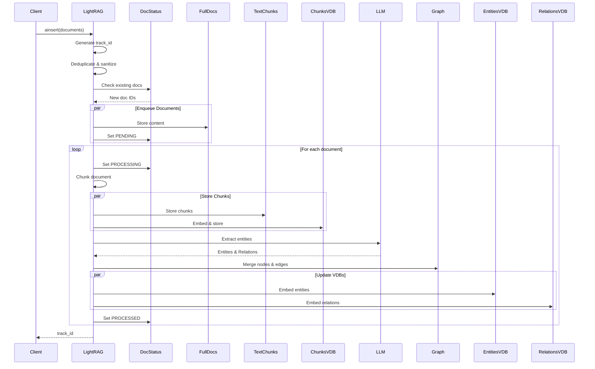
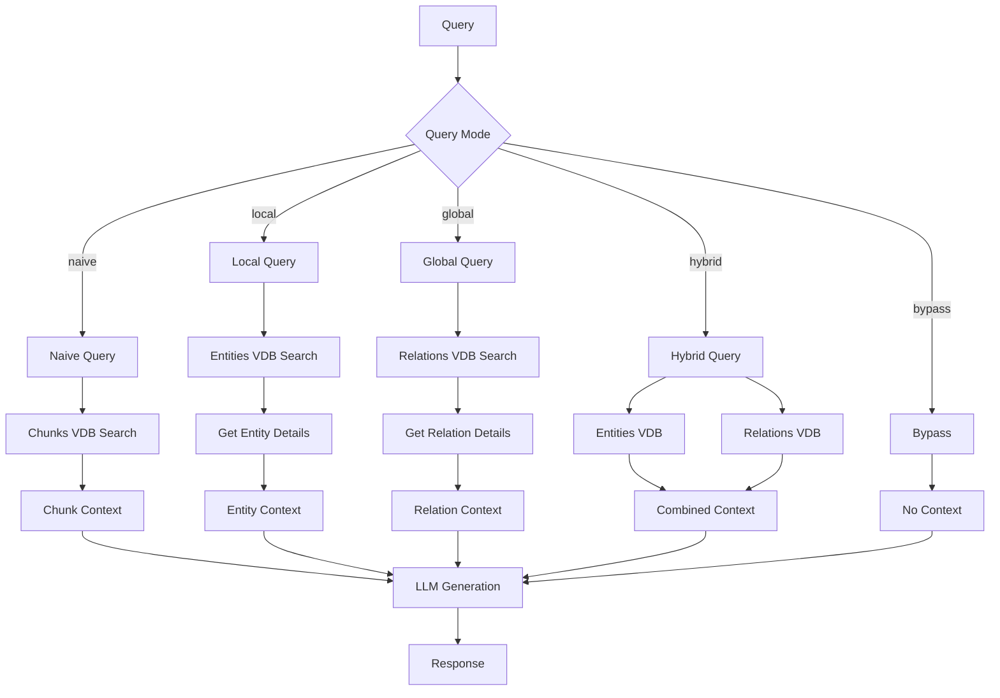

# LightRAG API Contracts

## Overview

This document defines all public API operations with their contracts, including preconditions, postconditions, and invariants. Any implementation should enforce these contracts.

---

## Core API: LightRAG Class

### Constructor: `LightRAG(...)`

```yaml
operation: Initialize LightRAG instance
signature: |
  LightRAG(
    working_dir: str = "./rag_storage",
    kv_storage: str = "JsonKVStorage",
    vector_storage: str = "NanoVectorDBStorage",
    graph_storage: str = "NetworkXStorage",
    doc_status_storage: str = "JsonDocStatusStorage",
    workspace: str = "",
    embedding_func: EmbeddingFunc = None,
    llm_model_func: Callable = None,
    llm_model_name: str = "gpt-4o-mini",
    chunk_token_size: int = 1200,
    chunk_overlap_token_size: int = 100,
    top_k: int = 40,
    ...
  )
  
preconditions:
  - working_dir must be a valid file path
  - embedding_func must be provided for vector operations
  - llm_model_func must be provided for query generation
  
postconditions:
  - All storage instances created (not initialized)
  - Configuration validated
  - Working directory created if not exists
  - _storages_status == StoragesStatus.CREATED
  
errors:
  - ValueError: Invalid storage configuration
  - ImportError: Storage backend not available
```

---

### Method: `initialize_storages()`

```yaml
operation: Initialize all storage backends
signature: async initialize_storages() -> None

preconditions:
  - Instance created via constructor
  - _storages_status == StoragesStatus.CREATED
  
postconditions:
  - All 12 storage instances initialized
  - Database connections established
  - Indices loaded or created
  - _storages_status == StoragesStatus.INITIALIZED
  - Default workspace set if first instance
  
side_effects:
  - May create database schemas
  - May load existing indices into memory
  - Sets default workspace globally
  
errors:
  - ConnectionError: Cannot connect to storage backend
  - PermissionError: Cannot access storage location
```

---

### Method: `finalize_storages()`

```yaml
operation: Gracefully shutdown all storage backends
signature: async finalize_storages() -> None

preconditions:
  - _storages_status == StoragesStatus.INITIALIZED
  
postconditions:
  - All pending writes flushed to disk
  - Database connections closed
  - Resources released
  - _storages_status == StoragesStatus.FINALIZED
  
side_effects:
  - Flushes in-memory data to persistent storage
  - Closes network connections
  
errors:
  - May log errors but continues finalization for all storages
```

---

## Document Ingestion API

### Method: `insert()` / `ainsert()`

```yaml
operation: Insert documents into the knowledge graph
signature: |
  insert(
    input: str | list[str],
    split_by_character: str | None = None,
    split_by_character_only: bool = False,
    ids: str | list[str] | None = None,
    file_paths: str | list[str] | None = None,
    track_id: str | None = None,
  ) -> str
  
async_signature: |
  async ainsert(...) -> str

preconditions:
  - Storage initialized
  - input is non-empty string or list
  - If ids provided, len(ids) == len(input)
  - If file_paths provided, len(file_paths) == len(input)
  - ids must be unique if provided
  
postconditions:
  - Documents stored in full_docs
  - Chunks stored in text_chunks
  - Chunk embeddings stored in chunks_vdb
  - Entities extracted and stored in graph
  - Relationships extracted and stored in graph
  - Entity/relationship embeddings stored in VDB
  - Document status updated to PROCESSED
  - Returns track_id for status monitoring
  
side_effects:
  - LLM calls for entity extraction
  - Embedding computations
  - Graph mutations
  - VDB index updates
  
errors:
  - ValueError: IDs not unique or length mismatch
  - LLMError: Entity extraction failed
  - StorageError: Cannot persist data
  
idempotency: |
  Partially idempotent - duplicate document content 
  (same MD5 hash) will be skipped
```

### Insert Sequence Diagram



---

### Method: `apipeline_enqueue_documents()`

```yaml
operation: Enqueue documents for processing without processing
signature: |
  async apipeline_enqueue_documents(
    input: str | list[str],
    ids: list[str] | None = None,
    file_paths: str | list[str] | None = None,
    track_id: str | None = None,
  ) -> str

preconditions:
  - Storage initialized
  - input is non-empty
  
postconditions:
  - Documents stored in full_docs
  - Document status set to PENDING
  - Returns track_id
  
side_effects:
  - Creates document entries in doc_status
  - Stores content in full_docs
  
use_case: |
  For batch processing where enqueueing and processing 
  are handled separately
```

---

### Method: `apipeline_process_enqueue_documents()`

```yaml
operation: Process all enqueued pending documents
signature: |
  async apipeline_process_enqueue_documents(
    split_by_character: str | None = None,
    split_by_character_only: bool = False,
  ) -> None

preconditions:
  - Storage initialized
  - Documents in PENDING/PROCESSING/FAILED status exist
  
postconditions:
  - All processable documents moved to PROCESSED or FAILED
  - Entity extraction complete for successful docs
  - Pipeline status reset to not busy
  
concurrency: |
  Uses pipeline_status lock to ensure single processor
  Other calls queue their request via request_pending flag
  
cancellation: |
  Set pipeline_status["cancellation_requested"] = True
  to cancel processing after current document completes
```

---

## Query API

### Method: `query()` / `aquery()`

```yaml
operation: Query knowledge graph with natural language
signature: |
  query(
    query: str,
    param: QueryParam = QueryParam(),
    system_prompt: str | None = None,
  ) -> str | Iterator[str]
  
async_signature: |
  async aquery(...) -> str | AsyncIterator[str]

query_param_fields:
  mode: 
    type: Literal["naive", "local", "global", "hybrid", "bypass"]
    default: "hybrid"
    description: Query strategy
  only_need_context:
    type: bool
    default: false
    description: Return context without LLM generation
  top_k:
    type: int
    default: 40
    description: Number of results to retrieve
  stream:
    type: bool
    default: false
    description: Enable streaming response
  conversation_history:
    type: list[dict]
    default: []
    description: Previous conversation messages

preconditions:
  - Storage initialized
  - Query string is non-empty
  - LLM function configured (unless only_need_context=True)
  
postconditions:
  - Returns LLM-generated response
  - Response based on retrieved context
  - Streaming mode returns async iterator
  
side_effects:
  - Vector similarity searches
  - Graph traversals
  - LLM inference calls
  
query_modes:
  naive: |
    Direct chunk retrieval via vector similarity.
    No knowledge graph used.
  local: |
    Entity-centric search. Find relevant entities,
    retrieve their descriptions and relationships.
  global: |
    Relationship-centric search. Find relevant 
    relationships, expand to connected entities.
  hybrid: |
    Combine local and global modes for comprehensive
    coverage of both entities and relationships.
  bypass: |
    Skip retrieval, send query directly to LLM.
    Used for general conversation.
```

### Query Modes Flow



---

### Method: `aquery_data()`

```yaml
operation: Retrieve structured data without LLM generation
signature: |
  async aquery_data(
    query: str,
    param: QueryParam = QueryParam(),
  ) -> dict[str, Any]

preconditions:
  - Storage initialized
  - Query string is non-empty
  
postconditions:
  - Returns structured data dictionary
  - No LLM calls made
  
return_schema:
  status: "success" | "error"
  message: str
  data:
    entities:
      - entity_name: str
        entity_type: str
        description: str
        source_id: str
    relationships:
      - src_id: str
        tgt_id: str
        description: str
        keywords: str
        weight: float
    chunks:
      - content: str
        full_doc_id: str
        file_path: str
    context: str  # Combined context that would be sent to LLM
```

---

### Method: `aquery_llm()`

```yaml
operation: Query with full control over retrieval and generation
signature: |
  async aquery_llm(
    query: str,
    param: QueryParam = QueryParam(),
    system_prompt: str | None = None,
  ) -> dict[str, Any]

preconditions:
  - Storage initialized
  - Query string is non-empty
  
postconditions:
  - Returns comprehensive result dictionary
  - Includes both retrieval data and LLM response
  
return_schema:
  retrieval_data:
    entities: list[Entity]
    relationships: list[Relationship]
    chunks: list[Chunk]
    context: str
  llm_response:
    content: str  # Non-streaming
    response_iterator: AsyncIterator[str]  # Streaming
    is_streaming: bool
```

---

## Deletion API

### Method: `delete_by_doc_id()`

```yaml
operation: Delete document and all associated data
signature: |
  async adelete_by_doc_id(doc_id: str) -> DeletionResult

preconditions:
  - Storage initialized
  - doc_id exists in system
  
postconditions:
  - Document removed from full_docs
  - All chunks removed from text_chunks
  - Chunk embeddings removed from chunks_vdb
  - Entity source_ids updated (remove chunk references)
  - Relation source_ids updated
  - Orphaned entities removed (no source_ids left)
  - Orphaned relations removed
  - Entity/relation embeddings updated
  - Document status removed
  
return_schema:
  deleted_doc_ids: list[str]
  deleted_chunk_ids: list[str]
  affected_entity_count: int
  deleted_entity_count: int
  affected_relation_count: int
  deleted_relation_count: int

cascade_behavior: |
  Document deletion cascades to chunks.
  Chunk deletion updates entity/relation source_ids.
  Entities/relations with no remaining sources are deleted.
```

---

### Method: `delete_by_entity()`

```yaml
operation: Delete entity and associated relationships
signature: |
  async adelete_by_entity(entity_name: str) -> DeletionResult

preconditions:
  - Storage initialized
  - entity_name exists in graph
  
postconditions:
  - Entity removed from graph
  - Entity embedding removed from entities_vdb
  - All relationships involving entity removed
  - Relationship embeddings removed
  
cascade_behavior: |
  Entity deletion cascades to all relationships
  where entity is source or target.
```

---

## Knowledge Graph API

### Method: `get_knowledge_graph()`

```yaml
operation: Retrieve knowledge graph subgraph
signature: |
  async get_knowledge_graph(
    node_label: str,
    max_depth: int = 3,
    max_nodes: int = None,
  ) -> KnowledgeGraph

preconditions:
  - Storage initialized
  - node_label is valid string
  
postconditions:
  - Returns KnowledgeGraph with nodes and edges
  - Result limited by max_depth and max_nodes
  
return_schema:
  nodes:
    - id: str
      labels: list[str]
      properties:
        entity_name: str
        entity_type: str
        description: str
        source_id: str
  edges:
    - id: str
      source: str
      target: str
      properties:
        description: str
        keywords: str
        weight: float
```

---

### Method: `insert_custom_kg()`

```yaml
operation: Insert pre-extracted knowledge graph
signature: |
  async ainsert_custom_kg(
    custom_kg: dict[str, Any],
    full_doc_id: str = None,
  ) -> None

input_schema:
  chunks:
    - content: str
      source_id: str
      file_path: str
      chunk_order_index: int
  entities:
    - entity_name: str
      entity_type: str
      description: str
      source_id: str  # References chunk source_id
      file_path: str
  relationships:
    - src_id: str
      tgt_id: str
      description: str
      keywords: str
      weight: float
      source_id: str  # References chunk source_id

preconditions:
  - Storage initialized
  - Entity source_ids reference valid chunks
  - Relationship src_id and tgt_id reference valid entities
  
postconditions:
  - Chunks stored in chunks_vdb and text_chunks
  - Entities stored in graph and entities_vdb
  - Relationships stored in graph and relationships_vdb
  
use_case: |
  For pre-processed knowledge graphs or
  custom extraction pipelines
```

---

## Status & Monitoring API

### Method: `get_processing_status()`

```yaml
operation: Get current pipeline processing status
signature: |
  async get_processing_status() -> dict[str, Any]

return_schema:
  busy: bool
  job_name: str
  job_start: str  # ISO timestamp
  docs: int  # Total documents
  batchs: int  # Total files
  cur_batch: int  # Current progress
  request_pending: bool
  cancellation_requested: bool
  latest_message: str
  history_messages: list[str]
```

---

### Method: `get_docs_by_status()`

```yaml
operation: Retrieve documents by processing status
signature: |
  async get_docs_by_status(
    status: DocStatus
  ) -> dict[str, DocProcessingStatus]

status_values:
  - PENDING: Document enqueued, waiting for processing
  - PROCESSING: Currently being processed
  - PROCESSED: Successfully completed
  - FAILED: Processing failed with error

return_schema:
  doc_id:
    status: DocStatus
    content_summary: str
    content_length: int
    chunks_count: int
    chunks_list: list[str]
    file_path: str
    track_id: str
    error_msg: str  # Only for FAILED
    created_at: str
    updated_at: str
    metadata: dict
```

---

## Rebuild & Recovery API

### Method: `rebuild_from_chunks()`

```yaml
operation: Rebuild knowledge graph from existing chunks
signature: |
  async rebuild_from_chunks(
    chunk_ids: list[str] | None = None,
  ) -> None

preconditions:
  - Storage initialized
  - Chunks exist in text_chunks storage
  
postconditions:
  - Entities re-extracted from chunks
  - Relationships re-extracted
  - Graph updated with new extractions
  - VDBs updated with new embeddings
  
use_case: |
  For recovery after corruption or
  re-extraction with updated prompts/models
```

---

## Error Taxonomy

| Error Type | HTTP Code | Description |
|------------|-----------|-------------|
| **ValidationError** | 400 | Invalid input parameters |
| **NotFoundError** | 404 | Entity/document not found |
| **ConflictError** | 409 | Duplicate ID or concurrent modification |
| **StorageError** | 500 | Storage backend failure |
| **LLMError** | 502 | LLM service unavailable or failed |
| **TimeoutError** | 504 | Operation exceeded timeout |
| **PipelineCancelledException** | N/A | User-initiated cancellation |

---

## Rate Limiting & Concurrency

```yaml
concurrency_controls:
  llm_model_max_async:
    default: 16
    description: Maximum concurrent LLM calls
    
  embedding_func_max_async:
    default: 8
    description: Maximum concurrent embedding calls
    
  max_parallel_insert:
    default: 4
    description: Maximum concurrent document processing
    
timeout_controls:
  default_llm_timeout:
    default: 120
    unit: seconds
    description: LLM call timeout
    
  default_embedding_timeout:
    default: 60
    unit: seconds
    description: Embedding call timeout
```

---

## Cross-References

- [Domain Model](03-domain-model.md) - Entity definitions
- [Algorithms](05-algorithms.md) - Processing logic
- [Storage Contracts](06-storage-contracts.md) - Storage interfaces
