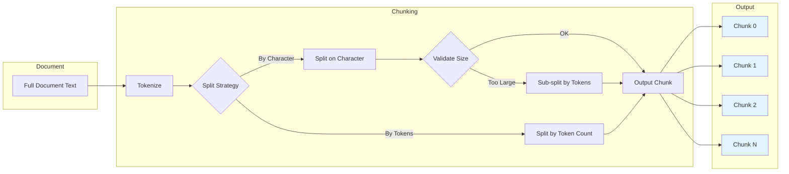
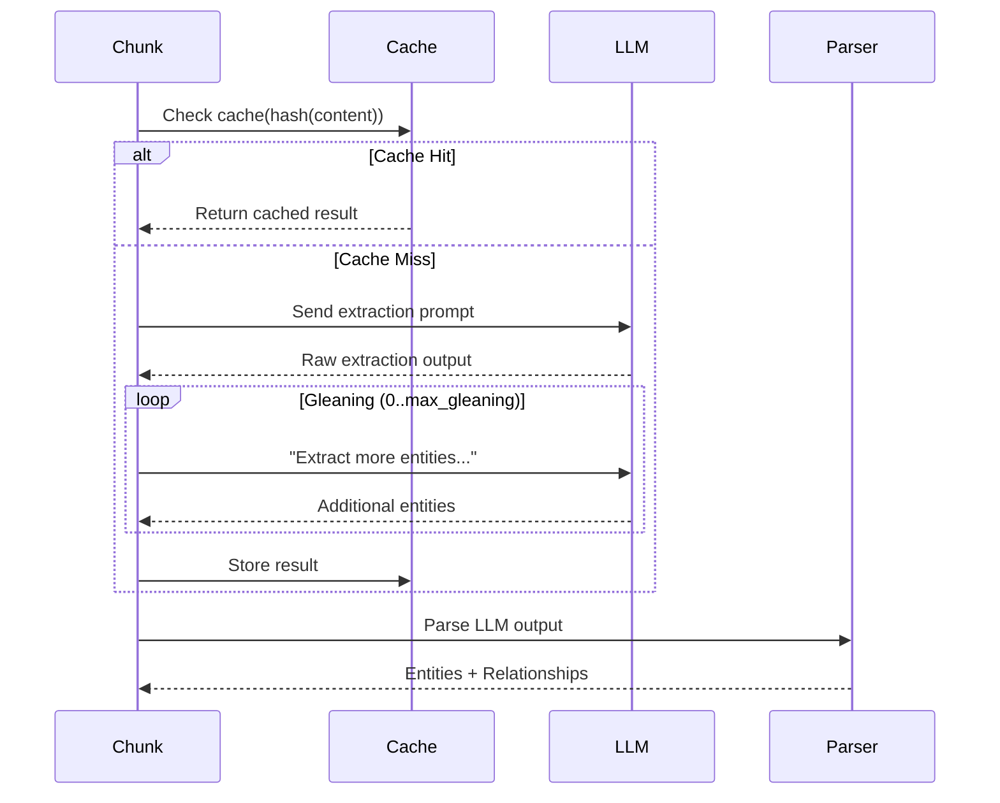
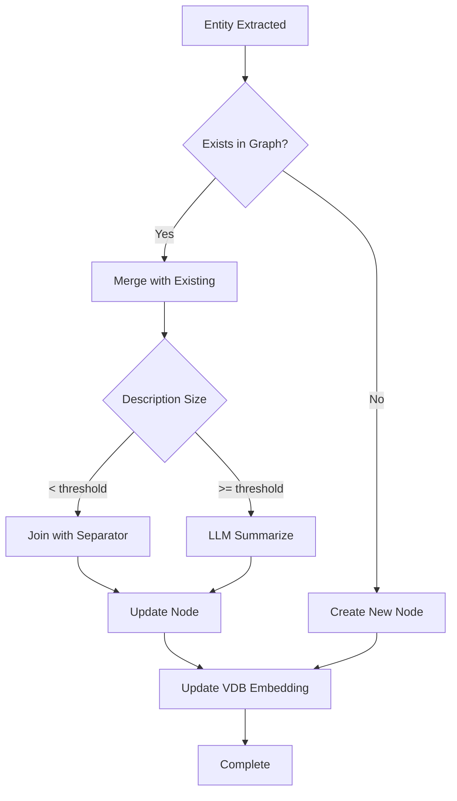
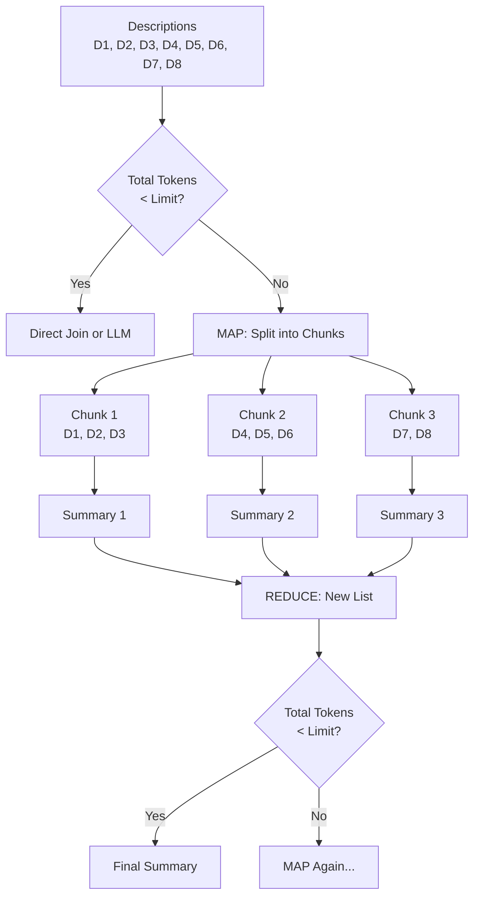
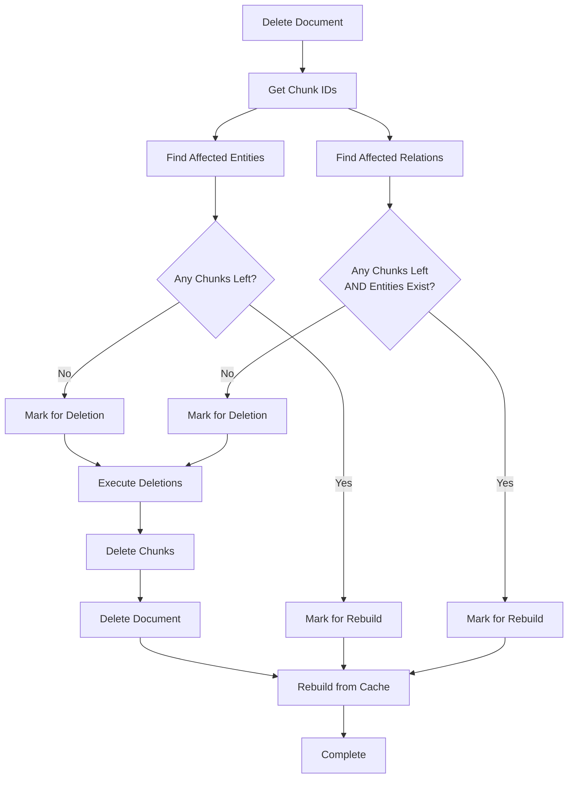

# LightRAG Algorithms

## Overview

This document describes the core algorithms in stack-agnostic pseudocode that any implementation can follow. These algorithms form the foundation of the RAG processing pipeline.

---

## 1. Text Chunking Algorithm

### Purpose
Split documents into overlapping chunks that fit within LLM context windows while preserving semantic coherence.

### Pseudocode

```
ALGORITHM chunking_by_token_size(
    tokenizer: Tokenizer,
    content: string,
    split_by_character: string | null,
    split_by_character_only: boolean,
    chunk_overlap_token_size: int,
    chunk_token_size: int
) -> list[Chunk]

INPUT:
    content: Raw text document
    chunk_token_size: Maximum tokens per chunk (default: 1200)
    chunk_overlap_token_size: Overlap between chunks (default: 100)
    split_by_character: Optional character to split on first
    split_by_character_only: If true, only split by character

OUTPUT:
    List of chunks with {tokens, content, chunk_order_index}

PROCESS:
    tokens = tokenizer.encode(content)
    results = []
    
    IF split_by_character IS NOT NULL:
        raw_chunks = content.split(split_by_character)
        new_chunks = []
        
        FOR EACH chunk IN raw_chunks:
            chunk_tokens = tokenizer.encode(chunk)
            
            IF split_by_character_only AND len(chunk_tokens) > chunk_token_size:
                RAISE ChunkTokenLimitExceededError
            ELSE IF len(chunk_tokens) > chunk_token_size:
                # Sub-split by token size
                FOR start = 0 TO len(chunk_tokens) STEP (chunk_token_size - chunk_overlap_token_size):
                    sub_chunk = tokenizer.decode(chunk_tokens[start:start + chunk_token_size])
                    new_chunks.append((min(chunk_token_size, len(chunk_tokens) - start), sub_chunk))
            ELSE:
                new_chunks.append((len(chunk_tokens), chunk))
        
        FOR index, (token_count, chunk) IN enumerate(new_chunks):
            results.append({
                tokens: token_count,
                content: chunk.strip(),
                chunk_order_index: index
            })
    ELSE:
        # Split purely by token size with overlap
        step = chunk_token_size - chunk_overlap_token_size
        FOR index, start = 0 TO len(tokens) STEP step:
            chunk_content = tokenizer.decode(tokens[start:start + chunk_token_size])
            results.append({
                tokens: min(chunk_token_size, len(tokens) - start),
                content: chunk_content.strip(),
                chunk_order_index: index
            })
    
    RETURN results
```

### Chunking Visualization



---

## 2. Entity & Relationship Extraction Algorithm

### Purpose
Extract named entities and their relationships from text chunks using LLM.

### Pseudocode

```
ALGORITHM extract_entities(
    chunks: dict[chunk_id, ChunkData],
    global_config: Config,
    llm_response_cache: KVStorage
) -> list[ChunkResult]

INPUT:
    chunks: Dictionary of chunk_id -> {content, full_doc_id, file_path}
    global_config: Contains LLM function, entity_types, language
    
OUTPUT:
    List of ChunkResult with extracted entities and relationships

CONSTANTS:
    TUPLE_DELIMITER = "<|#|>"
    COMPLETION_DELIMITER = "<|COMPLETE|>"
    
PROCESS:
    results = []
    
    # Build extraction prompt
    entity_types = global_config.entity_types  # e.g., ["person", "organization", "location"]
    language = global_config.language
    
    FOR EACH (chunk_id, chunk_data) IN chunks:
        # Check cache first
        cache_key = compute_hash(chunk_data.content + entity_types + language)
        cached_result = cache.get(cache_key)
        
        IF cached_result IS NOT NULL:
            chunk_result = parse_extraction_result(cached_result, chunk_id)
        ELSE:
            # Build prompt with entity types and examples
            prompt = format_extraction_prompt(
                content=chunk_data.content,
                entity_types=entity_types,
                language=language,
                tuple_delimiter=TUPLE_DELIMITER
            )
            
            # Call LLM
            llm_result = await llm_model_func(prompt)
            
            # Optional: Gleaning for more entities
            FOR i = 1 TO max_gleaning:
                IF needs_more_extraction(llm_result):
                    glean_prompt = format_gleaning_prompt(llm_result)
                    additional = await llm_model_func(glean_prompt)
                    llm_result = merge_results(llm_result, additional)
            
            # Cache the result
            cache.set(cache_key, llm_result)
            
            # Parse LLM output
            chunk_result = parse_extraction_result(llm_result, chunk_id)
        
        results.append(chunk_result)
    
    RETURN results


FUNCTION parse_extraction_result(result: string, chunk_id: string) -> ChunkResult:
    entities = {}   # entity_name -> entity_data
    relationships = {}  # (src, tgt) -> relationship_data
    
    records = split(result, ["\n", COMPLETION_DELIMITER])
    
    FOR EACH record IN records:
        fields = split(record, TUPLE_DELIMITER)
        
        IF fields[0] == "entity" AND len(fields) == 4:
            entity_name = normalize(fields[1])  # UPPERCASE
            entity_type = normalize(fields[2])  # lowercase
            description = sanitize(fields[3])
            
            entities[entity_name] = {
                entity_name: entity_name,
                entity_type: entity_type,
                description: description,
                source_id: chunk_id
            }
            
        ELSE IF fields[0] == "relationship" AND len(fields) == 5:
            source = normalize(fields[1])
            target = normalize(fields[2])
            keywords = sanitize(fields[3])
            description = sanitize(fields[4])
            
            key = (sorted([source, target]))  # Consistent key ordering
            
            relationships[key] = {
                src_id: source,
                tgt_id: target,
                keywords: keywords,
                description: description,
                weight: 1.0,
                source_id: chunk_id
            }
    
    RETURN ChunkResult(entities, relationships)
```

### Entity Extraction Flow



---

## 3. Entity/Relationship Merging Algorithm

### Purpose
Merge newly extracted entities with existing knowledge graph, combining descriptions and managing source references.

### Pseudocode

```
ALGORITHM merge_nodes_and_edges(
    chunk_results: list[ChunkResult],
    knowledge_graph: GraphStorage,
    entity_vdb: VectorStorage,
    relations_vdb: VectorStorage,
    global_config: Config
) -> void

INPUT:
    chunk_results: Extracted entities and relationships from chunks
    knowledge_graph: Existing knowledge graph
    entity_vdb: Entity vector database
    relations_vdb: Relationship vector database

PROCESS:
    # Group all entities and relationships by name/key
    all_entities = defaultdict(list)  # entity_name -> list[entity_data]
    all_relationships = defaultdict(list)  # (src, tgt) -> list[rel_data]
    
    FOR EACH result IN chunk_results:
        FOR EACH (name, data) IN result.entities:
            all_entities[name].append(data)
        FOR EACH (key, data) IN result.relationships:
            all_relationships[key].append(data)
    
    # Process entities with keyed locks for concurrency safety
    FOR EACH entity_name, entity_list IN all_entities:
        ACQUIRE_LOCK(entity_name)
        
        existing = await knowledge_graph.get_node(entity_name)
        
        IF existing IS NULL:
            # New entity - aggregate descriptions
            merged_description = aggregate_descriptions(
                [e.description for e in entity_list]
            )
            merged_source_ids = merge_source_ids(
                [e.source_id for e in entity_list]
            )
            
            await knowledge_graph.upsert_node(entity_name, {
                entity_name: entity_name,
                entity_type: entity_list[0].entity_type,
                description: merged_description,
                source_id: merged_source_ids
            })
        ELSE:
            # Merge with existing entity
            all_descriptions = [existing.description] + [e.description for e in entity_list]
            
            # Use LLM to summarize if too many descriptions
            IF count_tokens(all_descriptions) > summary_context_size:
                merged_description = await summarize_descriptions(
                    entity_name, all_descriptions
                )
            ELSE:
                merged_description = join(all_descriptions, SEPARATOR)
            
            merged_source_ids = merge_source_ids(
                existing.source_id,
                [e.source_id for e in entity_list],
                limit=max_source_ids_per_entity
            )
            
            await knowledge_graph.upsert_node(entity_name, {
                ...existing,
                description: merged_description,
                source_id: merged_source_ids
            })
        
        # Update entity vector embedding
        await entity_vdb.upsert({
            entity_name: {
                content: entity_name + "\n" + merged_description,
                entity_name: entity_name,
                source_id: merged_source_ids
            }
        })
        
        RELEASE_LOCK(entity_name)
    
    # Process relationships with keyed locks
    FOR EACH (src, tgt), rel_list IN all_relationships:
        sorted_key = sorted([src, tgt])
        ACQUIRE_LOCK(sorted_key)
        
        existing = await knowledge_graph.get_edge(src, tgt)
        
        IF existing IS NULL:
            # Create new relationship
            await knowledge_graph.upsert_edge(src, tgt, {
                description: aggregate_descriptions([r.description for r in rel_list]),
                keywords: merge_keywords([r.keywords for r in rel_list]),
                weight: sum([r.weight for r in rel_list]),
                source_id: merge_source_ids([r.source_id for r in rel_list])
            })
        ELSE:
            # Merge with existing relationship
            all_descriptions = [existing.description] + [r.description for r in rel_list]
            
            IF count_tokens(all_descriptions) > summary_context_size:
                merged_description = await summarize_descriptions(
                    f"{src} -> {tgt}", all_descriptions
                )
            ELSE:
                merged_description = join(all_descriptions, SEPARATOR)
            
            await knowledge_graph.upsert_edge(src, tgt, {
                ...existing,
                description: merged_description,
                weight: existing.weight + sum([r.weight for r in rel_list]),
                source_id: merge_source_ids(
                    existing.source_id,
                    [r.source_id for r in rel_list],
                    limit=max_source_ids_per_relation
                )
            })
        
        # Update relationship vector embedding
        await relations_vdb.upsert({...})
        
        RELEASE_LOCK(sorted_key)
```

### Merge Decision Flow



---

## 4. Query Processing Algorithm

### Purpose
Process natural language queries by retrieving relevant context from the knowledge graph and generating responses.

### Pseudocode

```
ALGORITHM process_query(
    query: string,
    param: QueryParam,
    knowledge_graph: GraphStorage,
    entity_vdb: VectorStorage,
    relations_vdb: VectorStorage,
    chunks_vdb: VectorStorage,
    llm_func: Function
) -> QueryResult

INPUT:
    query: User's natural language query
    param: {mode, top_k, only_need_context, stream}
    
OUTPUT:
    QueryResult with response and optional context data

PROCESS:
    context = {}
    
    SWITCH param.mode:
        CASE "naive":
            context = await naive_query(query, chunks_vdb, param.top_k)
            
        CASE "local":
            context = await local_query(query, entity_vdb, knowledge_graph, param.top_k)
            
        CASE "global":
            context = await global_query(query, relations_vdb, knowledge_graph, param.top_k)
            
        CASE "hybrid":
            local_ctx = await local_query(query, entity_vdb, knowledge_graph, param.top_k)
            global_ctx = await global_query(query, relations_vdb, knowledge_graph, param.top_k)
            context = merge_contexts(local_ctx, global_ctx)
            
        CASE "bypass":
            context = {}  # No retrieval
    
    IF param.only_need_context:
        RETURN QueryResult(context=context, response=null)
    
    # Format context for LLM
    formatted_context = format_context_for_llm(context)
    
    # Build prompt
    prompt = format_query_prompt(
        query=query,
        context=formatted_context,
        conversation_history=param.conversation_history
    )
    
    # Generate response
    IF param.stream:
        response_iterator = await llm_func(prompt, stream=true)
        RETURN QueryResult(response_iterator=response_iterator, context=context)
    ELSE:
        response = await llm_func(prompt)
        RETURN QueryResult(response=response, context=context)


FUNCTION local_query(query, entity_vdb, knowledge_graph, top_k) -> Context:
    # Find relevant entities by vector similarity
    entity_matches = await entity_vdb.search(query, top_k=top_k)
    
    entities = []
    relationships = []
    chunks = []
    
    FOR EACH match IN entity_matches:
        entity_name = match.entity_name
        
        # Get entity details from graph
        entity_data = await knowledge_graph.get_node(entity_name)
        IF entity_data:
            entities.append(entity_data)
            
            # Get related relationships
            edges = await knowledge_graph.get_edges_by_node(entity_name)
            relationships.extend(edges)
            
            # Get related chunks
            chunk_ids = parse_source_ids(entity_data.source_id)
            chunks.extend(await get_chunks_by_ids(chunk_ids))
    
    RETURN Context(entities, relationships, chunks)


FUNCTION global_query(query, relations_vdb, knowledge_graph, top_k) -> Context:
    # Find relevant relationships by vector similarity
    relation_matches = await relations_vdb.search(query, top_k=top_k)
    
    entities = set()
    relationships = []
    chunks = []
    
    FOR EACH match IN relation_matches:
        src, tgt = match.src_id, match.tgt_id
        
        # Get relationship details
        edge = await knowledge_graph.get_edge(src, tgt)
        IF edge:
            relationships.append(edge)
            
            # Get connected entities
            src_entity = await knowledge_graph.get_node(src)
            tgt_entity = await knowledge_graph.get_node(tgt)
            entities.add(src_entity)
            entities.add(tgt_entity)
            
            # Get related chunks
            chunk_ids = parse_source_ids(edge.source_id)
            chunks.extend(await get_chunks_by_ids(chunk_ids))
    
    RETURN Context(list(entities), relationships, chunks)
```

### Query Mode Comparison

```mermaid
graph TD
    subgraph Naive Mode
        N1[Query] --> N2[Chunks VDB]
        N2 --> N3[Similar Chunks]
        N3 --> N4[Context]
    end
    
    subgraph Local Mode
        L1[Query] --> L2[Entities VDB]
        L2 --> L3[Similar Entities]
        L3 --> L4[Get Entity Details]
        L4 --> L5[Get Connected Edges]
        L5 --> L6[Context]
    end
    
    subgraph Global Mode
        G1[Query] --> G2[Relations VDB]
        G2 --> G3[Similar Relations]
        G3 --> G4[Get Relation Details]
        G4 --> G5[Get Connected Entities]
        G5 --> G6[Context]
    end
    
    subgraph Hybrid Mode
        H1[Query] --> H2[Local Query]
        H1 --> H3[Global Query]
        H2 --> H4[Merge]
        H3 --> H4
        H4 --> H5[Context]
    end
```



---

## 5. Description Summarization Algorithm (Map-Reduce)

### Purpose
Summarize multiple descriptions that exceed token limits using a map-reduce approach.

### Pseudocode

```
ALGORITHM summarize_descriptions(
    description_type: string,
    entity_name: string,
    description_list: list[string],
    global_config: Config,
    llm_cache: KVStorage
) -> (summary: string, llm_used: boolean)

INPUT:
    description_list: List of descriptions to summarize
    global_config: Contains tokenizer, context limits, LLM function

CONSTANTS:
    summary_context_size: Max tokens for LLM context
    summary_max_tokens: Max tokens for output
    force_llm_summary_on_merge: Min descriptions before forcing LLM

OUTPUT:
    Tuple of (summarized text, whether LLM was used)

PROCESS:
    IF len(description_list) == 0:
        RETURN ("", false)
    
    IF len(description_list) == 1:
        RETURN (description_list[0], false)
    
    current_list = description_list.copy()
    llm_was_used = false
    
    WHILE true:
        total_tokens = sum(count_tokens(desc) for desc in current_list)
        
        # Base case: within limits
        IF total_tokens <= summary_context_size OR len(current_list) <= 2:
            IF len(current_list) < force_llm_summary_on_merge AND total_tokens < summary_max_tokens:
                # Just join, no LLM needed
                RETURN (SEPARATOR.join(current_list), llm_was_used)
            ELSE:
                # Final LLM summarization
                summary = await llm_summarize(entity_name, current_list)
                RETURN (summary, true)
        
        # Map phase: split into chunks
        chunks = []
        current_chunk = []
        current_tokens = 0
        
        FOR EACH desc IN current_list:
            desc_tokens = count_tokens(desc)
            
            IF current_tokens + desc_tokens > summary_context_size AND len(current_chunk) > 0:
                IF len(current_chunk) == 1:
                    # Force add one more to ensure at least 2 per chunk
                    current_chunk.append(desc)
                    chunks.append(current_chunk)
                    current_chunk = []
                    current_tokens = 0
                ELSE:
                    chunks.append(current_chunk)
                    current_chunk = [desc]
                    current_tokens = desc_tokens
            ELSE:
                current_chunk.append(desc)
                current_tokens += desc_tokens
        
        IF len(current_chunk) > 0:
            chunks.append(current_chunk)
        
        # Reduce phase: summarize each chunk
        new_summaries = []
        FOR EACH chunk IN chunks:
            IF len(chunk) == 1:
                new_summaries.append(chunk[0])
            ELSE:
                summary = await llm_summarize(entity_name, chunk)
                new_summaries.append(summary)
                llm_was_used = true
        
        current_list = new_summaries
```

### Map-Reduce Visualization



---

## 6. Source ID Management Algorithm

### Purpose
Manage source references for entities and relationships while respecting configured limits.

### Pseudocode

```
ALGORITHM apply_source_ids_limit(
    existing_source_ids: string,  # Pipe-separated
    new_source_ids: list[string],
    limit: int,
    method: "FIFO" | "KEEP"
) -> string

INPUT:
    existing_source_ids: Current pipe-separated source IDs
    new_source_ids: New source IDs to add
    limit: Maximum number of source IDs to keep
    method: Strategy for limiting (FIFO removes oldest, KEEP ignores new)

OUTPUT:
    Updated pipe-separated source IDs string

PROCESS:
    # Parse existing IDs
    existing_list = existing_source_ids.split(SEPARATOR)
    existing_set = set(existing_list)
    
    # Filter truly new IDs
    truly_new = [id for id in new_source_ids if id not in existing_set]
    
    IF len(truly_new) == 0:
        RETURN existing_source_ids
    
    combined = existing_list + truly_new
    
    IF len(combined) <= limit:
        RETURN SEPARATOR.join(combined)
    
    SWITCH method:
        CASE "FIFO":
            # Remove oldest entries (from beginning)
            trimmed = combined[len(combined) - limit:]
            RETURN SEPARATOR.join(trimmed)
            
        CASE "KEEP":
            # Keep existing, ignore new that exceed limit
            remaining_slots = limit - len(existing_list)
            IF remaining_slots > 0:
                added_new = truly_new[:remaining_slots]
                RETURN SEPARATOR.join(existing_list + added_new)
            ELSE:
                RETURN existing_source_ids


ALGORITHM subtract_source_ids(
    source_ids_string: string,
    ids_to_remove: set[string]
) -> string

INPUT:
    source_ids_string: Current pipe-separated source IDs
    ids_to_remove: Set of IDs to remove

OUTPUT:
    Updated pipe-separated source IDs string (may be empty)

PROCESS:
    current_ids = source_ids_string.split(SEPARATOR)
    remaining = [id for id in current_ids if id not in ids_to_remove]
    RETURN SEPARATOR.join(remaining)
```

---

## 7. Cascade Deletion Algorithm

### Purpose
Delete documents and cascade the deletion to chunks, entities, and relationships.

### Pseudocode

```
ALGORITHM delete_by_doc_id(
    doc_id: string,
    full_docs: KVStorage,
    text_chunks: KVStorage,
    chunks_vdb: VectorStorage,
    knowledge_graph: GraphStorage,
    entity_vdb: VectorStorage,
    relations_vdb: VectorStorage,
    doc_status: DocStatusStorage
) -> DeletionResult

INPUT:
    doc_id: Document ID to delete

OUTPUT:
    DeletionResult with counts of deleted/affected items

PROCESS:
    result = DeletionResult()
    
    # 1. Get document's chunk IDs
    doc_data = await doc_status.get(doc_id)
    chunk_ids = doc_data.chunks_list OR []
    chunk_ids_set = set(chunk_ids)
    
    # 2. Find affected entities
    affected_entities = {}  # entity_name -> remaining_chunk_ids
    all_nodes = await knowledge_graph.get_all_nodes()
    
    FOR EACH node IN all_nodes:
        node_source_ids = parse_source_ids(node.source_id)
        common_chunks = node_source_ids.intersection(chunk_ids_set)
        
        IF len(common_chunks) > 0:
            remaining = node_source_ids - chunk_ids_set
            affected_entities[node.entity_name] = remaining
    
    # 3. Find affected relationships
    affected_relationships = {}  # (src, tgt) -> remaining_chunk_ids
    all_edges = await knowledge_graph.get_all_edges()
    
    FOR EACH edge IN all_edges:
        edge_source_ids = parse_source_ids(edge.source_id)
        common_chunks = edge_source_ids.intersection(chunk_ids_set)
        
        IF len(common_chunks) > 0:
            remaining = edge_source_ids - chunk_ids_set
            affected_relationships[(edge.source, edge.target)] = remaining
    
    # 4. Process entities - delete orphans, rebuild others
    entities_to_delete = []
    entities_to_rebuild = {}
    
    FOR EACH entity_name, remaining_chunks IN affected_entities:
        IF len(remaining_chunks) == 0:
            entities_to_delete.append(entity_name)
        ELSE:
            entities_to_rebuild[entity_name] = remaining_chunks
    
    # 5. Process relationships - delete orphans, rebuild others
    relations_to_delete = []
    relations_to_rebuild = {}
    
    FOR EACH (src, tgt), remaining_chunks IN affected_relationships:
        # Also delete if either entity is being deleted
        IF src IN entities_to_delete OR tgt IN entities_to_delete:
            relations_to_delete.append((src, tgt))
        ELSE IF len(remaining_chunks) == 0:
            relations_to_delete.append((src, tgt))
        ELSE:
            relations_to_rebuild[(src, tgt)] = remaining_chunks
    
    # 6. Execute deletions
    await knowledge_graph.delete_nodes(entities_to_delete)
    await entity_vdb.delete(entities_to_delete)
    
    FOR EACH (src, tgt) IN relations_to_delete:
        await knowledge_graph.delete_edge(src, tgt)
    await relations_vdb.delete([make_key(s, t) for s, t in relations_to_delete])
    
    # 7. Delete chunks
    await text_chunks.delete(chunk_ids)
    await chunks_vdb.delete(chunk_ids)
    
    # 8. Delete document
    await full_docs.delete([doc_id])
    await doc_status.delete([doc_id])
    
    # 9. Rebuild affected entities and relationships from cache
    await rebuild_knowledge_from_chunks(
        entities_to_rebuild,
        relations_to_rebuild,
        knowledge_graph,
        entity_vdb,
        relations_vdb
    )
    
    RETURN DeletionResult(
        deleted_doc_ids=[doc_id],
        deleted_chunk_ids=chunk_ids,
        deleted_entity_count=len(entities_to_delete),
        deleted_relation_count=len(relations_to_delete),
        affected_entity_count=len(entities_to_rebuild),
        affected_relation_count=len(relations_to_rebuild)
    )
```

### Cascade Deletion Flow



---

## Cross-References

- [Domain Model](03-domain-model.md) - Entity definitions
- [API Contracts](04-api-contracts.md) - API specifications
- [Storage Contracts](06-storage-contracts.md) - Storage interfaces
