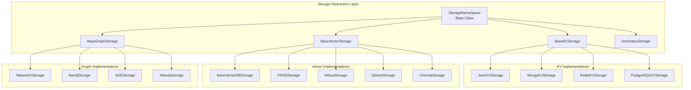

# LightRAG Storage Contracts

## Overview

This document defines the abstract storage interfaces that any implementation must follow. LightRAG uses a pluggable storage architecture with four storage types.

---

## Storage Architecture



---

## Base Interface: StorageNameSpace

All storage implementations inherit from this base class.

```yaml
interface: StorageNameSpace
description: Base class for all storage implementations

properties:
  namespace:
    type: string
    description: Storage namespace for data isolation
    
  workspace:
    type: string
    description: Workspace identifier for multi-tenancy
    
  global_config:
    type: dict[str, Any]
    description: Global configuration dictionary

methods:
  initialize:
    signature: async initialize() -> None
    description: Initialize storage connections and resources
    postconditions:
      - Storage ready for read/write operations
      - Indices loaded or created
      
  finalize:
    signature: async finalize() -> None
    description: Gracefully shutdown storage
    postconditions:
      - All pending writes flushed
      - Connections closed
      - Resources released
      
  index_done_callback:
    signature: async index_done_callback() -> None
    description: Persist in-memory changes to durable storage
    postconditions:
      - All buffered writes committed
      - Data safe for recovery
    concurrency_notes: |
      Must be called after batch operations to ensure durability.
      Only one process should be writing before this callback.
      
  drop:
    signature: async drop() -> dict[str, str]
    description: Delete all data and reset storage
    returns:
      success: {"status": "success", "message": "data dropped"}
      error: {"status": "error", "message": "<details>"}
    postconditions:
      - All data removed
      - Storage in initial state
```

---

## Interface: BaseKVStorage

Key-value storage for document content, chunks, and caches.

```yaml
interface: BaseKVStorage
extends: StorageNameSpace
description: Key-value storage for arbitrary JSON documents

instances_in_lightrag:
  - llm_response_cache: LLM extraction/summary cache
  - text_chunks: Chunk content storage
  - full_docs: Full document content
  - full_entities: Document->entities mapping
  - full_relations: Document->relations mapping
  - entity_chunks: Entity->chunk_ids mapping
  - relation_chunks: Relation->chunk_ids mapping

methods:
  get_by_id:
    signature: async get_by_id(id: str) -> dict[str, Any] | None
    description: Retrieve single record by ID
    preconditions:
      - Storage initialized
    postconditions:
      - Returns record if exists, None otherwise
    complexity: O(1) average
    
  get_by_ids:
    signature: async get_by_ids(ids: list[str]) -> list[dict[str, Any]]
    description: Batch retrieve records by IDs
    preconditions:
      - Storage initialized
      - ids is non-empty list
    postconditions:
      - Returns list of found records
      - Order may not match input order
    complexity: O(n) where n = len(ids)
    
  filter_keys:
    signature: async filter_keys(keys: set[str]) -> set[str]
    description: Return keys that do NOT exist in storage
    preconditions:
      - Storage initialized
    postconditions:
      - Returns set of non-existent keys
    use_case: |
      Used for deduplication before insert.
      Returns keys that are safe to insert.
    complexity: O(n) where n = len(keys)
    
  upsert:
    signature: async upsert(data: dict[str, dict[str, Any]]) -> None
    description: Insert or update multiple records
    preconditions:
      - Storage initialized
      - data is dict of id -> record
    postconditions:
      - All records stored (in-memory)
      - Must call index_done_callback for durability
    concurrency_notes: |
      In-memory storage requires single-writer semantics.
      Use keyed locks for concurrent updates.
    complexity: O(n) where n = len(data)
    
  delete:
    signature: async delete(ids: list[str]) -> None
    description: Delete records by IDs
    preconditions:
      - Storage initialized
    postconditions:
      - Records removed (in-memory)
      - Must call index_done_callback for durability
    complexity: O(n) where n = len(ids)
    
  is_empty:
    signature: async is_empty() -> bool
    description: Check if storage contains any data
    returns: true if no records, false otherwise
```

### KV Storage Data Schemas

```yaml
llm_response_cache_schema:
  key: MD5 hash of (prompt + cache_type)
  value:
    cache_type: "extract" | "summary"
    chunk_id: string  # For extract type
    return: string  # LLM response text
    create_time: int  # Unix timestamp

text_chunks_schema:
  key: MD5 hash of chunk content (prefix "chunk-")
  value:
    content: string
    tokens: int
    chunk_order_index: int
    full_doc_id: string
    file_path: string
    llm_cache_list: list[string]  # References to LLM cache entries

full_docs_schema:
  key: MD5 hash of document content (prefix "doc-")
  value:
    content: string
    file_path: string

entity_chunks_schema:
  key: entity_name (uppercase)
  value:
    chunk_ids: list[string]
    count: int

relation_chunks_schema:
  key: "src_entity<SEP>tgt_entity" (sorted alphabetically)
  value:
    chunk_ids: list[string]
    count: int
```

---

## Interface: BaseVectorStorage

Vector storage for embedding-based similarity search.

```yaml
interface: BaseVectorStorage
extends: StorageNameSpace
description: Vector database for similarity search

properties:
  embedding_func:
    type: EmbeddingFunc
    description: Function to compute embeddings
    
  cosine_better_than_threshold:
    type: float
    default: 0.2
    description: Minimum similarity score to return
    
  meta_fields:
    type: set[str]
    description: Metadata fields to store with vectors

instances_in_lightrag:
  - entities_vdb: Entity name + description embeddings
  - relationships_vdb: Relationship embeddings
  - chunks_vdb: Chunk content embeddings

methods:
  query:
    signature: |
      async query(
        query: str,
        top_k: int,
        query_embedding: list[float] = None
      ) -> list[dict[str, Any]]
    description: Similarity search for top_k results
    preconditions:
      - Storage initialized
      - query is non-empty OR query_embedding provided
    postconditions:
      - Returns up to top_k results
      - Results sorted by similarity (descending)
      - Each result has similarity score
    parameters:
      query_embedding: |
        Pre-computed embedding. If provided, skips
        embedding computation for better performance.
    complexity: O(n) for brute force, O(log n) for indexed
    
  upsert:
    signature: async upsert(data: dict[str, dict[str, Any]]) -> None
    description: Insert or update vectors with metadata
    preconditions:
      - Storage initialized
      - Each record must have 'content' field for embedding
    postconditions:
      - Vectors computed and stored
      - Metadata indexed
      - Must call index_done_callback for durability
    data_schema:
      key: Unique vector ID
      value:
        content: string  # Text to embed
        # Additional meta_fields...
    complexity: O(n * embedding_time)
    
  delete:
    signature: async delete(ids: list[str]) -> None
    description: Delete vectors by IDs
    postconditions:
      - Vectors removed
      - Index updated
      - Must call index_done_callback for durability
    complexity: O(n)
    
  delete_entity:
    signature: async delete_entity(entity_name: str) -> None
    description: Delete entity vector by name
    use_case: Called during entity deletion
    
  delete_entity_relation:
    signature: async delete_entity_relation(entity_name: str) -> None
    description: Delete all relationships involving an entity
    use_case: Called during cascade entity deletion
    
  get_by_id:
    signature: async get_by_id(id: str) -> dict[str, Any] | None
    description: Retrieve single vector record by ID
    
  get_by_ids:
    signature: async get_by_ids(ids: list[str]) -> list[dict[str, Any]]
    description: Batch retrieve vector records
    
  get_vectors_by_ids:
    signature: async get_vectors_by_ids(ids: list[str]) -> dict[str, list[float]]
    description: Get raw vectors for efficiency
    returns: Mapping of ID to vector array
```

### Vector Storage Metadata Schemas

```yaml
entities_vdb_schema:
  id: "ent-" + MD5(entity_name)
  fields:
    content: "{entity_name}\n{description}"
    entity_name: string
    source_id: string  # Pipe-separated chunk IDs
    description: string
    entity_type: string
    file_path: string

relationships_vdb_schema:
  id: "rel-" + MD5(src_id + tgt_id)
  fields:
    content: "{keywords}\t{src_id}\n{tgt_id}\n{description}"
    src_id: string
    tgt_id: string
    source_id: string
    keywords: string
    description: string
    weight: float
    file_path: string

chunks_vdb_schema:
  id: "chunk-" + MD5(content)
  fields:
    content: string
    full_doc_id: string
    file_path: string
```

---

## Interface: BaseGraphStorage

Knowledge graph storage for entities and relationships.

```yaml
interface: BaseGraphStorage
extends: StorageNameSpace
description: Graph storage for knowledge graph operations
notes: All edge operations are undirected

instances_in_lightrag:
  - chunk_entity_relation_graph: Main knowledge graph

methods:
  # Node operations
  has_node:
    signature: async has_node(node_id: str) -> bool
    description: Check if node exists
    
  get_node:
    signature: async get_node(node_id: str) -> dict[str, str] | None
    description: Get node properties
    returns: Node properties dict or None
    
  upsert_node:
    signature: async upsert_node(node_id: str, node_data: dict[str, str]) -> None
    description: Insert or update node
    node_data_schema:
      entity_id: string  # Same as node_id
      entity_name: string
      entity_type: string
      description: string
      source_id: string  # Pipe-separated chunk IDs
      file_path: string
      created_at: int  # Unix timestamp
    
  delete_node:
    signature: async delete_node(node_id: str) -> None
    description: Delete single node
    
  remove_nodes:
    signature: async remove_nodes(nodes: list[str]) -> None
    description: Batch delete nodes
    
  node_degree:
    signature: async node_degree(node_id: str) -> int
    description: Get number of edges connected to node
    
  get_all_nodes:
    signature: async get_all_nodes() -> list[dict]
    description: Get all nodes in graph
    returns: List of node property dicts
    
  # Edge operations
  has_edge:
    signature: async has_edge(source_node_id: str, target_node_id: str) -> bool
    description: Check if edge exists
    notes: Order of nodes doesn't matter (undirected)
    
  get_edge:
    signature: async get_edge(src: str, tgt: str) -> dict[str, str] | None
    description: Get edge properties
    edge_data_schema:
      source: string
      target: string
      description: string
      keywords: string
      weight: float
      source_id: string
      file_path: string
      created_at: int
    
  upsert_edge:
    signature: async upsert_edge(src: str, tgt: str, edge_data: dict) -> None
    description: Insert or update edge
    
  get_node_edges:
    signature: async get_node_edges(node_id: str) -> list[tuple[str, str]] | None
    description: Get all edges connected to a node
    returns: List of (source, target) tuples
    
  remove_edges:
    signature: async remove_edges(edges: list[tuple[str, str]]) -> None
    description: Batch delete edges
    
  edge_degree:
    signature: async edge_degree(src: str, tgt: str) -> int
    description: Sum of degrees of both nodes
    
  get_all_edges:
    signature: async get_all_edges() -> list[dict]
    description: Get all edges in graph
    
  # Batch operations (optional optimization)
  get_nodes_batch:
    signature: async get_nodes_batch(node_ids: list[str]) -> dict[str, dict]
    description: Batch get nodes
    default: Iterates get_node
    
  get_edges_batch:
    signature: async get_edges_batch(pairs: list[dict]) -> dict[tuple, dict]
    description: Batch get edges
    default: Iterates get_edge
    
  # Query operations
  get_knowledge_graph:
    signature: |
      async get_knowledge_graph(
        node_label: str,
        max_depth: int = 3,
        max_nodes: int = 1000
      ) -> KnowledgeGraph
    description: Get connected subgraph from starting node
    returns:
      nodes: list[KnowledgeGraphNode]
      edges: list[KnowledgeGraphEdge]
      is_truncated: bool
    notes: |
      Use "*" for node_label to get all nodes.
      BFS traversal with max_depth limit.
      Truncates at max_nodes.
    
  get_all_labels:
    signature: async get_all_labels() -> list[str]
    description: Get all entity names in graph
    status: Deprecated
    
  get_popular_labels:
    signature: async get_popular_labels(limit: int = 300) -> list[str]
    description: Get entities sorted by degree
    
  search_labels:
    signature: async search_labels(query: str, limit: int = 50) -> list[str]
    description: Fuzzy search entity names
```

---

## Interface: DocStatusStorage

Document processing status tracking.

```yaml
interface: DocStatusStorage
extends: BaseKVStorage
description: Track document processing lifecycle

status_enum:
  PENDING: Document enqueued, waiting
  PROCESSING: Currently being processed
  PREPROCESSED: Multimodal preprocessing done
  PROCESSED: Successfully completed
  FAILED: Processing failed

doc_processing_status_schema:
  content_summary: string  # First 100 chars
  content_length: int
  file_path: string
  status: DocStatus
  created_at: string  # ISO timestamp
  updated_at: string  # ISO timestamp
  track_id: string | null
  chunks_count: int | null
  chunks_list: list[string] | null
  error_msg: string | null
  metadata: dict

methods:
  get_status_counts:
    signature: async get_status_counts() -> dict[str, int]
    description: Count documents by status
    returns: |
      {"pending": 5, "processing": 2, "processed": 100, "failed": 3}
    
  get_docs_by_status:
    signature: async get_docs_by_status(status: DocStatus) -> dict[str, DocProcessingStatus]
    description: Get all documents with specific status
    returns: Mapping of doc_id to status object
    
  get_docs_by_track_id:
    signature: async get_docs_by_track_id(track_id: str) -> dict[str, DocProcessingStatus]
    description: Get documents by tracking ID
    use_case: Monitor batch insert progress
    
  get_docs_paginated:
    signature: |
      async get_docs_paginated(
        status_filter: DocStatus | None = None,
        page: int = 1,
        page_size: int = 50,
        sort_field: str = "updated_at",
        sort_direction: str = "desc"
      ) -> tuple[list[tuple[str, DocProcessingStatus]], int]
    description: Paginated document listing
    returns: Tuple of (results, total_count)
    sort_fields: ["created_at", "updated_at", "id"]
    
  get_doc_by_file_path:
    signature: async get_doc_by_file_path(file_path: str) -> dict[str, Any] | None
    description: Find document by file path
```

---

## Storage Namespace Constants

```yaml
namespaces:
  # KV Storage
  KV_STORE_LLM_RESPONSE_CACHE: "llm_response_cache"
  KV_STORE_TEXT_CHUNKS: "text_chunks"
  KV_STORE_FULL_DOCS: "full_docs"
  KV_STORE_FULL_ENTITIES: "full_entities"
  KV_STORE_FULL_RELATIONS: "full_relations"
  KV_STORE_ENTITY_CHUNKS: "entity_chunks"
  KV_STORE_RELATION_CHUNKS: "relation_chunks"
  
  # Vector Storage
  VECTOR_STORE_ENTITIES: "entities"
  VECTOR_STORE_RELATIONSHIPS: "relationships"
  VECTOR_STORE_CHUNKS: "chunks"
  
  # Graph Storage
  GRAPH_STORE_CHUNK_ENTITY_RELATION: "chunk_entity_relation"
  
  # Doc Status
  DOC_STATUS: "doc_status"
```

---

## Implementation Guidelines

### Concurrency

```yaml
concurrency_model:
  read_operations:
    - Thread-safe by default
    - No locking required
    
  write_operations:
    - Must use keyed locks for concurrent entity updates
    - Lock key: entity_name or sorted([src, tgt]) for edges
    - Lock namespace: "{workspace}:GraphDB"
    
  persistence:
    - In-memory changes buffered until index_done_callback
    - Only one writer should be active per namespace
    - Use distributed locks for multi-process scenarios
```

### Error Handling

```yaml
error_handling:
  connection_errors:
    - Retry with exponential backoff
    - Log and fail after max retries
    
  not_found:
    - Return None or empty collection
    - Do not raise exception
    
  constraint_violations:
    - Log warning
    - Upsert semantics: update if exists
    
  timeout:
    - Use configurable timeout
    - Raise TimeoutError after limit
```

### Performance Considerations

```yaml
performance:
  batching:
    - Prefer batch operations over single-record operations
    - Use *_batch methods when available
    
  caching:
    - Implement in-memory caching for hot paths
    - Cache embeddings to avoid recomputation
    
  indexing:
    - Create indices on frequently queried fields
    - Consider approximate nearest neighbor for VDB
    
  connection_pooling:
    - Maintain connection pool for database backends
    - Reuse connections across operations
```

---

## Cross-References

- [Domain Model](03-domain-model.md) - Entity schemas
- [API Contracts](04-api-contracts.md) - How APIs use storage
- [Algorithms](05-algorithms.md) - Storage interaction patterns
