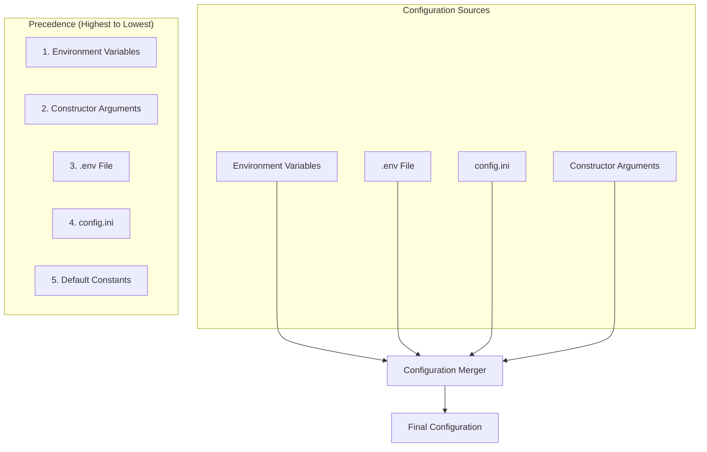

# LightRAG Configuration Reference

## Overview

This document provides a complete reference of all configuration options, environment variables, and their relationships for LightRAG.

---

## Configuration Hierarchy



---

## Constructor Parameters

### LightRAG Class Parameters

| Parameter | Type | Default | Environment | Description |
|-----------|------|---------|-------------|-------------|
| `working_dir` | str | "./rag_storage" | - | Directory for cache and data |
| `workspace` | str | "" | WORKSPACE | Data isolation namespace |
| `kv_storage` | str | "JsonKVStorage" | KV_STORAGE | Key-value storage backend |
| `vector_storage` | str | "NanoVectorDBStorage" | VECTOR_STORAGE | Vector database backend |
| `graph_storage` | str | "NetworkXStorage" | GRAPH_STORAGE | Graph storage backend |
| `doc_status_storage` | str | "JsonDocStatusStorage" | DOC_STATUS_STORAGE | Document status backend |

### LLM Configuration

| Parameter | Type | Default | Environment | Description |
|-----------|------|---------|-------------|-------------|
| `llm_model_func` | Callable | None | - | LLM function (required) |
| `llm_model_name` | str | "gpt-4o-mini" | - | Model name for logging |
| `llm_model_max_async` | int | 4 | MAX_ASYNC | Max concurrent LLM calls |
| `default_llm_timeout` | int | 180 | LLM_TIMEOUT | LLM call timeout (seconds) |
| `enable_llm_cache` | bool | True | - | Enable LLM response caching |
| `enable_llm_cache_for_entity_extract` | bool | True | - | Cache entity extractions |

### Embedding Configuration

| Parameter | Type | Default | Environment | Description |
|-----------|------|---------|-------------|-------------|
| `embedding_func` | EmbeddingFunc | None | - | Embedding function (required) |
| `embedding_batch_num` | int | 10 | EMBEDDING_BATCH_NUM | Batch size for embeddings |
| `embedding_func_max_async` | int | 8 | EMBEDDING_FUNC_MAX_ASYNC | Max concurrent embedding calls |
| `default_embedding_timeout` | int | 30 | EMBEDDING_TIMEOUT | Embedding call timeout |

### Chunking Configuration

| Parameter | Type | Default | Environment | Description |
|-----------|------|---------|-------------|-------------|
| `chunk_token_size` | int | 1200 | CHUNK_SIZE | Max tokens per chunk |
| `chunk_overlap_token_size` | int | 100 | CHUNK_OVERLAP_SIZE | Overlap between chunks |
| `tiktoken_model_name` | str | "gpt-4o-mini" | - | Tokenizer model |
| `chunking_func` | Callable | chunking_by_token_size | - | Custom chunking function |

### Query Configuration

| Parameter | Type | Default | Environment | Description |
|-----------|------|---------|-------------|-------------|
| `top_k` | int | 40 | TOP_K | Entities/relations to retrieve |
| `chunk_top_k` | int | 20 | CHUNK_TOP_K | Chunks to retrieve |
| `max_entity_tokens` | int | 6000 | MAX_ENTITY_TOKENS | Max tokens for entities |
| `max_relation_tokens` | int | 8000 | MAX_RELATION_TOKENS | Max tokens for relations |
| `max_total_tokens` | int | 30000 | MAX_TOTAL_TOKENS | Total context tokens |
| `cosine_threshold` | float | 0.2 | COSINE_THRESHOLD | Min similarity score |
| `related_chunk_number` | int | 5 | RELATED_CHUNK_NUMBER | Chunks per entity/relation |
| `kg_chunk_pick_method` | str | "VECTOR" | KG_CHUNK_PICK_METHOD | Chunk selection method |

### Entity Extraction Configuration

| Parameter | Type | Default | Environment | Description |
|-----------|------|---------|-------------|-------------|
| `entity_extract_max_gleaning` | int | 1 | MAX_GLEANING | Max gleaning iterations |
| `force_llm_summary_on_merge` | int | 8 | FORCE_LLM_SUMMARY_ON_MERGE | Descriptions before LLM summary |
| `summary_max_tokens` | int | 1200 | SUMMARY_MAX_TOKENS | Max tokens per description |
| `summary_context_size` | int | 12000 | SUMMARY_CONTEXT_SIZE | Context for summarization |
| `summary_length_recommended` | int | 600 | SUMMARY_LENGTH_RECOMMENDED | Target summary length |

### Source ID Management

| Parameter | Type | Default | Environment | Description |
|-----------|------|---------|-------------|-------------|
| `max_source_ids_per_entity` | int | 300 | MAX_SOURCE_IDS_PER_ENTITY | Max chunk refs per entity |
| `max_source_ids_per_relation` | int | 300 | MAX_SOURCE_IDS_PER_RELATION | Max chunk refs per relation |
| `source_ids_limit_method` | str | "FIFO" | SOURCE_IDS_LIMIT_METHOD | FIFO or KEEP strategy |
| `max_file_paths` | int | 100 | MAX_FILE_PATHS | Max file paths in metadata |

### Concurrency Configuration

| Parameter | Type | Default | Environment | Description |
|-----------|------|---------|-------------|-------------|
| `max_parallel_insert` | int | 2 | MAX_PARALLEL_INSERT | Max concurrent doc processing |
| `max_graph_nodes` | int | 1000 | MAX_GRAPH_NODES | Max nodes in graph query |

### Rerank Configuration

| Parameter | Type | Default | Environment | Description |
|-----------|------|---------|-------------|-------------|
| `rerank_model_func` | Callable | None | - | Optional rerank function |
| `min_rerank_score` | float | 0.0 | MIN_RERANK_SCORE | Min score after reranking |

---

## Environment Variables Reference

### Core Settings

```yaml
WORKSPACE:
  type: string
  default: ""
  description: Namespace for data isolation
  example: "project-alpha"

WORKING_DIR:
  type: string
  default: "./rag_storage"
  description: Base directory for storage files
```

### Storage Backend Selection

```yaml
KV_STORAGE:
  type: string
  default: "JsonKVStorage"
  options:
    - JsonKVStorage
    - MongoKVStorage
    - RedisKVStorage
    - PostgreSQLKVStorage
    - OracleKVStorage

VECTOR_STORAGE:
  type: string
  default: "NanoVectorDBStorage"
  options:
    - NanoVectorDBStorage
    - FAISSStorage
    - MilvusStorage
    - QdrantStorage
    - ChromaStorage
    - PGVectorStorage
    - TiDBVectorStorage

GRAPH_STORAGE:
  type: string
  default: "NetworkXStorage"
  options:
    - NetworkXStorage
    - Neo4jStorage
    - AGEStorage
    - NebulaStorage
    - GremlinStorage

DOC_STATUS_STORAGE:
  type: string
  default: "JsonDocStatusStorage"
  options:
    - JsonDocStatusStorage
    - MongoDocStatusStorage
    - PostgreSQLDocStatusStorage
```

### LLM Provider Settings

```yaml
# OpenAI
OPENAI_API_KEY:
  type: string
  required: true (if using OpenAI)
  description: OpenAI API key

OPENAI_BASE_URL:
  type: string
  default: null
  description: Custom OpenAI-compatible endpoint

# Azure OpenAI
AZURE_OPENAI_API_KEY:
  type: string
  description: Azure OpenAI API key

AZURE_OPENAI_ENDPOINT:
  type: string
  description: Azure endpoint URL

AZURE_OPENAI_DEPLOYMENT:
  type: string
  description: Deployment name

AZURE_OPENAI_API_VERSION:
  type: string
  default: "2024-02-15-preview"

# Anthropic
ANTHROPIC_API_KEY:
  type: string
  description: Anthropic API key

# Ollama
OLLAMA_HOST:
  type: string
  default: "http://localhost:11434"
  description: Ollama server URL

# Google
GOOGLE_API_KEY:
  type: string
  description: Google Gemini API key

# AWS Bedrock
AWS_ACCESS_KEY_ID:
  type: string
AWS_SECRET_ACCESS_KEY:
  type: string
AWS_REGION:
  type: string
```

### Database Connection Settings

```yaml
# MongoDB
MONGO_URI:
  type: string
  example: "mongodb://localhost:27017"

MONGO_DATABASE:
  type: string
  default: "lightrag"

# Neo4j
NEO4J_URI:
  type: string
  example: "bolt://localhost:7687"

NEO4J_USERNAME:
  type: string
  default: "neo4j"

NEO4J_PASSWORD:
  type: string

# PostgreSQL
POSTGRES_HOST:
  type: string
POSTGRES_PORT:
  type: integer
  default: 5432
POSTGRES_USER:
  type: string
POSTGRES_PASSWORD:
  type: string
POSTGRES_DATABASE:
  type: string

# Redis
REDIS_URI:
  type: string
  example: "redis://localhost:6379"

# Milvus
MILVUS_HOST:
  type: string
MILVUS_PORT:
  type: integer
  default: 19530

# Qdrant
QDRANT_URL:
  type: string
QDRANT_API_KEY:
  type: string
```

### Observability Settings

```yaml
# Langfuse
LANGFUSE_PUBLIC_KEY:
  type: string
  description: Enables LLM observability when set

LANGFUSE_SECRET_KEY:
  type: string

LANGFUSE_HOST:
  type: string
  default: "https://cloud.langfuse.com"
```

### Logging Settings

```yaml
LOG_LEVEL:
  type: string
  default: "INFO"
  options: [DEBUG, INFO, WARNING, ERROR, CRITICAL]

LOG_FILE:
  type: string
  default: "lightrag.log"

LOG_MAX_BYTES:
  type: integer
  default: 10485760  # 10MB

LOG_BACKUP_COUNT:
  type: integer
  default: 5
```

---

## Default Constants

### Extraction Defaults

```yaml
DEFAULT_SUMMARY_LANGUAGE: "English"
DEFAULT_MAX_GLEANING: 1
DEFAULT_ENTITY_NAME_MAX_LENGTH: 256
DEFAULT_FORCE_LLM_SUMMARY_ON_MERGE: 8
DEFAULT_SUMMARY_MAX_TOKENS: 1200
DEFAULT_SUMMARY_LENGTH_RECOMMENDED: 600
DEFAULT_SUMMARY_CONTEXT_SIZE: 12000

DEFAULT_ENTITY_TYPES:
  - Person
  - Creature
  - Organization
  - Location
  - Event
  - Concept
  - Method
  - Content
  - Data
  - Artifact
  - NaturalObject
```

### Query Defaults

```yaml
DEFAULT_TOP_K: 40
DEFAULT_CHUNK_TOP_K: 20
DEFAULT_MAX_ENTITY_TOKENS: 6000
DEFAULT_MAX_RELATION_TOKENS: 8000
DEFAULT_MAX_TOTAL_TOKENS: 30000
DEFAULT_COSINE_THRESHOLD: 0.2
DEFAULT_RELATED_CHUNK_NUMBER: 5
DEFAULT_KG_CHUNK_PICK_METHOD: "VECTOR"  # or "WEIGHT"
```

### Concurrency Defaults

```yaml
DEFAULT_MAX_ASYNC: 4
DEFAULT_MAX_PARALLEL_INSERT: 2
DEFAULT_EMBEDDING_FUNC_MAX_ASYNC: 8
DEFAULT_EMBEDDING_BATCH_NUM: 10
```

### Timeout Defaults

```yaml
DEFAULT_LLM_TIMEOUT: 180  # seconds
DEFAULT_EMBEDDING_TIMEOUT: 30  # seconds
DEFAULT_TIMEOUT: 300  # Gunicorn worker timeout
```

### Internal Constants

```yaml
GRAPH_FIELD_SEP: "<SEP>"  # Separator for multi-value fields
# WARNING: Cannot be changed after data is inserted

DEFAULT_MAX_GRAPH_NODES: 1000
DEFAULT_MAX_SOURCE_IDS_PER_ENTITY: 300
DEFAULT_MAX_SOURCE_IDS_PER_RELATION: 300
DEFAULT_MAX_FILE_PATHS: 100
DEFAULT_MAX_FILE_PATH_LENGTH: 32768
```

---

## Configuration Validation

### Required Settings

```yaml
required_for_operation:
  - embedding_func: Must be configured for any vector operations
  - llm_model_func: Must be configured for query generation
  - working_dir: Must be writable directory

required_for_storage_backends:
  mongodb:
    - MONGO_URI
    - MONGO_DATABASE
  neo4j:
    - NEO4J_URI
    - NEO4J_PASSWORD
  milvus:
    - MILVUS_HOST
  postgresql:
    - POSTGRES_HOST
    - POSTGRES_USER
    - POSTGRES_PASSWORD
    - POSTGRES_DATABASE
```

### Validation Rules

```yaml
validations:
  force_llm_summary_on_merge:
    rule: ">= 3"
    warning: "Should be at least 3"
    
  summary_context_size:
    rule: "<= max_total_tokens"
    warning: "Should not exceed max_total_tokens"
    
  summary_length_recommended:
    rule: "<= summary_max_tokens"
    warning: "Should not exceed summary_max_tokens"
    
  chunk_overlap_token_size:
    rule: "< chunk_token_size"
    error: "Overlap must be less than chunk size"
```

---

## Example Configurations

### Minimal Configuration (.env)

```bash
# Minimal OpenAI configuration
OPENAI_API_KEY=sk-xxxxx
```

### Production Configuration (.env)

```bash
# LLM Configuration
OPENAI_API_KEY=sk-xxxxx
LLM_TIMEOUT=180
MAX_ASYNC=8

# Storage Backends
KV_STORAGE=MongoKVStorage
VECTOR_STORAGE=MilvusStorage
GRAPH_STORAGE=Neo4jStorage

# Database Connections
MONGO_URI=mongodb://mongo:27017
MONGO_DATABASE=lightrag
MILVUS_HOST=milvus
NEO4J_URI=bolt://neo4j:7687
NEO4J_PASSWORD=password

# Query Tuning
TOP_K=60
MAX_TOTAL_TOKENS=40000

# Observability
LANGFUSE_PUBLIC_KEY=pk-xxxxx
LANGFUSE_SECRET_KEY=sk-xxxxx

# Logging
LOG_LEVEL=INFO
```

### Local Development (config.ini)

```ini
[server]
host = 0.0.0.0
port = 9621
workers = 2

[storage]
kv_storage = JsonKVStorage
vector_storage = NanoVectorDBStorage
graph_storage = NetworkXStorage

[llm]
max_async = 4
timeout = 120
```

---

## Cross-References

- [Architecture](02-architecture.md) - System design using these configs
- [Storage Contracts](06-storage-contracts.md) - Storage backend options
- [External Integrations](07-external-integrations.md) - LLM provider configs
