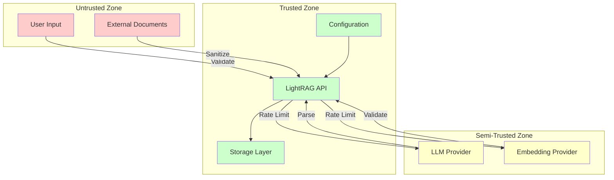
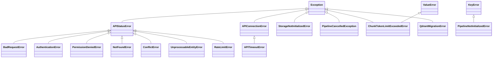

# LightRAG Security & Error Handling

## Overview

This document covers security considerations, trust boundaries, and the complete error taxonomy for LightRAG implementations.

---

## Security Model

### Trust Boundaries



### Trust Boundary Definitions

```yaml
untrusted_inputs:
  user_queries:
    risks:
      - Prompt injection
      - Command injection
      - Excessive length
    mitigations:
      - Input validation
      - Length limits
      - Sanitization
      
  document_content:
    risks:
      - Malicious content
      - Encoding attacks
      - Path traversal in file_path
    mitigations:
      - Content sanitization
      - Encoding normalization
      - Path validation

semi_trusted:
  llm_responses:
    risks:
      - Malformed output
      - Delimiter corruption
      - Injection in extracted entities
    mitigations:
      - Output parsing with fallbacks
      - Entity name normalization
      - Special character filtering
      
  embedding_vectors:
    risks:
      - Dimension mismatch
      - NaN/Inf values
    mitigations:
      - Dimension validation
      - Numeric validation

trusted:
  configuration:
    risks:
      - Credential exposure
      - Misconfiguration
    mitigations:
      - Environment variable isolation
      - Validation at startup
```

---

## Input Validation

### Document Content Validation

```yaml
sanitize_text_for_encoding:
  operations:
    - Remove null bytes
    - Normalize Unicode (NFC)
    - Remove control characters (except newlines, tabs)
    - Validate UTF-8 encoding
    
file_path_validation:
  constraints:
    - Max length: 32768 characters
    - No path traversal sequences (../)
    - No null bytes
    - UTF-8 valid
    
entity_name_validation:
  constraints:
    - Max length: 256 characters
    - Uppercase normalized
    - No special characters: ' ( ) < > | / \
    - Non-empty after trimming
    
query_validation:
  constraints:
    - Non-empty string
    - Valid UTF-8
    - Reasonable length (configurable)
```

### ID Validation

```yaml
document_ids:
  format: MD5 hash or user-provided
  constraints:
    - Unique across workspace
    - Non-empty
    - No special characters that could break storage
    
chunk_ids:
  format: "chunk-" + MD5(content)
  generation: Automatic from content hash
  
entity_ids:
  format: Uppercase entity name
  normalization: Applied automatically
```

---

## Error Taxonomy

### Error Hierarchy



### Error Definitions

```yaml
APIStatusError:
  description: Base class for HTTP status errors
  properties:
    response: httpx.Response
    status_code: int
    request_id: str | None
  usage: API responses with 4xx or 5xx status

BadRequestError:
  status_code: 400
  causes:
    - Invalid input parameters
    - Malformed request body
    - Validation failures
  response: {"error": "message", "details": {...}}

AuthenticationError:
  status_code: 401
  causes:
    - Missing API key
    - Invalid API key
    - Expired credentials
  response: {"error": "Authentication required"}

PermissionDeniedError:
  status_code: 403
  causes:
    - Insufficient permissions
    - Resource access denied
    - Workspace isolation violation
  response: {"error": "Permission denied"}

NotFoundError:
  status_code: 404
  causes:
    - Document not found
    - Entity not found
    - Resource doesn't exist
  response: {"error": "Resource not found", "id": "..."}

ConflictError:
  status_code: 409
  causes:
    - Duplicate document ID
    - Concurrent modification
    - State conflict
  response: {"error": "Conflict", "details": {...}}

UnprocessableEntityError:
  status_code: 422
  causes:
    - Semantic validation failure
    - Business rule violation
  response: {"error": "Unprocessable", "validation_errors": [...]}

RateLimitError:
  status_code: 429
  causes:
    - Too many requests
    - Quota exceeded
  response: {"error": "Rate limit exceeded", "retry_after": seconds}
  handling: Automatic retry with exponential backoff

APITimeoutError:
  description: Request timeout
  causes:
    - Network issues
    - Server overload
    - Long-running operation
  handling: Retry with increased timeout

APIConnectionError:
  description: Connection failure
  causes:
    - Network unreachable
    - DNS failure
    - Connection refused
  handling: Retry with exponential backoff

StorageNotInitializedError:
  description: Storage operations before initialization
  causes:
    - Missing initialize_storages() call
    - Incorrect startup sequence
  resolution: |
    rag = LightRAG(...)
    await rag.initialize_storages()

PipelineNotInitializedError:
  description: Pipeline status accessed before init
  causes:
    - Missing initialization
    - Workspace mismatch
  resolution: Ensure initialize_storages() called

PipelineCancelledException:
  description: User-initiated cancellation
  causes:
    - User requested cancellation
    - Timeout in pipeline
  handling: Clean up and report partial progress

ChunkTokenLimitExceededError:
  description: Chunk exceeds token limit
  properties:
    chunk_tokens: int
    chunk_token_limit: int
    chunk_preview: str | None
  causes:
    - split_by_character_only=True with large segments
    - Misconfigured chunk_token_size
  resolution: |
    - Set split_by_character_only=False
    - Increase chunk_token_size
    - Pre-process documents

QdrantMigrationError:
  description: Qdrant data migration failure
  causes:
    - Schema incompatibility
    - Connection issues during migration
  resolution: Manual migration or data rebuild
```

---

## Error Handling Patterns

### Retry Strategy

```yaml
retry_configuration:
  library: tenacity
  
  default_strategy:
    max_attempts: 5
    wait: exponential_backoff
    multiplier: 1
    min_wait: 1 second
    max_wait: 60 seconds
    
  retryable_errors:
    - APIConnectionError
    - RateLimitError
    - APITimeoutError
    - InvalidResponseError (custom for malformed LLM output)
    
  non_retryable_errors:
    - AuthenticationError
    - PermissionDeniedError
    - BadRequestError
    - ChunkTokenLimitExceededError

code_example: |
  @retry(
    stop=stop_after_attempt(5),
    wait=wait_exponential(multiplier=1, min=1, max=60),
    retry=retry_if_exception_type((
      APIConnectionError,
      RateLimitError,
      APITimeoutError
    ))
  )
  async def call_llm(prompt):
      ...
```

### Graceful Degradation

```yaml
degradation_strategies:
  llm_cache_hit:
    condition: LLM extraction result cached
    action: Skip LLM call, use cached result
    
  partial_extraction:
    condition: Some entities extracted before error
    action: Store partial results, log error, continue
    
  storage_fallback:
    condition: Primary storage unavailable
    action: Queue operation for retry, return error to user
    
  query_fallback:
    condition: No relevant context found
    action: Return "I don't know" response, don't hallucinate
```

### Error Response Format

```yaml
api_error_response:
  success_response:
    status: "success"
    data: {...}
    
  error_response:
    status: "error"
    error:
      code: str  # Machine-readable error code
      message: str  # Human-readable message
      details: object | null  # Additional context
      request_id: str | null  # For debugging
      retry_after: int | null  # For rate limiting
```

---

## Security Best Practices

### Credential Management

```yaml
practices:
  - Never commit API keys to version control
  - Use environment variables for secrets
  - Rotate API keys regularly
  - Use minimal-privilege service accounts
  - Enable API key restrictions (IP, referrer)
  
file_permissions:
  .env: 600 (owner read/write only)
  config.ini: 644 (if no secrets)
  working_dir: 755
```

### Data Isolation

```yaml
workspace_isolation:
  description: Each workspace has isolated data
  implementation:
    - Separate storage namespaces
    - No cross-workspace queries
    - Workspace-prefixed keys
    
tenant_isolation:
  description: Multi-tenant deployments
  implementation:
    - Tenant ID in all storage keys
    - Authentication per tenant
    - Rate limiting per tenant
```

### Content Security

```yaml
content_sanitization:
  input:
    - Remove potentially dangerous characters
    - Normalize Unicode
    - Validate encoding
    
  output:
    - Escape HTML in responses
    - Sanitize entity names in graph queries
    - Validate file paths in references
    
prompt_injection_mitigation:
  - Separate system and user prompts
  - Use structured output formats
  - Validate LLM output structure
  - Don't execute LLM output as code
```

---

## Logging & Audit

### Log Levels

```yaml
log_levels:
  DEBUG: Detailed debugging information
  INFO: Normal operation events
  WARNING: Unexpected but handled situations
  ERROR: Errors that affect operation
  CRITICAL: System-wide failures

sensitive_data_handling:
  - Never log API keys
  - Truncate long content in logs
  - Mask personal information
  - Log request IDs for correlation
```

### Audit Events

```yaml
audit_events:
  document_insert:
    fields: [doc_id, file_path, timestamp, track_id]
    
  document_delete:
    fields: [doc_id, deleted_chunks, affected_entities]
    
  query_executed:
    fields: [query_hash, mode, latency_ms, result_count]
    
  authentication:
    fields: [user_id, success, ip_address, timestamp]
    
  configuration_change:
    fields: [setting, old_value, new_value, changed_by]
```

---

## Recovery Procedures

### Data Corruption Recovery

```yaml
chunk_storage_corruption:
  detection: Inconsistent chunk counts in doc_status
  recovery:
    1. Identify affected documents
    2. Delete corrupted entries
    3. Re-insert documents from source
    
graph_inconsistency:
  detection: Orphaned entities/relationships
  recovery:
    1. Run consistency check
    2. Remove orphaned nodes/edges
    3. Rebuild from chunk cache
    
vector_index_corruption:
  detection: Query returns no results
  recovery:
    1. Drop vector index
    2. Rebuild from entity/relation data
```

### Disaster Recovery

```yaml
backup_strategy:
  file_storage:
    - Regular filesystem backups
    - Include working_dir contents
    
  database_storage:
    - Use database-native backup tools
    - Point-in-time recovery if available
    
recovery_steps:
  1. Restore storage from backup
  2. Verify data integrity
  3. Re-initialize storage connections
  4. Test query functionality
```

---

## Cross-References

- [API Contracts](04-api-contracts.md) - Error responses in APIs
- [Storage Contracts](06-storage-contracts.md) - Storage error handling
- [Configuration](08-configuration.md) - Security-related settings
