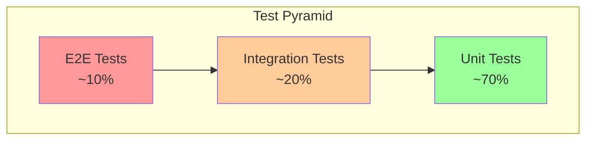

# LightRAG Testing & Quality Assurance

## Overview

This document defines the testing strategy, quality gates, and verification approaches for any LightRAG implementation.

---

## Test Categories

### Test Pyramid



### Test Markers

```yaml
markers:
  offline:
    description: Tests with no external dependencies
    default_run: true
    
  integration:
    description: Tests requiring external services
    default_run: false
    enable_flag: --run-integration
    environment: LIGHTRAG_RUN_INTEGRATION=true
    
  requires_db:
    description: Tests requiring database connection
    services: [mongodb, neo4j, postgresql, redis]
    
  requires_api:
    description: Tests requiring LightRAG API server
    setup: Start API server before tests
```

---

## Unit Test Requirements

### Core Module Tests

```yaml
lightrag/lightrag.py:
  tests:
    - test_constructor_defaults
    - test_constructor_with_custom_config
    - test_storage_initialization
    - test_storage_finalization
    - test_insert_single_document
    - test_insert_batch_documents
    - test_insert_duplicate_detection
    - test_query_modes (naive, local, global, hybrid, bypass)
    - test_query_streaming
    - test_query_with_context_only
    - test_delete_by_doc_id
    - test_delete_cascade_behavior
    
lightrag/operate.py:
  tests:
    - test_chunking_by_token_size
    - test_chunking_with_overlap
    - test_chunking_split_by_character
    - test_entity_extraction_parsing
    - test_relationship_extraction_parsing
    - test_malformed_llm_output_handling
    - test_entity_merging
    - test_relationship_merging
    - test_description_summarization_map_reduce
    - test_source_id_management
    
lightrag/base.py:
  tests:
    - test_query_param_defaults
    - test_doc_status_transitions
    - test_storage_namespace_interface
```

### Storage Implementation Tests

```yaml
storage_test_suite:
  description: Each storage implementation must pass these tests
  
  kv_storage_tests:
    - test_upsert_single
    - test_upsert_batch
    - test_get_by_id_exists
    - test_get_by_id_not_exists
    - test_get_by_ids_mixed
    - test_filter_keys_all_new
    - test_filter_keys_some_exist
    - test_delete_existing
    - test_delete_non_existing
    - test_is_empty_true
    - test_is_empty_false
    - test_persistence_across_restart
    
  vector_storage_tests:
    - test_upsert_with_embedding
    - test_query_returns_top_k
    - test_query_respects_threshold
    - test_query_with_precomputed_embedding
    - test_delete_entity
    - test_delete_entity_relation
    - test_get_by_id
    - test_get_vectors_by_ids
    
  graph_storage_tests:
    - test_upsert_node
    - test_upsert_edge
    - test_has_node_true
    - test_has_node_false
    - test_has_edge_undirected
    - test_get_node
    - test_get_edge
    - test_node_degree
    - test_edge_degree
    - test_get_node_edges
    - test_delete_node_cascades_edges
    - test_get_knowledge_graph_depth_limit
    - test_get_knowledge_graph_node_limit
    - test_batch_operations
```

### Utility Tests

```yaml
lightrag/utils.py:
  tests:
    - test_compute_mdhash_id_deterministic
    - test_tokenizer_encode_decode
    - test_sanitize_text_for_encoding
    - test_truncate_list_by_token_size
    - test_priority_limit_async_func_call
    - test_generate_track_id_unique
    - test_source_id_merge
    - test_source_id_subtract
```

---

## Integration Test Requirements

### Storage Integration Tests

```yaml
test_multi_tenant_backends:
  description: Test storage backends with multi-tenancy
  fixtures:
    - mongodb_container
    - neo4j_container
    - postgresql_container
  tests:
    - test_workspace_isolation
    - test_concurrent_access
    - test_data_persistence
    
test_workspace_isolation:
  description: Verify data isolation between workspaces
  tests:
    - test_no_cross_workspace_leakage
    - test_independent_document_counts
    - test_independent_entity_counts
```

### API Integration Tests

```yaml
test_document_routes:
  description: Test document API endpoints
  setup: Start LightRAG API server
  tests:
    - test_insert_document_endpoint
    - test_get_document_status_endpoint
    - test_delete_document_endpoint
    - test_list_documents_paginated
    
test_query_routes:
  description: Test query API endpoints
  tests:
    - test_query_naive_mode
    - test_query_hybrid_mode
    - test_query_streaming
    - test_query_with_references
    
test_tenant_routes:
  description: Test multi-tenant API endpoints
  tests:
    - test_create_tenant
    - test_create_knowledge_base
    - test_tenant_scoped_operations
```

### E2E Test Scenarios

```yaml
test_full_rag_pipeline:
  description: End-to-end RAG workflow
  steps:
    1. Initialize LightRAG with storage backends
    2. Insert multiple documents
    3. Verify entity extraction
    4. Execute queries in all modes
    5. Delete documents
    6. Verify cascade deletion
    7. Finalize storages
    
test_concurrent_operations:
  description: Concurrent insert and query
  steps:
    1. Start parallel document insertions
    2. Start parallel queries
    3. Verify no race conditions
    4. Verify data consistency
```

---

## Test Fixtures & Utilities

### Common Fixtures

```python
# Example fixture implementations

@pytest.fixture(scope="session")
def keep_test_artifacts(request):
    """Control artifact cleanup."""
    if request.config.getoption("--keep-artifacts"):
        return True
    return os.getenv("LIGHTRAG_KEEP_ARTIFACTS", "false").lower() == "true"

@pytest.fixture(scope="session")
def stress_test_mode(request):
    """Enable intensive workloads."""
    if request.config.getoption("--stress-test"):
        return True
    return os.getenv("LIGHTRAG_STRESS_TEST", "false").lower() == "true"

@pytest.fixture(scope="session")
def test_workers(request):
    """Number of parallel workers."""
    cli_value = request.config.getoption("--test-workers")
    env_value = os.getenv("LIGHTRAG_TEST_WORKERS")
    return int(env_value) if env_value else cli_value

@pytest.fixture
def temp_working_dir(tmp_path, keep_test_artifacts):
    """Temporary working directory for tests."""
    working_dir = tmp_path / "test_rag_storage"
    working_dir.mkdir()
    yield str(working_dir)
    if not keep_test_artifacts:
        shutil.rmtree(working_dir, ignore_errors=True)

@pytest.fixture
async def initialized_rag(temp_working_dir, mock_llm, mock_embedding):
    """Fully initialized LightRAG instance."""
    rag = LightRAG(
        working_dir=temp_working_dir,
        llm_model_func=mock_llm,
        embedding_func=mock_embedding,
    )
    await rag.initialize_storages()
    yield rag
    await rag.finalize_storages()
```

### Mock Functions

```python
# Mock LLM function
async def mock_llm_func(prompt, **kwargs):
    """Mock LLM that returns deterministic entity extraction."""
    if "extract" in prompt.lower():
        return """
entity<|#|>JOHN DOE<|#|>person<|#|>A software engineer
entity<|#|>ACME CORP<|#|>organization<|#|>A technology company
relationship<|#|>JOHN DOE<|#|>ACME CORP<|#|>works_at<|#|>John works at Acme
<|COMPLETE|>
"""
    return "This is a mock response."

# Mock embedding function
async def mock_embedding_func(texts: list[str]) -> np.ndarray:
    """Mock embedding that returns deterministic vectors."""
    return np.random.RandomState(42).randn(len(texts), 1536).astype(np.float32)

mock_embedding = EmbeddingFunc(
    embedding_dim=1536,
    max_token_size=8192,
    func=mock_embedding_func,
)
```

---

## Quality Gates

### Pre-Commit Checks

```yaml
pre_commit_hooks:
  - ruff check .  # Linting
  - ruff format --check .  # Formatting
  - python -m pytest tests -m "not integration" -q  # Quick tests
  
ci_pipeline:
  stages:
    lint:
      - ruff check .
      - ruff format --check .
      
    unit_tests:
      - pytest tests -m "not integration" --cov=lightrag
      
    integration_tests:
      when: merge_request
      services: [mongodb, neo4j, postgresql]
      - pytest tests -m integration --run-integration
      
    e2e_tests:
      when: main_branch
      - pytest e2e/ --run-integration
```

### Coverage Requirements

```yaml
coverage_targets:
  overall: ">= 80%"
  critical_modules:
    lightrag/lightrag.py: ">= 85%"
    lightrag/operate.py: ">= 85%"
    lightrag/base.py: ">= 90%"
    
excluded_from_coverage:
  - lightrag/llm/*  # External provider wrappers
  - lightrag/kg/*_impl.py  # Storage implementations (tested via integration)
```

---

## Test Data Management

### Sample Documents

```yaml
test_documents:
  small:
    size: "< 1000 tokens"
    use_case: Unit tests
    
  medium:
    size: "1000-5000 tokens"
    use_case: Integration tests
    
  large:
    size: "> 10000 tokens"
    use_case: Stress tests, chunking tests

sample_content:
  technical: |
    John Doe is a software engineer at Acme Corp.
    He works on the RAG project with Jane Smith.
    The project uses Neo4j for graph storage.
    
  narrative: |
    The quick brown fox jumps over the lazy dog.
    This sentence contains every letter of the alphabet.
```

### Test Assertions

```yaml
assertion_patterns:
  entity_extraction:
    - Extracted entity count matches expected
    - Entity names are uppercase normalized
    - Entity types are lowercase
    - Source IDs reference valid chunks
    
  relationship_extraction:
    - Relationship connects existing entities
    - Keywords are non-empty
    - Weight is positive float
    
  query_response:
    - Response is non-empty for valid queries
    - Streaming returns async iterator
    - Context contains relevant entities
    
  deletion:
    - Document removed from full_docs
    - Chunks removed from text_chunks
    - Orphaned entities deleted
    - VDB entries updated
```

---

## Performance Testing

### Benchmarks

```yaml
benchmarks:
  document_insertion:
    metric: documents_per_second
    target: ">= 10 docs/s (small docs)"
    
  query_latency:
    metric: p95_latency_ms
    target: "< 2000ms (excluding LLM)"
    
  vector_search:
    metric: queries_per_second
    target: ">= 100 qps"
    
stress_test_config:
  concurrent_inserts: 10
  concurrent_queries: 50
  duration: 300 seconds
  data_size: 1000 documents
```

### Load Testing

```yaml
load_test_scenarios:
  ramp_up:
    start_users: 1
    end_users: 100
    duration: 600 seconds
    
  steady_state:
    users: 50
    duration: 3600 seconds
    
  spike:
    base_users: 10
    spike_users: 200
    spike_duration: 60 seconds
```

---

## Continuous Integration

### GitHub Actions Example

```yaml
name: LightRAG CI

on: [push, pull_request]

jobs:
  lint:
    runs-on: ubuntu-latest
    steps:
      - uses: actions/checkout@v4
      - uses: actions/setup-python@v5
        with:
          python-version: "3.11"
      - run: pip install ruff
      - run: ruff check .

  test:
    runs-on: ubuntu-latest
    steps:
      - uses: actions/checkout@v4
      - uses: actions/setup-python@v5
        with:
          python-version: "3.11"
      - run: pip install -e .[dev]
      - run: pytest tests -m "not integration" --cov=lightrag

  integration:
    if: github.event_name == 'pull_request'
    runs-on: ubuntu-latest
    services:
      mongodb:
        image: mongo:7
        ports: ["27017:27017"]
      neo4j:
        image: neo4j:5
        ports: ["7687:7687"]
        env:
          NEO4J_AUTH: neo4j/testpassword
    steps:
      - uses: actions/checkout@v4
      - uses: actions/setup-python@v5
      - run: pip install -e .[dev]
      - run: pytest tests -m integration --run-integration
```

---

## Cross-References

- [API Contracts](04-api-contracts.md) - API testing requirements
- [Storage Contracts](06-storage-contracts.md) - Storage test patterns
- [Configuration](08-configuration.md) - Test configuration options
