# LightRAG Rebuild Checklist

## Purpose

This document provides a step-by-step checklist for implementing LightRAG in any technology stack. Follow these phases in order to ensure complete feature parity.

---

## Prerequisites

Before starting implementation, ensure you have:

```yaml
prerequisites:
  documentation:
    - [ ] Read Executive Summary (01-executive-summary.md)
    - [ ] Understand Architecture (02-architecture.md)
    - [ ] Review Domain Model (03-domain-model.md)
    - [ ] Study API Contracts (04-api-contracts.md)
    - [ ] Study Algorithms (05-algorithms.md)
    - [ ] Review Storage Contracts (06-storage-contracts.md)
    - [ ] Understand External Integrations (07-external-integrations.md)
    
  infrastructure:
    - [ ] LLM API access (OpenAI/Azure/local)
    - [ ] Embedding model access
    - [ ] Storage backend selection
    - [ ] Development environment setup
```

---

## Phase 1: Foundation

### 1.1 Configuration System

```yaml
configuration:
  - [ ] Define configuration schema (see 08-configuration.md)
  - [ ] Implement environment variable loading
  - [ ] Implement file-based config (ini/yaml/json)
  - [ ] Add configuration validation
  - [ ] Set sensible defaults
  
config_keys:
  - [ ] working_dir (storage base path)
  - [ ] chunk_token_size (default: 1200)
  - [ ] chunk_overlap_token_size (default: 100)
  - [ ] embedding_batch_num (default: 32)
  - [ ] llm_model_max_async (default: 4)
  - [ ] max_parallel_insert (default: 2)
```

### 1.2 Error Handling

```yaml
exceptions:
  - [ ] Define base exception class
  - [ ] Implement API error hierarchy (400, 401, 403, 404, 500)
  - [ ] Implement storage errors
  - [ ] Implement pipeline errors
  - [ ] Add retry logic for transient failures
  - [ ] Implement timeout handling
```

### 1.3 Utilities

```yaml
utilities:
  - [ ] MD5 hash function for document IDs
  - [ ] Tokenizer wrapper (tiktoken compatible)
  - [ ] Text sanitization (Unicode handling)
  - [ ] Async batch processor
  - [ ] Rate limiting utility
  - [ ] Logging infrastructure
```

---

## Phase 2: Storage Layer

### 2.1 Key-Value Storage

```yaml
kv_storage:
  interface:
    - [ ] Implement namespace property
    - [ ] Implement index_start_callback()
    - [ ] Implement index_done_callback()
    - [ ] Implement upsert(data: dict)
    - [ ] Implement get_by_id(id: str) -> Optional[dict]
    - [ ] Implement get_by_ids(ids: list) -> list
    - [ ] Implement filter_keys(data: dict) -> set
    - [ ] Implement delete(ids: list)
    - [ ] Implement is_empty() -> bool
    
  implementations:
    - [ ] In-memory implementation (for testing)
    - [ ] File-based JSON implementation
    - [ ] (Optional) Redis implementation
    - [ ] (Optional) MongoDB implementation
```

### 2.2 Vector Storage

```yaml
vector_storage:
  interface:
    - [ ] Implement namespace property
    - [ ] Implement embedding_func setter
    - [ ] Implement index_start_callback()
    - [ ] Implement index_done_callback()
    - [ ] Implement upsert(data: dict)
    - [ ] Implement query(query: str, top_k: int, ids: list) -> list
    - [ ] Implement delete_entity(entity_name: str)
    - [ ] Implement delete_entity_relation(entity_name: str)
    - [ ] Implement get_by_id(id: str) -> Optional[dict]
    - [ ] Implement get_vectors_by_ids(ids: list) -> list
    
  implementations:
    - [ ] In-memory implementation (for testing)
    - [ ] File-based implementation (NanoVectorDB style)
    - [ ] (Optional) Milvus implementation
    - [ ] (Optional) Qdrant implementation
    - [ ] (Optional) ChromaDB implementation
```

### 2.3 Graph Storage

```yaml
graph_storage:
  interface:
    - [ ] Implement namespace property
    - [ ] Implement index_start_callback()
    - [ ] Implement index_done_callback()
    - [ ] Implement upsert_node(node_id, node_data)
    - [ ] Implement upsert_edge(src, tgt, edge_data)
    - [ ] Implement has_node(node_id) -> bool
    - [ ] Implement has_edge(src, tgt) -> bool
    - [ ] Implement get_node(node_id) -> Optional[dict]
    - [ ] Implement get_edge(src, tgt) -> Optional[dict]
    - [ ] Implement node_degree(node_id) -> int
    - [ ] Implement edge_degree(src, tgt) -> int
    - [ ] Implement get_node_edges(source_node_id) -> list
    - [ ] Implement delete_node(node_id)
    - [ ] Implement get_knowledge_graph(node_label, max_depth, max_nodes, node_edge_limit)
    - [ ] Implement batch_upsert_nodes()
    - [ ] Implement batch_upsert_edges()
    
  implementations:
    - [ ] In-memory implementation (NetworkX style)
    - [ ] File-based implementation (GraphML/GEXF)
    - [ ] (Optional) Neo4j implementation
    - [ ] (Optional) ArangoDB implementation
    - [ ] (Optional) PostgreSQL + AGE implementation
```

### 2.4 Document Status Storage

```yaml
doc_status_storage:
  interface:
    - [ ] Implement get_status_by_doc_id(doc_id) -> Optional[DocStatus]
    - [ ] Implement get_docs_by_status(status) -> dict
    - [ ] Implement upsert(doc_id, status_dict)
    - [ ] Implement delete(doc_ids: list)
    
  status_enum:
    - [ ] Define PENDING status
    - [ ] Define PROCESSING status
    - [ ] Define PROCESSED status
    - [ ] Define FAILED status
```

---

## Phase 3: LLM Integration

### 3.1 LLM Function Interface

```yaml
llm_interface:
  - [ ] Define async function signature
  - [ ] Support text input/output
  - [ ] Support streaming responses
  - [ ] Handle rate limiting
  - [ ] Implement retry with backoff
  - [ ] Add token counting
  - [ ] Support system prompts
  
providers:
  - [ ] OpenAI implementation
  - [ ] Azure OpenAI implementation
  - [ ] (Optional) Anthropic implementation
  - [ ] (Optional) Ollama implementation
  - [ ] (Optional) HuggingFace implementation
```

### 3.2 Embedding Function Interface

```yaml
embedding_interface:
  - [ ] Define EmbeddingFunc dataclass
  - [ ] embedding_dim: int (vector size)
  - [ ] max_token_size: int (context limit)
  - [ ] func: async callable
  - [ ] Implement batch processing
  - [ ] Handle rate limiting
  
providers:
  - [ ] OpenAI text-embedding-3-small/large
  - [ ] Azure OpenAI embeddings
  - [ ] (Optional) Ollama embeddings
  - [ ] (Optional) HuggingFace sentence-transformers
```

---

## Phase 4: Core Algorithms

### 4.1 Document Chunking

```yaml
chunking:
  - [ ] Implement chunking_by_token_size algorithm
  - [ ] Support character-based splitting (paragraphs, sentences)
  - [ ] Handle overlap between chunks
  - [ ] Generate chunk IDs (MD5 hash of content)
  - [ ] Preserve source document reference
  
validation:
  - [ ] Test with edge cases (empty, single token, exact fit)
  - [ ] Verify overlap is correct
  - [ ] Verify all content is captured
```

### 4.2 Entity Extraction

```yaml
entity_extraction:
  - [ ] Implement extraction prompt template
  - [ ] Parse LLM output for entities
  - [ ] Handle extraction format: entity<|#|>NAME<|#|>TYPE<|#|>DESC
  - [ ] Normalize entity names to uppercase
  - [ ] Handle malformed output gracefully
  - [ ] Aggregate descriptions for duplicate entities
  
output_format:
  entity_name: string (uppercase)
  entity_type: string (lowercase)
  description: string
  source_id: chunk_id
```

### 4.3 Relationship Extraction

```yaml
relationship_extraction:
  - [ ] Implement extraction prompt template
  - [ ] Parse LLM output for relationships
  - [ ] Format: relationship<|#|>SRC<|#|>TGT<|#|>DESC<|#|>KEYWORDS<|#|>WEIGHT
  - [ ] Validate source and target exist
  - [ ] Handle malformed output gracefully
  
output_format:
  src_id: string (entity name)
  tgt_id: string (entity name)
  description: string
  keywords: string
  weight: float
  source_id: chunk_id
```

### 4.4 Entity/Relationship Merging

```yaml
merging:
  entities:
    - [ ] Group entities by normalized name
    - [ ] Aggregate descriptions
    - [ ] Merge source IDs
    - [ ] Track merge count
    
  relationships:
    - [ ] Group by (src, tgt) pair (undirected)
    - [ ] Aggregate descriptions
    - [ ] Merge keywords
    - [ ] Sum weights
    - [ ] Merge source IDs
```

### 4.5 Description Summarization

```yaml
summarization:
  - [ ] Detect when description exceeds max tokens
  - [ ] Implement map-reduce pattern
  - [ ] Chunk descriptions by token limit
  - [ ] Summarize each chunk
  - [ ] Combine summaries
  - [ ] Iterate if still too long
```

### 4.6 Query Processing

```yaml
query_modes:
  naive:
    - [ ] Search text chunks by similarity
    - [ ] Generate response from top chunks
    
  local:
    - [ ] Extract query entities
    - [ ] Expand with one-hop neighbors
    - [ ] Search entity/relationship descriptions
    - [ ] Generate response with local context
    
  global:
    - [ ] Extract query entities
    - [ ] Search community reports
    - [ ] Search high-degree nodes
    - [ ] Generate response with global context
    
  hybrid:
    - [ ] Combine local and global context
    - [ ] Deduplicate sources
    - [ ] Generate unified response
    
  bypass:
    - [ ] Return context only (no generation)
    - [ ] Used for custom processing
```

---

## Phase 5: API Layer

### 5.1 Core API Methods

```yaml
api_methods:
  initialization:
    - [ ] Constructor with configuration
    - [ ] initialize_storages() async method
    - [ ] finalize_storages() async method
    
  document_operations:
    - [ ] insert(content) - sync wrapper
    - [ ] ainsert(content) - async method
    - [ ] Batch processing support
    - [ ] Progress callbacks
    
  query_operations:
    - [ ] query(text, param) - sync wrapper
    - [ ] aquery(text, param) - async method
    - [ ] Streaming support
    
  deletion:
    - [ ] delete_by_doc_id(doc_id)
    - [ ] Cascade deletion logic
    - [ ] Orphan cleanup
```

### 5.2 REST API (Optional)

```yaml
rest_endpoints:
  documents:
    - [ ] POST /documents - Insert documents
    - [ ] GET /documents/{id} - Get status
    - [ ] DELETE /documents/{id} - Delete
    - [ ] GET /documents - List with pagination
    
  queries:
    - [ ] POST /query - Execute query
    - [ ] POST /query/stream - Streaming query
    
  knowledge_graph:
    - [ ] GET /graphs/{label} - Get subgraph
    - [ ] GET /graphs - List all graphs
    
  health:
    - [ ] GET /health - Health check
    - [ ] GET /health/ready - Readiness probe
```

---

## Phase 6: Advanced Features

### 6.1 Multi-Tenancy (Optional)

```yaml
multi_tenancy:
  - [ ] Tenant isolation model
  - [ ] Knowledge base per tenant
  - [ ] Namespace prefixing for all storages
  - [ ] Tenant-scoped API endpoints
  - [ ] Cross-tenant query prevention
```

### 6.2 Caching (Optional)

```yaml
caching:
  - [ ] Query result caching
  - [ ] Embedding caching
  - [ ] LLM response caching
  - [ ] Cache invalidation on updates
```

### 6.3 Observability (Optional)

```yaml
observability:
  - [ ] Structured logging
  - [ ] Metrics collection (insert rate, query latency)
  - [ ] Distributed tracing
  - [ ] Health endpoints
```

---

## Phase 7: Testing & Validation

### 7.1 Unit Tests

```yaml
unit_tests:
  - [ ] Configuration loading tests
  - [ ] Utility function tests
  - [ ] Chunking algorithm tests
  - [ ] Entity extraction parsing tests
  - [ ] Relationship extraction parsing tests
  - [ ] Merging algorithm tests
  - [ ] Query mode tests (with mocks)
```

### 7.2 Integration Tests

```yaml
integration_tests:
  - [ ] Storage implementation tests
  - [ ] LLM integration tests
  - [ ] Full pipeline tests (insert -> query)
  - [ ] Deletion cascade tests
  - [ ] Multi-tenancy isolation tests
```

### 7.3 End-to-End Tests

```yaml
e2e_tests:
  - [ ] Complete workflow test
  - [ ] API endpoint tests
  - [ ] Concurrent operation tests
  - [ ] Error handling tests
```

---

## Validation Criteria

### Functional Validation

```yaml
functional:
  - [ ] Documents can be inserted
  - [ ] Entities are extracted correctly
  - [ ] Relationships connect entities
  - [ ] All query modes return results
  - [ ] Deletion removes all related data
  - [ ] Storage persists across restarts
```

### Performance Validation

```yaml
performance:
  - [ ] Insert latency acceptable
  - [ ] Query latency acceptable
  - [ ] Concurrent operations stable
  - [ ] Memory usage bounded
  - [ ] Storage size reasonable
```

### Compatibility Validation

```yaml
compatibility:
  - [ ] API contract matches specification
  - [ ] Storage format is documented
  - [ ] Configuration is consistent
  - [ ] Error responses match specification
```

---

## Implementation Order Recommendation

```mermaid
graph LR
    subgraph "Week 1"
        A[Configuration] --> B[Utilities]
        B --> C[Error Handling]
    end
    
    subgraph "Week 2"
        C --> D[KV Storage]
        D --> E[Vector Storage]
        E --> F[Graph Storage]
    end
    
    subgraph "Week 3"
        F --> G[LLM Integration]
        G --> H[Embedding Integration]
    end
    
    subgraph "Week 4"
        H --> I[Chunking]
        I --> J[Entity Extraction]
        J --> K[Relationship Extraction]
    end
    
    subgraph "Week 5"
        K --> L[Merging]
        L --> M[Query Processing]
    end
    
    subgraph "Week 6"
        M --> N[API Layer]
        N --> O[Testing]
    end
    
    style A fill:#99ff99
    style O fill:#ff9999
```



---

## Cross-References

- [Architecture Overview](02-architecture.md) - System design
- [Domain Model](03-domain-model.md) - Entity definitions
- [API Contracts](04-api-contracts.md) - Interface specifications
- [Algorithms](05-algorithms.md) - Implementation details
- [Storage Contracts](06-storage-contracts.md) - Storage interfaces
- [Testing](10-testing-quality.md) - Test requirements
