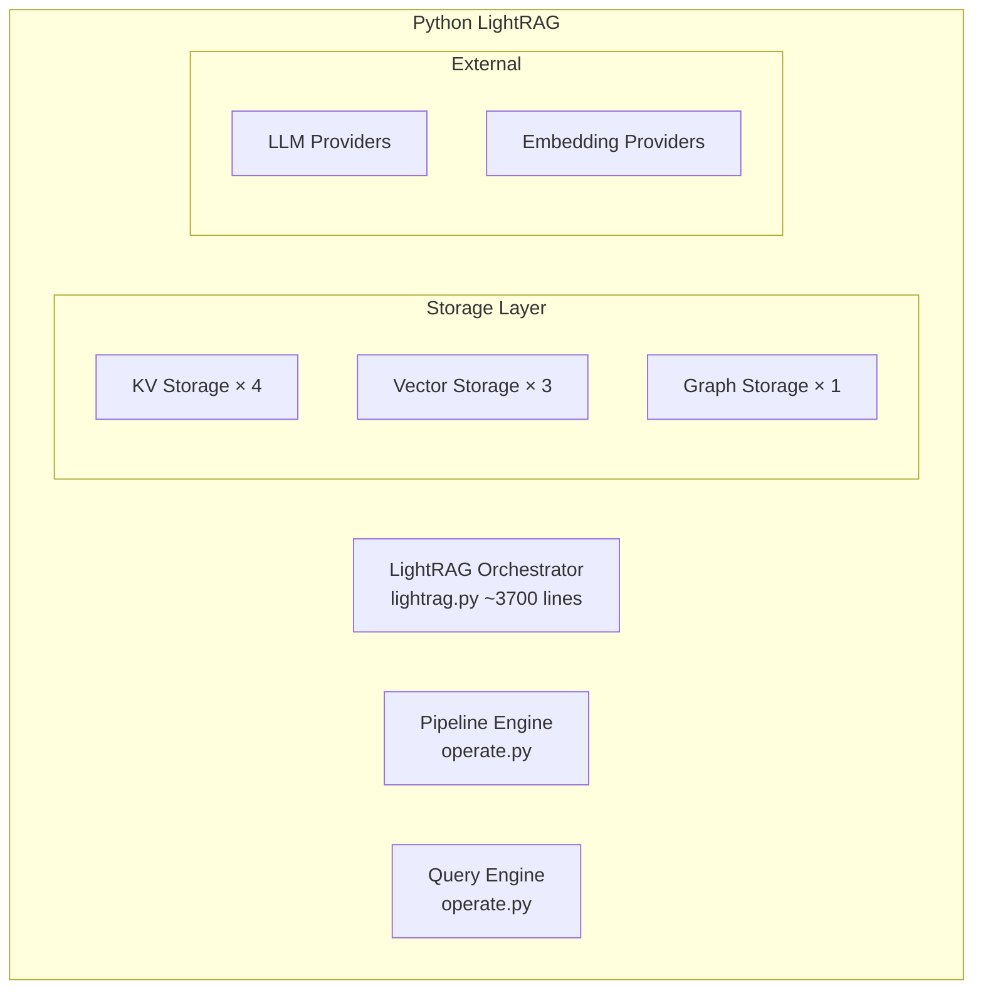

# EdgeQuake Implementation Planning - Craft Pad

**Date**: 2025-12-21  
**Author**: Implementation Planning Team  
**Purpose**: Working notes from analyzing LightRAG reference documentation and EdgeQuake tech stack

---

## Analysis Summary

### Source Documentation Analyzed

| Document | Key Takeaways |
|----------|---------------|
| [docs_retro/01-executive-summary.md](../docs_retro/01-executive-summary.md) | LightRAG is graph-based RAG with multi-mode querying |
| [docs_retro/02-architecture.md](../docs_retro/02-architecture.md) | Layered architecture: API → Orchestrator → Pipeline/Query → Storage |
| [docs_retro/03-domain-model.md](../docs_retro/03-domain-model.md) | Core entities: Document, Chunk, GraphEntity, GraphRelationship, Embedding |
| [docs_retro/04-api-contracts.md](../docs_retro/04-api-contracts.md) | Main APIs: insert, query, delete with pre/post conditions |
| [docs_retro/05-algorithms.md](../docs_retro/05-algorithms.md) | Key algorithms: chunking, entity extraction, merging, query processing |
| [docs_retro/06-storage-contracts.md](../docs_retro/06-storage-contracts.md) | 3 storage types: KV, Vector, Graph with abstract interfaces |
| [docs_retro/07-external-integrations.md](../docs_retro/07-external-integrations.md) | LLM and Embedding provider interfaces |
| [docs_retro/11-rebuild-checklist.md](../docs_retro/11-rebuild-checklist.md) | 6-phase rebuild checklist for any stack |
| [tech_stack/technology_choice.md](../tech_stack/technology_choice.md) | Rust 2021 + Tokio + Axum + PostgreSQL AGE/pgvector + SurrealDB |
| [tech_stack/README.md](../tech_stack/README.md) | Project structure and implementation phases overview |

---

## Key Architectural Insights

### 1. LightRAG Core Components



### 2. Storage Instance Mapping

Python LightRAG uses **12 storage instances**:

| Instance | Type | Purpose | EdgeQuake Target |
|----------|------|---------|------------------|
| `full_docs` | KV | Full document content | SurrealDB `document` table |
| `doc_status` | KV | Document processing status | SurrealDB `doc_status` table |
| `text_chunks` | KV | Chunked segments | SurrealDB `chunk` table |
| `llm_response_cache` | KV | LLM response cache | SurrealDB `llm_cache` table |
| `full_entities` | KV | Doc→Entity mapping | SurrealDB relations |
| `full_relations` | KV | Doc→Relation mapping | SurrealDB relations |
| `entity_chunks` | KV | Entity→Chunks mapping | SurrealDB relations |
| `relation_chunks` | KV | Relation→Chunks mapping | SurrealDB relations |
| `chunk_entity_relation_graph` | Graph | Knowledge graph | PostgreSQL AGE / SurrealDB graph |
| `entities_vdb` | Vector | Entity embeddings | pgvector / SurrealDB vector |
| `relationships_vdb` | Vector | Relation embeddings | pgvector / SurrealDB vector |
| `chunks_vdb` | Vector | Chunk embeddings | pgvector / SurrealDB vector |

### 3. Query Mode Analysis

| Mode | Vector Search | Graph Traversal | Use Case |
|------|--------------|-----------------|----------|
| `naive` | chunks_vdb | None | Simple document retrieval |
| `local` | entities_vdb | 1-hop neighbors | Entity-centric questions |
| `global` | relationships_vdb | High-degree nodes | Relationship questions |
| `hybrid` | entities + relations | Combined | Comprehensive answers |
| `bypass` | None | None | Direct LLM chat |

---

## Technology Stack Decisions

### Primary Stack (from tech_stack/)

| Layer | Python (LightRAG) | Rust (EdgeQuake) | Rationale |
|-------|-------------------|------------------|-----------|
| Language | Python 3.10+ | Rust 2021 Edition | 10-100x performance |
| Async | asyncio | Tokio | True concurrency |
| Web | FastAPI | Axum 0.8+ | Tower ecosystem |
| Graph DB | NetworkX (in-memory) | PostgreSQL AGE / FalkorDB | Production scalability |
| Vector DB | NanoVectorDB/FAISS | pgvector / Qdrant | Native integration |
| KV Store | JSON files | SurrealDB / PostgreSQL | Unified storage |
| LLM Client | openai-python | async-openai | Full API coverage |
| Tokenizer | tiktoken | tiktoken-rs | Token counting |

### Database Strategy

**Option A: PostgreSQL Unified** (Recommended for production)
```
PostgreSQL 16+
├── AGE extension (Graph queries)
├── pgvector extension (Vector search)
└── Native tables (KV/Document storage)
```

**Option B: SurrealDB All-in-One** (Simpler setup)
```
SurrealDB 2.x
├── Graph relations (native)
├── Vector embeddings (native)
└── Document tables (native)
```

**Option C: Hybrid** (Maximum performance)
```
PostgreSQL AGE (Graph)
Qdrant (Vector)
Redis (Cache)
```

---

## Algorithm Implementation Notes

### 1. Chunking Algorithm
- **Input**: Raw text, token limits, overlap settings
- **Process**: Tokenize → Split by character/token → Generate overlapping chunks
- **Output**: `Vec<Chunk>` with IDs (MD5 hash of content)
- **Rust Consideration**: Use `tiktoken-rs` + `text-splitter` crate

### 2. Entity Extraction
- **Input**: Chunk text, entity types, LLM function
- **Process**: Build prompt → Call LLM → Parse tuples → Normalize names
- **Output**: `HashMap<String, Entity>`
- **Rust Consideration**: Structured output parsing with `serde`

### 3. Entity Merging
- **Input**: New entities, existing graph
- **Process**: Lock entity → Fetch existing → Aggregate descriptions → Update
- **Concurrency**: Keyed locks per entity/relation
- **Rust Consideration**: Use `tokio::sync::RwLock<HashMap<String, Entity>>`

### 4. Query Processing
- **Input**: Query text, mode, top_k
- **Process**: Mode-specific retrieval → Context building → LLM generation
- **Output**: `QueryResult { response, context_data }`
- **Rust Consideration**: Enum-based mode dispatch

---

## Risk Analysis

### Technical Risks

| Risk | Likelihood | Impact | Mitigation |
|------|------------|--------|------------|
| SurrealDB vector performance | Medium | High | Fallback to pgvector |
| async-openai API gaps | Low | Medium | Custom request implementation |
| AGE query complexity | Medium | Medium | Cypher query templates |
| Embedding dimension mismatch | Low | High | Configuration validation |
| Graph traversal performance | Medium | High | Index optimization |

### Schedule Risks

| Risk | Likelihood | Impact | Mitigation |
|------|------------|--------|------------|
| Entity merging complexity | High | Medium | Allocate extra sprint |
| LLM prompt engineering | Medium | Medium | Reuse Python prompts |
| Integration testing delays | Medium | High | Early integration tests |
| Documentation lag | Medium | Low | Doc-as-code approach |

---

## Implementation Priority Matrix

### P0 - Critical Path (Weeks 1-4)
1. Core data structures (Entity, Relation, Chunk, Document)
2. Storage trait abstraction
3. PostgreSQL AGE adapter
4. pgvector adapter
5. Chunking algorithm
6. Entity extraction

### P1 - Core Features (Weeks 5-8)
1. Entity/relation merging
2. Query modes (naive, local, global, hybrid)
3. Axum REST API
4. Document insertion pipeline
5. Document deletion cascade

### P2 - Production Features (Weeks 9-10)
1. Multi-tenancy
2. LLM response caching
3. Rate limiting
4. OpenAPI documentation
5. Error handling refinement

### P3 - Nice-to-Have (Weeks 11-12)
1. Additional LLM providers (Anthropic, Ollama)
2. Qdrant adapter (alternative vector DB)
3. FalkorDB adapter (alternative graph DB)
4. Performance benchmarks
5. Load testing

---

## Cross-Reference Index

| EdgeQuake Component | LightRAG Reference | Tech Stack Guide |
|--------------------|-------------------|------------------|
| `edgequake-core` | [03-domain-model.md](../docs_retro/03-domain-model.md) | [README.md](../tech_stack/README.md) |
| `edgequake-storage` | [06-storage-contracts.md](../docs_retro/06-storage-contracts.md) | [postgresql-age-pgvector.md](../tech_stack/postgresql-age-pgvector.md) |
| `edgequake-api` | [04-api-contracts.md](../docs_retro/04-api-contracts.md) | [axum.md](../tech_stack/axum.md) |
| `edgequake-pipeline` | [05-algorithms.md](../docs_retro/05-algorithms.md) | [async-openai.md](../tech_stack/async-openai.md) |
| `edgequake-query` | [05-algorithms.md](../docs_retro/05-algorithms.md) | [technology_choice.md](../tech_stack/technology_choice.md) |

---

## Open Questions

1. **Database Selection**: Should we standardize on PostgreSQL AGE+pgvector or offer SurrealDB as alternative?
   - **Decision**: PostgreSQL as primary (production-proven), SurrealDB as optional adapter

2. **Embedding Model**: Default to OpenAI `text-embedding-3-small` or support local models?
   - **Decision**: OpenAI default, trait-based abstraction for alternatives

3. **Graph Query Language**: Cypher (AGE/FalkorDB) or SurrealQL?
   - **Decision**: Abstract behind trait, implement both

4. **Caching Strategy**: In-memory LRU or external Redis?
   - **Decision**: Start with in-memory, add Redis adapter later

5. **Multi-tenancy Model**: Database-per-tenant or namespace isolation?
   - **Decision**: Namespace isolation (PostgreSQL schemas / SurrealDB namespaces)

---

## Next Steps

1. ✅ Complete craft_pad.md (this document)
2. 🔄 Create master.md with full implementation plan
3. 🔄 Create phase-specific documents (phases/phase-*.md)
4. 🔄 Create plan_progress.md tracker
5. ⏳ Review and validate plan completeness
