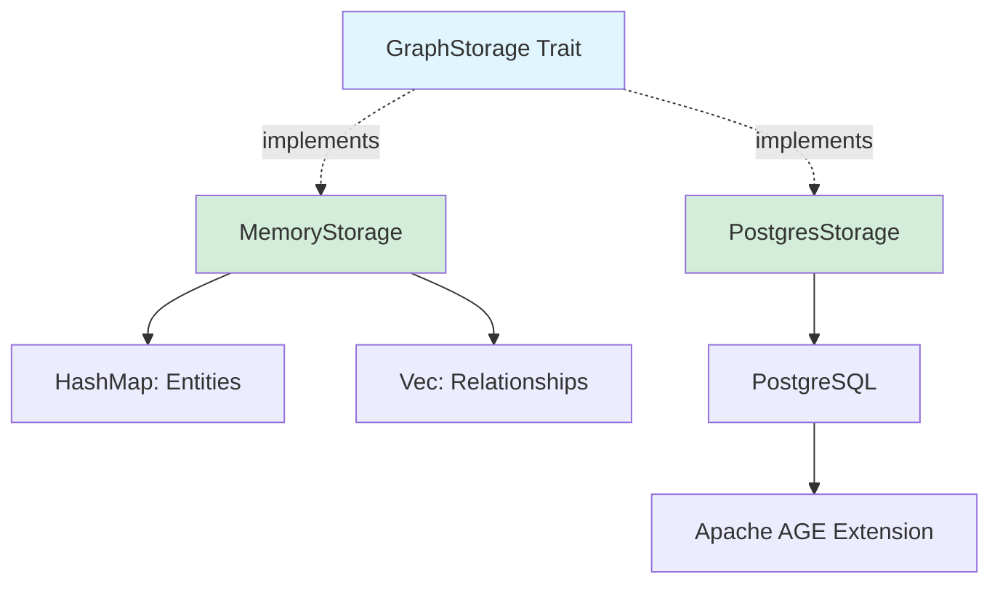

# Example: Documenting a Rust Crate

This example demonstrates how to use the reverse-documentation skill to document an entire Rust crate.

## Scenario

You want to generate comprehensive documentation for the `edgequake-storage` crate, which provides storage backends for the EdgeQuake graph database.

## Command

```
Generate comprehensive documentation for the edgequake-storage crate including:
- All public traits and implementations
- Error types and handling
- Async patterns
- Examples for each storage backend
- Architecture diagram showing trait relationships
```

## Process

### 1. Discovery Phase

The assistant will:

```bash
# Navigate to the crate
cd edgequake/crates/edgequake-storage

# Examine structure
ls -la src/

# Read Cargo.toml
cat Cargo.toml

# Find all Rust files
fd -e rs
```

### 2. Analysis Phase

The assistant analyzes:

**Trait Definitions:**

```rust
// Found in src/traits.rs
pub trait GraphStorage: Send + Sync {
    async fn insert_entity(&self, entity: Entity) -> Result<(), StorageError>;
    async fn insert_relationship(&self, rel: Relationship) -> Result<(), StorageError>;
    async fn query_entities(&self, query: &Query) -> Result<Vec<Entity>, StorageError>;
}
```

**Implementations:**

```rust
// Found in src/memory.rs
pub struct MemoryStorage {
    entities: Arc<RwLock<HashMap<String, Entity>>>,
    relationships: Arc<RwLock<Vec<Relationship>>>,
}

impl GraphStorage for MemoryStorage {
    // Implementation details
}
```

**Error Types:**

```rust
// Found in src/error.rs
#[derive(Debug, thiserror::Error)]
pub enum StorageError {
    #[error("Entity not found: {0}")]
    NotFound(String),

    #[error("Connection failed: {0}")]
    ConnectionFailed(String),
}
```

### 3. Documentation Generation

The assistant generates:

#### src/lib.rs

````rust
//! EdgeQuake Storage Backends
//!
//! This crate provides storage abstractions and implementations for EdgeQuake's
//! knowledge graph. It supports multiple backends through a unified trait interface.
//!
//! # Backends
//!
//! - [`MemoryStorage`]: In-memory HashMap-based storage (ideal for testing)
//! - [`PostgresStorage`]: PostgreSQL with Apache AGE extension (production use)
//!
//! # Examples
//!
//! ```rust
//! use edgequake_storage::{GraphStorage, MemoryStorage};
//!
//! # async fn example() -> Result<(), Box<dyn std::error::Error>> {
//! let storage = MemoryStorage::new();
//!
//! // Insert an entity
//! storage.insert_entity(Entity {
//!     name: "SARAH_CHEN".to_string(),
//!     entity_type: EntityType::Person,
//!     properties: HashMap::new(),
//! }).await?;
//! # Ok(())
//! # }
//! ```
//!
//! # Feature Flags
//!
//! - `postgres`: Enable PostgreSQL backend (requires `tokio-postgres`)
//! - `serde`: Enable serialization support for storage types

pub mod traits;
pub mod memory;
#[cfg(feature = "postgres")]
pub mod postgres;
pub mod error;

pub use traits::GraphStorage;
pub use memory::MemoryStorage;
#[cfg(feature = "postgres")]
pub use postgres::PostgresStorage;
pub use error::StorageError;
````

#### src/traits.rs

````rust
//! Core storage traits and types.

use async_trait::async_trait;
use crate::error::StorageError;

/// Storage backend for graph data.
///
/// This trait defines the interface that all storage backends must implement.
/// It provides async methods for inserting and querying entities and relationships.
///
/// # Implementations
///
/// The crate provides two implementations:
///
/// - [`MemoryStorage`]: In-memory storage using `HashMap` and `Vec`
/// - [`PostgresStorage`]: PostgreSQL storage using Apache AGE extension
///
/// # Thread Safety
///
/// All implementations must be `Send + Sync` to work with async runtimes.
///
/// # Examples
///
/// ```rust
/// use edgequake_storage::{GraphStorage, MemoryStorage, Entity, EntityType};
/// use std::collections::HashMap;
///
/// # async fn example() -> Result<(), Box<dyn std::error::Error>> {
/// let storage = MemoryStorage::new();
///
/// // Insert an entity
/// let entity = Entity {
///     name: "JOHN_DOE".to_string(),
///     entity_type: EntityType::Person,
///     properties: HashMap::new(),
/// };
/// storage.insert_entity(entity).await?;
/// # Ok(())
/// # }
/// ```
#[async_trait]
pub trait GraphStorage: Send + Sync {
    /// Inserts a new entity into the graph.
    ///
    /// # Arguments
    ///
    /// * `entity` - The entity to insert
    ///
    /// # Errors
    ///
    /// Returns [`StorageError::ConnectionFailed`] if the storage backend is unavailable.
    /// Returns [`StorageError::DuplicateEntity`] if an entity with the same name exists.
    ///
    /// # Examples
    ///
    /// ```rust
    /// # use edgequake_storage::{GraphStorage, MemoryStorage, Entity, EntityType};
    /// # use std::collections::HashMap;
    /// # async fn example() -> Result<(), Box<dyn std::error::Error>> {
    /// # let storage = MemoryStorage::new();
    /// storage.insert_entity(Entity {
    ///     name: "ALICE".to_string(),
    ///     entity_type: EntityType::Person,
    ///     properties: HashMap::new(),
    /// }).await?;
    /// # Ok(())
    /// # }
    /// ```
    async fn insert_entity(&self, entity: Entity) -> Result<(), StorageError>;

    /// Inserts a new relationship between entities.
    ///
    /// # Arguments
    ///
    /// * `relationship` - The relationship to insert
    ///
    /// # Errors
    ///
    /// Returns [`StorageError::NotFound`] if either entity does not exist.
    /// Returns [`StorageError::ConnectionFailed`] if the storage backend is unavailable.
    ///
    /// # Examples
    ///
    /// ```rust
    /// # use edgequake_storage::{GraphStorage, MemoryStorage, Relationship};
    /// # async fn example() -> Result<(), Box<dyn std::error::Error>> {
    /// # let storage = MemoryStorage::new();
    /// storage.insert_relationship(Relationship {
    ///     source: "ALICE".to_string(),
    ///     target: "BOB".to_string(),
    ///     relationship_type: "KNOWS".to_string(),
    ///     weight: 1.0,
    /// }).await?;
    /// # Ok(())
    /// # }
    /// ```
    async fn insert_relationship(&self, relationship: Relationship) -> Result<(), StorageError>;

    /// Queries entities matching the given criteria.
    ///
    /// # Arguments
    ///
    /// * `query` - The query criteria
    ///
    /// # Returns
    ///
    /// A vector of matching entities. Returns an empty vector if no matches found.
    ///
    /// # Errors
    ///
    /// Returns [`StorageError::ConnectionFailed`] if the storage backend is unavailable.
    /// Returns [`StorageError::QueryFailed`] if the query syntax is invalid.
    ///
    /// # Examples
    ///
    /// ```rust
    /// # use edgequake_storage::{GraphStorage, MemoryStorage, Query};
    /// # async fn example() -> Result<(), Box<dyn std::error::Error>> {
    /// # let storage = MemoryStorage::new();
    /// let query = Query::new()
    ///     .entity_type(EntityType::Person)
    ///     .limit(10);
    ///
    /// let entities = storage.query_entities(&query).await?;
    /// for entity in entities {
    ///     println!("Found: {}", entity.name);
    /// }
    /// # Ok(())
    /// # }
    /// ```
    async fn query_entities(&self, query: &Query) -> Result<Vec<Entity>, StorageError>;
}
````

#### src/memory.rs

````rust
//! In-memory storage implementation.
//!
//! This module provides a simple in-memory storage backend using `HashMap` and `Vec`.
//! It's primarily intended for testing and development.

use async_trait::async_trait;
use std::collections::HashMap;
use std::sync::Arc;
use tokio::sync::RwLock;

use crate::traits::GraphStorage;
use crate::error::StorageError;

/// In-memory storage backend using HashMap.
///
/// This implementation stores entities in a `HashMap` and relationships in a `Vec`,
/// both protected by `RwLock` for concurrent access. Data is not persisted and will
/// be lost when the storage is dropped.
///
/// # Thread Safety
///
/// This implementation is thread-safe and can be shared across multiple async tasks.
/// It uses `tokio::sync::RwLock` for interior mutability.
///
/// # Performance
///
/// - Entity insertion: O(1) average case
/// - Entity lookup: O(1) average case
/// - Relationship insertion: O(1)
/// - Relationship query: O(n) where n is the number of relationships
///
/// # Examples
///
/// ```rust
/// use edgequake_storage::{MemoryStorage, GraphStorage, Entity, EntityType};
/// use std::collections::HashMap;
///
/// # async fn example() -> Result<(), Box<dyn std::error::Error>> {
/// let storage = MemoryStorage::new();
///
/// // Insert entities
/// storage.insert_entity(Entity {
///     name: "ALICE".to_string(),
///     entity_type: EntityType::Person,
///     properties: HashMap::new(),
/// }).await?;
///
/// storage.insert_entity(Entity {
///     name: "BOB".to_string(),
///     entity_type: EntityType::Person,
///     properties: HashMap::new(),
/// }).await?;
///
/// // Insert relationship
/// storage.insert_relationship(Relationship {
///     source: "ALICE".to_string(),
///     target: "BOB".to_string(),
///     relationship_type: "KNOWS".to_string(),
///     weight: 1.0,
/// }).await?;
/// # Ok(())
/// # }
/// ```
pub struct MemoryStorage {
    /// Entity storage indexed by entity name
    entities: Arc<RwLock<HashMap<String, Entity>>>,

    /// Relationship storage
    relationships: Arc<RwLock<Vec<Relationship>>>,
}

impl MemoryStorage {
    /// Creates a new empty memory storage.
    ///
    /// # Examples
    ///
    /// ```rust
    /// use edgequake_storage::MemoryStorage;
    ///
    /// let storage = MemoryStorage::new();
    /// ```
    pub fn new() -> Self {
        Self {
            entities: Arc::new(RwLock::new(HashMap::new())),
            relationships: Arc::new(RwLock::new(Vec::new())),
        }
    }

    /// Returns the number of entities stored.
    ///
    /// # Examples
    ///
    /// ```rust
    /// # use edgequake_storage::MemoryStorage;
    /// # async fn example() {
    /// let storage = MemoryStorage::new();
    /// assert_eq!(storage.entity_count().await, 0);
    /// # }
    /// ```
    pub async fn entity_count(&self) -> usize {
        self.entities.read().await.len()
    }

    /// Returns the number of relationships stored.
    ///
    /// # Examples
    ///
    /// ```rust
    /// # use edgequake_storage::MemoryStorage;
    /// # async fn example() {
    /// let storage = MemoryStorage::new();
    /// assert_eq!(storage.relationship_count().await, 0);
    /// # }
    /// ```
    pub async fn relationship_count(&self) -> usize {
        self.relationships.read().await.len()
    }
}

impl Default for MemoryStorage {
    fn default() -> Self {
        Self::new()
    }
}

#[async_trait]
impl GraphStorage for MemoryStorage {
    async fn insert_entity(&self, entity: Entity) -> Result<(), StorageError> {
        let mut entities = self.entities.write().await;

        if entities.contains_key(&entity.name) {
            return Err(StorageError::DuplicateEntity(entity.name));
        }

        entities.insert(entity.name.clone(), entity);
        Ok(())
    }

    async fn insert_relationship(&self, relationship: Relationship) -> Result<(), StorageError> {
        // Verify entities exist
        let entities = self.entities.read().await;

        if !entities.contains_key(&relationship.source) {
            return Err(StorageError::NotFound(relationship.source));
        }

        if !entities.contains_key(&relationship.target) {
            return Err(StorageError::NotFound(relationship.target));
        }

        drop(entities);

        // Insert relationship
        let mut relationships = self.relationships.write().await;
        relationships.push(relationship);

        Ok(())
    }

    async fn query_entities(&self, query: &Query) -> Result<Vec<Entity>, StorageError> {
        let entities = self.entities.read().await;

        let mut results: Vec<Entity> = entities
            .values()
            .filter(|e| query.matches(e))
            .cloned()
            .collect();

        if let Some(limit) = query.limit {
            results.truncate(limit);
        }

        Ok(results)
    }
}

#[cfg(test)]
mod tests {
    use super::*;

    #[tokio::test]
    async fn test_insert_and_query() {
        let storage = MemoryStorage::new();

        let entity = Entity {
            name: "TEST".to_string(),
            entity_type: EntityType::Person,
            properties: HashMap::new(),
        };

        storage.insert_entity(entity).await.unwrap();

        let query = Query::new();
        let results = storage.query_entities(&query).await.unwrap();

        assert_eq!(results.len(), 1);
        assert_eq!(results[0].name, "TEST");
    }
}
````

### 4. Generated Files

The assistant creates:

```
edgequake/crates/edgequake-storage/
├── README.md              # Crate overview and examples
├── ARCHITECTURE.md        # Architecture diagram and design
└── src/
    ├── lib.rs            # Updated with comprehensive docs
    ├── traits.rs         # Trait documentation
    ├── memory.rs         # MemoryStorage documentation
    ├── postgres.rs       # PostgresStorage documentation
    └── error.rs          # Error type documentation
```

### 5. Architecture Diagram



## Expected Output

After running this skill, you'll have:

✅ Comprehensive inline documentation for all public APIs  
✅ Module-level documentation explaining the crate  
✅ Working code examples that compile  
✅ Error documentation for all Result types  
✅ Architecture diagram showing trait relationships  
✅ README.md with usage examples  
✅ ARCHITECTURE.md with design decisions

## Verification

Run these commands to verify the documentation:

```bash
# Generate HTML docs
cargo doc --no-deps --open

# Test documentation examples
cargo test --doc

# Check for issues
cargo clippy
```

## Next Steps

After generating documentation:

1. Review the generated docs in your browser
2. Run `cargo test --doc` to verify examples
3. Make any necessary adjustments
4. Commit the documentation with your code
5. Set up CI to check docs on pull requests
