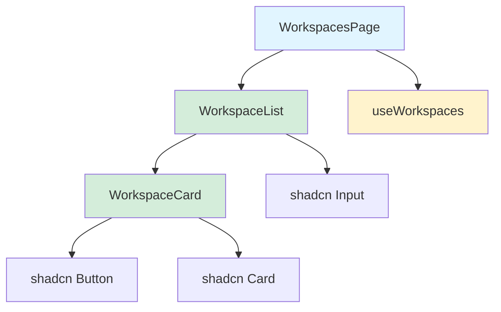

# Example: Documenting TypeScript React Components

This example demonstrates how to use the reverse-documentation skill to document React components in a TypeScript project.

## Scenario

You want to generate comprehensive documentation for React components in the EdgeQuake WebUI, specifically the workspace management components.

## Command

```
Generate comprehensive documentation for React components in src/app/workspace including:
- Component props with types
- Event handlers
- State management patterns
- Usage examples
- Accessibility notes
```

## Process

### 1. Discovery Phase

The assistant will:

```bash
# Navigate to the components directory
cd edgequake_webui/src/app/workspace

# List all component files
ls -la

# Find all TypeScript/TSX files
fd -e tsx -e ts
```

### 2. Analysis Phase

The assistant analyzes:

**Component Structure:**

```typescript
// Found in src/app/workspace/components/WorkspaceCard.tsx
interface WorkspaceCardProps {
  workspace: Workspace;
  onSelect?: (id: string) => void;
  onDelete?: (id: string) => void;
}

export const WorkspaceCard: React.FC<WorkspaceCardProps> = ({
  workspace,
  onSelect,
  onDelete,
}) => {
  // Component implementation
};
```

**Type Definitions:**

```typescript
// Found in src/types/workspace.ts
interface Workspace {
  id: string;
  name: string;
  description?: string;
  createdAt: Date;
  updatedAt: Date;
}
```

**Custom Hooks:**

```typescript
// Found in src/hooks/useWorkspaces.ts
export function useWorkspaces() {
  return useSWR<Workspace[]>("/api/workspaces", fetcher);
}
```

### 3. Documentation Generation

The assistant generates:

#### WorkspaceCard.tsx

````typescript
import React from "react";
import {
  Card,
  CardHeader,
  CardTitle,
  CardDescription,
  CardContent,
} from "@/components/ui/card";
import { Button } from "@/components/ui/button";
import { Trash2, FolderOpen } from "lucide-react";

/**
 * Displays a workspace in a card format with actions.
 *
 * This component shows workspace details including name, description,
 * and timestamps. It provides actions for selecting and deleting the workspace.
 *
 * @param props - The component props
 * @returns A card displaying workspace information
 *
 * @example
 * Basic usage:
 * ```tsx
 * <WorkspaceCard
 *   workspace={workspace}
 *   onSelect={(id) => navigate(`/workspace/${id}`)}
 *   onDelete={(id) => deleteWorkspace(id)}
 * />
 * ```
 *
 * @example
 * Read-only mode (no actions):
 * ```tsx
 * <WorkspaceCard workspace={workspace} />
 * ```
 *
 * @remarks
 * - The card is fully keyboard accessible
 * - Delete action requires confirmation (handled by parent)
 * - Uses shadcn/ui Card component for consistent styling
 */
export interface WorkspaceCardProps {
  /**
   * The workspace object to display.
   */
  workspace: Workspace;

  /**
   * Callback fired when the workspace is selected.
   *
   * @param id - The ID of the selected workspace
   *
   * @example
   * ```tsx
   * <WorkspaceCard
   *   workspace={ws}
   *   onSelect={(id) => {
   *     console.log('Selected:', id);
   *     router.push(`/workspace/${id}`);
   *   }}
   * />
   * ```
   */
  onSelect?: (id: string) => void;

  /**
   * Callback fired when the delete button is clicked.
   *
   * Should show a confirmation dialog before deleting.
   *
   * @param id - The ID of the workspace to delete
   *
   * @example
   * ```tsx
   * <WorkspaceCard
   *   workspace={ws}
   *   onDelete={async (id) => {
   *     if (confirm('Delete workspace?')) {
   *       await deleteWorkspace(id);
   *     }
   *   }}
   * />
   * ```
   */
  onDelete?: (id: string) => void;
}

export const WorkspaceCard: React.FC<WorkspaceCardProps> = ({
  workspace,
  onSelect,
  onDelete,
}) => {
  /**
   * Handles the select action.
   * Calls onSelect callback if provided.
   */
  const handleSelect = () => {
    onSelect?.(workspace.id);
  };

  /**
   * Handles the delete action.
   * Calls onDelete callback if provided.
   */
  const handleDelete = (e: React.MouseEvent) => {
    e.stopPropagation(); // Prevent card click
    onDelete?.(workspace.id);
  };

  return (
    <Card
      className="hover:shadow-lg transition-shadow cursor-pointer"
      onClick={handleSelect}
      role="button"
      tabIndex={0}
      onKeyDown={(e) => {
        if (e.key === "Enter" || e.key === " ") {
          handleSelect();
        }
      }}
      aria-label={`Workspace: ${workspace.name}`}
    >
      <CardHeader>
        <div className="flex items-start justify-between">
          <div className="flex-1">
            <CardTitle className="flex items-center gap-2">
              <FolderOpen className="h-5 w-5" />
              {workspace.name}
            </CardTitle>
            {workspace.description && (
              <CardDescription className="mt-2">
                {workspace.description}
              </CardDescription>
            )}
          </div>

          {onDelete && (
            <Button
              variant="ghost"
              size="icon"
              onClick={handleDelete}
              aria-label={`Delete ${workspace.name}`}
              className="text-destructive hover:text-destructive"
            >
              <Trash2 className="h-4 w-4" />
            </Button>
          )}
        </div>
      </CardHeader>

      <CardContent>
        <div className="text-sm text-muted-foreground">
          <p>Created: {new Date(workspace.createdAt).toLocaleDateString()}</p>
          <p>Updated: {new Date(workspace.updatedAt).toLocaleDateString()}</p>
        </div>
      </CardContent>
    </Card>
  );
};

// Display name for React DevTools
WorkspaceCard.displayName = "WorkspaceCard";
````

#### WorkspaceList.tsx

````typescript
import React, { useState } from "react";
import { WorkspaceCard } from "./WorkspaceCard";
import { Input } from "@/components/ui/input";
import { Button } from "@/components/ui/button";
import { Plus, Search } from "lucide-react";

/**
 * Displays a list of workspaces with search and create functionality.
 *
 * This component manages a list of workspaces with search filtering
 * and provides UI for creating new workspaces.
 *
 * @param props - The component props
 * @returns A workspace list with search and actions
 *
 * @example
 * ```tsx
 * <WorkspaceList
 *   workspaces={workspaces}
 *   onWorkspaceSelect={(id) => navigate(`/workspace/${id}`)}
 *   onWorkspaceDelete={async (id) => {
 *     await deleteWorkspace(id);
 *     mutate();
 *   }}
 *   onCreateNew={() => setShowCreateDialog(true)}
 * />
 * ```
 *
 * @remarks
 * - Search is case-insensitive and matches name/description
 * - Empty state is shown when no workspaces exist
 * - Loading state should be handled by parent component
 */
export interface WorkspaceListProps {
  /**
   * Array of workspaces to display.
   */
  workspaces: Workspace[];

  /**
   * Callback fired when a workspace is selected.
   *
   * @param id - The ID of the selected workspace
   */
  onWorkspaceSelect: (id: string) => void;

  /**
   * Callback fired when a workspace should be deleted.
   *
   * @param id - The ID of the workspace to delete
   */
  onWorkspaceDelete: (id: string) => void;

  /**
   * Callback fired when the create button is clicked.
   */
  onCreateNew: () => void;

  /**
   * Optional loading state indicator.
   * @defaultValue false
   */
  isLoading?: boolean;
}

export const WorkspaceList: React.FC<WorkspaceListProps> = ({
  workspaces,
  onWorkspaceSelect,
  onWorkspaceDelete,
  onCreateNew,
  isLoading = false,
}) => {
  /**
   * Search query state.
   * Used to filter workspaces by name or description.
   */
  const [searchQuery, setSearchQuery] = useState("");

  /**
   * Filters workspaces based on search query.
   * Matches against workspace name and description (case-insensitive).
   */
  const filteredWorkspaces = workspaces.filter((ws) => {
    const query = searchQuery.toLowerCase();
    return (
      ws.name.toLowerCase().includes(query) ||
      ws.description?.toLowerCase().includes(query)
    );
  });

  if (isLoading) {
    return (
      <div className="flex items-center justify-center p-8">
        <div className="animate-spin rounded-full h-8 w-8 border-b-2 border-primary" />
      </div>
    );
  }

  return (
    <div className="space-y-4">
      {/* Header with search and create button */}
      <div className="flex items-center gap-4">
        <div className="relative flex-1">
          <Search className="absolute left-3 top-1/2 -translate-y-1/2 h-4 w-4 text-muted-foreground" />
          <Input
            type="search"
            placeholder="Search workspaces..."
            value={searchQuery}
            onChange={(e) => setSearchQuery(e.target.value)}
            className="pl-10"
            aria-label="Search workspaces"
          />
        </div>
        <Button onClick={onCreateNew} aria-label="Create new workspace">
          <Plus className="h-4 w-4 mr-2" />
          New Workspace
        </Button>
      </div>

      {/* Workspace grid */}
      {filteredWorkspaces.length > 0 ? (
        <div
          className="grid gap-4 md:grid-cols-2 lg:grid-cols-3"
          role="list"
          aria-label="Workspaces"
        >
          {filteredWorkspaces.map((workspace) => (
            <WorkspaceCard
              key={workspace.id}
              workspace={workspace}
              onSelect={onWorkspaceSelect}
              onDelete={onWorkspaceDelete}
            />
          ))}
        </div>
      ) : (
        <div className="text-center py-12">
          <p className="text-muted-foreground">
            {searchQuery
              ? "No workspaces found matching your search."
              : "No workspaces yet. Create your first workspace to get started."}
          </p>
        </div>
      )}
    </div>
  );
};

WorkspaceList.displayName = "WorkspaceList";
````

#### useWorkspaces.ts

````typescript
import useSWR from "swr";
import type { SWRConfiguration } from "swr";

/**
 * Custom hook for fetching and managing workspace data.
 *
 * Uses SWR for automatic caching, revalidation, and error handling.
 * Data is automatically revalidated on window focus and network reconnection.
 *
 * @param config - Optional SWR configuration
 * @returns SWR response with workspace data
 *
 * @example
 * Basic usage:
 * ```tsx
 * function WorkspacesPage() {
 *   const { data, error, isLoading } = useWorkspaces();
 *
 *   if (isLoading) return <Spinner />;
 *   if (error) return <ErrorMessage error={error} />;
 *
 *   return <WorkspaceList workspaces={data} />;
 * }
 * ```
 *
 * @example
 * With custom configuration:
 * ```tsx
 * const { data, mutate } = useWorkspaces({
 *   refreshInterval: 5000, // Refresh every 5 seconds
 *   revalidateOnFocus: false,
 * });
 * ```
 *
 * @example
 * Manual revalidation:
 * ```tsx
 * const { data, mutate } = useWorkspaces();
 *
 * const handleCreate = async (workspace: CreateWorkspaceInput) => {
 *   await createWorkspace(workspace);
 *   mutate(); // Revalidate the list
 * };
 * ```
 *
 * @remarks
 * - Data is cached globally across the app
 * - Failed requests are automatically retried
 * - Stale data is shown while revalidating
 */
export function useWorkspaces(config?: SWRConfiguration) {
  return useSWR<Workspace[], Error>("/api/workspaces", fetcher, {
    // Default configuration
    revalidateOnFocus: true,
    revalidateOnReconnect: true,
    dedupingInterval: 2000,
    ...config,
  });
}

/**
 * Custom hook for fetching a single workspace by ID.
 *
 * @param workspaceId - The ID of the workspace to fetch
 * @param config - Optional SWR configuration
 * @returns SWR response with workspace data
 *
 * @example
 * ```tsx
 * function WorkspaceDetails({ id }: { id: string }) {
 *   const { data, error, isLoading } = useWorkspace(id);
 *
 *   if (isLoading) return <Skeleton />;
 *   if (error) return <ErrorMessage error={error} />;
 *   if (!data) return <NotFound />;
 *
 *   return <WorkspaceCard workspace={data} />;
 * }
 * ```
 */
export function useWorkspace(workspaceId: string, config?: SWRConfiguration) {
  return useSWR<Workspace, Error>(
    workspaceId ? `/api/workspaces/${workspaceId}` : null,
    fetcher,
    config
  );
}

/**
 * Fetcher function for SWR.
 * Handles JSON parsing and error responses.
 *
 * @param url - The URL to fetch
 * @returns Parsed JSON data
 * @throws {Error} If the response is not ok
 */
async function fetcher<T>(url: string): Promise<T> {
  const response = await fetch(url);

  if (!response.ok) {
    const error = new Error("An error occurred while fetching data");
    error.info = await response.json();
    error.status = response.status;
    throw error;
  }

  return response.json();
}
````

### 4. Generated Files

The assistant creates:

```
edgequake_webui/src/app/workspace/
├── COMPONENTS.md          # Component overview
├── components/
│   ├── WorkspaceCard.tsx  # Fully documented
│   ├── WorkspaceList.tsx  # Fully documented
│   └── index.ts          # Exports documentation
└── hooks/
    ├── useWorkspaces.ts   # Fully documented
    └── index.ts          # Exports documentation
```

### 5. Component Hierarchy Diagram



## Expected Output

After running this skill, you'll have:

✅ Complete TSDoc comments for all components  
✅ Prop interfaces with detailed descriptions  
✅ Event handler documentation  
✅ Usage examples for each component  
✅ Hook documentation with SWR patterns  
✅ Accessibility notes and ARIA labels  
✅ Component hierarchy diagram

## Verification

Run these commands to verify the documentation:

```bash
# Type check
npx tsc --noEmit

# Generate TypeDoc
npx typedoc src/

# Lint
npm run lint

# Build to ensure examples are correct
npm run build
```

## Next Steps

After generating documentation:

1. Review generated TypeDoc output
2. Create Storybook stories for components
3. Add visual regression tests
4. Update component README
5. Set up documentation site with TypeDoc
