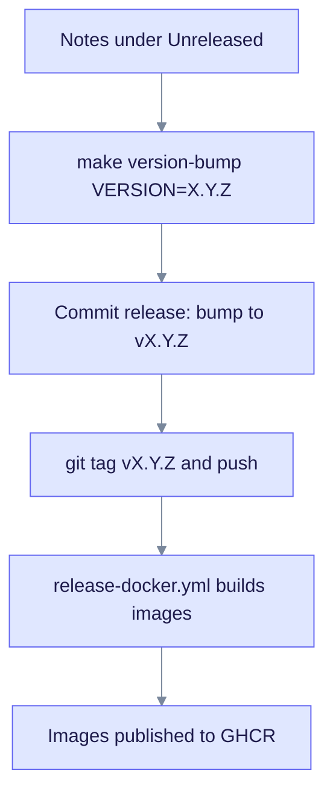

# Changelog

Product and documentation release history lives in the **root** changelog. Do not keep a second list here.

→ **[CHANGELOG.md](../CHANGELOG.md)** (current product line: **v0.32.2**)

Each release section follows the same path, from an `[Unreleased]` entry to a published image.

Pushing the version tag starts the Docker workflow, which publishes the images to GHCR.

When a docs-only change ships without a product bump, note it under `[Unreleased]` or the next version section in the root changelog.
