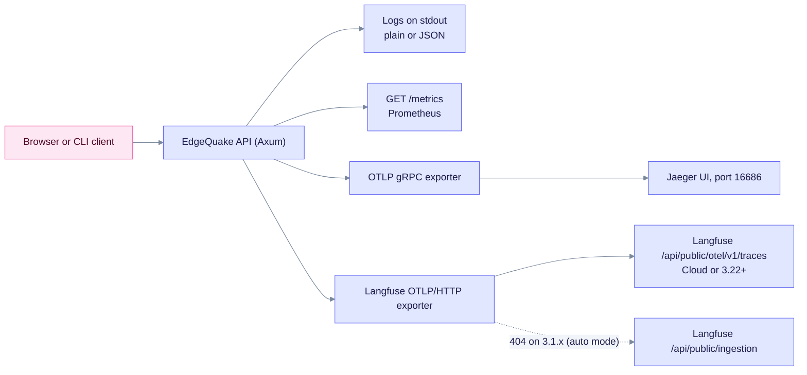
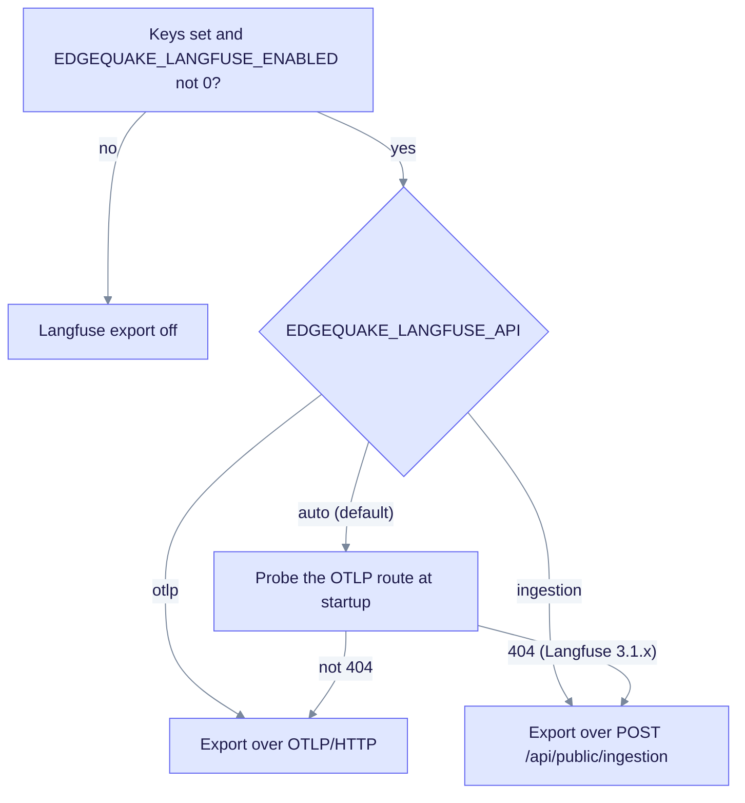
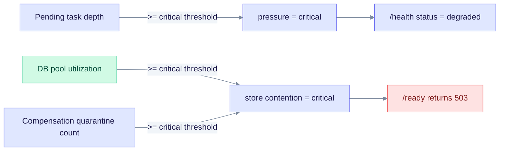

> **Product: v0.32.2** · Spec: [SPEC-018](../specs/018-observability/README.md) · Ingestion ops: [Ingestion cancel & fairness](ingestion-cancel-and-fairness.md)

# EdgeQuake Observability

This page covers the four signals EdgeQuake emits: logs, Prometheus metrics, OpenTelemetry traces and Langfuse LLM traces. It is for operators who run EdgeQuake and for developers who debug ingestion or queries. The full audit and proof index is in [SPEC-018](../specs/018-observability/README.md).

## Signals at a glance



Logs and `/metrics` are on by default. Traces and Langfuse need the variables in the next section. Jaeger and Langfuse can run at the same time.

## Environment variables

### Logs

| Variable | Purpose | Default |
|----------|---------|---------|
| `RUST_LOG` | Tracing filter. It also limits what OTLP exports | Built-in filter (`edgequake=info`, `sqlx=warn`, ...) |
| `EDGEQUAKE_LOG_FORMAT` | `json` or `plain` | `plain` |
| `EDGEQUAKE_LOG_SPAN_EVENTS` | `1` or `true` logs span close events with their duration | off |
| `EDGEQUAKE_ENVIRONMENT` | `deployment.environment` attribute on traces | `development` |

### Traces (OpenTelemetry)

| Variable | Purpose | Default |
|----------|---------|---------|
| `EDGEQUAKE_OTEL_ENABLED` | `1` or `true` turns on the OTLP gRPC layer | off |
| `OTEL_EXPORTER_OTLP_ENDPOINT` | OTLP gRPC endpoint, for example Jaeger at `http://localhost:4317` | unset (disabled) |
| `OTEL_SERVICE_NAME` | Service name in traces | `edgequake-api` |

### Langfuse (LLM traces)

| Variable | Purpose | Default |
|----------|---------|---------|
| `LANGFUSE_PUBLIC_KEY` | Public key (`pk-lf-...`) | unset |
| `LANGFUSE_SECRET_KEY` | Secret key (`sk-lf-...`). Never logged | unset |
| `LANGFUSE_BASE_URL` | Langfuse UI and API base URL. `LANGFUSE_HOST` is accepted as an alias | `https://cloud.langfuse.com` |
| `LANGFUSE_PROJECT_ID` | Optional project ID for deep links. If unset, the API looks it up | unset |
| `EDGEQUAKE_LANGFUSE_ENABLED` | `0`, `false` or `off` forces Langfuse off. Export still needs both keys; `1` does not turn it on by itself | on when both keys are set |
| `EDGEQUAKE_LANGFUSE_API` | `auto` (probe the OTLP route, use ingestion on 404), `otlp`, or `ingestion` (`native` is an alias) | `auto` |
| `EDGEQUAKE_LANGFUSE_IO_MAX_BYTES` | Optional byte cap on generation input and output. `0` means no cap | `0` (unlimited) |

### LLM and pool sampling

| Variable | Purpose | Default |
|----------|---------|---------|
| `EDGEQUAKE_PROMPT_CACHE` | Provider prompt cache (SPEC-126). Observations report `cache_hit_tokens` | on |
| `EDGEQUAKE_DB_POOL_METRICS_INTERVAL_SECS` | DB pool gauge sampling interval, minimum 5 seconds | `15` |

### Queue and store thresholds

| Variable | Purpose | Default |
|----------|---------|---------|
| `EDGEQUAKE_QUEUE_PENDING_WARN` | Pending depth that sets queue pressure to `elevated` | `100` |
| `EDGEQUAKE_QUEUE_PENDING_CRITICAL` | Pending depth that sets pressure to `critical` and degrades `/health` | `max(500, 5 × warn)` |
| `EDGEQUAKE_DB_POOL_UTIL_WARN` | Pool utilization that sets store contention to `elevated` | `0.75` |
| `EDGEQUAKE_DB_POOL_UTIL_CRITICAL` | Pool utilization that sets store contention to `critical` (`/ready` returns 503) | `0.90` |
| `EDGEQUAKE_COMPENSATION_QUARANTINE_WARN` | Quarantine count that sets store contention to `elevated` | `1` |
| `EDGEQUAKE_COMPENSATION_QUARANTINE_CRITICAL` | Quarantine count that sets store contention to `critical` (`/ready` returns 503) | `5` |

### Build with OTLP

The `otel` feature is on by default for the workspace binary, `edgequake-api` and `edgequake-observability`. Export still needs runtime variables such as `LANGFUSE_*` or `OTEL_EXPORTER_OTLP_ENDPOINT`.

```bash
# Default build: OTLP and the Langfuse HTTP exporter are included
cd edgequake && cargo build --release

# Optional: enable the OTLP gRPC layer and JSON logs at runtime
export EDGEQUAKE_OTEL_ENABLED=1
export OTEL_EXPORTER_OTLP_ENDPOINT=http://localhost:4317   # for Jaeger
export EDGEQUAKE_LOG_FORMAT=json
```

To build without OTLP:

```bash
cd edgequake && cargo build --release --no-default-features --features postgres,vision
```

## Docker

Run the OTLP-enabled image with the Jaeger overlay from the `edgequake/docker` folder:

```bash
cd edgequake/docker
docker compose -f docker-compose.yml -f docker-compose.observability.yml \
  --profile observability up --build
# Jaeger UI: http://localhost:16686
```

The overlay sets `ENABLE_OTEL=true`, JSON logs, span-close events, `EDGEQUAKE_OTEL_ENABLED=1` and `OTEL_EXPORTER_OTLP_ENDPOINT=http://jaeger:4317`.

## Langfuse (SPEC-124)

Langfuse stores one trace per query or ingest task, with LLM generations, retrievals and embeddings as observations. The export path depends on your Langfuse version.

| Langfuse | Export path | Notes |
|----------|-------------|-------|
| Cloud, or self-hosted 3.22 and later | OTLP/HTTP at `{LANGFUSE_BASE_URL}/api/public/otel/v1/traces` | The default path. Use the full `/v1/traces` URL in custom OTLP exporters |
| Self-hosted 3.1.x | `POST /api/public/ingestion` | OTLP returns 404 on 3.1.x (added in 3.22.0). Auto mode switches to ingestion |



The chart shows how EdgeQuake picks the export path. Auto mode is the safe default for both Langfuse generations.

### Turn it on

1. Add the keys to the repo-root `.env` file, or export them in your shell. Prefer unquoted values.
2. Restart the backend with `make dev`, or with `make kill-app && make backend-bg`.
3. Check the make output for `LANGFUSE_* keys detected`.
4. Confirm the export. Call `GET /health` and read `operational.observability.langfuse_enabled`, `langfuse_base_url` and `langfuse_api_resolved`. You can also open **Settings → Langfuse Observability**.

`make dev`, `backend-bg` and `backend-dev` load `.env` through `APPLY_LANGFUSE_ENV`. They do not overwrite a non-empty shell value.

### What Langfuse shows

- **Sessions.** Chat turns use the durable `conversation_id` as the Langfuse session. Optional `session_id` on `/query` and `/query/stream` is for API clients. EdgeQuake never invents a session.
- **Tokens, not cost.** Generation and embedding spans record `gen_ai.usage.input_tokens` and `output_tokens` when the provider returns them. EdgeQuake never emits `gen_ai.usage.cost` or `langfuse.observation.cost_details`. A `$0.00` cost in Langfuse comes from its model catalogue. Run `make langfuse-sync-prices` to fix it.
- **Observation types.** `generation`, `retriever`, `embedding` and `chain` (the ingest root).
- **Full LLM I/O.** Generation input and output hold the full prompt and completion, with secrets redacted. Retriever, embedding and ingest stats stay compact. Ingest document content is a preview only. See [specs/124](../specs/124-langfuse-support/14-observation-io-and-full-observe.md) and [SPEC-145](../specs/145-fix-truncated-logs/).
- **Chunking stats.** `ingest.chunking` outputs counts only (`chunks`, `token_min`, `token_p50`, `token_max`, `orphan_heading_chunks`, `fill_p50`, `mm_sidecar_appended`). Chunk text is never included. See [SPEC-125](../specs/125-better-chunking/) and [SPEC-135](../specs/135-chunking/).

Deep links use `{LANGFUSE_BASE_URL}/project/{projectId}/traces/{traceId}`. Query responses include `trace_id` for this purpose. A bare `/sessions/{id}` URL returns 404 on Cloud. Use the project form.

### Self-hosted 3.1.x

The full wiring for a 3.1.x server is in [operations/langfuse-3.1.md](operations/langfuse-3.1.md). For Kubernetes, see [deploy/kubernetes/README.md](../deploy/kubernetes/README.md#existing-langfuse-31x). The ingestion path is a bridge. Upgrade to 3.22 or later, or to the in-repo v4 stack, when you can.

### Local Langfuse test stacks

These targets are for development and proof runs. None of them is started by `make dev`.

| Target | Starts | Port |
|--------|--------|------|
| `make langfuse-up` | Langfuse v4 UI only | 3310 |
| `make dev-langfuse` / `make dev-bg-langfuse` | EdgeQuake stack plus Langfuse v4. Injects the local keys into the backend | 3310 |
| `make langfuse-smoke` | Health check and `GET /api/public/projects` with the headless keys | 3310 |
| `make spec124-langfuse-e2e` | Settings and sessions Playwright test. Needs a working `/api/v1/query` (Ollama or `OPENAI_API_KEY`) | 3310 |
| `make langfuse-3.1-up` / `make spec124-langfuse-3.1-e2e` | Langfuse 3.1.1, ingestion fallback proof | 3320 |
| `make langfuse-3.22-up` / `make spec124-langfuse-3.22-e2e` | Langfuse 3.22.0, OTLP route proof | 3330 |
| `make langfuse-3.225-up` / `make spec124-langfuse-3.225-e2e` | Langfuse 3.225.5, OTLP persistence proof | 3340 |
| `make spec124-langfuse-cloud-e2e` | Langfuse Cloud, using the keys in `.env` | Cloud |
| `make spec124-langfuse-matrix` | All of the above | Mixed |
| `make langfuse-sync-prices` (`FORCE=1` to overwrite) | Pushes model prices from `models.toml` | Any |
| `make langfuse-down` / `make langfuse-reset CONFIRM=yes` | Stops the stack (volumes kept) / deletes its volumes | Any |

The local stack uses these headless keys, which match `edgequake/docker/docker-compose.langfuse.yml`:

- `LANGFUSE_PUBLIC_KEY=pk-lf-edgequake-local`
- `LANGFUSE_SECRET_KEY=sk-lf-edgequake-local-dev`
- `LANGFUSE_BASE_URL=http://localhost:3310`
- `LANGFUSE_PROJECT_ID=edgequake-local`
- UI login: `dev@example.com` / `edgequake-local-dev`

## Metrics

`GET /metrics` returns Prometheus text. Counters appear after the first request.

| Metric | Labels | Since |
|--------|--------|-------|
| `edgequake_http_*` | method, path, status | — |
| `edgequake_query_*` | mode, outcome | — |
| `edgequake_llm_*` | provider, operation, outcome | — |
| `edgequake_document_processing_*` | task_type, stage, outcome | — |
| `edgequake_storage_errors_total` | category, error_code | — |
| `edgequake_pipeline_errors_total` | category, error_code | — |
| `edgequake_db_pool_connections` | state = total, idle, active, max | — |
| `edgequake_rate_limit_exceeded_total` | scope | — |
| `edgequake_task_queue_pending` | — | v0.16 |
| `edgequake_task_queue_processing` | — | v0.16 |
| `edgequake_task_queue_failed` | — | v0.16 |
| `edgequake_ingestion_failures_total` | failure_class, workspace | v0.16 |
| `edgequake_ingestion_chunk_strategy_total` | strategy | v0.16 |
| `edgequake_compensation_quarantine_total` | kind | v0.23 |
| `edgequake_graph_quality_*` | workspace | v0.17 |
| `edgequake_faithfulness_*` | — | v0.17 |
| `edgequake_query_sparse_retrieval_total` | backend | v0.17 |
| `edgequake_storage_drift_*` | severity | v0.18 |

DB pool gauges refresh every `EDGEQUAKE_DB_POOL_METRICS_INTERVAL_SECS` seconds and on each scrape.

### Queue pressure & store contention (v0.23)

`GET /api/v1/pipeline/queue-metrics` is the operator view of backlog and ingestion health.

| Field | Meaning |
|-------|---------|
| `pressure` | `normal`, `elevated` or `critical`, from pending depth against the queue thresholds |
| `store_contention.level` | Worst of pool utilization and compensation quarantine |
| `tenant_park_waiters` | Tasks parked on the tenant fairness semaphore |
| `cancel_intent_count` | In-flight cancel intents (process-local) |



The diagram shows which signals degrade `/health` and which block `/ready`. Inspect the KV dead-letter keys `compensation_quarantine:{document_id}:*` when `edgequake_compensation_quarantine_total` rises. See [Ingestion cancel & fairness](ingestion-cancel-and-fairness.md#store-contention--compensate-dlq-spec-057-p3) for remediation.

## Endpoints

| Endpoint | Use |
|----------|-----|
| `GET /health` | Status `healthy` or `degraded`, components, schema, and the `operational.observability` block |
| `GET /ready` | Kubernetes readiness. Returns 503 when storage pings fail, the queue is critical, or store contention is critical |
| `GET /live` | Liveness. The process is up |
| `GET /metrics` | Prometheus text |
| `GET /api/v1/pipeline/queue-metrics` | Queue pressure, store contention and fairness waiters |
| `GET /api/v1/settings/langfuse` | Langfuse status (same DTO as the Settings card). No secrets |

## Log levels (when errors happen)

| Situation | Level | Fields |
|-----------|-------|--------|
| HTTP 5xx (`ApiError`) | `error!` | `request_id`, `error.code`, `error.message`, `error.source`, `error.details`, `http.status` |
| HTTP 4xx (`ApiError`) | `warn!` | Same as 5xx |
| HTTP transport (middleware) | `debug!` | Status and duration only. The body is logged by `ApiError` |
| Query pipeline failure | `warn!` | `#[instrument(err)]` on the `query_pipeline` span |
| Sync query early `?` return | `warn!` or `error!` | `ApiError::into_response` only (the guard records metrics) |
| Stream query or chat failure during SSE | `error!` | `ErrorEvent::log_stream_error(source, ...)` with `phase` |
| SSE client disconnect | `info!` | `ErrorEvent::log_stream_disconnect`. Not a server error |
| WebSocket transport failure | `error!` or `warn!` | `log_domain_error` or `log_domain_warn` with `websocket` |
| Task worker queue or storage | `error!` | `error.source=task_worker`, `task_process` span |
| Queue backlog critical | `error!` | `target=edgequake.task_queue`, `pressure=critical` |
| Store contention elevated or critical | `warn!` or `error!` | `store_contention` in queue-metrics |
| Startup recovery (non-fatal) | `warn!` | `log_domain_warn("startup", action, ...)` |
| Auth login or refresh failure | `warn!` | `ApiError::auth_unauthorized`, with `details.diagnostics` (`action`, `reason`, `subject`). One log line |
| JWT verify failure | `warn!` | `error.code`, `error.source=jwt` in `edgequake-auth` |
| HTTP 5xx OTEL span status | `ERROR` | `Status::error` on the span |
| HTTP 4xx OTEL span status | `OK` | Span fields are kept, but Jaeger does not show a false error |

With `EDGEQUAKE_LOG_FORMAT=json`, logs include the `span` and `spans` fields. API error bodies include `details.request_id`, `error_code`, `diagnostics` and `retryable`.

`retryable` is true for rate limits, timeouts, transient storage or DB errors, LLM timeouts or overload, and an open pipeline circuit breaker. It is false for auth errors, not-found errors and invalid API keys.

## Correlation headers

| Header | Direction | Notes |
|--------|-----------|-------|
| `X-Request-ID` | Client to API and back | The WebUI sets one per request |
| `traceparent` | WebUI to API and back | W3C format. A new span ID per request. The trace ID is kept in `sessionStorage` |
| `X-Tenant-ID` and `X-Workspace-ID` | WebUI to API | Multitenancy scope |

## Trace spans (OTLP / JSON logs)

| Span | Crate | Fields |
|------|-------|--------|
| `http_request` | edgequake-api | `request_id`, `trace_id`, `http.method`, `error.*` |
| `query_execute` | edgequake-api | `request_id`, `query.mode` |
| `query_stream` | edgequake-api | `request_id`, `query.mode`, `stream.format` |
| `chat_stream` | edgequake-api | `request_id`, `query.mode` |
| `query_pipeline` | edgequake-query | Query pipeline phases (`run_query_pipeline`) |
| `rag.retrieval` | edgequake-observability | `gen_ai.operation.name=retrieval`, `langfuse.observation.type=retriever`, `gen_ai.data_source.id`, `gen_ai.retrieval.top_k`, `rag.retrieval.*` |
| `rag.generation` | edgequake-observability | `gen_ai.operation.name=chat`, `langfuse.observation.type=generation`, model and provider, `gen_ai.usage.input_tokens` and `output_tokens` (never cost) |
| `rag.embedding` | edgequake-observability | `gen_ai.operation.name=embeddings`, `langfuse.observation.type=embedding` |
| `feature.root` / `ingest.document` | edgequake-observability | `langfuse.observation.type=chain`, `langfuse.trace.tags=ingest` |
| `task_process` | edgequake-tasks | `task_id`, `tenant_id`, `task_type` |
| `pipeline_chunk_extraction` | edgequake-pipeline | Chunk index |

Mix and Hybrid query arms and `pipeline_retrieve` wrap retrieval in `rag.retrieval`. LLM calls use `rag.generation`. Spans always appear in JSON logs. OTLP export needs the `otel` feature and `EDGEQUAKE_OTEL_ENABLED=1`.

## Proof script

```bash
make observability-proof
# or: ./specs/018-observability/e2e/run_observability_proof.sh
```
