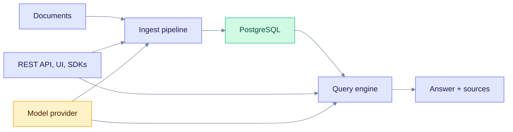

> **Released: v0.32.2** (schema 168) · **On main: v0.33.0 in progress** (schema 169) · Contract: [`openapi.snapshot.json`](../edgequake_webui/openapi/openapi.snapshot.json) · Ops: [Ingestion cancel and fairness](ingestion-cancel-and-fairness.md)

# EdgeQuake Documentation

EdgeQuake is a Graph-RAG framework written in Rust. It reads your documents, builds a knowledge graph of the entities and relationships in them, and answers questions using both the graph and vector search. PostgreSQL with pgvector and Apache AGE is required; there is no in-memory mode. Auth is on by default. To turn it off for local work, set `EDGEQUAKE_DEV_MODE=true` (or `EDGEQUAKE_AUTH_DISABLED=true`).

This page is the map. Start with [Getting Started](getting-started/index.md) if you are new.

## How it fits together



Read the chart from the left: the ingest pipeline stores vectors and the graph in PostgreSQL, and the query engine reads them back to answer with sources.

## Documentation index

### Getting started

| Guide | Description | Time |
|-------|-------------|------|
| [Installation](getting-started/installation.md) | Prerequisites and setup | 5 min |
| [Quick Start](getting-started/quick-start.md) | First ingestion and query | 10 min |
| [First ingestion](tutorials/document-ingestion.md) | How the pipeline works | 15 min |
| [Providers](providers/index.md) | Connect a model provider | 5 min |

### Architecture

| Document | Description |
|----------|-------------|
| [Overview](architecture/overview.md) | System design and components |
| [Data flow](architecture/data-flow.md) | Upload, convert, ingest, query |
| [Crate reference](architecture/crates/index.md) | The 15 workspace crates |

### Core concepts

| Concept | Description |
|---------|-------------|
| [Graph-RAG](concepts/graph-rag.md) | Why a knowledge graph helps RAG |
| [Entity extraction](concepts/entity-extraction.md) | How a model finds entities |
| [Knowledge graph](concepts/knowledge-graph.md) | Nodes, edges, communities |
| [Hybrid retrieval](concepts/hybrid-retrieval.md) | Vector and graph search together |
| [Decision extraction](concepts/decision-extraction.md) | Preview: closed-question extraction |

### Deep dives

| Article | Description |
|---------|-------------|
| [Data layer](deep-dives/data-layer.md) | Postgres, KV, AGE, pgvector, full-text search |
| [LightRAG algorithm](deep-dives/lightrag-algorithm.md) | Extraction, graph, retrieval |
| [Query modes](deep-dives/query-modes.md) | The six modes and their trade-offs |
| [Pipeline progress](deep-dives/pipeline-progress.md) | WebSocket and SSE progress |
| [PDF processing](deep-dives/pdf-processing.md) | Vision and EdgeParse extraction |
| [Entity normalization](deep-dives/entity-normalization.md) | Deduplication and merging |
| [Gleaning](deep-dives/gleaning.md) | Multi-pass extraction |
| [Entity extraction](deep-dives/entity-extraction.md) | The extraction pipeline |
| [Community detection](deep-dives/community-detection.md) | Louvain clustering |
| [Chunking strategies](deep-dives/chunking-strategies.md) | Token-based segmentation |
| [Embedding models](deep-dives/embedding-models.md) | Model choice and dimensions |
| [Graph storage](deep-dives/graph-storage.md) | Apache AGE property graph |
| [Vector storage](deep-dives/vector-storage.md) | pgvector HNSW and halfvec |
| [Cost tracking](deep-dives/cost-tracking.md) | Model cost monitoring |

### Comparisons

| Comparison | Key insight |
|------------|-------------|
| [vs LightRAG (Python)](comparisons/vs-lightrag-python.md) | Performance and design differences |
| [vs GraphRAG](comparisons/vs-graphrag.md) | Microsoft's approach |
| [vs traditional RAG](comparisons/vs-traditional-rag.md) | Why graphs matter |

### Tutorials

| Tutorial | Description |
|----------|-------------|
| [Building your first RAG app](tutorials/first-rag-app.md) | End to end |
| [PDF ingestion](tutorials/pdf-ingestion.md) | Upload and configuration |
| [Multi-tenant setup](tutorials/multi-tenant.md) | Workspace isolation |
| [Document ingestion](tutorials/document-ingestion.md) | Upload and processing |
| [Migration from LightRAG](tutorials/migration-from-lightrag.md) | Python to Rust |
| [Knowledge injection](tutorials/knowledge-injection.md) | Manual entity and relationship edits |
| [Query optimization](tutorials/query-optimization.md) | Mode and filter tuning |
| [Tracing entity sources](tutorials/tracing-entity-sources.md) | Lineage and provenance |

### Integrations and SDKs

| Guide | Description |
|-------|-------------|
| [Open WebUI](integrations/open-webui.md) | Chat interface with Ollama emulation |
| [LangChain](integrations/langchain.md) | Retriever and agent integration |
| [Custom clients](integrations/custom-clients.md) | Plain HTTP |
| [SDK index](sdks/README.md) | Python, TypeScript, Rust, Go, Java, Kotlin, Swift, C#, Ruby, PHP |
| [SDK assessment](sdks/BRUTAL-ASSESSMENT.md) | Parity gaps and tiers |

SDK packages carry their own version numbers. They do not match the product version.

### API reference

| API | Description |
|-----|-------------|
| [REST API](api-reference/rest-api.md) | Guided overlay and key endpoints |
| [Extended API](api-reference/extended-api.md) | Tasks, progress, cancel, metrics |
| [Document upload quick reference](api-reference/document-upload-quick-reference.md) | Text, PDF, batch |
| [Lineage endpoints](api-reference/lineage-endpoints.md) | Provenance and source tracing |
| OpenAPI snapshot | [`openapi.snapshot.json`](../edgequake_webui/openapi/openapi.snapshot.json) |

### Reference

| Resource | Description |
|----------|-------------|
| [Cookbook](cookbook.md) | Recipes |
| [FAQ](faq.md) | Common questions |
| [Product limits](product-limits.md) | Sizing and scale limits |
| [Feature registry](features.md) | Feature IDs grounded in code |
| [Environment variable reference](operations/env-reference.md) | Hand-maintained; every variable is checked against the registry |
| [Changelog](../CHANGELOG.md) | Release history |

### Operations

| Guide | Description |
|-------|-------------|
| [Docker quickstart](operations/docker-quickstart.md) | GHCR images, one-command stack |
| [Deployment](operations/deployment.md) | Production deployment |
| [Configuration](operations/configuration.md) | Env vars and model catalog |
| [Upgrading](operations/upgrading.md) | Schema train and `edgequake migrate` |
| [Runtime auth hardening](operations/runtime-auth-hardening.md) | Auth on by default, bootstrap admin |
| [Ingestion cancel and fairness](ingestion-cancel-and-fairness.md) | Claim and lease, cancel, replicas |
| [Release and CD](operations/release-and-cd.md) | Tag, GHCR, quality gates |
| [Monitoring](operations/monitoring.md) | Health, ready, metrics |
| [Performance tuning](operations/performance-tuning.md) | Optimization guide |
| [Metadata debugging](operations/metadata-debugging.md) | Document status fields |
| [Operations overview](operations/index.md) | Local and CI operating model |
| [Observability](OBSERVABILITY.md) | OpenTelemetry and tracing |
| [Langfuse 3.1](operations/langfuse-3.1.md) | Native ingestion fallback (no OTLP) |
| [SQLx offline mode](sqlx-offline-mode.md) | Offline query metadata |
| [Migrate to v0.23](operations/migrate-to-0.23.md) | Historical fresh-install versus upgrade note |
| [SPEC-083 improvements](../specs/083-improvements/README.md) | Defect register and roadmap |
| [Production `eq_*` incident](../specs/083-improvements/INCIDENT-PROD-DIAGNOSIS.md) | Schema readiness and maintenance |

### Security and troubleshooting

| Guide | Description |
|-------|-------------|
| [Security best practices](security/best-practices.md) | Guidelines |
| [Common issues](troubleshooting/common-issues.md) | Debugging guide |

## Quick links

| Goal | Go to |
|------|-------|
| Get running in 5 minutes | [Quick Start](getting-started/quick-start.md) |
| Pin Docker images to a version | [Docker quickstart](operations/docker-quickstart.md) |
| Cancel, claim, lease behaviour | [Ingestion cancel and fairness](ingestion-cancel-and-fairness.md) |
| See the API contract | [OpenAPI snapshot](../edgequake_webui/openapi/openapi.snapshot.json) |
| Use an official SDK | [SDKs](sdks/README.md) |
| Deploy to production | [Deployment](operations/deployment.md) |

## Technology stack

| Layer | Technology |
|-------|-----------|
| Backend | Rust 1.95, Axum, SQLx, Tokio (15 workspace crates) |
| Frontend | Next.js 16, React 19 |
| Storage | PostgreSQL 16, 17 or 18; pgvector 0.8.5; Apache AGE 1.6, 1.7 or 1.8 (matching the PostgreSQL major version) |
| Images | `ghcr.io/raphaelmansuy/edgequake`, `edgequake-frontend`, `edgequake-postgres` |

## One-line start

Clone and run from source. This uses Ollama if no `OPENAI_API_KEY` is set:

```bash
git clone https://github.com/raphaelmansuy/edgequake.git && cd edgequake && make dev
```

Or pull prebuilt images:

```bash
EDGEQUAKE_VERSION=0.32.2 docker compose -f docker-compose.quickstart.yml up -d
```

| Start method | API | Web UI |
|--------------|-----|--------|
| `make dev` | <http://localhost:8090> | <http://localhost:3010> |
| Docker quickstart | <http://localhost:8080> | <http://localhost:3000> |

## License and links

- License: Apache-2.0
- [GitHub](https://github.com/raphaelmansuy/edgequake)
- [Releases](https://github.com/raphaelmansuy/edgequake/releases)
- [LightRAG paper](https://arxiv.org/abs/2410.05779)
