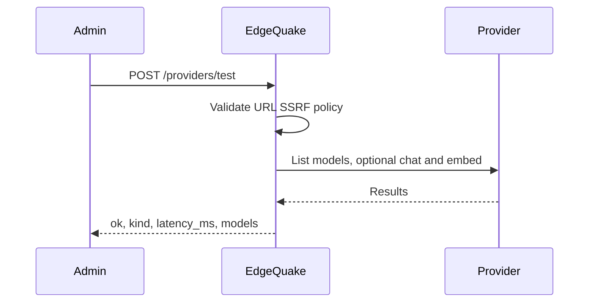

# Connections and provider test

This page covers the **v0.33.0** (SPEC-163) endpoints that store LLM provider endpoints, probe them before you save a key, and route workspace roles through a saved Connection. It is for operators and admins who configure providers. Product pin is still **v0.32.2**; these routes ship with **v0.33.0**. Upgrade notes: [Upgrade to 0.33.0](../operations/upgrade-to-0.33.0.md).

Auth: every Connections and probe route requires an **admin** JWT or API key (`ApiRequireAdmin`). Send `Authorization: Bearer <token>`. See [Provider security](../providers/security.md).

## What a Connection is

A Connection is a named provider endpoint stored in PostgreSQL (migration 169, table `provider_connections`). The API key is encrypted with `EDGEQUAKE_SECRETS_KEY`. The list endpoint also shows env-backed rows (for example from `OLLAMA_HOST`) with `source: "env"` and a nil UUID; those are read-only.

| Field | Description |
|-------|-------------|
| `slug` | Unique name within a tenant (unique with `tenant_id`) |
| `display_name` | Label for the UI |
| `api_shape` | Wire format: `ollama`, `openai_chat`, `anthropic_messages`, or a native provider id |
| `base_url` | Provider base URL (http or https) |
| `locality` | `local` or `cloud`. Default: `local` when `api_shape` looks like a local provider, else `cloud` |
| `auth_scheme` | `none`, `bearer` or `x_api_key` (default `none`) |
| `api_key` | Write-only. Never returned. Requires `EDGEQUAKE_SECRETS_KEY` |
| `timeout_secs` | Default 120 |
| `allow_private_network` | Allow loopback and private IPs. Defaults to true when `locality` is `local` |
| `tenant_id` | Optional UUID. Omit for a server-wide row |

Response view (never includes the key): `id`, `tenant_id`, `slug`, `display_name`, `api_shape`, `locality`, `base_url`, `auth_scheme`, `key_fingerprint`, `key_configured`, `timeout_secs`, `allow_private_network`, `source` (`db` or `env`), `last_test_ok`, `last_test_error`.

## Endpoints

| Method | Path | Success |
|--------|------|---------|
| GET | `/api/v1/connections` | 200 array of Connection views |
| POST | `/api/v1/connections` | 201 created view |
| PUT | `/api/v1/connections/{id}` | 200 updated view |
| DELETE | `/api/v1/connections/{id}` | 204 |
| POST | `/api/v1/connections/{id}/test` | 200 probe result (updates `last_test_*`) |
| POST | `/api/v1/providers/test` | 200 probe result (no storage) |

All of these need PostgreSQL except `GET /connections` (env rows still appear) and `POST /providers/test`. Without PostgreSQL, create/update/delete/test-stored return 503.

```bash
# Create
curl -s -X POST http://localhost:8080/api/v1/connections \
  -H "Authorization: Bearer $TOKEN" \
  -H "Content-Type: application/json" \
  -d '{
    "slug": "my-ollama",
    "display_name": "Ollama",
    "api_shape": "ollama",
    "base_url": "http://127.0.0.1:11434",
    "locality": "local"
  }'
```

```json
{
  "id": "11111111-1111-1111-1111-111111111111",
  "tenant_id": null,
  "slug": "my-ollama",
  "display_name": "Ollama",
  "api_shape": "ollama",
  "locality": "local",
  "base_url": "http://127.0.0.1:11434",
  "auth_scheme": "none",
  "key_fingerprint": null,
  "key_configured": false,
  "timeout_secs": 120,
  "allow_private_network": true,
  "source": "db",
  "last_test_ok": null,
  "last_test_error": null
}
```

Omit `api_key` on PUT to keep the stored key. Send a new value to replace it. Empty string is ignored. Storing a key without `EDGEQUAKE_SECRETS_KEY` returns 400.

## Probe a provider

`POST /api/v1/providers/test` checks reachability, lists models, and optionally tries chat and embed. It does not save anything. Use it from the first-run wizard or before creating a Connection.



Read it top to bottom. The server refuses dangerous URLs first, then talks to the provider, then returns a structured result.

```bash
curl -s -X POST http://localhost:8080/api/v1/providers/test \
  -H "Authorization: Bearer $TOKEN" \
  -H "Content-Type: application/json" \
  -d '{
    "shape": "ollama",
    "base_url": "http://127.0.0.1:11434",
    "model": "gemma3:latest"
  }'
```

```json
{
  "ok": true,
  "kind": "ok",
  "latency_ms": 42,
  "message": "reachable",
  "models": ["gemma3:latest", "embeddinggemma:latest"],
  "embedding_dimension": null,
  "chat_ok": true,
  "embed_ok": false,
  "list_ok": true
}
```

| Body field | Notes |
|------------|-------|
| `shape` | Required. Same values as `api_shape`. Local shapes get a default URL when `base_url` is omitted (for example Ollama → `http://127.0.0.1:11434`). |
| `base_url` | Required for cloud shapes |
| `model`, `embedding_model` | Optional models to exercise |
| `api_key`, `auth_scheme` | Credentials for the probe only |
| `allow_private_network` | Override SSRF private-IP policy |
| `expected_dimension` | Fail with `dim_mismatch` when the embedding size differs |

`kind` values (snake_case): `ok`, `unreachable`, `unauthorized`, `model_not_found`, `dim_mismatch`, `shape_mismatch`, `ssrf_denied`, `invalid_url`.

`POST /connections/{id}/test` runs the same probe with the stored URL and decrypted key, then writes `last_test_ok` and `last_test_error`.

## SSRF rules

Every create, update and probe validates `base_url`:

- Scheme must be `http` or `https`.
- Blocked hosts and obfuscated IPs are rejected.
- Private and loopback addresses need `locality=local` (or `allow_private_network=true`). Cloud connections to `127.0.0.1` fail with `ssrf_denied`.

See [Provider security](../providers/security.md).

## Per-role routing

Point a workspace role at a Connection by setting `connection_id` in `llm_roles`. Only some roles use Connections today (`extract` and `query`). Details: [Model roles](../providers/roles.md).

```bash
curl -s -X PUT http://localhost:8080/api/v1/workspaces/$WORKSPACE_ID \
  -H "Authorization: Bearer $TOKEN" \
  -H "Content-Type: application/json" \
  -d '{
    "llm_roles": {
      "query": {
        "provider": "openai-compatible",
        "model": "my-model",
        "connection_id": "11111111-1111-1111-1111-111111111111"
      }
    }
  }'
```

If `connection_id` is invalid, the row is missing, PostgreSQL is down, or the client cannot be built, EdgeQuake falls back silently to the next provider choice. Check `/health` and **Test connection** when answers come from the wrong model.

## Health and doctor

`GET /health` (public) now includes `security_posture` and a live probe for local LLM providers:

```json
{
  "status": "healthy",
  "components": { "llm_provider": true },
  "security_posture": {
    "auth_enabled": false,
    "dev_mode": true,
    "secrets_key_configured": true,
    "jwt_secret_is_default": true,
    "rate_limit_enabled": false,
    "swagger_enabled": true
  }
}
```

`status` becomes `degraded` when a local LLM does not answer the probe. Full field list: [REST API: Health](rest-api.md#health).

CLI preflight (no server required for the check itself):

```bash
edgequake doctor
edgequake doctor --json
```

Exit codes: `0` all required checks passed, `1` database check failed, `2` other failures (warnings). Checks include `DATABASE_URL`, secrets key, JWT secret and related env.

## Known behaviour to watch

These are implementation facts, not documentation workarounds:

- `GET /connections` and `POST /providers/test` are not filtered by the caller's tenant. Scope with care in multi-tenant installs.
- Omitting `tenant_id` on PUT writes `null` (it does not leave the previous value).
- A duplicate `(tenant_id, slug)` currently surfaces as a 500 from the database unique constraint rather than a clean 409.
- `locality` default is keyed on `api_shape`, not on the provider slug.

None of the published SDKs wrap these routes yet. Call them with raw HTTP (see [Custom clients](../integrations/custom-clients.md)).

Related: [Providers](../providers/index.md), [Environment reference](../operations/env-reference.md), [Upgrade to 0.33.0](../operations/upgrade-to-0.33.0.md).
