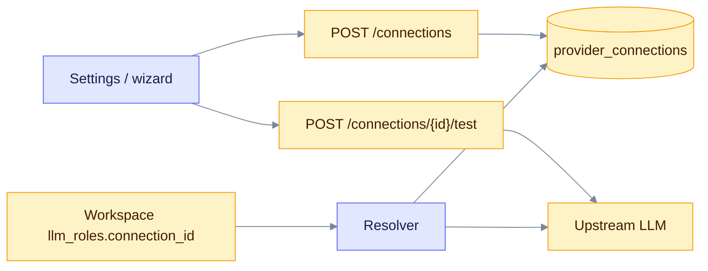

# Connections and provider test

This page covers the **v0.33.0** provider APIs. Use them to save an LLM endpoint once, test that it answers, and point each workspace model role at it. Product pin for the rest of the API is still **v0.32.2**; these routes ship with schema train **169**.

Admin role required on every route below (`ApiRequireAdmin`). When auth is off, the server treats the default user as admin.

Related: [Providers guide](../providers/index.md) · [Model roles](../providers/roles.md) · [Security](../providers/security.md) · [Extended API](extended-api.md)

## How the pieces fit



Read left to right: you save a connection, probe it, then attach its id to a workspace role. At query or extract time the resolver loads the row, decrypts the key, and builds the client.

## Shapes and auth schemes

| `api_shape` / `shape` | Typical base URL | Notes |
|---|---|---|
| `openai_chat` | `https://api.openai.com/v1` or any OpenAI-compatible host | Chat Completions |
| `anthropic_messages` | `https://api.anthropic.com` | Messages API |
| `ollama` | `http://host.docker.internal:11434` | Native Ollama |
| Native ids (`openai`, `anthropic`, `lmstudio`, `omlx`, …) | See [providers](../providers/index.md) | Resolved like env providers |

| `auth_scheme` | Header sent |
|---|---|
| `none` | No key |
| `bearer` | `Authorization: Bearer …` |
| `x_api_key` | `x-api-key: …` |

Keys are write-only. The API returns `key_configured` and a short `key_fingerprint`, never the plaintext. Storing a key needs `EDGEQUAKE_SECRETS_KEY` (AES-256-GCM).

## List connections

`GET /api/v1/connections`

Returns database rows plus read-only **env** connections derived from process environment (`OLLAMA_HOST`, `OPENAI_COMPATIBLE_BASE_URL`, `OMLX_HOST` / `OMLX_BASE_URL`, `ANTHROPIC_BASE_URL`, `LMSTUDIO_HOST`). Env rows use a nil UUID and `source: "env"`.

```bash
curl -s http://localhost:8080/api/v1/connections \
  -H "Authorization: Bearer $TOKEN" | jq .
```

Response item (`ConnectionView`):

| Field | Meaning |
|---|---|
| `id` | Connection UUID (nil for env) |
| `tenant_id` | Optional tenant scope |
| `slug`, `display_name` | Stable id and label |
| `api_shape`, `locality`, `base_url`, `auth_scheme` | How to call it |
| `key_fingerprint`, `key_configured` | Key presence without revealing the secret |
| `timeout_secs`, `allow_private_network` | Client limits and SSRF policy |
| `source` | `"db"` or `"env"` |
| `last_test_ok`, `last_test_error` | Last probe result, if any |

## Create connection

`POST /api/v1/connections` → `201`

```bash
curl -s -X POST http://localhost:8080/api/v1/connections \
  -H "Authorization: Bearer $TOKEN" \
  -H "Content-Type: application/json" \
  -d '{
    "slug": "ollama-local",
    "display_name": "Ollama on this machine",
    "api_shape": "ollama",
    "base_url": "http://host.docker.internal:11434",
    "locality": "local",
    "auth_scheme": "none",
    "allow_private_network": true
  }'
```

Body (`UpsertConnection`): `slug`, `display_name`, `api_shape`, `base_url` required. Optional: `locality`, `auth_scheme`, `api_key`, `timeout_secs` (default 120), `allow_private_network`, `tenant_id`.

The server validates `base_url` with the SSRF policy before insert. Private/loopback hosts need `allow_private_network: true` (default when `locality` is `local`).

## Update connection

`PUT /api/v1/connections/{id}` → `200`

Same body as create. Omit `api_key` (or send empty) to keep the stored key. Sending a new key re-encrypts it.

## Delete connection

`DELETE /api/v1/connections/{id}` → `204`

Returns `404` if the id is unknown. Does not cascade-clear workspace `llm_roles.connection_id` references; update those roles separately.

## Test a stored connection

`POST /api/v1/connections/{id}/test` → `200` (`ProbeResponse`)

Decrypts the stored key, probes the upstream, and writes `last_test_ok` / `last_test_error` on the row.

```bash
curl -s -X POST "http://localhost:8080/api/v1/connections/$ID/test" \
  -H "Authorization: Bearer $TOKEN" | jq .
```

## Ad-hoc provider test

`POST /api/v1/providers/test` → `200` (`ProbeResponse`)

Probes an endpoint without saving it. Useful from the first-run wizard.

```bash
curl -s -X POST http://localhost:8080/api/v1/providers/test \
  -H "Authorization: Bearer $TOKEN" \
  -H "Content-Type: application/json" \
  -d '{
    "shape": "ollama",
    "base_url": "http://host.docker.internal:11434",
    "model": "gemma3:latest",
    "allow_private_network": true
  }'
```

| Request field | Meaning |
|---|---|
| `shape` | Same values as `api_shape` |
| `base_url` | Required except when a local default exists for the shape |
| `model`, `embedding_model` | Optional; defaults apply per shape |
| `api_key`, `auth_scheme` | Optional credentials |
| `allow_private_network` | Allow private/loopback targets |
| `expected_dimension` | If set, embed probe must match this size |

| Response field | Meaning |
|---|---|
| `ok` | Overall success |
| `kind` | Error kind when not ok (`ok`, `unreachable`, `auth`, `dim_mismatch`, …) |
| `latency_ms` | Wall time |
| `message` | Human-readable detail |
| `models` | Models listed by the upstream, when available |
| `embedding_dimension` | Measured embed size, if probed |
| `chat_ok`, `embed_ok`, `list_ok` | Per-capability flags |

## Per-role routing

Workspace metadata `llm_roles.<role>.connection_id` points at a saved connection UUID. Roles: `extract`, `query`, `keyword`, `summary`, `embedding`, `vision`, `reranker`, `decision`.

```bash
curl -s -X PATCH "http://localhost:8080/api/v1/workspaces/$WS" \
  -H "Authorization: Bearer $TOKEN" \
  -H "Content-Type: application/json" \
  -d '{
    "metadata": {
      "llm_roles": {
        "extract": {
          "provider": "ollama",
          "model": "gemma3:latest",
          "connection_id": "'"$ID"'"
        }
      }
    }
  }'
```

Merge rules for `llm_roles` are documented in [Extended API](extended-api.md). See also [Model roles](../providers/roles.md).

## CLI: `edgequake doctor`

Not an HTTP route. Prints preflight checks (database, schema, secrets key, provider reachability posture) and exits `0` (ok), `1` (fail), or `2` (warn). Prefer this before opening the UI on a new install.

```bash
edgequake doctor
edgequake doctor --json
```

## Honest health

`GET /health` includes provider reachability and security posture fields used by the WebUI banner. Prefer it over guessing whether Ollama or a cloud key is live.
