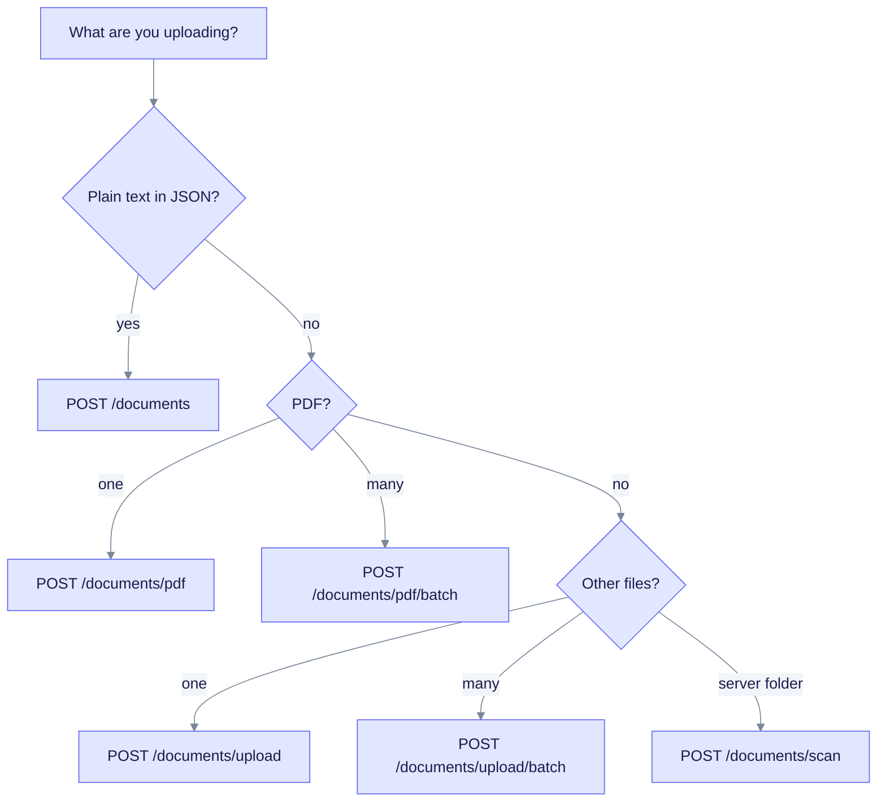
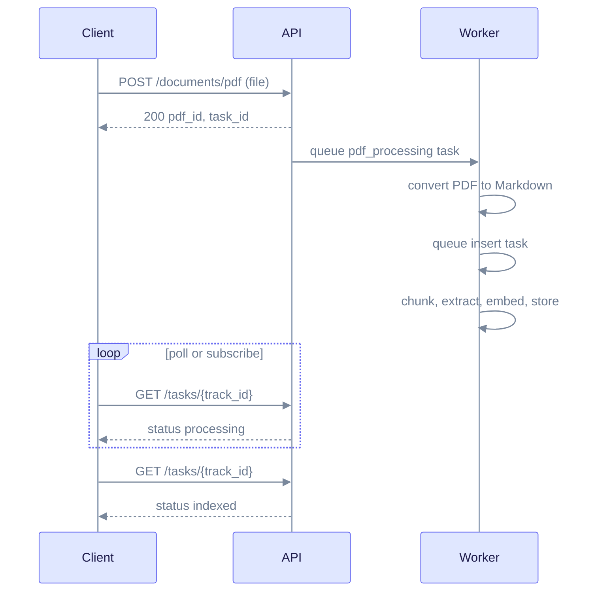

# Document Upload Quick Reference

This page helps you choose the right upload endpoint and shows how to follow a document from upload to "searchable". It is for developers who ingest content over HTTP.

Examples assume `http://localhost:8080`, `EDGEQUAKE_DEV_MODE=true` (auth off), and a `WORKSPACE_ID` shell variable. With auth on, add `Authorization: Bearer <token>`. See [REST API conventions](rest-api.md#conventions).

## Pick an endpoint



Follow the questions top to bottom to land on one endpoint. All paths start with `/api/v1`.

| Endpoint | Body | Success | Returns |
|----------|------|---------|---------|
| `POST /documents` | JSON | 202 | `document_id`, `task_id`, `track_id` |
| `POST /documents/upload` | multipart | 202 | `document_id`, `task_id`, `track_id`, `content_hash` |
| `POST /documents/upload/batch` | multipart | 202 | per-file `document_id` and status |
| `POST /documents/pdf` | multipart | **200** | `pdf_id`, `task_id` (`pdf-<uuid>`) |
| `POST /documents/pdf/batch` | multipart | 200 | per-file `pdf_id`, `task_id` |
| `POST /documents/scan` | JSON | 200 | `track_id`, queued file paths |

Every upload is queued. There is no synchronous mode. The size limit is 50 MiB per file (413 above that).

## What happens after you upload



Read it top to bottom. For a PDF the work has two parts: convert to Markdown, then ingest the text.

For text and file uploads, the response `track_id` and `task_id` hold the same value. Use it with `GET /api/v1/tasks/{track_id}`, and for cancel and retry. PDF uploads return `track_id: null`, so use the `task_id` (format `pdf-<uuid>`) and the PDF progress routes below. The `track_id` you send is only a label for grouping.

Track progress with one of these:

| Method | Route | Notes |
|--------|-------|-------|
| Poll task | `GET /api/v1/tasks/{track_id}` | `status`: `pending`, `processing`, `indexed`, `failed`, `cancelled` |
| Poll ingest progress | `GET /api/v1/ingestion/{track_id}/progress` | Stage, percentage, counts |
| Poll PDF progress | `GET /api/v1/documents/pdf/progress/{track_id}` | Per-phase progress for PDFs |
| Server-Sent Events | `GET /api/v1/documents/pdf/progress/stream/{track_id}` | PDF progress stream |
| WebSocket | `GET /ws/progress/{track_id}` | Live events, can send `cancel` |
| Batch poll | `POST /api/v1/ingestion/progress` with `{"track_ids":[...]}` | Many tracks at once |

Event formats are in [Extended API: progress streams](extended-api.md#progress-streams). Task and document states are in [Extended API: lifecycle](extended-api.md#lifecycle).

## Text or JSON: POST /documents

```bash
curl -s -X POST http://localhost:8080/api/v1/documents \
  -H "Content-Type: application/json" \
  -H "X-Workspace-ID: $WORKSPACE_ID" \
  -d '{"content":"Marie Curie won two Nobel Prizes.","title":"Curie notes","metadata":{"source":"wiki"}}'
```

```json
{
  "document_id": "5b1f6c0e-...",
  "track_id": "9c7a41d2-...",
  "task_id": "9c7a41d2-...",
  "status": "pending",
  "queue_position": 1,
  "eta_seconds": null,
  "eta_basis": "no_history"
}
```

| Field | Required | Description |
|-------|----------|-------------|
| `content` | yes | Document text |
| `title` | no | Display title |
| `metadata` | no | Free-form object |
| `track_id` | no | Your own grouping label. The response `track_id` always equals `task_id`. |
| `chunk_strategy` | no | `fixed`, `recursive` or `markdown` |
| `chunk_options` | no | Size, overlap and separator overrides |
| `enable_gleaning`, `max_gleaning` | no | Extra extraction passes |
| `use_llm_summarization` | no | LLM-written merged descriptions |
| `extraction_mode`, `decision_gate_preset` | no | See [extraction mode](#extraction-mode) |
| `extract_max_entities`, `extract_max_records` | no | Per-upload caps |

## One file: POST /documents/upload

Use it for `txt`, `md`, `json`, `csv`, `html`, `htm`, `xml`, `yaml` and `yml`, and for images (`png`, `jpg`, `jpeg`, `gif`, `webp`), which go through a vision model. A PDF works here, but prefer `/documents/pdf`.

```bash
curl -s -X POST http://localhost:8080/api/v1/documents/upload \
  -H "X-Workspace-ID: $WORKSPACE_ID" \
  -F "file=@notes.md" \
  -F 'metadata={"category":"finance"}'
```

Multipart fields: `file` (required), `metadata` (JSON string), `chunk_strategy`, `chunk_options` (JSON string), `extract_max_entities`, `extract_max_records`, `extraction_mode`, `decision_gate_preset`. The title is taken from the file name.

Response fields include `document_id`, `filename`, `size`, `content_hash`, `is_duplicate`, `status`, `task_id`, `track_id`.

A file whose content is already stored returns **200** with `is_duplicate: true`, not 409. Errors: 400 (no file or unsupported type) and 413 (too large).

## Many files: POST /documents/upload/batch

```bash
curl -s -X POST http://localhost:8080/api/v1/documents/upload/batch \
  -H "X-Workspace-ID: $WORKSPACE_ID" \
  -F "files=@a.txt" -F "files=@b.md"
```

```json
{
  "total_files": 2,
  "processed": 1,
  "duplicates": 1,
  "failed": 0,
  "results": [
    { "filename": "a.txt", "document_id": "d1...", "status": "pending" },
    { "filename": "b.md", "document_id": "d0...", "status": "duplicate" }
  ]
}
```

Each result has `status` `pending` (queued), `duplicate` or `failed`. A PDF in this batch fails for that file with a message that points you to `/documents/pdf`. Batch results do not include a `task_id`; poll `GET /api/v1/documents/{document_id}` or list documents instead.

## PDFs: POST /documents/pdf

This is the preferred path for PDFs. It converts pages to Markdown, then ingests the Markdown.

```bash
curl -s -X POST http://localhost:8080/api/v1/documents/pdf \
  -H "X-Workspace-ID: $WORKSPACE_ID" \
  -F "file=@paper.pdf" \
  -F "title=My paper" \
  -F "pdf_parser_backend=edgeparse"
```

```json
{
  "pdf_id": "7d2e...",
  "document_id": "5b1f...",
  "task_id": "pdf-7d2e...",
  "track_id": null,
  "status": "queued",
  "message": "PDF uploaded successfully. Processing in background.",
  "estimated_time_seconds": 120,
  "metadata": {
    "filename": "paper.pdf",
    "file_size_bytes": 1048576,
    "page_count": null,
    "sha256_checksum": "ab12...",
    "vision_enabled": true,
    "vision_model": null
  }
}
```

| Multipart field | Description |
|-----------------|-------------|
| `file` | The PDF (required) |
| `pdf_parser_backend` | `vision`, `edgeparse`, `edgeparse-ocr` or `auto` |
| `enable_vision`, `vision_provider`, `vision_model`, `vision_reasoning_effort` | Vision model selection |
| `vision_extract_images`, `vision_extract_charts`, `vision_extract_figures` | Describe images, charts or figures |
| `vision_page_system_prompt`, `vision_image_system_prompt`, `vision_chart_system_prompt`, `vision_figure_system_prompt` | Prompt overrides |
| `title`, `metadata`, `track_id` | Labels |
| `force_reindex` | Re-process a duplicate (`true`/`false`) |
| `process_options` | Advanced options string |

The `document_id` is reserved at upload time. A duplicate PDF returns 200 with `status: "duplicate"`. The `duplicate_of` field appears in batch results, not at the top level of a single upload.

Errors: 400 (bad request), 413 (too large), 500 (server error). 409 is returned only for state conflicts, such as a PDF that is already being reprocessed. The PDF routes do not read a request `extraction_mode` field; they use the workspace or server setting, and the response reports which one applied.

Batch version: `POST /documents/pdf/batch` with repeated `files` fields plus the same options. It returns `{ total_files, accepted, duplicates, failed, results[] }`, where each result has `filename`, `status` (`processing`, `duplicate`, `reindexing`, `failed`), `pdf_id`, `task_id`, `duplicate_of` and `error`.

Other PDF routes: `GET /documents/pdf` (list), `GET /documents/pdf/{pdf_id}`, `DELETE /documents/pdf/{pdf_id}`, `GET .../content`, `GET .../download` (supports byte ranges), `POST .../retry`, `DELETE .../cancel`. To convert a PDF without storing it, use [`POST /parse`](rest-api.md#parse).

## Directory scan: POST /documents/scan

The server reads files from a path **on the server's disk**. The path must be inside a directory the server allows (this blocks path traversal). Use it for bulk imports.

```bash
curl -s -X POST http://localhost:8080/api/v1/documents/scan \
  -H "Content-Type: application/json" \
  -d '{"path":"/data/docs","recursive":true,"extensions":["txt","md"],"max_files":500}'
```

```json
{
  "track_id": "scan_20261009_100000_ab12cd34",
  "files_found": 10,
  "files_queued": 8,
  "files_skipped": 2,
  "queued_files": ["/data/docs/a.txt"],
  "skipped_files": [{ "path": "/data/docs/b.txt", "reason": "duplicate" }]
}
```

Errors:

| Status | Cause |
|--------|-------|
| 400 | Invalid path (traversal pattern, symlink, too deep) or not a directory |
| 403 | Path is outside the allowed directories |
| 404 | Directory does not exist |

## Extraction mode

`extraction_mode` chooses how entities are extracted: `llm` (default), `decision` (local decision model), or `inherit`. It is read on `POST /documents`, `/documents/upload` and `/documents/upload/batch`. Omit it and the document follows the workspace, then `EDGEQUAKE_EXTRACTION_MODE`, then `llm`. The response echoes `extraction_mode` and `extraction_mode_source`. A `decision` upload with no reachable decision backend returns 422. See [Decision extraction](../concepts/decision-extraction.md).

## Common mistakes

| Symptom | Cause | Fix |
|---------|-------|-----|
| 415 or "Expected request with `Content-Type: application/json`" | You sent a file with `-F` to `/documents` | Use `/documents/upload` for files |
| "Failed to parse the request body as JSON" | You sent form data to a JSON route | Use `-H "Content-Type: application/json" -d '{...}'` |
| "missing field `content`" | JSON body without `content` | Add `content` |
| Upload returns 200 with `is_duplicate: true` | Same content is already stored | Check `is_duplicate`. To reprocess a PDF use `force_reindex=true`, or delete the old document. |
| PDF fails in `/upload/batch` | PDFs are rejected there | Use `/documents/pdf/batch` |

## Good habits

1. Save the task key from every upload. For text and file uploads it is `track_id` (equal to `task_id`). For PDFs it is `task_id`. It is the key for progress, cancel and retry.
2. Cancel with `POST /api/v1/tasks/{track_id}/cancel`. See [Ingestion cancel and fairness](../ingestion-cancel-and-fairness.md).
3. Subscribe to progress before long PDF conversions.
4. Send the tenant and workspace headers on every call.

Next: [REST API](rest-api.md), [Extended API](extended-api.md), [PDF ingestion tutorial](../tutorials/pdf-ingestion.md), [Troubleshooting](../troubleshooting/common-issues.md).
