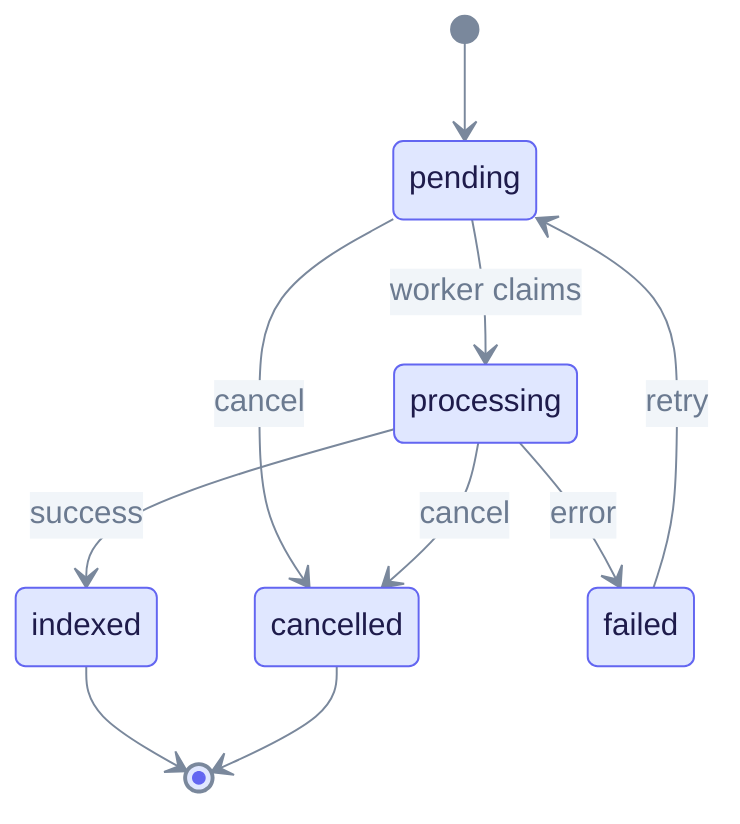
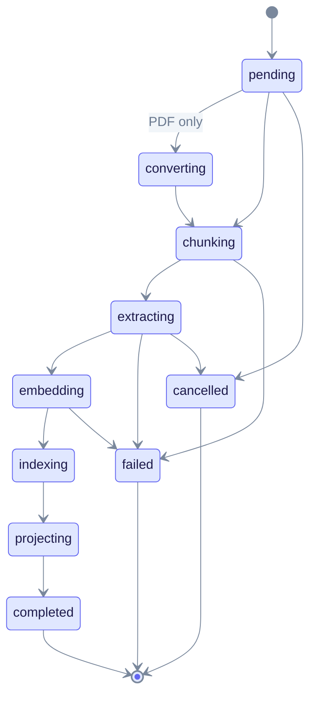
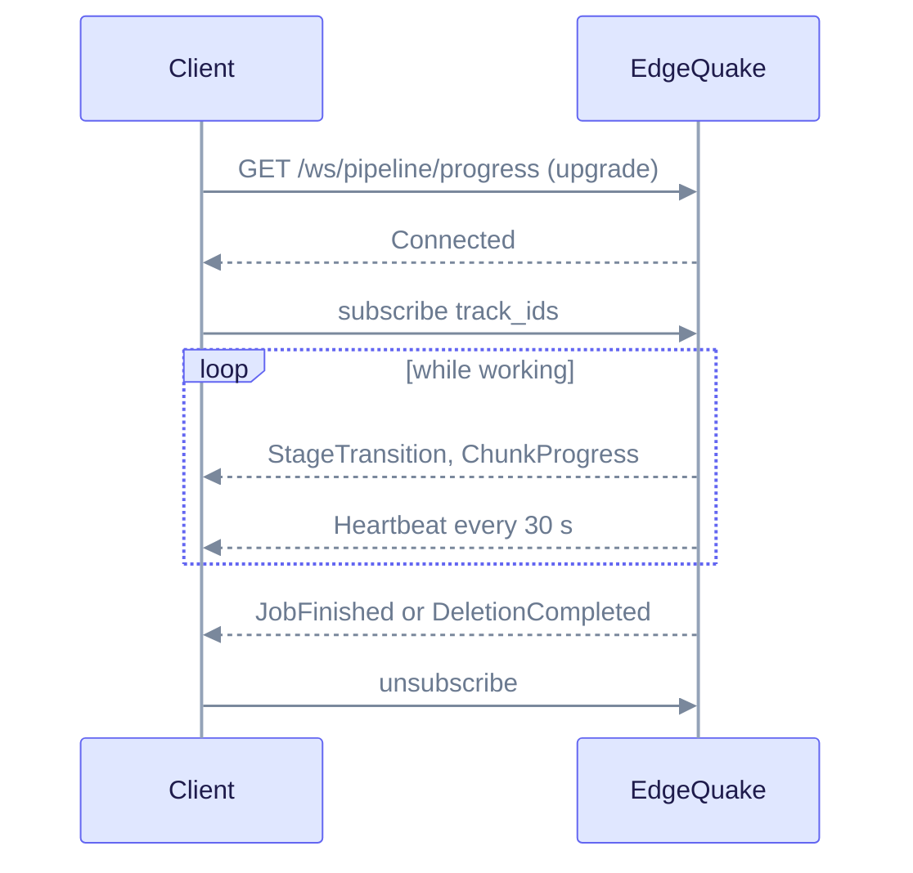

# Extended API Reference

This page covers the operational side of the API: background tasks, live progress, pipeline health, cost tracking, tenants and workspaces, and the Ollama-compatible endpoints. It is for developers who build dashboards, automate ingestion, or manage multi-tenant setups. Read [REST API](rest-api.md#conventions) first for auth, headers and error format.

All paths are under `/api/v1` unless noted. Examples use `http://localhost:8080`.

## Lifecycle

A **task** is a unit of background work (an upload, a PDF conversion, a delete). A **document** has its own status that follows the task through the pipeline stages.

Task states, from `TaskStatus` in the task crate:



Read it left to right. A task starts `pending`, a worker moves it to `processing`, and it ends as `indexed`, `failed` or `cancelled`. Only `failed` tasks can be retried, and a retry puts the task back to `pending`. Cancel works on `pending` and `processing` tasks.

Document statuses show finer steps. The stage names below are what `current_stage` and `status` report.



Read it as the usual path (pending to completed) with failures and cancels branching off. The diagram shows the common transitions. Cancel can also happen from other active stages. `partial_failure` means the document was processed but with problems (for example, no entities were found). Terminal states are `completed` (also reported as `indexed`), `partial_failure`, `failed` and `cancelled`. For badges, prefer the server-computed `display_status` and `ui_phase` on each document.

PDF ingestion has two tasks. First `pdf_processing` converts pages to Markdown (PDF progress phases: `upload`, `pdf_conversion`, `chunking`, `embedding`, `extraction`, `graph_storage`; each phase is `pending`, `active`, `complete`, `failed` or `skipped`). Then an `insert` task ingests the Markdown.

## Tasks

Task types: `upload`, `insert`, `scan`, `reindex`, `pdf_processing`, `knowledge_injection`, `deletion`, `batch_deletion`, `workspace_wipe`.

| Endpoint | Purpose |
|----------|---------|
| `GET /tasks` | List. Query: `status`, `task_type`, `page`, `page_size`, `sort`, `order`. |
| `GET /tasks/{track_id}` | One task (404 if unknown or in another workspace) |
| `POST /tasks/{track_id}/cancel` | Cancel (canonical). 200, 404, 409 when already finished. |
| `POST /tasks/{track_id}/retry` | Retry a failed task. 409 if the task is not `failed`. |
| `GET /documents/track/{track_id}` | All documents that share a client `track_id`, with `status_summary` |

```bash
curl -s "http://localhost:8080/api/v1/tasks?status=processing&page=1&page_size=20" \
  -H "X-Workspace-ID: $WORKSPACE_ID"
```

```json
{
  "tasks": [
    {
      "track_id": "9c7a41d2-...",
      "task_type": "insert",
      "status": "processing",
      "tenant_id": "...",
      "workspace_id": "...",
      "retry_count": 0,
      "max_retries": 3,
      "progress": null,
      "error_message": null,
      "queue_position": null,
      "eta_seconds": null,
      "created_at": "2026-10-09T10:00:00Z",
      "updated_at": "2026-10-09T10:00:05Z"
    }
  ],
  "pagination": { "page": 1, "page_size": 20, "total": 1, "total_pages": 1 },
  "statistics": { "pending": 0, "processing": 1, "indexed": 0, "failed": 0, "cancelled": 0 }
}
```

A failed task includes an `error` object with `message`, `reason`, `step`, `suggestion` and `retryable`. Cancellation is cooperative: the worker stops at the next safe point, so a `processing` task may take a moment to show `cancelled`. See [Ingestion cancel and fairness](../ingestion-cancel-and-fairness.md).

Other cancel routes: `DELETE /documents/pdf/{pdf_id}/cancel` (PDF), `POST /documents/{document_id}/cancel` (works without a live task; idempotent), and `POST /pipeline/cancel` (current pipeline job).

## Progress streams

You can follow a task without polling. Authenticate WebSockets with `Sec-WebSocket-Protocol: edgequake.bearer, <token>` or `?token=`.

| Transport | Route | Scope |
|-----------|-------|-------|
| WebSocket | `GET /ws/progress/{track_id}` | One track. 404 before upgrade when the track is not yours. |
| WebSocket | `GET /ws/pipeline/progress` | Many tracks. Send `{"type":"subscribe","track_ids":[...]}` (max 256). |
| SSE | `GET /api/v1/documents/pdf/progress/stream/{track_id}` | PDF progress |
| Poll | `GET /api/v1/ingestion/{track_id}/progress` | Stage, `progress.completion_percentage`, `counts` (`pages`, `chunks`, `entities`, `relationships`) |
| Poll | `POST /api/v1/ingestion/progress` | Body `{"track_ids":[...]}` |



Read it top to bottom. After the upgrade you tell the server which tracks you care about. It pushes events until the work ends. Commands you can send: `subscribe`, `unsubscribe`, `cancel` (with `track_id`), and `ping`.

Server events are JSON objects shaped `{"type": "<Name>", "data": {...}}`. The names use PascalCase:

| Event | Meaning |
|-------|---------|
| `Connected`, `Heartbeat`, `StatusSnapshot` | Connection and state |
| `JobStarted`, `BatchCompleted`, `JobFinished`, `CancellationRequested` | Job milestones |
| `StageTransition` | Document moved to a new stage (`stage`, `stage_message`, `stage_progress`) |
| `PdfPageProgress` | Page conversion (`page_num`, `total_pages`, `phase`) |
| `ChunkProgress`, `ChunkFailure` | Per-chunk extraction (tokens, cost, ETA) |
| `GraphStorageProgress` | Entities and relationships stored |
| `DocumentProgress`, `DocumentFailed` | Per-document counters |
| `DeletionStarted`, `DeletionPhase`, `DeletionCompleted`, `DeletionFailed` | Single delete (phases: `cancelling_task`, `removing_vectors`, `removing_graph`, `removing_kv`, `finalizing`) |
| `BulkDeletionStarted`, `BulkDeletionItemProgress`, `BulkDeletionCompleted` | Workspace wipe and batch delete |
| `Message` | Log line (`level`, `message`) |

## Pipeline

| Endpoint | Purpose |
|----------|---------|
| `GET /pipeline/status` | Current job, counters, history messages. Query `tenant_id`, `workspace_id`. |
| `GET /pipeline/activity` | `busy`, plus `working`, `queued` documents and active `tasks` |
| `POST /pipeline/cancel` | Ask the current job to stop. 200 even if idle. |
| `GET /pipeline/queue-metrics` | Queue depth and pressure |

```json
{
  "is_busy": true,
  "job_name": "pdf_processing",
  "total_documents": 5,
  "processed_documents": 2,
  "pending_tasks": 3,
  "processing_tasks": 1,
  "completed_tasks": 2,
  "failed_tasks": 0,
  "cancellation_requested": false,
  "latest_message": "Extracting entities...",
  "history_messages": []
}
```

`queue-metrics` returns `pending_count`, `processing_count`, `active_workers`, `max_workers`, `worker_utilization`, `throughput_per_minute`, `avg_wait_time_seconds`, `max_wait_time_seconds`, `estimated_queue_time_seconds`, `pressure` (`normal`, `elevated`, `critical`), `pending_warn_threshold`, `pending_critical_threshold`, `rate_limited`, per-tenant limits and `operator_action` guidance. When pressure is `critical`, `/ready` returns 503.

## Costs

| Endpoint | Purpose |
|----------|---------|
| `GET /pipeline/costs/pricing` | `{ "models": [{ "model", "input_cost_per_1k", "output_cost_per_1k" }] }` |
| `POST /pipeline/costs/estimate` | Body `{"model","input_tokens","output_tokens"}` returns `estimated_cost_usd`, `formatted_cost` |
| `GET /costs/summary` | Workspace totals: `total_cost`, `total_tokens`, `document_count`, `average_cost_per_document`, `by_operation[]`, `budget` |
| `GET /costs/history` | Array of `{timestamp, total_cost, total_tokens, document_count}`. Query `start_date`, `end_date`, `granularity`. |
| `GET`, `PATCH /costs/budget` | `{monthly_budget_usd, alert_threshold, spent_usd, remaining_usd, is_over_budget}` |

See [Cost tracking](../deep-dives/cost-tracking.md).

## Tenants and workspaces

A tenant is an organisation. A workspace is an isolated knowledge base inside a tenant. See [Multi-tenant tutorial](../tutorials/multi-tenant.md).

| Endpoint | Purpose |
|----------|---------|
| `GET`, `POST /tenants` | List (`offset`, `limit`) and create. POST returns 201, or 200 if the slug already exists (idempotent), 409 on conflict. |
| `GET`, `PUT`, `DELETE /tenants/{tenant_id}` | Read, update, delete (204) |
| `GET`, `POST /tenants/{tenant_id}/workspaces` | List (`offset`, `limit`, `include_stats`) and create (201) |
| `GET /tenants/{tenant_id}/workspaces/by-slug/{slug}` | Look up by slug |
| `GET`, `PUT`, `DELETE /workspaces/{workspace_id}` | Read, update, delete (204, cascades all data) |
| `GET /workspaces/{workspace_id}/stats` | Counts |
| `GET /workspaces/{workspace_id}/metrics-history`, `POST .../metrics-snapshot` | Stored snapshots (newest first), manual snapshot (201) |
| `POST /workspaces/{workspace_id}/rebuild-embeddings` | Re-embed after an embedding model change |
| `POST /workspaces/{workspace_id}/rebuild-knowledge-graph` | Re-extract after an LLM change |
| `POST /workspaces/{workspace_id}/reprocess-documents` | Requeue documents |
| `PATCH /admin/tenants/{tenant_id}/quota` | Admin: set `max_workspaces` |

Create a workspace:

```bash
curl -s -X POST http://localhost:8080/api/v1/tenants/$TENANT_ID/workspaces \
  -H "Content-Type: application/json" \
  -d '{"name":"Research","llm_provider":"ollama","llm_model":"gemma3:latest","embedding_provider":"ollama","embedding_model":"embeddinggemma:latest"}'
```

Main workspace fields: `name`, `slug`, `description`, `llm_provider`, `llm_model`, `embedding_provider`, `embedding_model`, `embedding_dimension`, `vision_llm_provider`, `vision_llm_model`, `pdf_parser_backend`, `chunking_mode` (`inherit`, `adaptive`, `fixed`), `chunk_token_size`, `chunk_overlap_token_size`, `entity_types`, `relation_types`, `extraction_language`, `max_documents`, and `llm_roles`. The response adds `resolved_*` fields that show which provider and model are in effect, and `*_resolution_source` (`workspace`, `tenant`, `env`, `default`).

Stats response:

```json
{
  "workspace_id": "...",
  "document_count": 12,
  "chunk_count": 340,
  "entity_count": 410,
  "relationship_count": 620,
  "embedding_count": 340,
  "entity_type_count": 9,
  "storage_bytes": 1048576,
  "stale": false
}
```

`stale: true` means the numbers came from cache because the live count timed out.

### Per-role models with llm_roles (v0.33.0)

A workspace can route each job to its own model. `PUT /workspaces/{id}` merges `llm_roles` one role at a time. Roles: `extract`, `query`, `summary`, `vlm`, `keyword`. Each role takes `provider`, `model`, `reasoning_effort` and (v0.33.0) `connection_id`.

```bash
curl -s -X PUT http://localhost:8080/api/v1/workspaces/$WORKSPACE_ID \
  -H "Content-Type: application/json" \
  -d '{"llm_roles":{"query":{"provider":"openai-compatible","model":"my-model","connection_id":"<connection uuid>"}}}'
```

Merge rules: send only the roles and fields you want to change. A `null` field removes that field. A `null` role, or an empty `llm_roles` object, removes the role or all roles. See [Connections](connections.md#per-role-routing) and [Model roles](../providers/roles.md).

### Rebuild operations

| Endpoint | Body | Notes |
|----------|------|-------|
| `rebuild-embeddings` | `embedding_provider`, `embedding_model`, `embedding_dimension`, `force` | Clears vectors and re-embeds. Response has `documents_to_process`, `chunks_to_process`, `vectors_cleared`, `status`, optional `compatibility_warning`. |
| `rebuild-knowledge-graph` | `llm_provider`, `llm_model`, `force`, `rebuild_embeddings` (default true), `max_documents` | Re-extracts the graph |
| `reprocess-documents` | `include_completed`, `max_documents` (default 1000) | Returns `track_id`, `documents_queued`, `documents_skipped`, `skip_reasons` |

These return 202 with a `Location` header when a job or track id exists (the default). Set `EDGEQUAKE_V1_RPC_RETURN_202=0` to get the older 200. Responses may carry a `v2_migration` hint pointing to the matching v2 job.

## Advanced document endpoints

| Endpoint | Purpose |
|----------|---------|
| `GET /documents/{id}/deletion-impact` | Preview a delete: `chunks_to_delete`, `entities_to_remove`, `entities_to_update`, `relationships_to_remove`, `relationships_to_update` |
| `GET /documents/{id}/failed-chunks` | Chunks that failed extraction |
| `POST /documents/{id}/retry-chunks` | Body `{"chunk_indices":[...],"force":false,"max_retries":3}`. Empty indices retry all failed chunks. |
| `POST /documents/reprocess` | Body: `document_id`, `track_id`, `mode`, `force`, `max_documents`. Returns `failed_found`, `requeued`, `skipped`, `task_id` (when exactly one), `track_id`. |
| `POST /documents/recover-stuck` | Body: `stuck_threshold_minutes` (default 10), `max_documents`, `document_ids`. Returns `stuck_found`, `requeued`. |
| `POST /documents/batch-delete` | Delete a chosen set (202) |
| `POST /documents/{id}/pages/reprocess` | Re-run chosen PDF pages. 200, 202, 409, 422. |
| `GET /documents/{id}/pages`, `.../pages/health`, `.../pages/{n}/layout` | Per-page health and layout |
| `POST /documents/{id}/reanalyze` | Re-run multimodal analysis |
| `GET /documents/{id}/assets`, `.../assets/{asset_id}`, `.../mm-assets/{path}` | Extracted figures and images |
| `POST /documents/{id}/assets/include-from-pdf` | Pull page assets from the stored PDF |

## Async jobs (v2)

The v2 API exposes a few operations as workspace-scoped job resources. Submit returns 202 with a `Location` header.

| Endpoint | Purpose |
|----------|---------|
| `GET /api/v2/workspaces/{workspace_id}/jobs/catalog` | Supported job types, with links |
| `POST /api/v2/workspaces/{workspace_id}/jobs` | Body `{"job_type","payload"}`. 202, or 400 for a bad type. |
| `GET /api/v2/workspaces/{workspace_id}/jobs` | List. Query `status`, `page`, `page_size`. |
| `GET /api/v2/workspaces/{workspace_id}/jobs/{job_id}` | Status |
| `DELETE /api/v2/workspaces/{workspace_id}/jobs/{job_id}` | Cancel a pending job. 409 if not cancellable. |

Creatable `job_type` values: `upload`, `insert`, `pdf_processing`, `knowledge_injection`, `rebuild_embeddings`, `rebuild_knowledge_graph`, `reprocess_all`, `reprocess_failed`, `recover_stuck`, `reanalyze_multimodal`. `scan` and `reindex` appear in the catalog but cannot be created through v2. A job response has `job_id`, `job_type`, `status`, `tenant_id`, `workspace_id`, timestamps and `links` (`self_link`, `cancel`, `catalog`, `v1_task`).

## Users, API keys and setup

| Endpoint | Purpose |
|----------|---------|
| `GET /setup/status` | `needs_setup`, `auth_enabled`, `has_login_users`, `tenant_count`, `workspace_count` (public) |
| `POST /setup/initialize` | First-run bootstrap: creates the first tenant, workspace and optional admin. 201, or 409 if already initialized. When `EDGEQUAKE_SETUP_TOKEN` is set, send `X-EdgeQuake-Setup-Token`. |
| `GET`, `POST /users`; `GET`, `PATCH`, `DELETE /users/{user_id}` | User admin (admin only) |
| `GET`, `POST /api-keys`; `DELETE /api-keys/{key_id}` | Your API keys. The secret is shown once, in `api_key`. |
| `GET /auth/sso/providers`, `GET /auth/oidc/login`, `GET /auth/oidc/callback`, `POST /auth/handoff` | Single sign-on |
| `GET`, `PUT`, `DELETE /admin/identity-providers/{slug}` | Manage SSO providers (admin) |
| `GET /admin/migration-jobs`, `.../{job_id}`, `POST .../cancel`, `.../pause`, `.../resume` | Data migration jobs (admin) |
| `GET /admin/storage/inspect`, `POST /admin/storage/repair` | Storage diagnostics (admin) |
| `GET`, `PATCH /admin/config/defaults` | Server default `max_workspaces` (admin) |
| `POST /admin/ann/warmup`, `GET`, `POST /admin/entities/reconcile` | Index warm-up and entity reconcile (admin) |
| `GET /decision/status`, `GET /decision/models` | Decision-extraction backend probe ([guide](../concepts/decision-extraction.md)) |

Single sign-on setup is in [Authentication](../security/authentication/index.md).

## Ollama emulation

EdgeQuake answers a subset of the Ollama API so tools such as Open WebUI can use it as a model. The routes are under `/api` (not `/api/v1`). They are enabled by default; set `EDGEQUAKE_OLLAMA_COMPAT_ENABLED=false` to turn them off (they then return 503).

| Route | Behaviour |
|-------|-----------|
| `GET /api/version` | `{"version": "..."}` |
| `GET /api/tags` | Lists one model, `edgequake:latest` |
| `GET /api/ps` | Running models |
| `POST /api/generate` | Body `{"model","prompt","stream","system"}`. `stream` defaults to **false**. |
| `POST /api/chat` | Body `{"model","messages":[{"role","content"}],"stream"}`. `stream` defaults to **true**. |

The `model` field is ignored: every request runs a RAG query against the selected workspace. Streams are newline-delimited JSON (`application/x-ndjson`). There are no `/v1/chat/completions` or `/v1/embeddings` routes. For a chat call with sources use [`POST /api/v1/chat/completions`](rest-api.md#chat). Setup guide: [Open WebUI](../integrations/open-webui.md).

```bash
curl -s http://localhost:8080/api/chat -d '{
  "model": "edgequake:latest",
  "messages": [{"role":"user","content":"What is in my documents?"}],
  "stream": false
}'
```

Related: [REST API](rest-api.md), [Lineage endpoints](lineage-endpoints.md), [Connections](connections.md).
