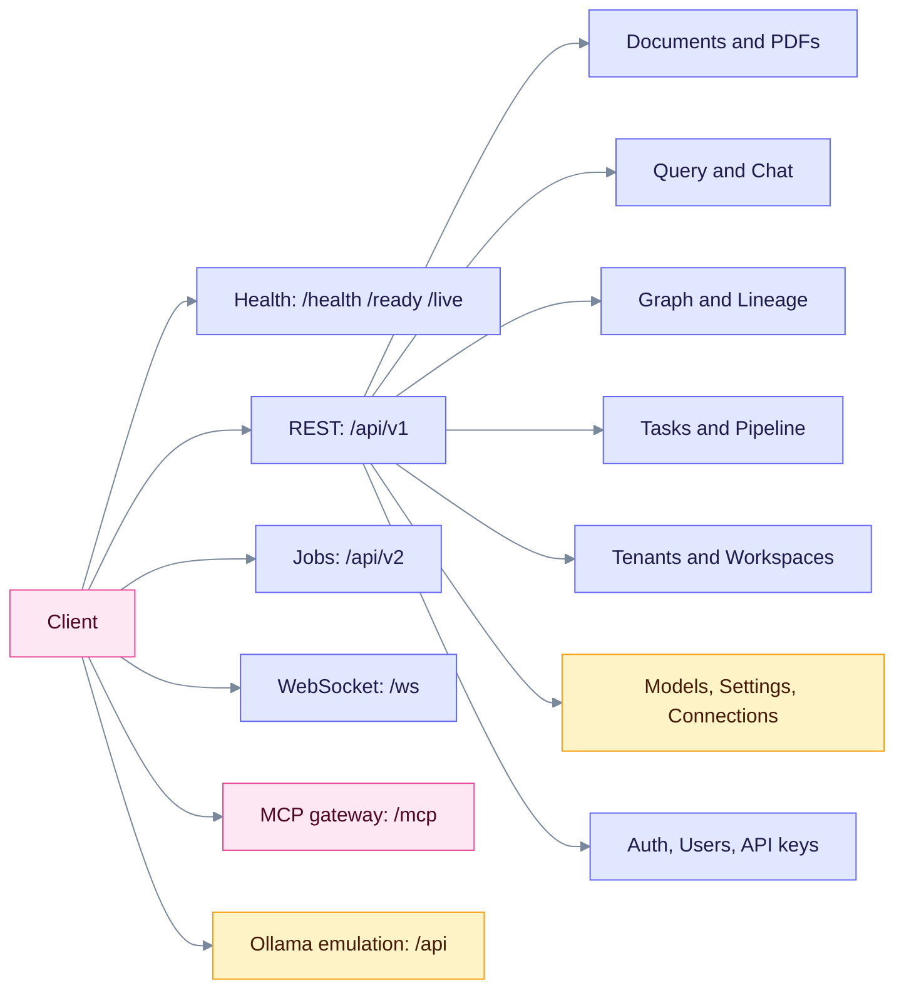
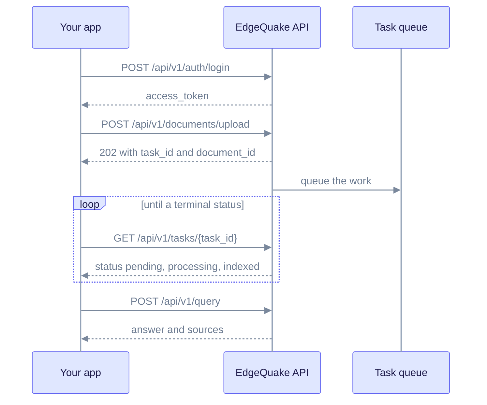

This section describes the EdgeQuake HTTP API. It is for developers who call EdgeQuake from their own code, or who write an SDK. Product pin: **v0.32.2**. Pages also cover the **v0.33.0** additions (provider Connections, `POST /api/v1/providers/test`, honest `/health`). Those are marked "v0.33.0" on each page.

**Source of truth.** The running server publishes its own contract at `/api-docs/openapi.json` and a Try-it-out UI at `/swagger-ui/` (default `http://localhost:8080`). A committed copy of the v0.32.2 contract is in [`openapi.snapshot.json`](../../edgequake_webui/openapi/openapi.snapshot.json). It does not yet include the v0.33.0 routes. Where this documentation and the server disagree, trust the server.

## Pick a page

| I want to... | Read |
|--------------|------|
| Learn auth, headers, errors, pagination, rate limits | [REST API](rest-api.md#conventions) |
| Upload text, files or PDFs and follow progress | [Document upload](document-upload-quick-reference.md) |
| Ask questions, stream answers, chat | [REST API: Query and Chat](rest-api.md#query) |
| Read or edit the knowledge graph | [REST API: Graph](rest-api.md#graph) |
| Manage tasks, queue metrics, costs, tenants, workspaces | [Extended API](extended-api.md) |
| Trace an answer back to chunks and documents | [Lineage endpoints](lineage-endpoints.md) |
| Save provider endpoints and test them (v0.33.0) | [Connections and provider test](connections.md) |
| Use EdgeQuake from an AI agent | [MCP integration](../../mcp/README.md) |
| Use a typed client library | [SDKs](../sdks/README.md) |

## How the API is organised

All resource routes live under `/api/v1`. Health probes, WebSockets, the MCP gateway and OAuth are served from the root. The Ollama emulation lives under `/api`.

Read the diagram from left to right: a client picks a front door, and `/api/v1` fans out into the resource areas listed in the table above.

## What a typical integration does

A typical client authenticates, picks a workspace, uploads a document, waits for the background task to finish, then queries.

Read it top to bottom. Uploads return at once; the server does the heavy work in the background, so you poll the task (or listen on a WebSocket) before you query.

## Pages in this section

- [REST API](rest-api.md): conventions, health, documents, parse, query, chat, graph, conversations, knowledge injection, models and settings.
- [Document upload](document-upload-quick-reference.md): which upload endpoint to use, with copy-paste examples.
- [Extended API](extended-api.md): tasks, progress streams, pipeline, costs, tenants, workspaces, Ollama emulation.
- [Lineage endpoints](lineage-endpoints.md): provenance for documents, chunks and entities.
- [Connections and provider test](connections.md): saved provider endpoints, probes, per-role model routing (v0.33.0).

Related: [Ingestion cancel and fairness](../ingestion-cancel-and-fairness.md), [Decision extraction](../concepts/decision-extraction.md), [Environment variables](../operations/env-reference.md).
