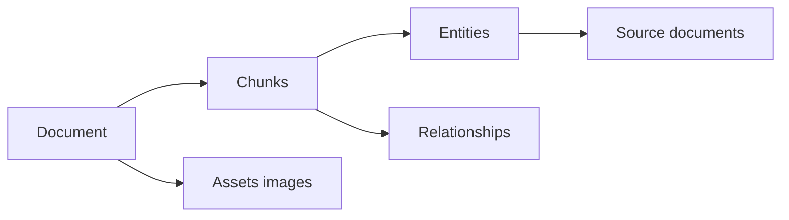

# Lineage API Reference

This page describes the endpoints that show where a fact came from. It is for developers who need provenance in an answer UI, an audit trail or a debugging tool. Base path: `/api/v1`. Auth and headers are the same as the [REST API](rest-api.md#conventions).

**Convert then ingest.** A PDF is first converted to Markdown, then ingested. Lineage appears after the ingest step finishes. A PDF row can say `Completed` while the linked document is still `extracting`. That is expected. See [Ingestion cancel and fairness](../ingestion-cancel-and-fairness.md).



Read it left to right: a document splits into chunks; chunks produce entities and relationships; an entity can point back to every document that mentioned it. Assets are figures extracted from PDF pages.

## Endpoints

| Method | Path | Returns |
|--------|------|---------|
| GET | `/documents/{document_id}/lineage` | Full lineage tree plus metadata and assets |
| GET | `/documents/{document_id}/metadata` | Flat document metadata |
| GET | `/documents/{document_id}/lineage/export?format=json\|csv` | Downloadable export |
| GET | `/documents/{document_id}/assets` | Asset summaries (no binary) |
| GET | `/documents/{document_id}/assets/{asset_id}` | PNG by stable id (for example `page-0001-chart`) |
| GET | `/documents/{document_id}/mm-assets/{*asset_path}` | Asset by relative path |
| GET | `/chunks/{chunk_id}` | Full chunk text, entities and relationships |
| GET | `/chunks/{chunk_id}/lineage` | Chunk with parent document context |
| GET | `/entities/{entity_id}/provenance` | Sources and related entities for one entity |
| GET | `/lineage/entities/{entity_name}` | Every document that produced an entity |
| GET | `/lineage/documents/{document_id}` | Graph summary of a document |

All of these return 404 when the id is unknown or belongs to another workspace.

## Document lineage

`GET /api/v1/documents/{document_id}/lineage` reads the persisted lineage record and wraps it with current metadata.

```bash
curl -s http://localhost:8080/api/v1/documents/$DOC_ID/lineage \
  -H "X-Workspace-ID: $WORKSPACE_ID"
```

```json
{
  "document_id": "5b1f...",
  "metadata": {
    "id": "5b1f...",
    "status": "completed",
    "title": "Curie notes"
  },
  "lineage": {
    "document_id": "5b1f...",
    "document_name": "Curie notes",
    "job_id": "...",
    "total_chunks": 3,
    "total_entities": 12,
    "total_relationships": 8,
    "extraction_provider": "ollama",
    "extraction_model": "gemma3:latest",
    "embedding_provider": "ollama",
    "embedding_model": "embeddinggemma:latest",
    "embedding_dimension": 768,
    "chunks": [
      {
        "chunk_id": "5b1f...-chunk-0",
        "chunk_index": 0,
        "start_line": 1,
        "end_line": 20,
        "start_offset": 0,
        "end_offset": 512,
        "page_start": 1,
        "page_end": 1,
        "entity_ids": ["MARIE_CURIE"],
        "relationship_ids": ["rel-1"]
      }
    ],
    "entities": {
      "MARIE_CURIE": {
        "source_document_ids": ["5b1f..."],
        "source_chunk_ids": ["5b1f...-chunk-0"]
      }
    },
    "relationships": {
      "rel-1": {
        "source_document_id": "5b1f...",
        "source_chunk_id": "5b1f...-chunk-0"
      }
    },
    "created_at": "2026-10-09T10:00:00Z",
    "updated_at": "2026-10-09T10:01:00Z"
  },
  "mm_assets": []
}
```

`page_start` and `page_end` are filled for PDF-sourced documents when available. Older lineage records may lack them; the server adds them on the fly from chunk storage when it can. Export with `GET .../lineage/export?format=csv` (or `json`) for a downloadable file.

## Document metadata

`GET /api/v1/documents/{document_id}/metadata` returns the flat metadata object stored for the document (status, title, token counts, models, and so on). Use it when you need the document fields without the lineage tree.

## Multimodal assets

After a vision-backed PDF conversion, extracted figures live as assets.

```bash
# List summaries (no binary)
curl -s http://localhost:8080/api/v1/documents/$DOC_ID/assets

# Fetch bytes by stable id
curl -s -o chart.png http://localhost:8080/api/v1/documents/$DOC_ID/assets/page-0001-chart
```

`GET .../mm-assets/{*asset_path}` accepts a relative path when you already know it. Both binary routes return `image/png` on success and 404 when missing. Assets appear only when multimodal asset storage is enabled (PostgreSQL builds).

## Chunk detail and lineage

```bash
curl -s http://localhost:8080/api/v1/chunks/$CHUNK_ID
```

```json
{
  "chunk_id": "5b1f...-chunk-0",
  "document_id": "5b1f...",
  "document_name": "Curie notes",
  "index": 0,
  "content": "Marie Curie won two Nobel Prizes...",
  "token_count": 48,
  "char_range": { "start": 0, "end": 512 },
  "start_line": 1,
  "end_line": 20,
  "page_start": 1,
  "page_end": 1,
  "entities": [
    { "id": "MARIE_CURIE", "name": "MARIE_CURIE", "entity_type": "PERSON", "description": "..." }
  ],
  "relationships": [
    {
      "source_name": "MARIE_CURIE",
      "target_name": "NOBEL_PRIZE",
      "relation_type": "WON",
      "description": "Won two Nobel Prizes"
    }
  ],
  "extraction_metadata": {
    "model": "gemma3:latest",
    "duration_ms": 900,
    "input_tokens": 200,
    "output_tokens": 80,
    "gleaning_iterations": 1,
    "cached": false
  }
}
```

`GET /chunks/{chunk_id}/lineage` adds parent document context: `content_preview`, `document_type`, `entity_names`, `entity_count`, `relationship_count`. Use it when you have a chunk id from a query source and want the surrounding document.

## Entity provenance

```bash
curl -s http://localhost:8080/api/v1/entities/MARIE_CURIE/provenance
```

```json
{
  "entity_id": "MARIE_CURIE",
  "entity_name": "MARIE_CURIE",
  "entity_type": "PERSON",
  "description": "Physicist and chemist",
  "total_extraction_count": 3,
  "sources": [
    {
      "document_id": "5b1f...",
      "document_name": "Curie notes",
      "first_extracted_at": "2026-10-09T10:00:30Z",
      "chunks": [
        {
          "chunk_id": "5b1f...-chunk-0",
          "start_line": 1,
          "end_line": 20,
          "source_text": "Marie Curie won..."
        }
      ]
    }
  ],
  "related_entities": [
    {
      "entity_id": "NOBEL_PRIZE",
      "entity_name": "NOBEL_PRIZE",
      "relationship_type": "WON",
      "shared_documents": 1
    }
  ]
}
```

## Entity lineage

`GET /api/v1/lineage/entities/{entity_name}` lists every source document for an entity, plus description history.

```json
{
  "entity_name": "MARIE_CURIE",
  "entity_type": "PERSON",
  "source_count": 2,
  "source_documents": [
    {
      "document_id": "5b1f...",
      "chunk_ids": ["5b1f...-chunk-0"],
      "line_ranges": [{ "start_line": 1, "end_line": 20 }]
    }
  ],
  "description_versions": [
    {
      "version": 1,
      "description": "Physicist and chemist",
      "created_at": "2026-10-09T10:00:30Z",
      "source_chunk_id": "5b1f...-chunk-0"
    }
  ]
}
```

## Document graph lineage

`GET /api/v1/lineage/documents/{document_id}` summarises the graph that came from one document.

```json
{
  "document_id": "5b1f...",
  "chunk_count": 3,
  "entities": [
    {
      "id": "MARIE_CURIE",
      "name": "MARIE_CURIE",
      "label": "Marie Curie",
      "entity_type": "PERSON",
      "source_chunks": ["5b1f...-chunk-0"],
      "is_shared": false,
      "description": "Physicist and chemist"
    }
  ],
  "relationships": [
    {
      "source": "MARIE_CURIE",
      "target": "NOBEL_PRIZE",
      "keywords": "won",
      "source_chunks": ["5b1f...-chunk-0"]
    }
  ],
  "extraction_stats": {
    "total_entities": 12,
    "unique_entities": 10,
    "total_relationships": 8,
    "unique_relationships": 7,
    "processing_time_ms": 4500
  }
}
```

`is_shared: true` means the entity also appears in other documents.

## Document-level extraction fields

Document list and detail responses also carry a `DocumentLineage`-style summary when available: `llm_model`, `embedding_model`, `embedding_dimensions`, `input_tokens`, `output_tokens`, `total_tokens`, `cost_usd`, `processing_duration_ms`, `chunking_strategy`, `avg_chunk_size`, `entity_types`, `relationship_types`, `keywords`, and for PDFs `pdf_extraction_method` (`vision` or `text`), `pdf_vision_model` and `pdf_extraction_warning`. Those fields live on the document object, not on the lineage tree endpoint.

## Errors

| Status | Meaning |
|--------|---------|
| 404 | Document, chunk or entity not found in this workspace, or lineage not written yet |
| 503 | Read path busy under ingest load (retry) |

Related: [REST API](rest-api.md), [Architecture: lineage tracking](../architecture/lineage-tracking.md), [SDKs](../sdks/README.md).
