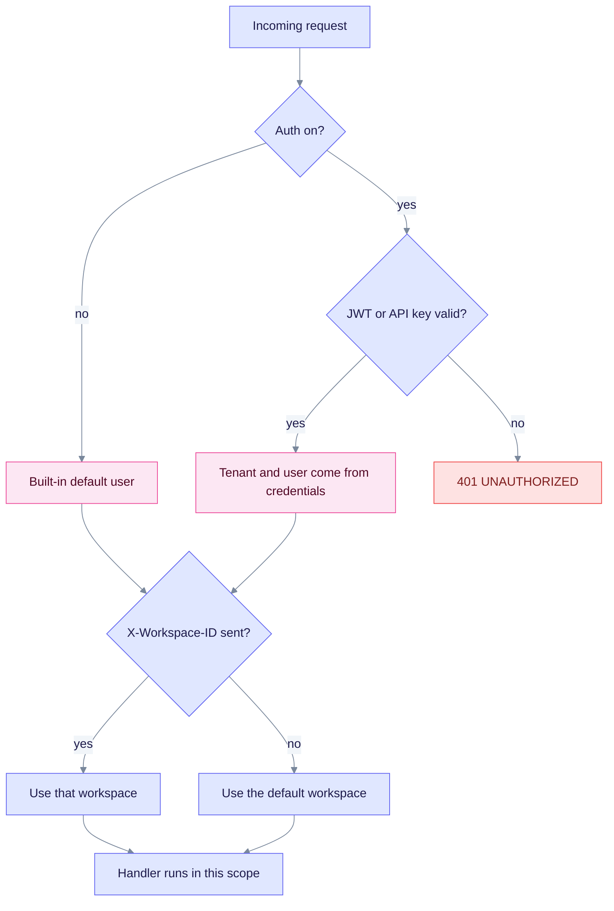
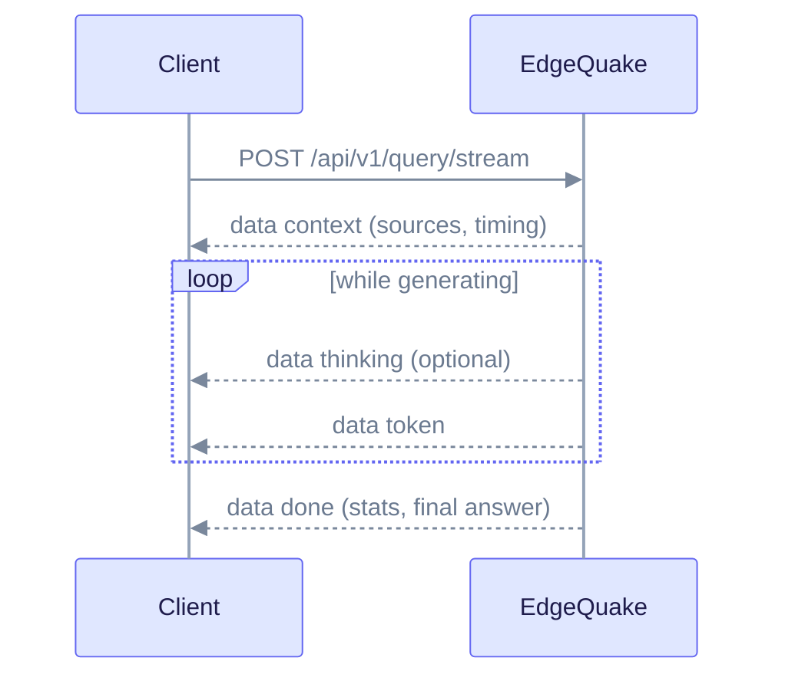

# EdgeQuake REST API Reference

This page covers the core HTTP API: how requests are authenticated and scoped, how errors look, and the main endpoints for documents, queries, chat, the knowledge graph, conversations and settings. It is for developers who call EdgeQuake directly with `curl` or an HTTP client.

Product pin: **v0.32.2**. Base URL in examples: `http://localhost:8080`. Resource routes live under `/api/v1`. For tasks, pipeline, costs, tenants and workspaces see [Extended API](extended-api.md). For saved provider endpoints (v0.33.0) see [Connections](connections.md).

The server publishes its full contract at `/api-docs/openapi.json` and a Try-it-out UI at `/swagger-ui/`.

## Conventions

### Authentication

Authentication is **on by default**. Set `EDGEQUAKE_DEV_MODE=true` (or `EDGEQUAKE_AUTH_ENABLED=false`) to run without credentials as the built-in default user. `EDGEQUAKE_AUTH_ENABLED` takes precedence over dev mode. When auth is on, send one of:

| Credential | How to send it |
|------------|----------------|
| JWT access token | `Authorization: Bearer <token>` |
| API key | `Authorization: Bearer <key>` or `X-API-Key: <key>` |

Get a JWT with `POST /api/v1/auth/login`, and create an API key with `POST /api/v1/api-keys`.

```bash
curl -s -X POST http://localhost:8080/api/v1/auth/login \
  -H "Content-Type: application/json" \
  -d '{"username":"admin","password":"<password>"}'
```

```json
{
  "access_token": "eyJ...",
  "refresh_token": "eyJ...",
  "token_type": "Bearer",
  "expires_in": 3600,
  "user": { "user_id": "...", "username": "admin", "email": "admin@example.com", "role": "admin" }
}
```

Refresh with `POST /api/v1/auth/refresh`, log out with `POST /api/v1/auth/logout`, and read the current user with `GET /api/v1/auth/me`. In the browser flow the refresh token is set as an HttpOnly cookie and is omitted from the login body.

These paths need no credentials:

| Path | Method |
|------|--------|
| `/health`, `/ready`, `/live` | any |
| `/swagger-ui`, `/api-docs` | any |
| `/api/v1/auth/login`, `/api/v1/auth/refresh` | POST |
| `/api/v1/auth/oidc/login`, `/api/v1/auth/oidc/callback`, `/api/v1/auth/handoff`, `/api/v1/auth/sso/providers` | any |
| `/api/v1/auth/oidc/backchannel-logout` | POST |
| `/api/v1/setup/status`, `/api/v1/setup/initialize` | any |
| `/mcp` | POST (the MCP gateway checks credentials itself) |
| `/api/v1/users` | POST, only when self-registration is allowed |

WebSockets cannot set headers in a browser. Send the token as `Sec-WebSocket-Protocol: edgequake.bearer, <token>` or as a `?token=` query parameter.

### Tenant and workspace headers

Data belongs to a **tenant** (an organisation) and a **workspace** (a separate knowledge base inside it). Select them with headers:

| Header | Meaning |
|--------|---------|
| `X-Tenant-ID` | Tenant UUID |
| `X-Workspace-ID` | Workspace UUID |
| `X-User-ID` | User UUID (ignored when a JWT or API key identifies the user) |

When auth succeeds, the server takes tenant and user from your credentials, not from spoofable headers. If you send no workspace, the default workspace is used.



Read it top to bottom: credentials decide who you are, and the workspace header (or the default) decides which knowledge base the handler reads and writes.

### Errors

Errors use JSON with RFC 7807 fields added. The content type is `application/problem+json`.

```json
{
  "code": "NOT_FOUND",
  "message": "Not found: document 'abc'",
  "type": "https://edgequake.dev/problems/not-found",
  "title": "Not Found",
  "status": 404,
  "details": { "request_id": "..." }
}
```

| Status | `code` | Meaning |
|--------|--------|---------|
| 400 | `BAD_REQUEST` | Malformed request or missing field |
| 401 | `UNAUTHORIZED` | Missing or invalid credentials |
| 403 | `FORBIDDEN` | Valid user, not allowed (for example admin-only routes) |
| 404 | `NOT_FOUND` | Resource does not exist in your workspace |
| 409 | `CONFLICT` | Duplicate or conflicting state |
| 410 | `GONE` | Resource expired (for example a retrieval id) |
| 422 | `VALIDATION_ERROR` | Valid JSON, invalid values |
| 423 | `ACCOUNT_LOCKED` | Too many failed logins |
| 429 | `RATE_LIMITED` | Rate limit hit (only when enabled) |
| 500 | `INTERNAL_ERROR` | Unexpected server error. Quote the `request_id` when you report it. |
| 502 | `LLM_ERROR` | Upstream model provider failed |
| 503 | `SERVICE_UNAVAILABLE`, `read_path_busy` | Dependency down, or reads are shed under heavy ingest. Retry. |

Parse errors use codes such as `parse.too_large` and `parse.unsupported_media_type`.

### Pagination

List endpoints use one of two styles. Check each endpoint.

| Style | Parameters | Used by |
|-------|------------|---------|
| Page | `page` (from 1), `page_size` (documents and graph entities: default 20, max 100) | documents, graph entities and relationships, tasks, API keys, users, v2 jobs |
| Offset | `offset`, `limit` | tenants, workspaces, injections, metrics history |
| Cursor | `cursor`, `limit` | conversations (default 20, max 100), messages (default 50, max 200) |

### Rate limits

Rate limiting is **off by default**. Set `EDGEQUAKE_RATE_LIMIT_ENABLED=true` to turn it on. It uses a token bucket per authenticated tenant. Successful responses carry `X-RateLimit-Limit` and `X-RateLimit-Remaining`. A rejected request returns 429 with `Retry-After` and this body:

```json
{
  "error": "rate_limit_exceeded",
  "message": "Too many requests for tenant '...'",
  "retry_after_seconds": 2,
  "request_id": "...",
  "error_code": "RATE_LIMITED",
  "retryable": true
}
```

### Long-running work is asynchronous

Uploads, deletes and rebuilds return quickly and finish in the background. The response carries a `task_id` or `track_id`. Poll `GET /api/v1/tasks/{track_id}`, or follow progress over [WebSocket or SSE](extended-api.md#progress-streams). See [Document upload](document-upload-quick-reference.md) for the full flow.

## Health

These three routes need no auth. They are for operators and orchestrators.

| Route | Purpose | Success | Failure |
|-------|---------|---------|---------|
| `GET /health` | Detailed status of storage, providers, schema and queue | 200 (degraded is reported in the body) | n/a |
| `GET /ready` | Can this node take traffic? | 200 `{"ready":true,"blockers":[]}` | 503 with `blockers` and `operator_action` |
| `GET /live` | Is the process alive? | 200, plain text `OK` | n/a |

```bash
curl -s http://localhost:8080/health
```

```json
{
  "status": "healthy",
  "version": "0.32.2",
  "storage_mode": "postgresql",
  "workspace_id": "default",
  "components": {
    "kv_storage": true,
    "vector_storage": true,
    "graph_storage": true,
    "llm_provider": true
  },
  "llm_provider_name": "ollama",
  "providers": {
    "llm": { "name": "ollama", "model": "gemma3:latest" },
    "embedding": { "name": "ollama", "model": "embeddinggemma:latest", "dimension": 768 }
  },
  "security_posture": {
    "auth_enabled": false,
    "dev_mode": true,
    "secrets_key_configured": false,
    "jwt_secret_is_default": true,
    "rate_limit_enabled": false,
    "swagger_enabled": true
  }
}
```

`status` is `healthy` or `degraded`. It turns `degraded` when a storage component is down, the task queue is overloaded, a required index is missing, or the active LLM is a local provider that does not answer a probe. In v0.33.0, `components.llm_provider` is a live probe of local providers, not only a configuration check. Other optional fields include `schema`, `operational`, `capabilities`, `build_info`, `pdf_storage_enabled` and `attribution`.

## Documents

A document is a unit of source text. Uploading creates a background task that chunks the text, extracts entities and relationships, embeds the chunks and stores everything. The [upload guide](document-upload-quick-reference.md) explains which endpoint to pick.

| Endpoint | Use it for | Success |
|----------|------------|---------|
| `POST /api/v1/documents` | JSON text body | 202 |
| `POST /api/v1/documents/upload` | One file (txt, md, json, csv, html, htm, xml, yaml, yml, or an image) | 202 |
| `POST /api/v1/documents/upload/batch` | Several files | 202 |
| `POST /api/v1/documents/pdf` | One PDF | 200 |
| `POST /api/v1/documents/pdf/batch` | Several PDFs | 200 |
| `POST /api/v1/documents/scan` | Server-side directory scan | 200 |

The maximum upload size is 50 MiB. Larger files return 413.

### POST /api/v1/documents

```bash
curl -s -X POST http://localhost:8080/api/v1/documents \
  -H "Content-Type: application/json" \
  -H "X-Workspace-ID: $WORKSPACE_ID" \
  -d '{"content":"Marie Curie won two Nobel Prizes.","title":"Curie notes"}'
```

```json
{
  "document_id": "5b1f...",
  "track_id": "9c7a...",
  "task_id": "9c7a...",
  "status": "pending",
  "queue_position": 1,
  "eta_seconds": null,
  "eta_basis": "no_history",
  "extraction_mode": "llm",
  "extraction_mode_source": "default"
}
```

| Field | Type | Notes |
|-------|------|-------|
| `content` | string, required | Document text |
| `title` | string | Display title |
| `metadata` | object | Free-form metadata |
| `track_id` | string | Optional label you send. The response's `track_id` always equals `task_id`; use either one with `GET /api/v1/tasks/{track_id}`. |
| `async_processing` | boolean | Kept for compatibility. Uploads are always queued, so you always get a `task_id`. |
| `chunk_strategy` | string | `fixed`, `recursive` or `markdown` |
| `chunk_options` | object | Chunk size, overlap and separator overrides |
| `enable_gleaning`, `max_gleaning` | boolean, integer | Extra extraction passes |
| `use_llm_summarization` | boolean | Summarise merged descriptions with the LLM |
| `extraction_mode` | string | `llm`, `decision` or `inherit` ([decision extraction](../concepts/decision-extraction.md)) |
| `decision_gate_preset` | string | `strict`, `balanced` or `recall` |
| `extract_max_entities`, `extract_max_records` | integer | Per-upload extraction caps |

If the same content is already being processed, you get 200 with `status: "duplicate_processing"` and `duplicate_of` set to the existing document id. Errors: 400 (missing `content`), 413 (too large).

### GET /api/v1/documents

Query parameters: `page`, `page_size`, `status`, `date_from`, `date_to`, `document_pattern` (case-insensitive title match; commas mean OR).

```bash
curl -s "http://localhost:8080/api/v1/documents?page=1&page_size=20&status=failed" \
  -H "X-Workspace-ID: $WORKSPACE_ID"
```

```json
{
  "documents": [
    {
      "id": "5b1f...",
      "title": "Curie notes",
      "status": "completed",
      "display_status": "completed",
      "ui_phase": "terminal",
      "current_stage": "completed",
      "chunk_count": 3,
      "entity_count": 12,
      "created_at": "2026-10-09T10:00:00Z"
    }
  ],
  "total": 1,
  "page": 1,
  "page_size": 20,
  "total_pages": 1,
  "has_more": false,
  "status_counts": {
    "pending": 0, "processing": 0, "completed": 1,
    "partial_failure": 0, "failed": 0, "cancelled": 0, "unknown": 0
  }
}
```

`status_counts` covers the whole workspace, even when you filter by `status`. A 503 means reads are being shed under ingest load; retry. Use `GET /api/v1/documents/search?q=...` for a fast title search.

### GET /api/v1/documents/{document_id}

Returns the same fields as a list item plus `content`, `content_hash`, token counts, `llm_model`, `embedding_model` and `warning_message`. Returns 404 when the document is not in your workspace.

### Document statuses

`status` is the raw state. For UI badges, use `display_status` and `ui_phase`, which already merge task and document state.

| Field | Values |
|-------|--------|
| `status` | `pending`, `processing`, `converting`, `chunking`, `extracting`, `embedding`, `indexing`, `projecting`, `completed` (also `indexed`), `partial_failure`, `failed`, `cancelled` |
| `ui_phase` | `idle`, `running`, `stopping`, `terminal` |

Lifecycle diagrams are in [Extended API](extended-api.md#lifecycle).

### DELETE /api/v1/documents/{document_id}

Deletes the document and its chunks, vectors and graph contributions. It is an async job: you get **202**, not 200.

```json
{ "document_id": "5b1f...", "accepted": true, "deleted": false, "track_id": "del-...", "chunks_deleted": 0 }
```

Watch the `track_id` on the WebSocket for `DeletionCompleted`. Use `GET /api/v1/documents/{id}/deletion-impact` first to preview what will be removed.

### Bulk and recovery operations

| Endpoint | What it does |
|----------|--------------|
| `DELETE /api/v1/documents` | Wipe every document in the workspace. 202 with `wipe_track_id`. Send `X-EdgeQuake-Confirm: delete-all-documents` (enforced when `EDGEQUAKE_REQUIRE_DELETE_ALL_CONFIRM=true`). 409 if a wipe is already running. |
| `POST /api/v1/documents/batch-delete` | Delete a chosen set (body `BatchDeleteDocumentsRequest`). 202. |
| `POST /api/v1/documents/{id}/cancel` | Cancel in-flight work for one document. |
| `POST /api/v1/documents/reprocess` | Requeue failed documents. |
| `POST /api/v1/documents/recover-stuck` | Requeue documents stuck in an active status. |
| `GET /api/v1/documents/{id}/failed-chunks`, `POST .../retry-chunks` | Inspect and retry failed chunks. |
| `GET /api/v1/documents/{id}/download/markdown`, `.../download/original` | Download extracted Markdown or the original bytes. |
| `GET /api/v1/documents/{id}/pages`, `.../pages/health`, `POST .../pages/reprocess` | Per-page health and partial reprocess for PDFs. |
| `POST /api/v1/documents/{id}/reanalyze` | Re-run multimodal analysis on stored Markdown. |

Details for these are in [Extended API](extended-api.md#advanced-document-endpoints).

## Parse

`POST /api/v1/parse` converts a PDF to Markdown and returns it. It stores nothing and builds no graph. Use it when you only need text extraction.

Send multipart form data with a `file` field and an optional `options` JSON field, or send the raw PDF body with `Content-Type: application/pdf` and an `X-Filename` header.

```bash
curl -s -X POST http://localhost:8080/api/v1/parse \
  -F "file=@paper.pdf" \
  -F 'options={"backend":"edgeparse","pages":"1-3"}'
```

```json
{
  "markdown": "# Title\n...",
  "page_count": 3,
  "backend": "edgeparse",
  "backend_effective": "edgeparse",
  "fallback_applied": false,
  "warnings": [],
  "metrics": { "total_ms": 812 },
  "request_id": "req-..."
}
```

| Option | Values |
|--------|--------|
| `backend` | `vision`, `edgeparse`, `edgeparse-ocr`, `auto` |
| `provider`, `model` | Vision provider and model (vision backend) |
| `dpi` | 72 to 400 |
| `concurrency` | 1 to 16 |
| `pages` | Page selection such as `1-3,7` |
| `table_method`, `emit_assets`, `allow_fallback`, `include_page_timings` | Optional tuning |
| `async` | `true` forces a background job |

Large inputs, or a `Prefer: respond-async` header, return **202** with `{"job_id","status","request_id"}`. Poll `GET /api/v1/parse/jobs/{job_id}`; its `status` is `pending`, `running`, `completed` or `failed`, and `result` holds the same body as the sync response. Jobs expire after about an hour. `GET /api/v1/parse/backends` lists backends, reachable vision models and the size and page limits.

Errors: 400, 413 (too large), 415 (not a PDF), 422 (unreadable), 502 (backend unavailable), 504 (timeout).

## Query

### POST /api/v1/query

Runs retrieval over the workspace knowledge graph and returns an answer with sources.

```bash
curl -s -X POST http://localhost:8080/api/v1/query \
  -H "Content-Type: application/json" \
  -H "X-Workspace-ID: $WORKSPACE_ID" \
  -d '{"query":"How many Nobel Prizes did Marie Curie win?","mode":"mix"}'
```

```json
{
  "answer": "Marie Curie won two Nobel Prizes...",
  "mode": "mix",
  "sources": [
    {
      "id": "chunk-1",
      "source_type": "chunk",
      "score": 0.83,
      "document_id": "5b1f...",
      "snippet": "Marie Curie won two Nobel Prizes.",
      "reference_id": 1
    }
  ],
  "stats": {
    "embedding_time_ms": 12,
    "retrieval_time_ms": 45,
    "generation_time_ms": 900,
    "total_time_ms": 960,
    "sources_retrieved": 5,
    "llm_provider": "ollama",
    "llm_model": "gemma3:latest"
  },
  "reranked": false,
  "conversation_id": null
}
```

| Field | Type | Notes |
|-------|------|-------|
| `query` | string, required | The question text |
| `mode` | string | `naive`, `local`, `global`, `hybrid`, `mix` or `bypass`. Default `mix`. |
| `llm_provider`, `llm_model` | string | Override the workspace model for this call |
| `document_filter` | object | Limit scope: `document_ids`, `document_pattern`, `date_from`, `date_to` |
| `conversation_history` | array | Earlier turns for multi-turn context |
| `max_results` | integer | Result cap |
| `enable_rerank`, `rerank_model`, `rerank_top_k` | boolean, string, integer | Reranking |
| `context_only` | boolean | Return context without calling the LLM |
| `prompt_only` | boolean | Return the built prompt only |
| `include_references`, `include_subgraph` | boolean | Add reference metadata or the matched sub-graph |
| `content_granularity` | string | Snippet size: `citation`, `agent` or `debug` |
| `system_prompt` | string | Extends the system prompt |
| `response_type` | string | Answer format cue |
| `hl_keywords`, `ll_keywords` | array | Pre-supplied keywords; skips keyword extraction |
| `reasoning_effort` | string | `none`, `minimal`, `low`, and so on |

This endpoint has no `top_k` or `rerank` field; use `max_results` and `enable_rerank` instead.

Related retrieval routes: `POST /api/v1/query/context` (retrieve without answering), `POST /api/v1/query/context/search`, `GET /api/v1/query/context/{retrieval_id}` (410 when expired) and `GET /api/v1/query/context/artifacts/{artifact_type}/{artifact_id}`.

### POST /api/v1/query/stream

Same request as `/query` plus `stream_format`. The response is Server-Sent Events (`text/event-stream`).



Read it as one request and many small events. Each `data:` line is a JSON object with a `type` field.

| `type` | Fields |
|--------|--------|
| `context` | `sources`, `query_mode`, `retrieval_time_ms`, optional `subgraph` |
| `token` | `content` |
| `thinking` | `content` (model reasoning, when available) |
| `done` | `stats`, `llm_provider`, `llm_model`, `answer` (verified Markdown; replace the streamed text with it) |
| `error` | `message`, `code` |

`stream_format` selects the wire format. `v2` (the default) sends the JSON events above. `v1` sends raw text chunks instead. `v3` adds a full structured bundle (SPEC-028).

```bash
curl -N -X POST http://localhost:8080/api/v1/query/stream \
  -H "Content-Type: application/json" \
  -d '{"query":"Summarise the corpus"}'
```

## Chat

Chat adds conversation storage on top of query. `POST /api/v1/chat/completions` returns one JSON response. `POST /api/v1/chat/completions/stream` returns SSE. (There is no OpenAI-style `/v1/chat/completions` route; for that shape see the [Ollama emulation](extended-api.md#ollama-emulation).)

```bash
curl -s -X POST http://localhost:8080/api/v1/chat/completions \
  -H "Content-Type: application/json" \
  -d '{"message":"Who is Marie Curie?","mode":"mix"}'
```

```json
{
  "conversation_id": "c1...",
  "user_message_id": "m1...",
  "assistant_message_id": "m2...",
  "content": "Marie Curie was a physicist...",
  "mode": "mix",
  "sources": [],
  "tokens_used": 120,
  "duration_ms": 1100,
  "llm_provider": "ollama",
  "llm_model": "gemma3:latest",
  "stats": { "total_time_ms": 1100 }
}
```

| Field | Notes |
|-------|-------|
| `message` | Required user text |
| `conversation_id` | Existing conversation. Omit to create one. |
| `parent_id` | Parent message for threading |
| `mode`, `provider`, `model`, `top_k`, `temperature`, `max_tokens` | Retrieval and generation options. `mode` defaults to `hybrid`. `chat` is accepted as an alias for `bypass`. |
| `language` | Preferred answer language (ISO 639-1) |
| `images` | Base64 images for vision models (at most 4 per message) |
| `document_filter`, `seed_entity_ids`, `system_prompt`, `reasoning_effort` | Scope and prompt options |

Stream event `type` values: `conversation`, `context`, `token`, `thinking`, `stage` (`retrieving`, `reading`, `generating`), `done`, `title_update`, `error`.

## Graph

The knowledge graph holds entities (nodes) and relationships (edges). Entity names are normalised to UPPERCASE with underscores.

| Endpoint | Purpose |
|----------|---------|
| `GET /api/v1/graph` | Sub-graph. Query: `start_node`, `depth` (default 2), `max_nodes` (default 100, clamped to a server maximum). |
| `GET /api/v1/graph/stream` | Progressive SSE: `metadata`, `nodes`, `edges`, `done`, `error` events. Query: `start_node`, `max_nodes`, `batch_size`. |
| `GET /api/v1/graph/nodes/{node_id}` | One node |
| `GET /api/v1/graph/nodes/search` | Search nodes by label or description. Query: `q`, `limit`, `include_neighbors`, `neighbor_depth`, `entity_type`. |
| `GET /api/v1/graph/labels/search`, `/labels/popular` | Label search and most-connected labels |
| `POST /api/v1/graph/degrees/batch` | Degrees for many nodes |
| `GET /api/v1/graph/communities`, `/graph/facets` | Community and type facets |
| `GET /api/v1/graph/entities` | Paged list. Query: `page`, `page_size`, `entity_type`, `search`. |
| `POST /api/v1/graph/entities` | Create (201; 409 if it exists) |
| `GET /api/v1/graph/entities/exists?entity_name=` | Existence check |
| `POST /api/v1/graph/entities/merge` | Merge two entities |
| `GET`, `PUT`, `DELETE /api/v1/graph/entities/{entity_name}` | Read, update, delete |
| `GET /api/v1/graph/entities/{entity_name}/neighborhood?depth=` | Connected nodes |
| `GET`, `POST /api/v1/graph/relationships`; `GET`, `PUT`, `DELETE .../{relationship_id}` | Relationship CRUD |

For counts use `GET /api/v1/workspaces/{id}/stats`.

```bash
curl -s "http://localhost:8080/api/v1/graph?depth=2&max_nodes=50" \
  -H "X-Workspace-ID: $WORKSPACE_ID"
```

```json
{
  "nodes": [
    {
      "id": "MARIE_CURIE",
      "label": "MARIE_CURIE",
      "node_type": "PERSON",
      "description": "Physicist and chemist",
      "degree": { "in": 1, "out": 2, "total": 3 },
      "community_id": null,
      "properties": {}
    }
  ],
  "edges": [
    {
      "id": "MARIE_CURIE|WON|NOBEL_PRIZE",
      "source": "MARIE_CURIE",
      "target": "NOBEL_PRIZE",
      "relationship_type": "WON",
      "keywords": ["award"],
      "weight": 1.0,
      "description": "",
      "properties": {}
    }
  ],
  "total_nodes": 42,
  "total_edges": 57,
  "is_truncated": false,
  "max_nodes": 50
}
```

Create an entity and a relationship:

```bash
curl -s -X POST http://localhost:8080/api/v1/graph/entities \
  -H "Content-Type: application/json" \
  -d '{"entity_name":"ADA_LOVELACE","entity_type":"PERSON","description":"Early programmer","source_id":"manual_entry"}'

curl -s -X POST http://localhost:8080/api/v1/graph/relationships \
  -H "Content-Type: application/json" \
  -d '{"src_id":"ADA_LOVELACE","tgt_id":"ANALYTICAL_ENGINE","keywords":"wrote programs","description":"Wrote the first program","source_id":"manual_entry","weight":0.9}'
```

Delete an entity with `DELETE /api/v1/graph/entities/{name}?confirm=true`. `confirm=true` is required; `delete_relationships` defaults to `true`. Merge body: `{"source_entity","target_entity","merge_strategy"}`, where `merge_strategy` is `prefer_source`, `prefer_target` or `merge`.

An entity response has `id`, `entity_name`, `entity_type`, `description`, `source_id`, `degree`, `metadata`, `created_at`, `updated_at`. `GET .../entities/{name}` wraps it as `{ "entity", "relationships": {"incoming","outgoing"}, "statistics" }`.

## Conversations

Conversations store chat history per user. They use cursor pagination.

| Endpoint | Purpose |
|----------|---------|
| `GET /api/v1/conversations` | List. Query: `cursor`, `limit`, `sort` (`updated_at`, `created_at`, `title`), `order`, and filters `filter[mode]`, `filter[archived]`, `filter[pinned]`, `filter[folder_id]`, `filter[unfiled]`, `filter[search]`. |
| `POST /api/v1/conversations` | Create. Body: `title`, `mode`, `folder_id` (all optional). 201. |
| `GET`, `PATCH`, `DELETE /api/v1/conversations/{id}` | Read, update, delete (204) |
| `GET`, `POST /api/v1/conversations/{id}/messages` | List and add messages. Body: `role`, `content`, optional `parent_id`. |
| `PATCH`, `DELETE /api/v1/messages/{message_id}` | Edit or delete a message |
| `PATCH /api/v1/conversations/{conversation_id}/messages/{message_id}/feedback` | Thumbs feedback |
| `POST`, `DELETE /api/v1/conversations/{id}/share` | Share or unshare. Read a shared one at `GET /api/v1/shared/{share_id}`. |
| `POST /api/v1/conversations/bulk/delete`, `/bulk/archive`, `/bulk/move` | Bulk actions. Body: `{"conversation_ids":[...]}`. |
| `POST /api/v1/conversations/import` | Import from browser local storage |
| `GET`, `POST /api/v1/folders`; `PATCH`, `DELETE /api/v1/folders/{folder_id}` | Folders |

A list response is `{ "items": [...], "pagination": { "has_more", "next_cursor", "prev_cursor", "total" } }`. Pass `next_cursor` as `cursor` to get the next page.

## Knowledge injection

Injection adds trusted reference text (glossaries, acronyms, definitions) to a workspace. EdgeQuake processes it into the graph like a document. Content is limited to 100 KiB.

| Endpoint | Purpose |
|----------|---------|
| `PUT /api/v1/workspaces/{workspace_id}/injection` | Create or replace by `name`. Body `{"name","content"}`. 202. |
| `PUT /api/v1/workspaces/{workspace_id}/injection/file` | Same from an uploaded plain-text file (multipart). 202. |
| `GET /api/v1/workspaces/{workspace_id}/injections` | List. Query `limit`, `offset`. |
| `GET`, `PATCH`, `DELETE /api/v1/workspaces/{workspace_id}/injections/{injection_id}` | Read, update (reprocesses if content changes), delete |

```bash
curl -s -X PUT http://localhost:8080/api/v1/workspaces/$WORKSPACE_ID/injection \
  -H "Content-Type: application/json" \
  -d '{"name":"Glossary","content":"RAG: Retrieval-Augmented Generation"}'
```

```json
{ "injection_id": "i1...", "workspace_id": "...", "version": 1, "status": "processing" }
```

Errors: 400 (invalid), 413 (over 100 KiB), 404 (unknown id).

## Models and settings

| Endpoint | Purpose |
|----------|---------|
| `GET /api/v1/models` | All configured providers and their models |
| `GET /api/v1/models/llm`, `/models/embedding` | Only chat or only embedding models |
| `GET /api/v1/models/health` | Array of providers, each with a `health` object (`available`, `latency_ms`, `checked_at`, `error`) |
| `GET /api/v1/models/{provider}`, `/models/{provider}/{model}` | One provider or model (404 if unknown) |
| `GET /api/v1/models/search` | Search by capability: `q`, `provider`, `requires_vision`, `requires_tools`, `requires_thinking`, `min_context_length`, `fuzzy`, `limit` |
| `POST /api/v1/models/discover/refresh` | Clear discovery caches |
| `GET /api/v1/settings/providers` | Providers you can switch to, with `active_llm_provider` and `active_embedding_provider` |
| `GET /api/v1/settings/provider/status` | Active provider, embedding and storage status |
| `GET`, `PATCH /api/v1/settings/llm-defaults` | Server-wide default models. PATCH needs admin and PostgreSQL. |
| `GET`, `PATCH /api/v1/settings/app-attribution`, `GET /api/v1/settings/attribution` | Application attribution headers sent to providers (PATCH needs admin) |
| `GET /api/v1/config/effective` | The effective configuration and where each value came from |

Model entries come from `edgequake/models.toml`. Provider setup is described in [Providers](../providers/index.md).

Related: [Extended API](extended-api.md), [Connections](connections.md), [SDKs](../sdks/README.md).
