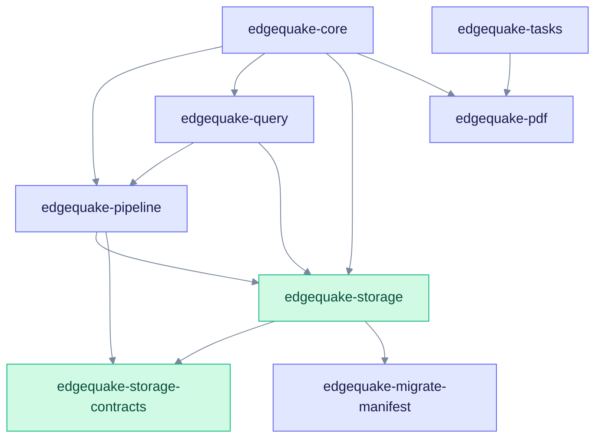

# Architecture: Crate Reference

This page gives the real dependency graph between EdgeQuake crates and a short note on each one. Read it when you add code and need to know which crate owns it, or which crates you may depend on.

The graphs are read from each crate's `Cargo.toml`. Test-only (`dev-dependencies`) edges are left out. For a one-line summary per crate, see the [crate list](./index.md).

---

## Dependency graph

The engine crates are the ones that ingest and query documents.

Read an arrow as "depends on". `edgequake-storage` is the base that most engine crates share. `edgequake-core` uses `edgequake-pipeline` through its `pipeline` feature, which is on by default.

The API crate sits above the engine crates and adds the cross-cutting crates.

```mermaid
%%{init: {"theme":"base","themeVariables":{"primaryColor":"#E0E7FF","primaryBorderColor":"#6366F1","primaryTextColor":"#1E1B4B","secondaryColor":"#D1FAE5","secondaryBorderColor":"#10B981","secondaryTextColor":"#064E3B","tertiaryColor":"#FEF3C7","tertiaryBorderColor":"#F59E0B","tertiaryTextColor":"#6B7A90","lineColor":"#7A889C","clusterBkg":"rgba(99,102,241,0.07)","clusterBorder":"#A5B4FC","noteBkgColor":"#FEF9C3","noteTextColor":"#422006","textColor":"#6B7A90","titleColor":"#6B7A90","signalColor":"#7A889C","signalTextColor":"#6B7A90","loopTextColor":"#6B7A90","edgeLabelBackground":"#F1F5F9","actorLineColor":"#94A3B8"}}}%%
%% eq-theme:v1
flowchart TD
    api["edgequake-api"] --> engine["Engine crates (graph above)"]
    api --> tasks["edgequake-tasks"]
    api --> auth["edgequake-auth"]
    api --> rate["edgequake-rate-limiter"]
    api --> audit["edgequake-audit"]
    api --> secrets["edgequake-secrets"]
    api --> obs["edgequake-observability"]
    api --> manifest["edgequake-migrate-manifest"]
```

Read it as the list of everything the API links in. `edgequake-pipeline`, `edgequake-query`, and `edgequake-tasks` also depend on `edgequake-observability` for metrics and tracing. `edgequake-storage` does too, behind its `observability` feature. `edgequake-auth`, `edgequake-audit`, `edgequake-rate-limiter`, and `edgequake-secrets` depend on no other workspace crate.

External crates used by several workspace crates:

| External crate | Used by | Purpose |
| -------------- | ------- | ------- |
| `edgequake-llm` (0.10.9) | api, core, pdf, pipeline, query | `LLMProvider` and `EmbeddingProvider` traits and all provider clients |
| `edgequake-pdf2md` | api, pdf | PDF page rendering and Markdown conversion (pdfium is bundled) |

The root `edgequake` package builds the server binary. It depends on the API, core, pipeline, query, storage, tasks, pdf, observability, and migrate-manifest crates.

---

## Engine crates

### edgequake-core

Orchestration layer. It holds the domain types (`Document`, `Chunk`, `GraphEntity`, `GraphRelationship`) and the `EdgeQuake` facade with `insert`, `insert_batch`, and `query`.

It also owns workspace and tenant types, `WorkspaceService`, and the LLM role helpers in `llm_roles.rs`. The five roles are `extract`, `query`, `summary`, `vlm`, and `keyword`. **(v0.33.0)** A role can carry a `connection_id`.

### edgequake-pipeline

Document ingestion. Main modules: `chunker` (strategies and token packing), `extractor` (LLM, SOTA, simple, gleaning, and decision extractors), `merger` (entity and relationship merge), `lineage`, `progress`, and `prompts`.

The `Pipeline` type runs chunk, extract, and embed. The `EntityExtractor` trait is the extension point for new extraction methods.

### edgequake-query

The query engine. `QueryMode` has six values: `Naive`, `Local`, `Global`, `Hybrid`, `Mix` (default), and `Bypass`. Other modules cover keyword extraction, context building, reranking, fusion, and answer caching. See [Query flow](../query-flow.md).

### edgequake-storage

Storage traits and adapters. The traits are `KVStorage`, `VectorStorage`, and `GraphStorage` (which is split into read, scan, mutate, and analytics traits). The production adapter lives in `adapters/postgres` (KV, pgvector, Apache AGE).

Memory adapters exist for tests. Optional adapters for SQLite, Qdrant, and Neo4j sit behind feature flags; the server binary only assembles PostgreSQL profiles. Details: [Storage model](../storage-model.md).

### edgequake-storage-contracts

Types shared between storage providers and callers, with no database driver. It holds scope and id types, binding, projection, vector, and graph contracts.

### edgequake-pdf

PDF to Markdown. Backends are `Vision` (default), `EdgeParse`, `EdgeParseOcr`, and `Auto`. It also handles page layout, page modality, figure and chart crops, and the page assets stored as multimodal assets.

---

## Service crates

### edgequake-api

The Axum server. Routes live in `routes.rs` under `/api/v1`, `/api/v2`, and `/api` (Ollama-compatible). Other entry points: `/health`, `/ready`, `/live`, `/metrics`, `/mcp`, and the WebSocket routes `/ws/progress/{track_id}` and `/ws/pipeline/progress`.

Notable modules:

- `processor/`: the task processor that runs PDF convert and text insert.
- `providers/`: provider resolution and connections. **(v0.33.0)** `connection_store`, `connection_factory`, and `probe` are new.
- `workspace_pipeline_factory.rs`: builds a pipeline per workspace.
- `doctor.rs`, `ssrf.rs`, `locality.rs` **(v0.33.0)**.
- `state/migration_bootstrap/`: the boot-time schema check. It never applies versioned migrations when serving.

### edgequake-tasks

The durable task system. Task types: `Upload`, `Insert`, `Scan`, `Reindex`, `PdfProcessing`, `KnowledgeInjection`, `Deletion`, `BatchDeletion`, and `WorkspaceWipe`. Task statuses: `Pending`, `Processing`, `Indexed`, `Failed`, and `Cancelled`.

It provides `claim_next`, leases, a `CancellationRegistry`, and tenant fairness. Delivery modes are `Local`, `Bridged`, and `NotifyOnly`. Operations notes: [Ingestion cancel and fairness](../../ingestion-cancel-and-fairness.md).

### edgequake-auth

JWT creation and checks, password hashing, API key types, role-based access control, OIDC settings, and tenant types.

### edgequake-audit

`AuditLogger` and audit events, written to PostgreSQL.

### edgequake-rate-limiter

Token-bucket limiter and the Axum middleware glue. The API applies it per tenant after authentication.

### edgequake-observability

One place to set up `tracing`, Prometheus metrics (feature `metrics`), OpenTelemetry export (feature `otel`), and Langfuse spans. Both features are on by default.

### edgequake-secrets **(v0.33.0)**

Encrypts and decrypts stored provider API keys with AES-256-GCM. The key comes from `EDGEQUAKE_SECRETS_KEY`. `SecretString` never prints its value, and a short fingerprint lets the UI show which key is stored.

### edgequake-migrate-manifest

Parses `edgequake/migrations/manifest.toml`, the single source of truth for migration phases, known-checksum variants, irreversible drops, and the serve-compatibility window (SPEC-150).

### edgequake-fake-llm **(v0.33.0)**

A small HTTP server that imitates an LLM API. It can inject faults (`401`, `500`, `slow`, `wrong-dim`, `down`) through a query string or the `X-Fake-Mode` header. Tests use it; production does not.

---

## Feature flags

| Flag | Crate | Effect |
| ---- | ----- | ------ |
| `postgres` | api, storage, core, tasks | PostgreSQL support. The server needs it. |
| `pipeline` | core | Links `edgequake-pipeline` (on by default) |
| `otel` | observability, api | OpenTelemetry export (on by default) |
| `metrics` | observability | Prometheus metrics (on by default) |
| `vision` | api | Vision PDF mode |
| `sqlite`, `qdrant`, `neo4j`, `p3` | storage, api | Optional adapters, not part of the default server |

Provider choice is made at run time through settings and workspace configuration, not through feature flags.

---

## See also

- [Architecture Overview](../overview.md)
- [Data flow](../data-flow.md)
- [REST API](../../api-reference/rest-api.md)
- [Pipeline progress](../../deep-dives/pipeline-progress.md)
