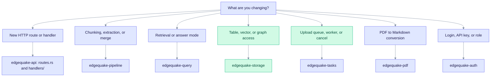

This page lists every crate in the EdgeQuake workspace and the one job each crate has. Read it when you need to find where code lives. For the dependency graphs and per-crate notes, see the [detailed reference](./README.md).

The workspace lives in `edgequake/crates/`. A root package, `edgequake`, builds the server binary.

| Crate | Job |
| ----- | --- |
| `edgequake-api` | Axum HTTP server, WebSocket progress, OpenAPI, MCP, background task processor |
| `edgequake-core` | Orchestration: the `EdgeQuake` facade, workspace and tenant services, LLM role resolution |
| `edgequake-pipeline` | Ingestion: chunking, extraction, embedding, graph merge, lineage |
| `edgequake-query` | Query engine: six query modes, keyword extraction, context building |
| `edgequake-storage` | Storage traits and the PostgreSQL adapters (KV, pgvector, Apache AGE) |
| `edgequake-storage-contracts` | Driver-free types shared by storage providers (scopes, ids, projections) |
| `edgequake-tasks` | Task queue, worker pool, lease, cancel, tenant fairness |
| `edgequake-pdf` | PDF to Markdown (vision LLM or EdgeParse), page assets |
| `edgequake-auth` | JWT, API keys, OIDC settings, roles, tenant types |
| `edgequake-audit` | Audit events and PostgreSQL audit log |
| `edgequake-rate-limiter` | Token-bucket rate limiting per tenant |
| `edgequake-observability` | Tracing, Prometheus metrics, OpenTelemetry, Langfuse |
| `edgequake-secrets` | AES-256-GCM encryption for stored API keys **(v0.33.0)** |
| `edgequake-migrate-manifest` | Parsed `manifest.toml` that describes migrations (SPEC-150) |
| `edgequake-fake-llm` | Test-only fake LLM server for hermetic proofs **(v0.33.0)** |

Two crates come from crates.io, not from this repository:

- `edgequake-llm` provides the LLM and embedding provider traits and clients.
- `edgequake-pdf2md` converts PDF pages to Markdown. `edgequake-pdf` wraps it.

There is no `edgequake-graph` crate. Graph code lives in `edgequake-storage` and `edgequake-query`.

## Which crate owns a change

Read the diagram top to bottom. Pick the question that matches your change, then open the crate it points to.

