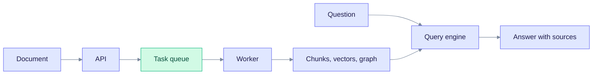
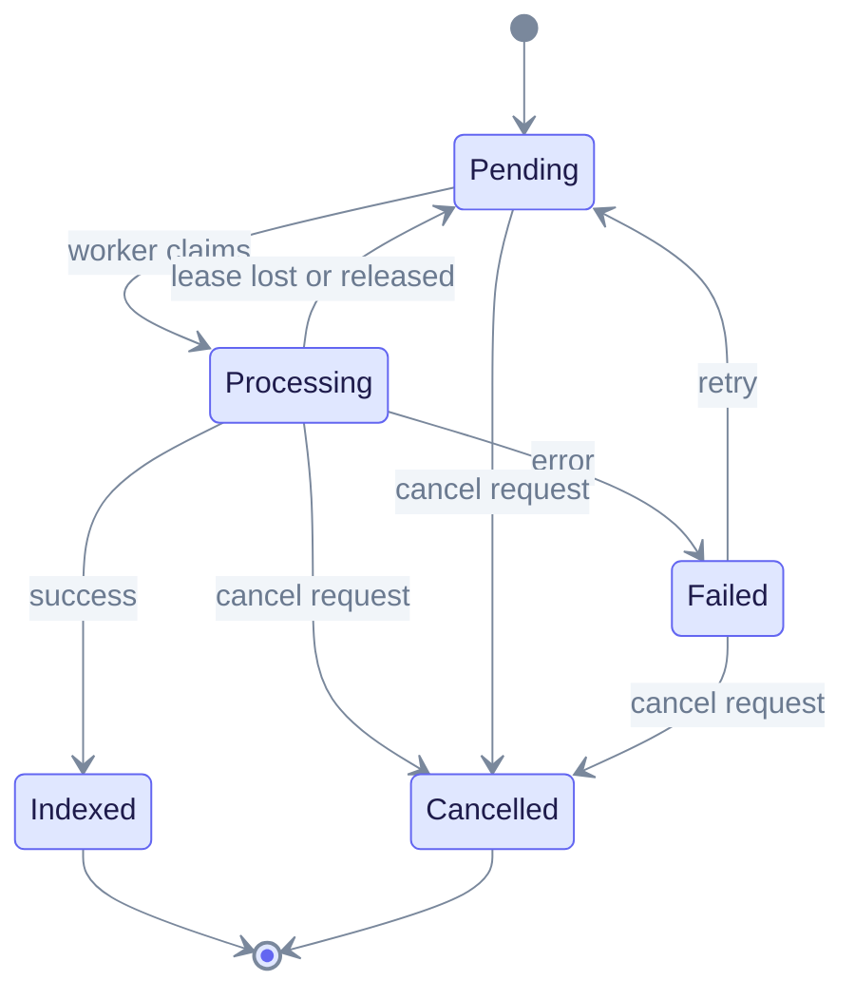
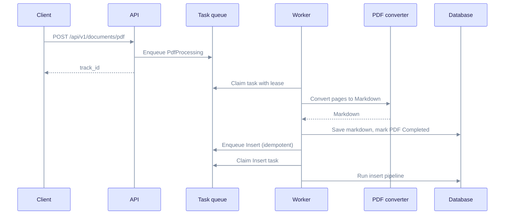
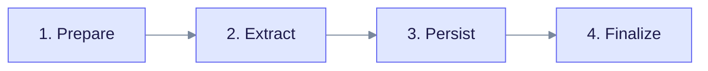
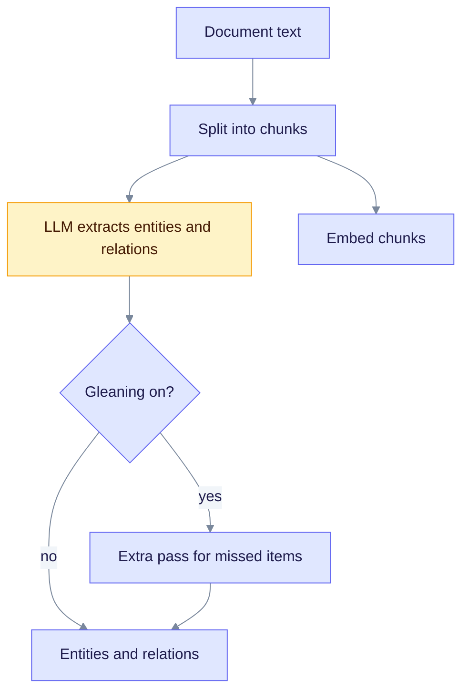
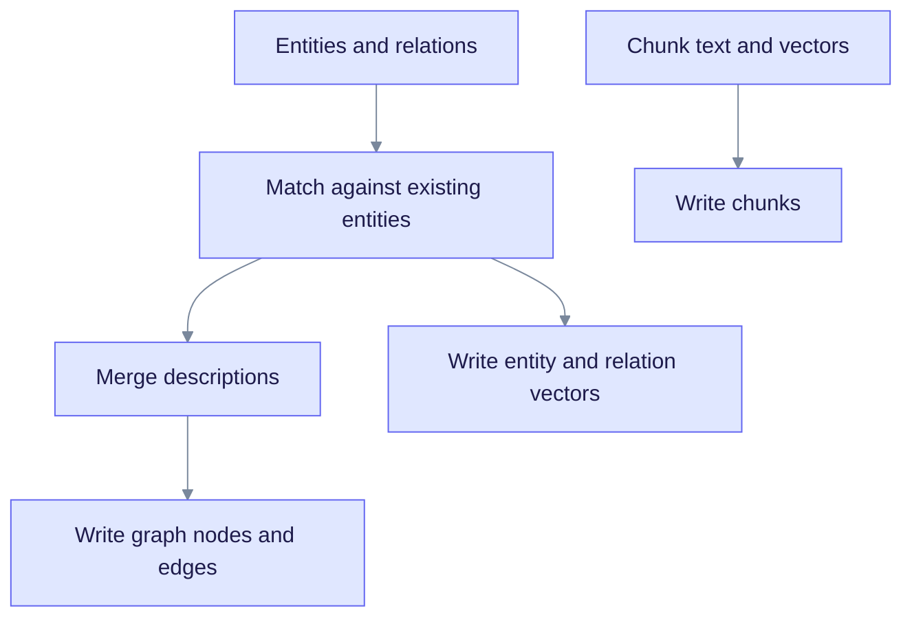
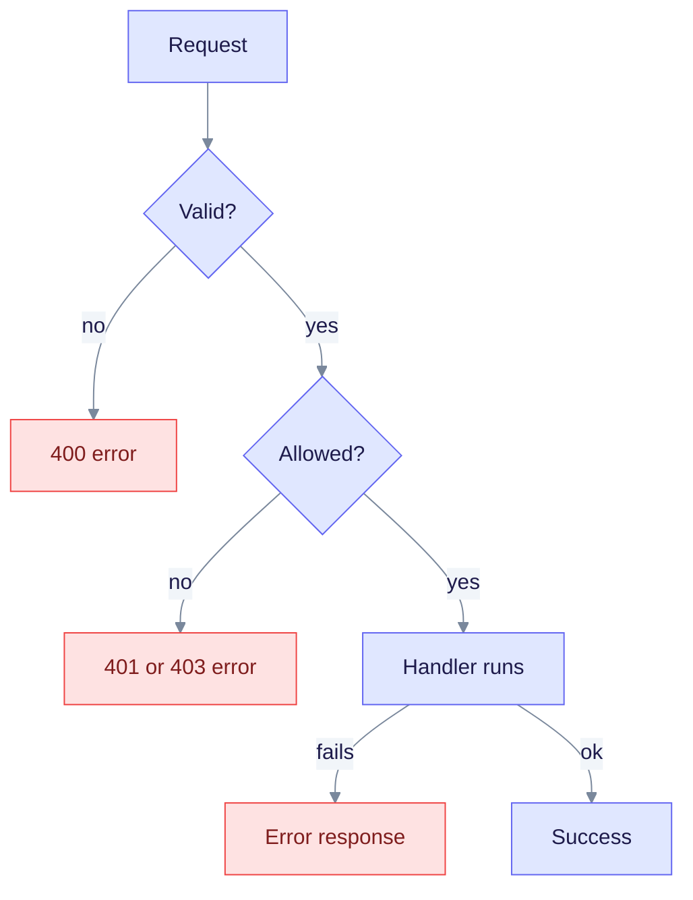

# Data Flow

This page follows one document from upload to searchable knowledge. It is for developers who work on ingestion, and for operators who need to know why a document is slow or stuck.

For the other half, how a question is answered, see [Query flow](./query-flow.md).

---

## Big picture

Ingestion turns a document into three things: text chunks, vectors, and a knowledge graph. A query then reads all three.

Read it left to right. Uploads return quickly with a task id. The heavy work happens later in a background worker.

---

## Upload and the task queue

Entry points:

| Route | Use |
| ----- | --- |
| `POST /api/v1/documents` | Plain text |
| `POST /api/v1/documents/upload` | A file |
| `POST /api/v1/documents/pdf` | A PDF |
| `POST /api/v1/documents/scan` | A directory on the server |

Each upload becomes a **task** with a `track_id`. Task types are `Upload`, `Insert`, `Scan`, `Reindex`, `PdfProcessing`, `KnowledgeInjection`, `Deletion`, `BatchDeletion`, and `WorkspaceWipe`.

Read it as the life of one task. A worker moves a task from `Pending` to `Processing` by claiming it with a lease. A failed task can be retried with `POST /api/v1/tasks/{track_id}/retry` until its retry limit is reached.

Two details matter in practice:

- **Fairness.** Tasks use two lanes, ingest and lifecycle (deletes and wipes). Claims rotate between tenants so one tenant cannot starve the others. See [Ingestion cancel and fairness](../ingestion-cancel-and-fairness.md).
- **Delivery mode.** `Local` (default) runs tasks in the same process. With more than one API replica you must use `Bridged` or `NotifyOnly`; the server refuses to boot with `Local` when `EDGEQUAKE_REPLICAS` is greater than 1.

---

## PDF ingestion: convert first, then insert

A PDF needs two tasks. The first converts the PDF to Markdown. The second runs the same insert pipeline as plain text.

Read it top to bottom. The Markdown is saved before the insert task starts, so the insert always has durable input. If you cancel after conversion, the PDF stays `Completed` and its Markdown is kept.

Conversion uses the workspace's PDF parser backend:

| Backend | Meaning |
| ------- | ------- |
| `Vision` (default) | A vision LLM reads each page image |
| `EdgeParse` | Text extraction without an LLM |
| `EdgeParseOcr` | EdgeParse plus OCR |
| `Auto` | Chooses per document |

---

## The insert pipeline

The insert task runs four phases. The document status shows which phase is running.

Read it left to right. The document `status` shows the current stage: `chunking`, `extracting`, `indexing`, and finally `completed`.

### Phase 1 and 2: prepare and extract

Read it top to bottom. Chunking comes first. Extraction and embedding then run per chunk.

- **Chunking.** The default size is 800 estimated tokens with 100 overlap. Strategies are `Fixed`, `Recursive` (default), `Markdown`, `Pdf`, and `Semantic`.
- **Extraction.** An extractor calls the LLM once per chunk. Chunks run in parallel under a limit. Cloud providers default to 16 at a time with a 180 second timeout and 3 retries. Local providers default to 1 at a time with a 600 second timeout and gleaning off.
- **Gleaning.** An optional extra pass asks the LLM what it missed. It is capped at 2 passes.
- **Decision mode.** `EDGEQUAKE_EXTRACTION_MODE=decision` replaces free-form extraction with closed questions: a small model answers from a fixed list of choices, each answer is gated by its probability, and only accepted rows enter the graph (SPEC-160). The default is `llm`.
- **Checkpoints.** Finished chunks are saved, so a retry does not redo them. Failed chunks are recorded and can be retried through `POST /api/v1/documents/{id}/retry-chunks`.

### Phase 3: persist and merge

Read it top to bottom. New entities are merged with ones already in the graph, then everything is written.

- **Matching.** An entity is matched by its normalized name (uppercase with underscores). Optional extra steps compare embeddings (`EDGEQUAKE_ENTITY_EMBED_ER`, threshold 0.92) or ask an LLM (`EDGEQUAKE_ER_LLM`). Both are off by default.
- **Descriptions.** New descriptions are joined with `<SEP>`. When a description reaches 8 fragments, or goes over the token budget (`EDGEQUAKE_SUMMARY_MAX_TOKENS`, default 1200), the summary LLM rewrites it into one description.
- **Communities.** The merger can label entities with a community id at index time. The algorithm is Louvain by default.

### Phase 4: finalize

The worker marks the document `completed`, stores the lineage record, and invalidates the cached workspace statistics so counts include the new content. See [Lineage tracking](./lineage-tracking.md).

---

## Progress reporting

Clients can follow a task through any of these:

| Channel | Path |
| ------- | ---- |
| WebSocket for one task | `/ws/progress/{track_id}` |
| WebSocket for the whole pipeline | `/ws/pipeline/progress` |
| Poll one task | `GET /api/v1/ingestion/{track_id}/progress` |
| Poll a PDF task | `GET /api/v1/documents/pdf/progress/{track_id}` |
| Task status | `GET /api/v1/tasks/{track_id}` |

The pipeline phases reported are `Upload`, `PdfConversion`, `Chunking`, `Embedding`, `Extraction`, and `GraphStorage`. More detail: [Pipeline progress](../deep-dives/pipeline-progress.md).

To stop a task, call `POST /api/v1/tasks/{track_id}/cancel` or `POST /api/v1/documents/{id}/cancel`.

---

## Error handling

Read it top to bottom. Errors return JSON with a `code` and `message`, plus RFC 7807 style fields (`type`, `title`, `status`) added alongside them. Rate limiting returns `429`.

Failures inside a background task do not reach the client. Instead, the task becomes `Failed` and the document shows an error message. Common causes:

- The LLM provider is down or rejected the key. Check `GET /health` and `edgequake doctor`.
- The embedding dimension does not match the workspace's vector table.
- A local model is too slow for the chunk timeout.

## See also

- [Architecture overview](./overview.md)
- [Storage model](./storage-model.md)
- [Query flow](./query-flow.md)
- [Ingestion cancel and fairness](../ingestion-cancel-and-fairness.md)
- [REST API reference](../api-reference/rest-api.md)
