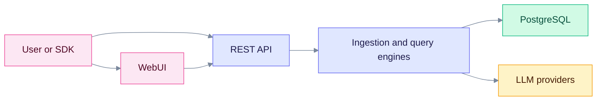

# Architecture

These pages explain how EdgeQuake is built: what runs, how data moves, and where it is stored. Start here if you want to understand the system before you change it or run it in production.

EdgeQuake is a Rust service that turns documents into a knowledge graph plus vectors, then answers questions from both. The released product is v0.32.2. Parts marked v0.33.0 are at repo HEAD and not yet released.

Read it left to right. Everything goes through the API. The engines use PostgreSQL for storage and an LLM provider for extraction and answers.

## Where to go next

| I want to know... | Read |
| ----------------- | ---- |
| What the pieces are and how they deploy | [Overview](./overview.md) |
| How a document becomes knowledge | [Data flow](./data-flow.md) |
| How a question becomes an answer | [Query flow](./query-flow.md) |
| Where data is stored and which tables exist | [Storage model](./storage-model.md) |
| Full PostgreSQL E/R diagrams by domain | [Schema E/R diagrams](../data-layer/schema-er.md) |
| How tenants, auth, and LLM provider choice work | [Tenancy and providers](./tenancy-and-providers.md) |
| How to trace an answer to its source | [Lineage tracking](./lineage-tracking.md) |
| What each crate does | [Crate list](./crates/index.md) and [crate dependency graphs](./crates/README.md) |
| Table names, indexes, and SQL | [Data layer deep dive](../deep-dives/data-layer.md) |
| How cancel, fairness, and restart work | [Ingestion cancel and fairness](../ingestion-cancel-and-fairness.md) |

## Facts to remember

- The workspace has 15 Rust crates under `edgequake/crates/`. LLM provider clients come from the external `edgequake-llm` crate.
- PostgreSQL is required. It holds relational data, vectors (pgvector), and the graph (Apache AGE). There is no in-memory server mode.
- Only `edgequake migrate` changes the database schema. The API never does.
- Each workspace has its own settings, embedding model, and vector table.
