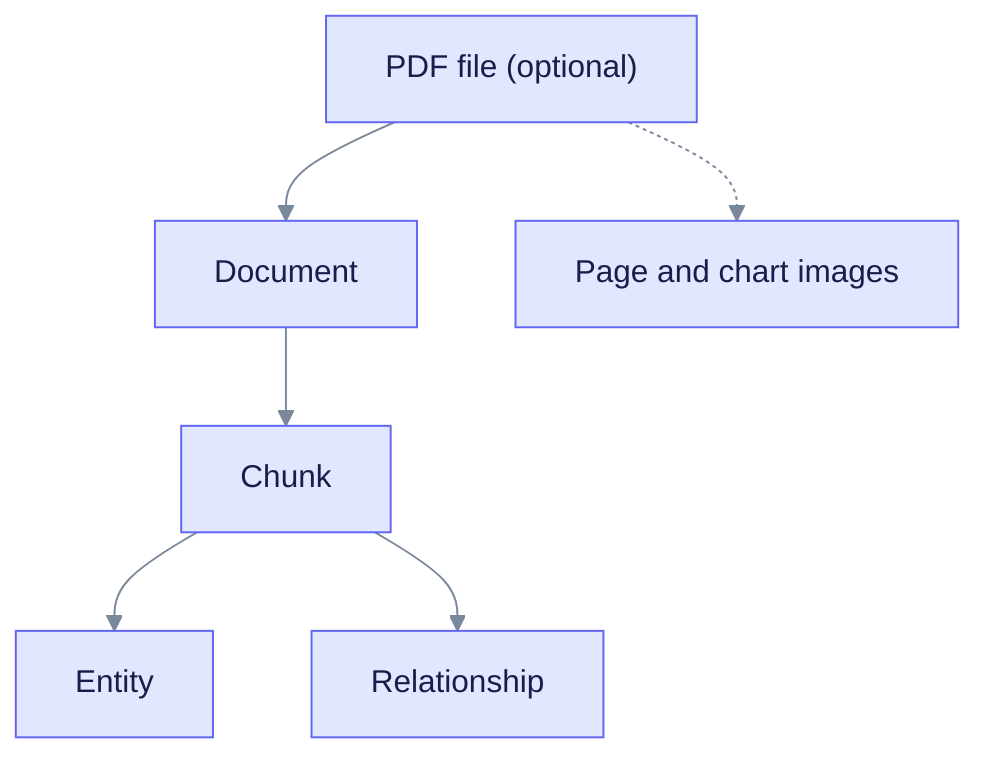
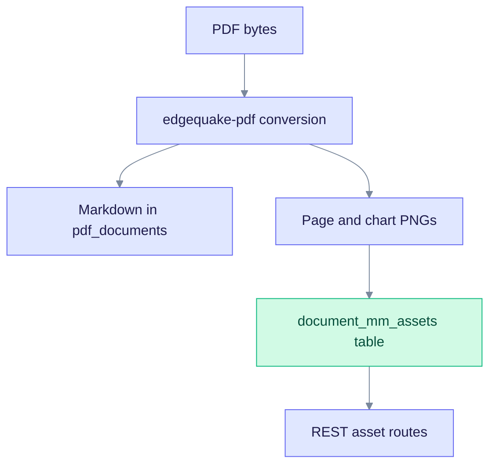
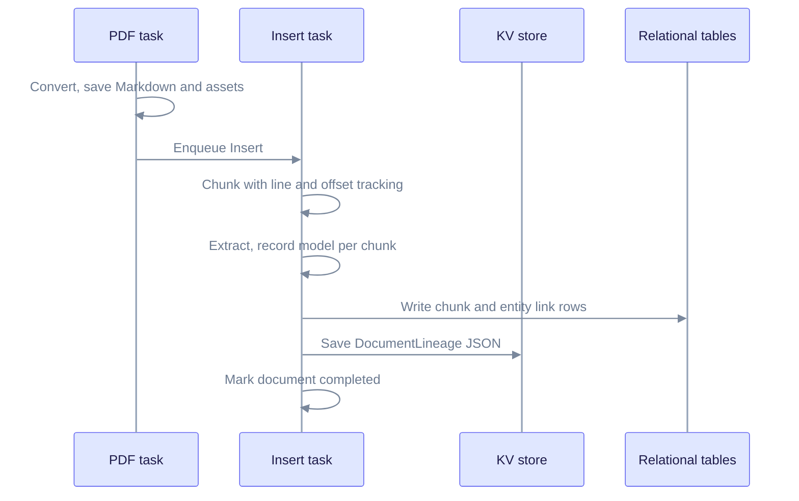

# Lineage Tracking

Lineage is the record of where each piece of knowledge came from. This page explains what is recorded, where it is stored, and how to read it. It is for developers who build on the lineage API, and for users who need to audit an answer.

For endpoint details and response examples, see the [Lineage API reference](../api-reference/lineage-endpoints.md).

---

## What lineage gives you

- **Audit.** Trace an entity back to the chunks, document, and line range that produced it.
- **Reproducibility.** See which extraction model, embedding model, and settings were used.
- **Debugging.** Find which stage of ingestion failed or produced poor output.
- **Quality checks.** Compare extraction results across models.

---

## The lineage chain

Each level points to its parent, so any item can be traced upward.

Read it top to bottom. A PDF produces one document, a document splits into chunks, and chunks produce entities and relationships. The dashed line shows images saved from a PDF.

What each level records:

| Level | Main fields |
| ----- | ----------- |
| PDF | `pdf_id`, filename, size, SHA-256 checksum, page count, Markdown after conversion |
| Document | `document_id`, source path, type, `pdf_id` link, models used, timestamps |
| Chunk | `chunk_id`, parent document, index, start and end line, start and end offset, page range, token count |
| Entity | `entity_id`, name, source chunk ids, source spans, extraction count, description history |
| Relationship | source and target entities, type, source chunk ids, description history |
| Extraction metadata (per chunk) | LLM model, gleaning passes, time, input and output tokens, cache hit |

Rules the pipeline keeps:

- Every chunk has a parent document.
- Every entity and relationship names at least one source chunk.
- A document made from a PDF links back to its `pdf_id`.
- Ids do not change once created. Document ids look like `doc-` followed by a hash of the content.

Entity names are stored as `UPPERCASE_WITH_UNDERSCORES`. When two chunks describe the same entity, the entity gains another source, and its **description history** records each version with its origin: extraction, merge, or summary.

---

## Modality and mm-assets

A vision PDF conversion can save page images and chart crops next to the Markdown. These are called mm-assets (multimodal assets).

Read it top to bottom. The Markdown and the images are saved by the same conversion step. The Markdown links to images with paths such as `assets/page-0001.png`.

Identity rules:

| Concept | Rule |
| ------- | ---- |
| `asset_id` | The file name without extension, for example `page-0001` for `assets/page-0001.png` |
| `document_id` | Scopes asset URLs. It is set when the PDF links to its document after conversion. |
| Storage | One row per `document_id` and asset path in `document_mm_assets` |
| Chunk link | A chunk may mention `assets/...`. Trace it to the PDF page through `pdf_id` and the asset path. |

Assets are served by `GET /api/v1/documents/{document_id}/assets/{asset_id}` and `GET /api/v1/documents/{document_id}/mm-assets/{*asset_path}`. See [mm-assets in the API reference](../api-reference/lineage-endpoints.md#multimodal-assets-mm-assets).

**Convert versus ingest.** Chunk and entity lineage is written during the Insert task, not during PDF conversion. A PDF row can be `Completed` while its document is still extracting. See [Convert then ingest](../ingestion-cancel-and-fairness.md#convert-then-ingest-spec-057-p2).

---

## When lineage is written

Read it top to bottom. Lineage is built while the Insert task runs and saved at the end. Setting `enable_lineage_tracking` in the pipeline config turns it on or off. It is on by default.

---

## Where lineage is stored

| Store | What | Key or table |
| ----- | ---- | ------------ |
| KV | The full `DocumentLineage` JSON | `{document_id}-lineage` |
| KV | Document metadata blob | `{document_id}-metadata` |
| Relational | Which chunk produced which entity | `chunk_entity_links` |
| Relational | Which chunk produced which relationship | `chunk_relation_links` |
| Relational | Entity description versions | `entities.description_history` |
| Graph and vectors | Entities and relationships keep their source chunk ids | Apache AGE, pgvector |

Chunk text itself lives in the relational `chunks` table by default. See [Storage model](./storage-model.md).

`DocumentLineage` holds the document id and name, the job id, a list of chunk lineages, maps of entity and relationship lineages, totals, and the providers and models used for extraction and embedding. Providers can differ, for example a cloud LLM with local embeddings.

---

## API endpoints

| Endpoint | Returns |
| -------- | ------- |
| `GET /api/v1/documents/{id}/lineage` | The whole lineage tree for a document in one call |
| `GET /api/v1/documents/{id}/metadata` | The merged metadata blob |
| `GET /api/v1/documents/{id}/lineage/export` | Lineage as a file, `format=json` (default) or `format=csv` |
| `GET /api/v1/chunks/{id}/lineage` | One chunk with its parent and position |
| `GET /api/v1/entities/{id}/provenance` | Source chunks and documents for an entity |
| `GET /api/v1/lineage/entities/{name}` | Lineage for an entity by name |
| `GET /api/v1/lineage/documents/{id}` | A document's contribution to the graph |

All lineage routes respect tenant and workspace isolation. See the [API reference](../api-reference/lineage-endpoints.md) for response shapes.

The Rust, TypeScript, and Python SDKs wrap these routes. For example, the Python SDK has `client.documents.get_lineage(document_id)`.

## In the WebUI

The document page has a metadata sidebar (`metadata-sidebar.tsx`). It shows extended metadata, a tree of document, chunks, and entities (`document-hierarchy-tree.tsx`), and a source grid (`source-info-grid.tsx`).

---

## Older documents

Lineage fields are optional. Documents ingested before a field existed return it as missing. No migration is needed. Re-ingest or reanalyze a document to fill the new fields.

## Related specs

- SPEC-032: per-workspace LLM and embedding providers
- SPEC-033: hybrid provider mode
- SPEC-047: modality-aware vision conversion and mm-assets
- SPEC-057: convert then ingest, and cancel semantics

## See also

- [Data flow](./data-flow.md)
- [Storage model](./storage-model.md)
- [Lineage API reference](../api-reference/lineage-endpoints.md)
