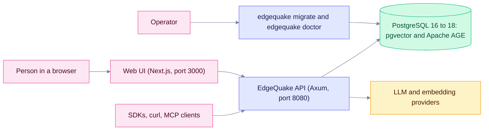
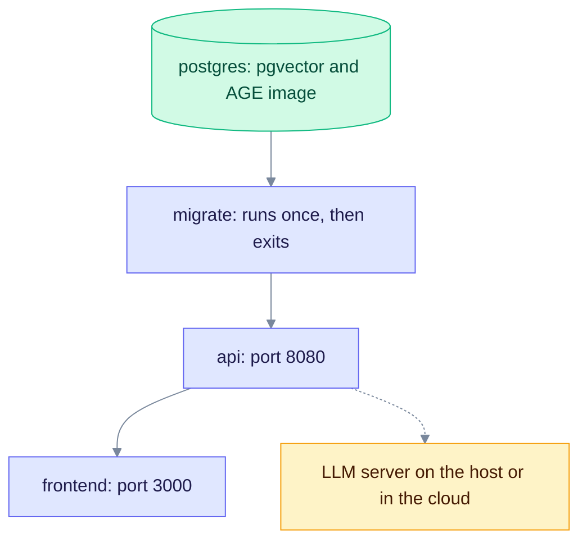
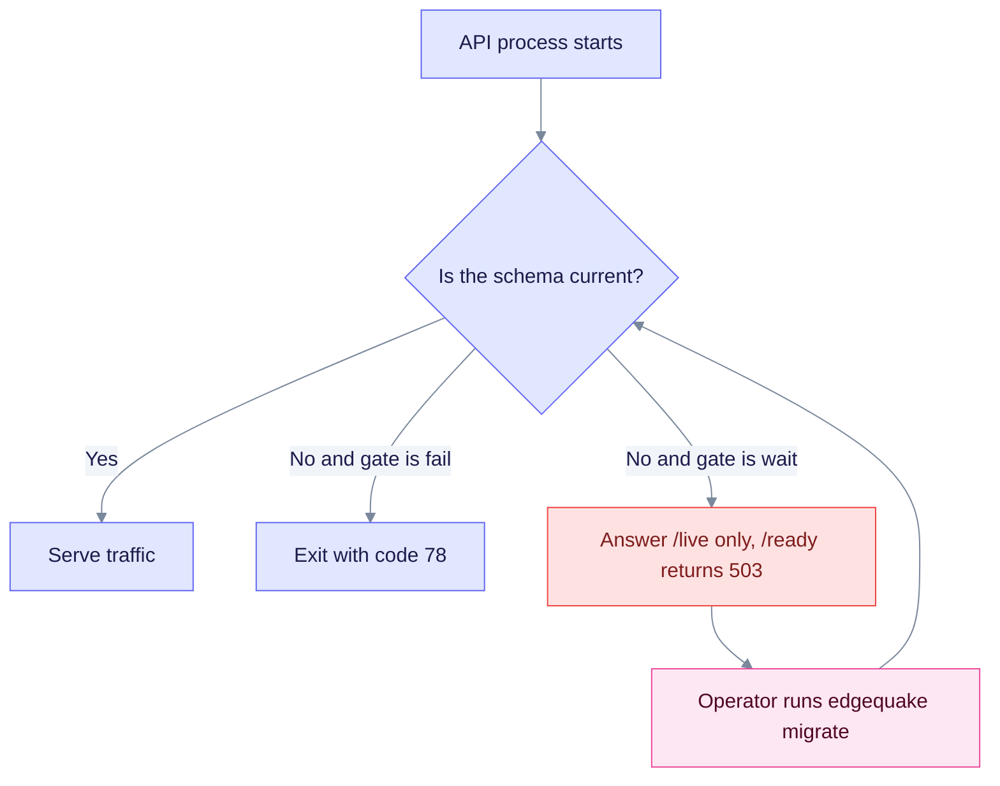
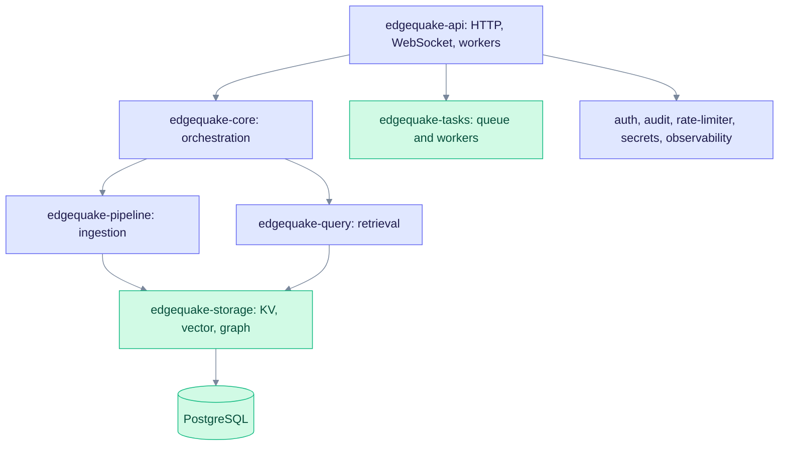

# Architecture Overview

This page shows the big picture of EdgeQuake: what runs where, how the Rust crates relate, and how a request moves through the system. Read it first if you plan to run, extend, or review EdgeQuake.

EdgeQuake is a Graph-RAG server. It reads your documents, builds a knowledge graph of entities and relationships, and answers questions by combining graph facts with matching text passages.

> **Version scope.** This page matches the released product `v0.32.2` plus the SPEC-163 changes now in the repository. SPEC-163 will ship as `v0.33.0`. Items from SPEC-163 are marked **(v0.33.0)**.

---

## System context

Here is what talks to what when EdgeQuake runs.

Read it left to right: people and tools call the API, and the API stores everything in PostgreSQL. The API calls out to LLM providers (cloud or local) for extraction, embeddings, and answers. The `migrate` command is the only thing that changes the database schema.

Key facts:

- **One database.** PostgreSQL holds relational tables, vectors (`pgvector`), and the graph (`Apache AGE`). There is no in-memory server mode; `DATABASE_URL` is required.
- **One backend binary.** The `edgequake` binary is the API server. It also has the subcommands `migrate`, `doctor`, `healthcheck`, and `pre-stop`.
- **Providers are pluggable.** LLM providers come from the external `edgequake-llm` crate (version `0.10.9`). Supported provider ids include `openai`, `anthropic`, `ollama`, `lmstudio`, `gemini`, `mistral`, `azure`, `bedrock`, and local servers such as `llamacpp`, `omlx`, and `mlx-lm`. The full list is in `edgequake/models.toml`.

---

## Deployment topology

The quickstart Docker Compose file runs four containers.

Read it top to bottom: PostgreSQL starts first, `migrate` applies the schema and exits, then the API starts, then the frontend. The dashed line is the API calling an LLM provider.

How startup works (SPEC-150):

Read it as a decision loop: the API never changes the schema itself. With `EDGEQUAKE_SCHEMA_GATE=fail` (the default) it exits. With `wait` (used by Compose and Helm) it stays alive but not ready until `edgequake migrate` finishes. See [Upgrading](../operations/upgrading.md) and [Configuration](../operations/configuration.md).

**Health checks.** `/live` says the process is up. `/ready` says it can serve traffic. `/health` gives component detail. **(v0.33.0)** `/health` now probes the LLM provider instead of assuming it works, and adds a `security_posture` block (auth, dev mode, secrets key, default JWT secret, rate limiting).

**Doctor (v0.33.0).** `edgequake doctor` runs preflight checks and prints `[ok]` or `[FAIL]` per check. Add `--json` for machine output.

---

## Inside the API

Every call to `/api/v1/*` passes the same layers before it reaches a handler.

```mermaid
%%{init: {"theme":"base","themeVariables":{"primaryColor":"#E0E7FF","primaryBorderColor":"#6366F1","primaryTextColor":"#1E1B4B","secondaryColor":"#D1FAE5","secondaryBorderColor":"#10B981","secondaryTextColor":"#064E3B","tertiaryColor":"#FEF3C7","tertiaryBorderColor":"#F59E0B","tertiaryTextColor":"#6B7A90","lineColor":"#7A889C","clusterBkg":"rgba(99,102,241,0.07)","clusterBorder":"#A5B4FC","noteBkgColor":"#FEF9C3","noteTextColor":"#422006","textColor":"#6B7A90","titleColor":"#6B7A90","signalColor":"#7A889C","signalTextColor":"#6B7A90","loopTextColor":"#6B7A90","edgeLabelBackground":"#F1F5F9","actorLineColor":"#94A3B8"}}}%%
%% eq-theme:v1
flowchart LR
    req["HTTP request"] --> auth["protected_api_auth"]
    auth --> rate["tenant rate limit"]
    rate --> handler["Handler"]
    handler --> svc["Services and engines"]
    svc --> store["Storage traits"]
%% eq-classes
classDef eqStore fill:#D1FAE5,stroke:#10B981,color:#064E3B
class store eqStore
```

Read it left to right: authentication runs first, then the per-tenant rate limit, then the handler. Handlers call services, and services use the storage traits.

- **Authentication** (`edgequake-auth`): JWT sessions, API keys, and OIDC single sign-on. It can be switched off with `EDGEQUAKE_AUTH_ENABLED=false` for local development.
- **Tenant context:** the headers `X-Tenant-ID`, `X-Workspace-ID`, and `X-User-ID` select the scope. When a JWT carries tenant or workspace claims, they must match the headers. The authenticated user always replaces `X-User-ID`.
- **Rate limit** (`edgequake-rate-limiter`): a token bucket per tenant. Over the limit returns HTTP 429.
- **Other entry points:** `/mcp` (MCP over HTTP), `/api/*` (Ollama-compatible API, can be disabled), `/ws/progress/{track_id}` and `/ws/pipeline/progress` (WebSocket progress), `/metrics`, and the Swagger UI.

See [Tenancy and providers](./tenancy-and-providers.md) for the full tenant model.

---

## Crates at a glance

The Rust workspace has 15 crates under `edgequake/crates/`, plus the root `edgequake` binary. Each crate has one job.

Read it top to bottom: the API sits on top and uses the engine crates. Everything that persists goes through `edgequake-storage`. This is a simplified view; the exact dependency graph is on the [Crate Reference](./crates/README.md) page.

Two things are not crates in this repository:

- **`edgequake-llm`** is an external crate from crates.io. It defines the `LLMProvider` and `EmbeddingProvider` traits and all provider clients.
- **`edgequake-pdf2md`** is also external. `edgequake-pdf` wraps it for PDF-to-Markdown conversion.

---

## Design choices

**Traits at the edges.** Storage is behind the traits `KVStorage`, `VectorStorage`, and `GraphStorage`. Providers are behind `LLMProvider` and `EmbeddingProvider`. Tests use in-memory and mock implementations; production uses PostgreSQL. See [Storage model](./storage-model.md).

**Facade for library use.** The `EdgeQuake` struct in `edgequake-core` offers `insert` and `query` for embedding the engine in your own Rust program. The API server does not call `insert` directly; it runs ingestion as background tasks (see [Data flow](./data-flow.md)).

**Strategy for query modes.** Six modes (`naive`, `local`, `global`, `hybrid`, `mix`, `bypass`) share one engine. `mix` is the default. See [Query flow](./query-flow.md).

**Durable tasks.** Uploads become rows in a Postgres task table. Workers claim a row, hold a lease, and can be cancelled. The in-process channel only wakes workers. See [Data flow](./data-flow.md).

**Explicit schema.** `edgequake migrate` is the only schema writer. At boot the API compares the database to the migrations built into the binary. It refuses to serve when required migrations are pending, or when the database is newer than the binary.

**Per-workspace pipelines.** Each workspace picks its own LLM, embedding model, and extraction settings. The API builds a pipeline for that workspace at run time. See [Tenancy and providers](./tenancy-and-providers.md).

---

## Where to go next

- [Data flow](./data-flow.md): upload, convert, ingest, and the task queue.
- [Query flow](./query-flow.md): one sequence diagram per query mode.
- [Storage model](./storage-model.md): traits and the main tables.
- [Tenancy and providers](./tenancy-and-providers.md): tenants, workspaces, auth, and connection resolution.
- [Crate Reference](./crates/README.md): what each crate does.
- [Lineage tracking](./lineage-tracking.md): from answer back to source.
- [Ingestion cancel and fairness](../ingestion-cancel-and-fairness.md): operations notes for the worker pool.

## Code map

| Component | Location |
| --------- | -------- |
| `EdgeQuake` facade | `edgequake/crates/edgequake-core/src/orchestrator/` |
| `QueryMode` enum | `edgequake/crates/edgequake-query/src/modes.rs` |
| `Pipeline` | `edgequake/crates/edgequake-pipeline/src/pipeline/` |
| Storage traits | `edgequake/crates/edgequake-storage/src/traits/` |
| Routes | `edgequake/crates/edgequake-api/src/routes.rs` |
| Auth and tenant middleware | `edgequake/crates/edgequake-api/src/middleware.rs` |
