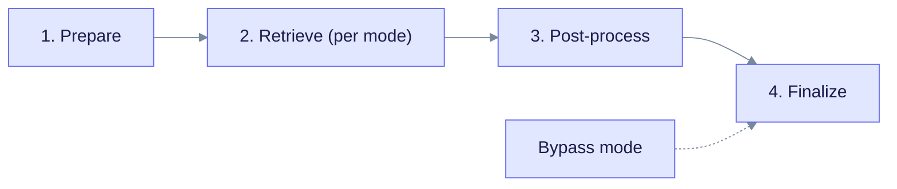
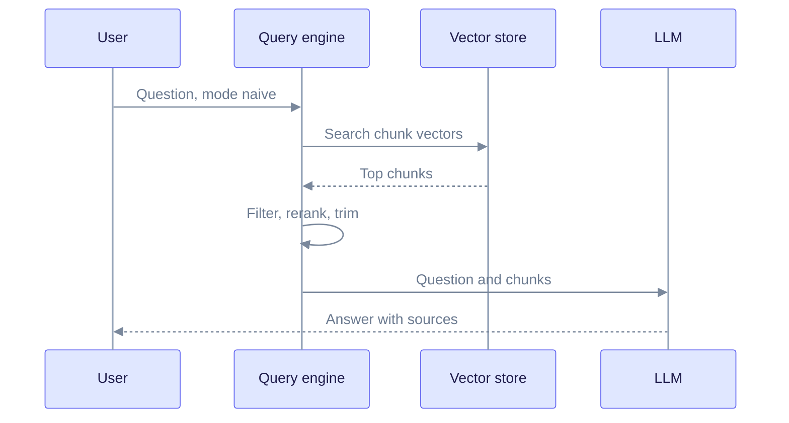
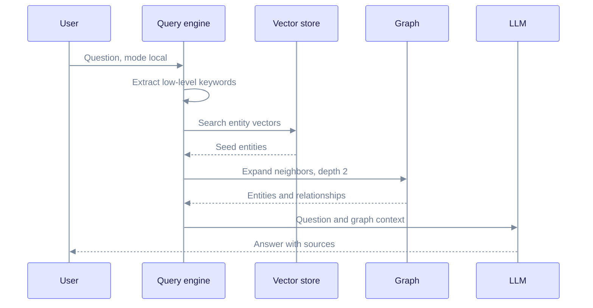
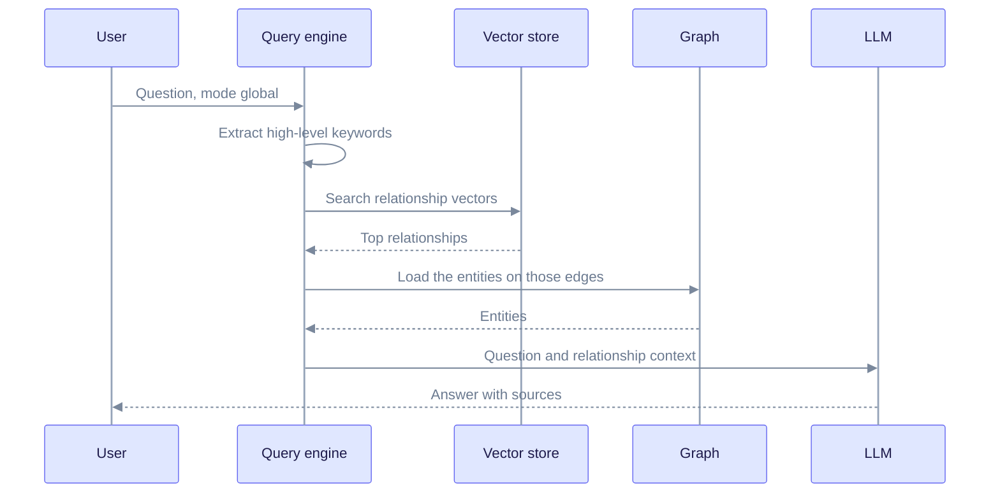
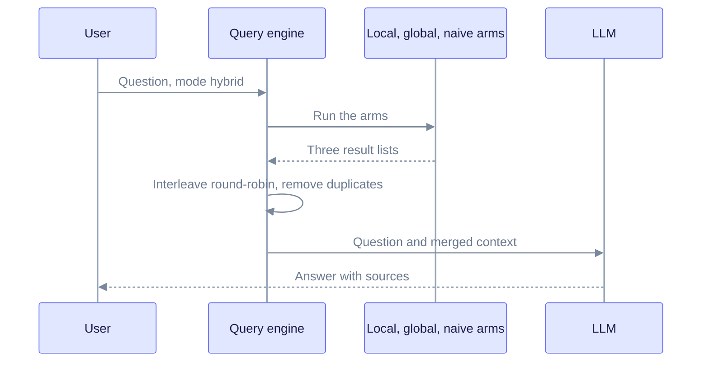
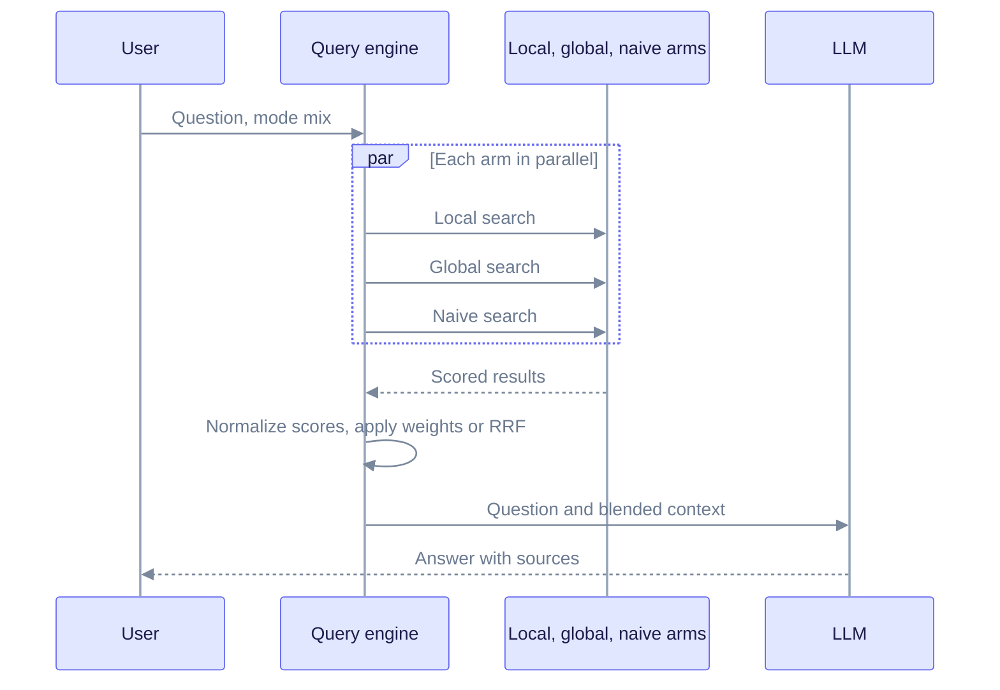
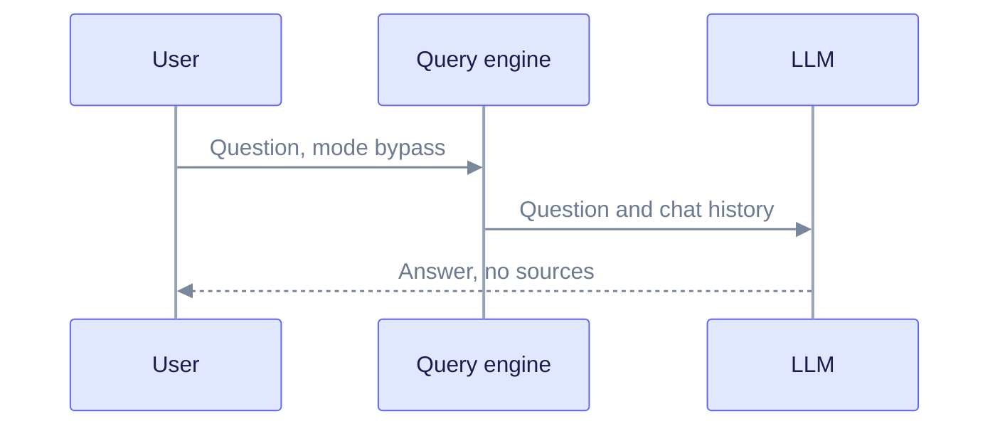

# Query Flow

This page shows what happens between a question arriving and an answer leaving. It is for developers who change retrieval, and for users who want to pick the right query mode.

The code lives in `edgequake-query` (`engine_impl/query_entry/query_pipeline.rs` and `engine_impl/modes/`). The HTTP entry points are `POST /api/v1/query`, `POST /api/v1/query/stream`, and `POST /api/v1/chat/completions`.

---

## The shared pipeline

Every mode runs the same four stages. Only the retrieval stage differs.

Read it left to right. Bypass skips straight to the final stage.

| Stage | What happens |
| ----- | ------------ |
| Prepare | The question is embedded. In parallel, an LLM extracts keywords: **high-level** (themes) and **low-level** (specific names). Keywords are cached for 24 hours. If the request supplies keywords, the keyword LLM call is skipped. |
| Retrieve | The mode decides which stores to search. See the diagrams below. |
| Post-process | Filter to requested document ids, drop low-relevancy items, rerank, sort, and trim to the token budget. |
| Finalize | The LLM writes the answer from the context. An answer cache may return a stored answer first, and a sample of answers is checked for faithfulness. |

Engine defaults: up to 60 entities, 60 relationships, and 20 chunks; a 30,000 token context budget; graph depth 2; minimum score 0.1; reranking on with the top 20 kept. Per-request settings can override these.

---

## Which mode to use

| Mode | Best for | Searches |
| ---- | -------- | -------- |
| `naive` | A specific fact in the text | Chunk vectors only |
| `local` | A question about named things | Entity vectors, then the graph around them |
| `global` | A broad theme | Relationship vectors |
| `hybrid` | Mixed questions | Local, global, and naive, interleaved |
| `mix` (default) | General use | Local, global, and naive, blended by score |
| `bypass` | Chat with no documents | Nothing. The LLM answers alone. |

The names differ slightly from LightRAG. In EdgeQuake, `hybrid` includes the naive arm and interleaves round-robin; `mix` blends all three arms with weights or reciprocal rank fusion (RRF). Always send an explicit `mode` when you compare systems.

---

## Naive mode

Naive mode is plain vector search over chunks. It is fast and has no graph step.

Read it top to bottom. One search feeds the LLM directly.

## Local mode

Local mode starts from entities that match the specific names in the question, then walks the graph around them.

Read it top to bottom. The keywords pick the seeds, and the graph adds their neighbors.

## Global mode

Global mode answers broad questions. It searches relationship descriptions, not community summaries.

Read it top to bottom. If the vector search finds nothing, the engine falls back to the highest-degree relationships.

Global mode can optionally expand to entities in the same index-time community, and add extractive community reports when `EDGEQUAKE_COMMUNITY_REPORTS` is on. This is not the same as Microsoft GraphRAG, which builds a hierarchy of LLM-written community reports. See [EdgeQuake vs GraphRAG](../comparisons/vs-graphrag.md).

## Hybrid mode

Hybrid mode runs local, global, and naive retrieval, then interleaves the results one by one.

Read it top to bottom. The arms are chosen using the question's intent, so an arm that does not fit may be skipped.

## Mix mode

Mix mode is the default. It runs the same three arms in parallel, then scores and blends them.

Read it top to bottom. Weights come from `EDGEQUAKE_MIX_LOCAL_WEIGHT`, `EDGEQUAKE_MIX_GLOBAL_WEIGHT`, and `EDGEQUAKE_MIX_NAIVE_WEIGHT`. A slow arm has a time limit, so it cannot stall the whole query.

## Bypass mode

Bypass mode skips retrieval. Use it for plain chat or to test the LLM connection.

Read it top to bottom. There is no search step and no sources are returned.

---

## Streaming

`POST /api/v1/query/stream` and `/api/v1/chat/completions/stream` follow the same stages. Preparation, retrieval, and post-processing finish first. Then the LLM answer is sent as it is produced. The streaming path can use the role-specific models described in [Tenancy and providers](./tenancy-and-providers.md#querying-the-answer-model).

## Context-only retrieval

`POST /api/v1/query/context` runs stages 1 to 3 and returns the retrieved context without calling the answer LLM. Use it when another system writes the answer.

## See also

- [Data flow](./data-flow.md): how the data got into the stores
- [Storage model](./storage-model.md)
- [Query modes deep dive](../deep-dives/query-modes.md)
- [Lineage tracking](./lineage-tracking.md): from an answer back to the source
