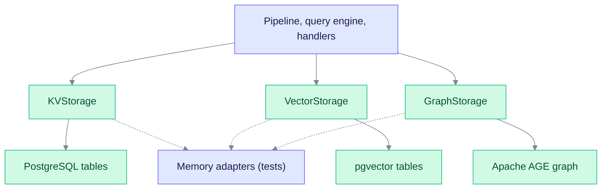
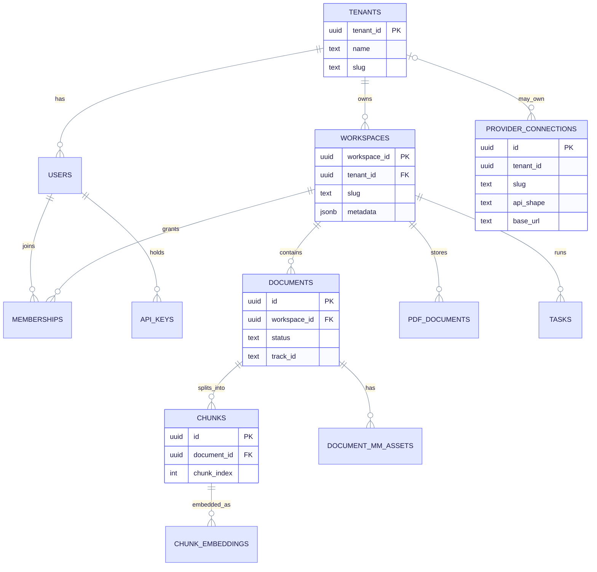

# Storage Model

This page explains where EdgeQuake keeps its data and how the code reaches it. It is for developers who read or change storage code, and for operators who inspect the database.

EdgeQuake stores everything in one PostgreSQL database. Three storage traits hide the database from the rest of the code. For physical table names, indexes, and SQL, see the [Data layer deep dive](../deep-dives/data-layer.md).

---

## Three traits, one database

The engine never talks to PostgreSQL directly. It uses traits defined in `edgequake-storage`.

Read it top to bottom: callers use the trait, and the trait is backed by a PostgreSQL adapter in production. The dashed lines are the in-memory adapters that tests use.

| Trait | What it stores | Production adapter |
| ----- | -------------- | ------------------ |
| `KVStorage` | Document metadata, lineage JSON, caches, small state blobs | PostgreSQL |
| `VectorStorage` | Embeddings for chunks, entities, and relationships | pgvector |
| `GraphStorage` | Entities as nodes and relationships as edges | Apache AGE |

`GraphStorage` is a bundle of smaller traits for reading, scanning, mutating, and analysing the graph. Code that only reads the graph takes a read-only view.

Other adapters exist behind feature flags (SQLite, Qdrant, Neo4j). They are not part of the default server, which assembles only PostgreSQL profiles.

---

## Where each kind of data lives

| Data | Home | Notes |
| ---- | ---- | ----- |
| Tenants, workspaces, users, memberships | Relational tables | Created by `edgequake migrate` |
| Documents and their status | Relational `documents` table, plus KV metadata | The API reconciles the two when it lists documents |
| Chunk text | Relational `chunks` table | The default authority is `relational` (`EDGEQUAKE_CHUNK_TEXT_AUTHORITY`) |
| Chunk, entity, and relationship vectors | pgvector tables | One vector table per workspace, sized to that workspace's embedding model |
| Entities and relationships | Apache AGE graph | One graph per storage namespace |
| Raw PDFs and page assets | `pdf_documents`, `document_mm_assets` | Binary data stored in PostgreSQL |
| Background tasks | `tasks` table | Partitioned by month |
| LLM answer and extraction cache | `llm_cache` and KV | Switched by `EDGEQUAKE_LLM_CACHE` |
| Provider connections **(v0.33.0)** | `provider_connections` | API keys are encrypted |

Why one vector table per workspace: workspaces may use different embedding models with different vector sizes. Mixing sizes in one table would corrupt similarity scores.

---

## Main tables

This diagram shows the main relational tables and how they connect.

Read it as "one tenant owns many workspaces, and each workspace owns its documents, chunks, tasks, and PDFs". Lines marked `o|` are optional: a connection may belong to a tenant or be global. The columns shown are a subset.

The full column-level schema, split by domain, is in [Schema entity-relationship diagrams](../data-layer/schema-er.md).

Things the diagram leaves out:

- **The graph.** Entities and relationships are AGE nodes and edges, not rows in these tables. Each node and edge records the chunk ids it came from.
- **Link tables.** `chunk_entity_links` and `chunk_relation_links` record which chunks produced which entities and relationships. They support lineage queries.
- **Row-level security.** Tenant-owned tables have row-level security policies, and `FORCE ROW LEVEL SECURITY` is set on several of them (migration 096). The storage layer sets the tenant and workspace as session variables inside a transaction, and the policies read them.
- **`tasks` details.** The API looks up a task by its `track_id`. The `tenant_id` and `workspace_id` columns have foreign keys, added by migration `104` when the table was partitioned by month.

---

## Provider connections table (v0.33.0)

Migration `169_spec163_provider_connections.sql` adds one table. It is expand-only: it adds a table and changes nothing else.

| Column | Meaning |
| ------ | ------- |
| `id` | Connection id. Workspace roles refer to it as `connection_id`. |
| `tenant_id` | Optional owner. Unique together with `slug`. |
| `slug`, `display_name` | Short name and label |
| `api_shape` | Wire format, such as `openai_chat` or `anthropic_messages` |
| `locality` | `local` or `cloud` |
| `base_url` | Server address, checked by the SSRF validator when saved |
| `auth_scheme` | How the key is sent |
| `api_key_ciphertext`, `api_key_nonce`, `key_id` | AES-256-GCM envelope for the API key |
| `key_fingerprint` | Short hash so the UI can show which key is stored |
| `allow_private_network` | Whether loopback and private addresses are allowed |
| `last_test_at`, `last_test_ok`, `last_test_error` | Result of the last connection test |

See [Tenancy and providers](./tenancy-and-providers.md) for how a connection is used.

---

## Rules to keep in mind

- **The API never creates tables when it serves traffic.** Only `edgequake migrate` writes the schema.
- **Every read and write carries a scope.** The scope is the tenant and workspace. Storage adapters filter on it.
- **Entity names are normalized** to `UPPERCASE_WITH_UNDERSCORES` before they are stored.
- **Failed multi-step writes are compensated.** If a later step fails, earlier writes are undone or recorded for cleanup instead of leaving silent partial data.

## See also

- [Data layer deep dive](../deep-dives/data-layer.md)
- [Graph storage](../deep-dives/graph-storage.md)
- [Vector storage](../deep-dives/vector-storage.md)
- [Data flow](./data-flow.md)
