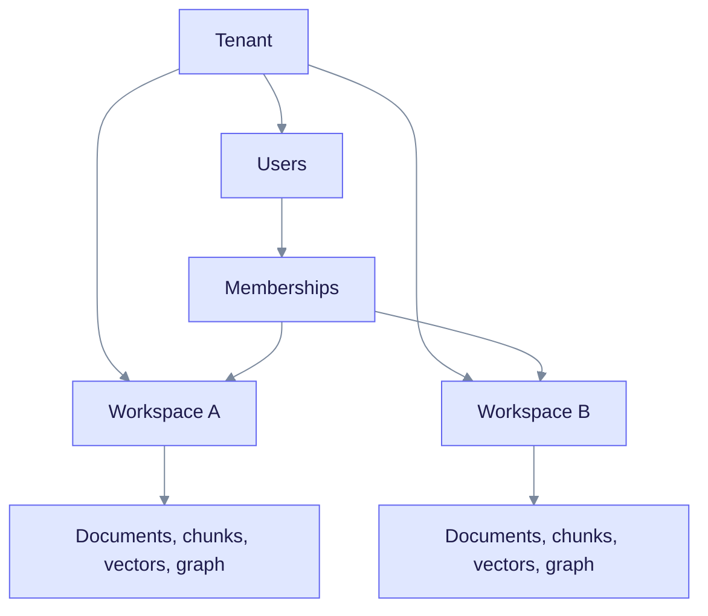
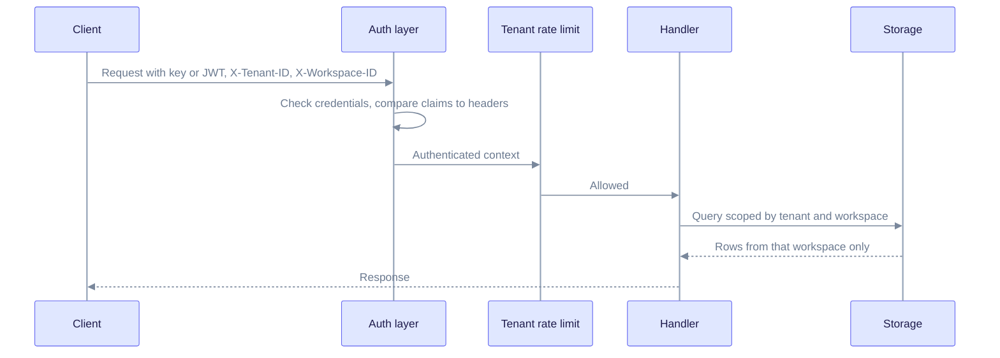
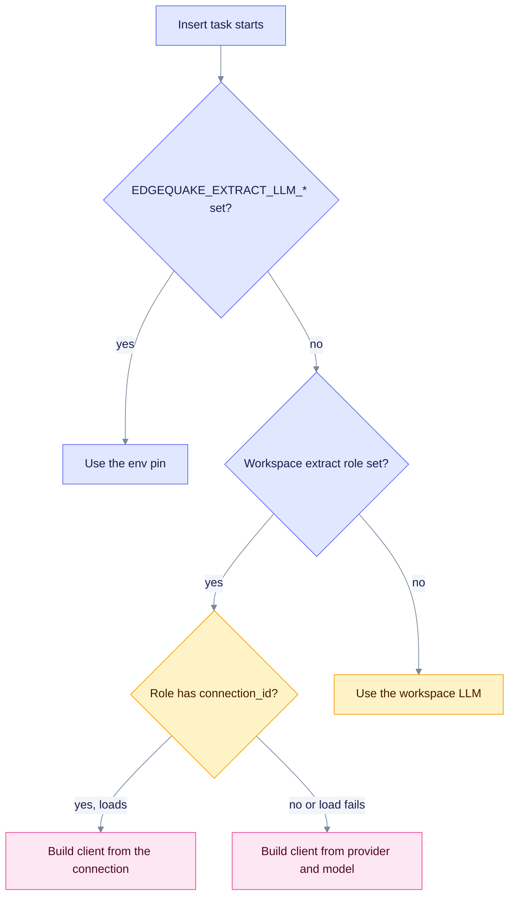
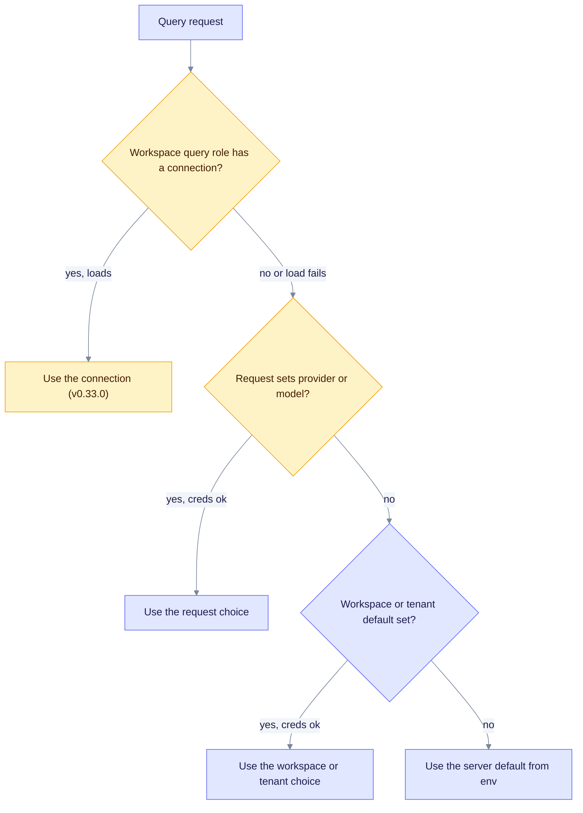
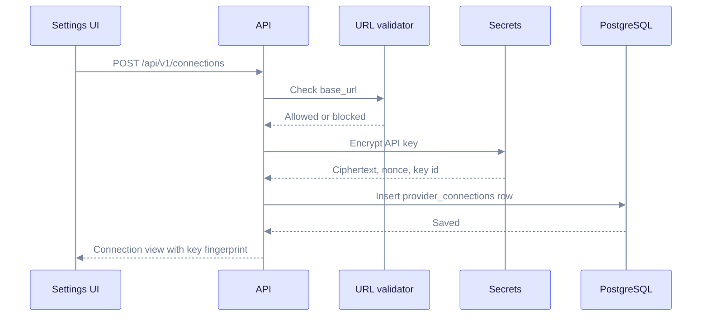

# Tenancy and Providers

This page explains two things: who can see which data, and which LLM EdgeQuake calls for a given job. It is for developers who change request handling or provider code, and for operators who set up multi-user deployments.

Parts marked **(v0.33.0)** exist at repo HEAD and ship in v0.33.0. The released product pin is v0.32.2.

---

## Tenants, workspaces, and users

A **tenant** is an organization. A **workspace** is an isolated knowledge base inside a tenant. A **user** gets access to workspaces through a **membership**.

Read it from the top: each workspace has its own data. A user sees a workspace only through a membership.

Each workspace also holds its own settings:

- LLM provider and model for extraction and answers
- Embedding provider, model, and dimension
- Vision provider and model, and the PDF parser backend
- Optional per-role overrides in `metadata.llm_roles`

Because each workspace has its own embedding model and vector table, you can change models in one workspace without touching another. See [Storage model](./storage-model.md).

---

## How a request is scoped

Every `/api/v1` request is authenticated first, then rate limited per tenant, then bound to a tenant and workspace.

Read it left to right. The auth layer runs first, so unauthenticated calls never reach the handler.

Key rules:

- **Credentials** are a JWT or an API key. The key can be sent as `Authorization: Bearer <key>` or as `X-API-Key`.
- **Headers**: `X-Tenant-ID` and `X-Workspace-ID` choose the scope. With a JWT, the claims must match the headers. The authenticated user id always replaces any `X-User-ID` header the client sends.
- **Membership**: the request is bound only if the user belongs to the workspace (SPEC-154).
- **Roles** are `Admin`, `User`, and `Readonly`.
- **Auth is on by default.** `EDGEQUAKE_AUTH_ENABLED` decides, and it wins over `EDGEQUAKE_DEV_MODE`. Dev mode is the one local bypass.
- **Database isolation**: the storage layer sets the tenant and workspace as session variables, and PostgreSQL row-level security policies read them.

At startup the server refuses to run with an unsafe setup, such as a default or short JWT secret or auth turned off against a non-local database. `EDGEQUAKE_DEV_MODE` lifts this for local work.

---

## Provider choice: two separate paths

EdgeQuake uses an LLM for extraction while ingesting, and an LLM for answers while querying. The two paths are separate on purpose. A cheap, steady model can extract while a stronger one answers.

A **role** names the job. There are five: `extract`, `query`, `summary`, `vlm`, and `keyword`. A workspace can set a role in `metadata.llm_roles`.

### Ingestion: the extract model

The workspace pipeline factory picks the extraction LLM when a document starts processing.

Read it top to bottom. The first matching branch wins. The environment pin always beats the workspace role, so an operator can force one extraction model fleet-wide.

Local providers such as Ollama, LM Studio, and oMLX get safer defaults than cloud providers: one extraction at a time, a 600 second timeout, and gleaning off. Cloud providers default to 16 concurrent extractions, a 180 second timeout, and three retries.

### Querying: the answer model

The query resolver runs when a chat or query request arrives.

Read it top to bottom. If a provider has no credentials in this runtime, the resolver skips it and tries the next step instead of failing the query.

Within the request, workspace, tenant, and env steps, the order of precedence is Request, then Workspace, then Tenant, then Env. The keyword model at query time follows: env pin, then `llm_roles.keyword`, then the query LLM.

### Embeddings

The embedding provider is always taken from the workspace, because the vector size must match the stored vectors. The order is Workspace, then Tenant, then Env.

---

## Provider connections (v0.33.0)

A **connection** is a saved, named endpoint for an LLM server: its URL, its wire format, and an encrypted API key. Before v0.33.0, endpoints and keys came only from environment variables.

### Saving a connection

Only admins can use the connection routes.

Read it top to bottom. The API never returns the key. It returns only a short fingerprint so you can tell which key is stored.

| Route | Purpose |
| ----- | ------- |
| `GET /api/v1/connections` | List saved connections, plus connections detected from environment variables (marked `source: env`) |
| `POST /api/v1/connections` | Create one |
| `PUT /api/v1/connections/{id}` | Update one |
| `DELETE /api/v1/connections/{id}` | Delete one |
| `POST /api/v1/connections/{id}/test` | List models and send a chat and embedding ping |
| `POST /api/v1/providers/test` | Test unsaved settings |

Safety rules:

- **Encryption**: keys use AES-256-GCM. The master key comes from `EDGEQUAKE_SECRETS_KEY`. Without it, saving a key returns a `400` error.
- **URL checks**: only `http` and `https` are accepted. Cloud metadata hostnames, `.internal` hostnames, and link-local addresses are always blocked. The check reads the URL text; it does not resolve DNS names. Loopback and private addresses are allowed only when the connection is marked local (`allow_private_network`) or the server runs in dev mode.
- **No secrets in logs**: keys travel in a `SecretString` that prints as redacted.

### Where connections apply today

| Role | Uses a connection? |
| ---- | ------------------ |
| Extract (ingestion) | Yes |
| Query (answers) | Yes |
| Summary, keyword, vision | No, these still use provider and model settings |
| Embeddings | No. The connection factory has an embedding builder, but no code path calls it yet. |

---

## Health and doctor (v0.33.0)

`GET /health` now reports whether the LLM provider is reachable, not only whether it is configured. It also returns a `security_posture` block (auth enabled, dev mode, secrets key configured, default JWT secret, rate limit enabled).

`edgequake doctor [--json]` is a preflight command. It checks your setup from the command line so you can find problems before you start the stack.

## See also

- [Architecture overview](./overview.md)
- [Storage model](./storage-model.md)
- [Query flow](./query-flow.md)
- [Configuration](../operations/configuration.md)
