# EdgeQuake and LightRAG: Implementation Differences (Feb 2026 Snapshot)

This is a historical page. It records design differences found in a code audit in February 2026 and keeps them correct for the current code. It is for contributors who want to know why EdgeQuake does something differently from LightRAG.

An earlier version of this page was titled a "superiority analysis" and scored EdgeQuake as winning 13 of 17 areas. That was wrong, and it has been removed. A design difference is not a quality win. The only measured result is the [Acc benchmark](./eq-vs-lightrag-acc-bench.md), and it shows a **statistical tie** on accuracy, with LightRAG ahead on evidence recall and context relevancy.

For current guidance, read [vs LightRAG (Python)](./vs-lightrag-python.md).

---

## How to read this page

Each row says what each project does. "Differs" means the designs are not the same, not that one is better. The LightRAG column follows the LightRAG README and paper; where we could not confirm a detail, the row says so.

```mermaid
%%{init: {"theme":"base","themeVariables":{"primaryColor":"#E0E7FF","primaryBorderColor":"#6366F1","primaryTextColor":"#1E1B4B","secondaryColor":"#D1FAE5","secondaryBorderColor":"#10B981","secondaryTextColor":"#064E3B","tertiaryColor":"#FEF3C7","tertiaryBorderColor":"#F59E0B","tertiaryTextColor":"#6B7A90","lineColor":"#7A889C","clusterBkg":"rgba(99,102,241,0.07)","clusterBorder":"#A5B4FC","noteBkgColor":"#FEF9C3","noteTextColor":"#422006","textColor":"#6B7A90","titleColor":"#6B7A90","signalColor":"#7A889C","signalTextColor":"#6B7A90","loopTextColor":"#6B7A90","edgeLabelBackground":"#F1F5F9","actorLineColor":"#94A3B8"}}}%%
%% eq-theme:v1
flowchart LR
    q["Question"] --> prep["Prepare: keywords and embedding"]
    prep --> ret["Retrieve: local, global, naive"]
    ret --> ctx["Build context"]
    ctx --> ans["Answer"]
%% eq-classes
classDef eqLlm fill:#FEF3C7,stroke:#F59E0B,color:#451A03
class prep eqLlm
```

Both projects follow this shape. The rows below describe where the steps differ.

---

## Query side

| Step | EdgeQuake | LightRAG | Note |
| ---- | --------- | -------- | ---- |
| Keywords | One LLM call returns high-level and low-level keywords, cached for 24 hours. A request can pass its own keywords to skip the call. | LLM keyword extraction, also cached | Same idea |
| Modes | `naive`, `local`, `global`, `hybrid`, `mix`, `bypass` | `local`, `global`, `hybrid`, `naive`, `mix` | Differs: EdgeQuake `hybrid` includes the naive arm |
| `mix` blending | Parallel arms, blended by weight or rank fusion | Graph and vector retrieval together | Differs |
| Mode choice | Optional intent-based arm selection (`use_adaptive_mode` is on by default) | Chosen by the caller | Differs |
| Reranking | On by default, built-in lexical reranker. Optional neural reranker with `EDGEQUAKE_RERANKER=cross_encoder`. | Reranker supported | Differs |
| Context budget | 60 entities, 60 relationships, 20 chunks, 30,000 tokens, graph depth 2, minimum score 0.1 | Configurable per query | Values differ by setting |
| Streaming | Server-sent events, with several streaming entry points in the engine | Supported through the LLM provider | Differs in plumbing |
| Arm timing | Retrieval arms run in parallel with a time limit per arm | Not compared | Not verified |

---

## Ingestion side

| Step | EdgeQuake | LightRAG | Note |
| ---- | --------- | -------- | ---- |
| Chunk size | 800 estimated tokens, overlap 100, minimum 100. The benchmark pins 1200 and 100 to match LightRAG. | Token-based, 1200 by default per the LightRAG docs | The defaults differ |
| Chunk strategies | Five: `Fixed`, `Recursive` (default), `Markdown`, `Pdf`, `Semantic` | Token-based with an optional split character | Differs |
| Extractors | LLM, SOTA, simple, gleaning (a wrapper), and decision mode (SPEC-160) | LLM extraction | Differs |
| Gleaning | Optional extra passes, capped at 2 | Optional extra pass | Same idea |
| Entity matching | Normalized name. Optional embedding match and optional LLM adjudication, both off by default. | Name based | Similar by default |
| Description merge | Fragments are joined with a separator. An LLM summary replaces them when there are 8 fragments or the token budget is exceeded. | LLM summary after a fragment threshold | Same approach |
| Source tracking | Chunk ids stored per entity and relationship, plus link tables and a lineage API | Chunk ids stored on graph items | Both track sources |
| Local models | Lower concurrency, longer timeouts, gleaning off by default | Not compared | Not verified |

---

## System side

| Area | EdgeQuake | LightRAG |
| ---- | --------- | -------- |
| Language | Rust | Python |
| Storage | PostgreSQL only | Many backends |
| Isolation | Tenants, workspaces, row-level security | Workspace data isolation |
| Ingestion jobs | Task queue with leases, cancel, and tenant fairness | Not compared |
| PDFs | Built-in conversion | RAG-Anything integration |

---

## What changed since February 2026

The original audit described several things that are no longer true:

- **Chunk size.** It listed EdgeQuake's default as 1200. The current default is 800.
- **Merging.** It said EdgeQuake keeps the longer description and that LightRAG leads on merging. EdgeQuake now uses the same LLM summary approach.
- **Strategies and extractors.** It counted 4 strategies and 3 extractors. There are now 5 and more.
- **Speed and test counts.** It claimed "5 to 10 times lower latency" and counted unit tests. Neither claim was backed by a published measurement, so both are removed. The measured cold latency is about equal (1.02x).
- **Evaluation numbers.** It quoted scores from a single French-language business dataset (Emil Frey, 100 questions) taken before several fixes. They are not comparable to the current benchmark, so they are not repeated here.

## See also

- [Acc benchmark](./eq-vs-lightrag-acc-bench.md)
- [vs LightRAG (Python)](./vs-lightrag-python.md)
- [Query flow](../architecture/query-flow.md)
- [Entity extraction](../deep-dives/entity-extraction.md)
