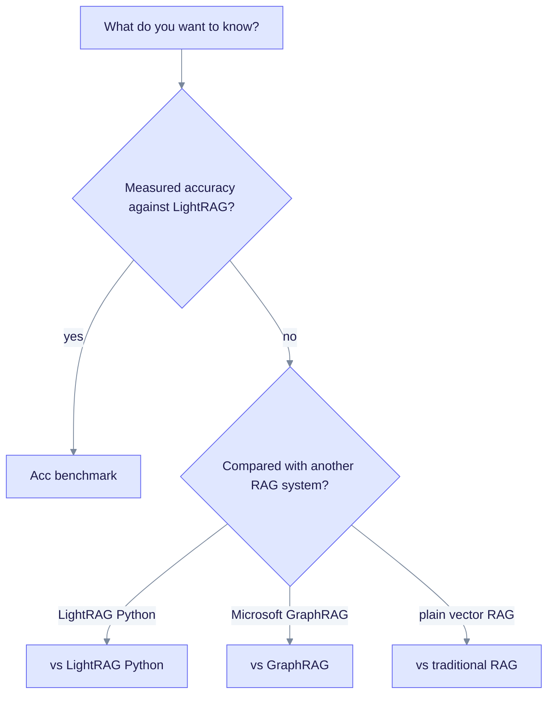

# Comparisons

These pages compare EdgeQuake with other ways to build RAG. They are for people choosing a tool. Each page says what is measured, what is only a design difference, and what we have not verified.

The one measured result is against LightRAG: a statistical tie on accuracy. Other pages compare design and features only.

| Page | What it covers |
| ---- | -------------- |
| [Acc benchmark](./eq-vs-lightrag-acc-bench.md) | The measured accuracy and latency results against LightRAG. This is the source of truth for those numbers. |
| [vs LightRAG (Python)](./vs-lightrag-python.md) | EdgeQuake and the Python original: modes, storage, and operations |
| [vs GraphRAG](./vs-graphrag.md) | Microsoft GraphRAG: communities and reports versus relationship search |
| [vs traditional RAG](./vs-traditional-rag.md) | What a graph adds to vector-only search, and what it costs |

## Which page to read

Start at the top of the chart and follow the first question that matches your need.

## Historical

- [Implementation differences, Feb 2026 snapshot](./edgequake-vs-lightrag-superiority-analysis.md): an old code audit, corrected and made neutral. Prefer the pages above.
