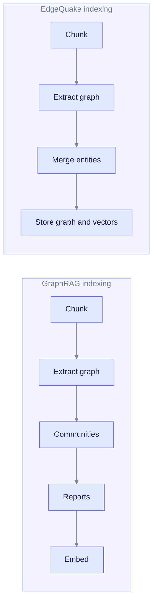
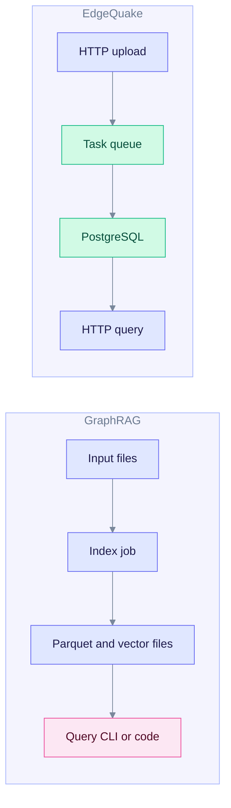

# EdgeQuake vs Microsoft GraphRAG

This page compares EdgeQuake with Microsoft GraphRAG. It is for teams who know they want a knowledge graph behind their RAG system and need to choose between the two designs.

Both build a graph of entities and relationships from your documents with an LLM. They differ in what they build on top of that graph, and in how they run.

We have not benchmarked EdgeQuake against GraphRAG, so this page makes no claims about cost, speed, or accuracy. It compares design and features only.

---

## The core difference

GraphRAG groups the graph into **communities** (clusters of related entities) at several levels, and asks an LLM to write a **report** for each one. Broad questions are answered from those reports.

EdgeQuake follows the LightRAG design. It does not write community reports by default. Broad questions are answered by searching **relationship descriptions**.

```mermaid
%%{init: {"theme":"base","themeVariables":{"primaryColor":"#E0E7FF","primaryBorderColor":"#6366F1","primaryTextColor":"#1E1B4B","secondaryColor":"#D1FAE5","secondaryBorderColor":"#10B981","secondaryTextColor":"#064E3B","tertiaryColor":"#FEF3C7","tertiaryBorderColor":"#F59E0B","tertiaryTextColor":"#6B7A90","lineColor":"#7A889C","clusterBkg":"rgba(99,102,241,0.07)","clusterBorder":"#A5B4FC","noteBkgColor":"#FEF9C3","noteTextColor":"#422006","textColor":"#6B7A90","titleColor":"#6B7A90","signalColor":"#7A889C","signalTextColor":"#6B7A90","loopTextColor":"#6B7A90","edgeLabelBackground":"#F1F5F9","actorLineColor":"#94A3B8"}}}%%
%% eq-theme:v1
flowchart TD
    subgraph GR["GraphRAG"]
        g1["Extract entities and relations"] --> g2["Detect communities (Leiden, hierarchical)"]
        g2 --> g3["LLM writes community reports"]
        g3 --> g4["Global search reads reports"]
    end
    subgraph EQ["EdgeQuake"]
        e1["Extract entities and relations"] --> e2["Embed entities and relations"]
        e2 --> e3["Global search reads relationships"]
    end
%% eq-classes
classDef eqLlm fill:#FEF3C7,stroke:#F59E0B,color:#451A03
class g3 eqLlm
```

Read each box top to bottom. GraphRAG adds a reporting step; EdgeQuake does not. That extra step is also where GraphRAG spends additional LLM calls at indexing time.

---

## Quick comparison

| Aspect | Microsoft GraphRAG | EdgeQuake |
| ------ | ------------------ | --------- |
| Language | Python | Rust |
| License | MIT | Apache-2.0 |
| Origin | [GraphRAG paper](https://arxiv.org/abs/2404.16130) | [LightRAG paper](https://arxiv.org/abs/2410.05779) |
| Communities | Leiden, hierarchical | Louvain by default, flat. Label propagation and connected components are also available. |
| Community reports | LLM-written, per level | Not by default. Optional extractive reports with `EDGEQUAKE_COMMUNITY_REPORTS`. |
| Claims extraction | Yes (optional) | No |
| Query modes | Local, Global, DRIFT, Basic | `naive`, `local`, `global`, `hybrid`, `mix`, `bypass` |
| Storage | Parquet files and a vector store such as LanceDB by default | PostgreSQL with pgvector and Apache AGE |
| Server and API | Library and CLI | REST API, WebSocket progress, MCP endpoint |
| Multi-tenancy | Not part of the project | Tenants, workspaces, row-level security |
| PDF input | Not part of the core pipeline | Built-in vision and text-based conversion |

---

## Query modes

| GraphRAG | EdgeQuake closest match | Notes |
| -------- | ----------------------- | ----- |
| Local search | `local` | Both start from entities and follow the graph |
| Global search | `global` (different method) | GraphRAG does map-reduce over community reports. EdgeQuake searches relationship vectors. |
| DRIFT search | None | Combines local search with community context |
| Basic search | `naive` | Plain vector search over text |
| None | `hybrid`, `mix`, `bypass` | Combined retrieval and a no-retrieval mode |

`global` has the same name but works differently. A question like "what are the main themes?" is answered from community reports in GraphRAG, and from relationship descriptions in EdgeQuake. The trade-off is that EdgeQuake skips the cost of writing reports, and GraphRAG gets an answer built from a summary of the whole corpus structure. For EdgeQuake's flow, see [Query flow](../architecture/query-flow.md).

---

## Indexing

Read each row left to right. The main extra stages in GraphRAG are community reports and, when enabled, claims.

What EdgeQuake adds around extraction:

- Entity names are normalized, and entities are merged. Descriptions are combined, and rewritten by an LLM when they grow long.
- Optional gleaning: extra passes to catch missed entities.
- Lineage from every entity back to its chunks, documents, and lines. See [Lineage tracking](../architecture/lineage-tracking.md).
- A task queue with cancel, retry, and progress. See [Data flow](../architecture/data-flow.md).

---

## Feature check

| Feature | GraphRAG | EdgeQuake |
| ------- | :------: | :-------: |
| Entity and relationship extraction | Yes | Yes |
| Hierarchical communities | Yes | No |
| LLM community reports | Yes | No (optional extractive reports) |
| Claims extraction | Yes | No |
| DRIFT search | Yes | No |
| Prompt tuning command | Yes | No |
| Gleaning | Not verified | Yes |
| LLM caching | Yes | Yes (keyword, answer, and extraction caches) |
| Streaming answers | Not verified | Yes |
| Multi-tenant isolation | Not part of the project | Yes |
| REST API and WebUI | Not part of the core package | Yes |
| OpenAI-style chat endpoint | Not part of the core package | Yes (`/api/v1/chat/completions`) |

"Not verified" means we did not check it, so we make no claim.

---

## Running them

GraphRAG usually runs as a CLI or notebook job. You index in batch, write files, and query from them.

EdgeQuake is a long-running service. You start PostgreSQL and the server, then send documents and questions over HTTP.

Read each row left to right. GraphRAG is file based and batch oriented. EdgeQuake is service based and incremental: you can add one document at a time.

---

## When to choose each

Choose **GraphRAG** when:

- You need hierarchical, report-style answers about the whole corpus.
- You want claims extraction or DRIFT search.
- Your workflow is batch analysis in Python.

Choose **EdgeQuake** when:

- You want a service with an API, tenants, and a UI.
- You want incremental ingestion with progress and cancel.
- You want one PostgreSQL database instead of separate file and vector stores.

---

## Moving between them

There is no automatic converter in either direction. The graphs use different schemas and communities are built differently. To switch, ingest the original documents into the new system and compare answers on your own questions.

## References

- [GraphRAG paper](https://arxiv.org/abs/2404.16130)
- [GraphRAG documentation](https://microsoft.github.io/graphrag/)
- [LightRAG paper](https://arxiv.org/abs/2410.05779)

## See also

- [vs LightRAG (Python)](./vs-lightrag-python.md)
- [vs traditional RAG](./vs-traditional-rag.md)
- [Community detection](../deep-dives/community-detection.md)
- [Query modes](../deep-dives/query-modes.md)
