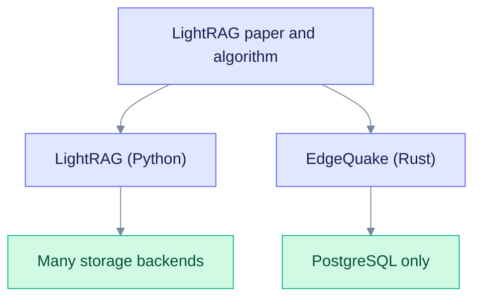

# EdgeQuake vs LightRAG (Python)

This page compares EdgeQuake with LightRAG, the Python project from HKU that EdgeQuake builds on. It is for teams choosing between them. It sticks to what the code, the LightRAG README, and the published benchmark can support.

**The short version:** on answer accuracy the two are tied in our benchmark. The real differences are in deployment, storage, and operations.

:::tip[Quick decision]
**Use LightRAG (Python)** if you want the reference implementation, a Python codebase, and a wider choice of storage backends.

**Use EdgeQuake** if you want a single Rust binary, PostgreSQL as the only store, multi-tenant isolation, and a built-in PDF pipeline.
:::

---

## How they relate

EdgeQuake follows the LightRAG idea ([paper](https://arxiv.org/abs/2410.05779)): extract entities and relationships with an LLM, build a graph, and answer with a mix of graph and vector retrieval. It is a separate codebase with its own choices, not a port line by line.



Read it top to bottom. Both start from the same idea, then differ in how they store data and run.

---

## Accuracy: a tie

The numbers below come from the [SPEC-001 benchmark](./eq-vs-lightrag-acc-bench.md). That page is the source of truth for them, including how they were measured.

Setup: GraphRAG-Bench medical-mid, 200 questions, Mix mode on both sides, Mistral Small and `mistral-embed`.

| Metric | EdgeQuake | LightRAG | Reading |
| ------ | --------- | -------- | ------- |
| Acc (n=200) | 0.792 | 0.786 | Statistical tie. The 95% CI of the difference is [-0.022, +0.034]. |
| Acc (n=2062, full set) | 0.786 | 0.786 | Point tie |
| Evidence recall | 0.932 | 0.949 | LightRAG is higher |
| Context relevancy | 0.471 | 0.510 | LightRAG is higher |
| Cold query p50 | 4447 ms | 4359 ms | About equal (1.02x) |
| Warm query p50 (caches on) | 82 ms | 993 ms | EdgeQuake faster, with caches enabled on both |

Do not read this as "EdgeQuake is more accurate". It is not, on this test. LightRAG retrieves slightly better evidence. See [the benchmark page](./eq-vs-lightrag-acc-bench.md) for per-question-type scores and the cache caveat.

---

## Query modes

Both projects use the names naive, local, global, hybrid, and mix. The meanings are close but not identical.

| Mode | EdgeQuake | LightRAG |
| ---- | --------- | -------- |
| `naive` | Vector search over chunks | Vector search over chunks |
| `local` | Entities matching specific names, then their graph neighbors | Entity-centred retrieval |
| `global` | Relationship vectors for broad themes | Relationship chains for broad themes |
| `hybrid` | Local, global, and naive, interleaved | Local and global |
| `mix` | Local, global, and naive, blended by weight or rank fusion | Graph and vector retrieval together (the default) |
| `bypass` | Direct LLM call, no retrieval | Not listed in the README's mode list |

The main difference is `hybrid`: EdgeQuake includes the naive arm, LightRAG does not. When you compare the two, set `mode` explicitly and use `mix` on both sides.

Neither project's `global` mode is Microsoft GraphRAG's community-report search. See [vs GraphRAG](./vs-graphrag.md).

---

## Storage

| Store | EdgeQuake | LightRAG |
| ----- | --------- | -------- |
| Key-value | PostgreSQL | JSON files, PostgreSQL, Redis, MongoDB, and others |
| Vectors | pgvector | Several, including PostgreSQL, Milvus, Qdrant, Faiss |
| Graph | Apache AGE | Several, including NetworkX, Neo4j, PostgreSQL, Memgraph |
| Default setup | PostgreSQL required | File and in-memory defaults |

EdgeQuake requires PostgreSQL 16 to 18 with pgvector and Apache AGE (the project ships `ghcr.io/raphaelmansuy/edgequake-postgres`). There is no in-memory server mode. LightRAG gives you more choices; EdgeQuake gives you one stack to operate. EdgeQuake has optional SQLite, Qdrant, and Neo4j adapters in the code, but the server does not assemble them.

---

## Other differences

| Area | EdgeQuake | LightRAG |
| ---- | --------- | -------- |
| Language and form | Rust, one server binary | Python package and server |
| Multi-tenancy | Tenants, workspaces, memberships, and row-level security | Workspace data isolation |
| PDFs | Built-in vision or text-based conversion with page images | Via the RAG-Anything integration |
| Background jobs | Task queue with cancel, leases, and per-tenant fairness | Not compared here |
| Multiple replicas | Supported with `Bridged` or `NotifyOnly` delivery | Not documented |
| Tracing | OpenTelemetry, with Langfuse attributes | Langfuse integration |
| Reranker | Optional, set with `EDGEQUAKE_RERANKER` | Supported |
| Entity merge | Automatic by normalized name; manual merge via `POST /api/v1/graph/entities/merge` | Supported |
| License | Apache-2.0 | MIT |

We leave out claims about speed, memory, and concurrency. We have not published a measurement that compares them, so we do not make them.

---

## API shape

LightRAG is a Python library with an optional server:

```python
rag = LightRAG(working_dir="./rag_storage", embedding_func=..., llm_model_func=...)
await rag.initialize_storages()
await rag.ainsert("Your document text")
result = await rag.aquery("What is the main topic?", param=QueryParam(mode="mix"))
```

EdgeQuake is a REST service first:

```bash
curl -X POST http://localhost:8080/api/v1/documents \
  -H "Content-Type: application/json" \
  -d '{"content": "Your document text", "title": "My Document"}'

curl -X POST http://localhost:8080/api/v1/query \
  -H "Content-Type: application/json" \
  -d '{"query": "What is the main topic?", "mode": "mix"}'
```

The Rust crate `edgequake-core` also exposes `EdgeQuake::insert(content, document_id)` and `EdgeQuake::query(query, params)` for embedding in a Rust program.

---

## When to choose each

Choose **EdgeQuake** when:

- You want one binary and one database to operate.
- You need tenants and workspaces with real isolation.
- You ingest many PDFs and want conversion built in.
- You need to run more than one API replica.
- You prefer a typed Rust codebase.

Choose **LightRAG (Python)** when:

- You want the reference implementation closest to the paper.
- Your team works in Python and wants to change the code quickly.
- You need a backend EdgeQuake does not run, such as Neo4j, MongoDB, or Milvus.
- You want integrations such as RAG-Anything.
- You are still prototyping.

---

## Moving from LightRAG to EdgeQuake

There is no importer for LightRAG storage files. The reliable path is to ingest your source documents again:

1. Start EdgeQuake and create a workspace. Pick the embedding model you want to keep, because it fixes the vector size for that workspace.
2. Upload the original files with `POST /api/v1/documents`, `/documents/upload`, or `/documents/pdf`.
3. Wait for the tasks to reach `Indexed`.
4. Run the same questions in `mix` mode and compare the answers.

Entity and relationship text will not match exactly, because the extraction runs again.

## See also

- [Acc benchmark](./eq-vs-lightrag-acc-bench.md)
- [Implementation differences snapshot](./edgequake-vs-lightrag-superiority-analysis.md)
- [Query flow](../architecture/query-flow.md)
- [LightRAG algorithm deep dive](../deep-dives/lightrag-algorithm.md)
- [vs GraphRAG](./vs-graphrag.md)
- [vs traditional RAG](./vs-traditional-rag.md)
