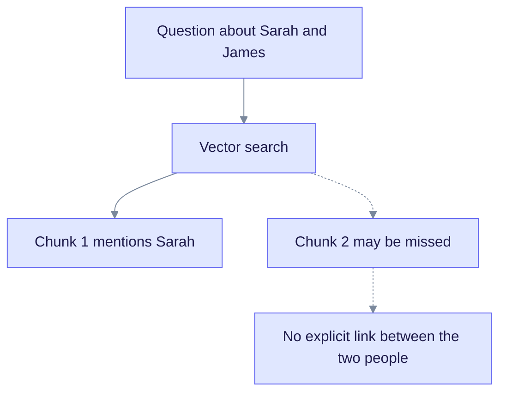
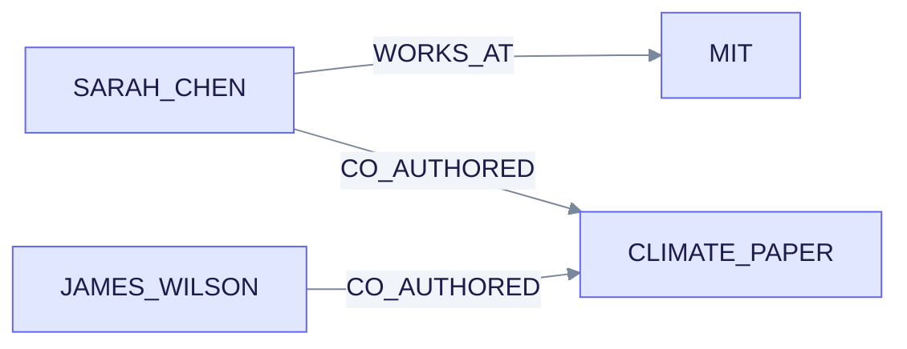
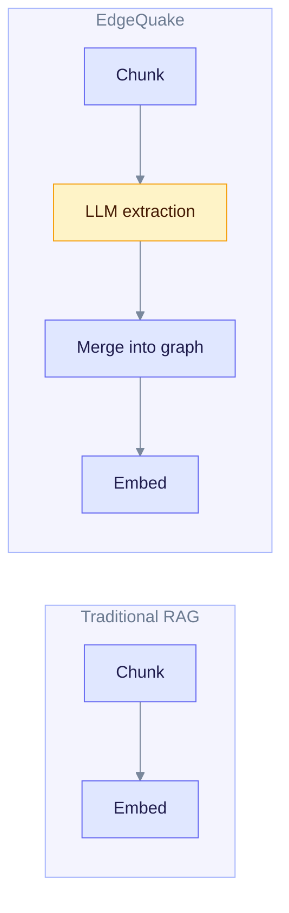

# EdgeQuake vs Traditional RAG

This page explains how graph-based RAG, as EdgeQuake does it, differs from vector-only RAG. It is for people deciding whether the extra indexing work of a graph is worth it for their documents.

**Traditional RAG** splits documents into chunks, turns each chunk into a vector, and at question time returns the chunks closest to the question. EdgeQuake does that too, and also builds a graph of entities and relationships, so it can follow connections between facts.

We have not measured EdgeQuake against a plain vector baseline, so this page gives no speed or cost numbers for either side. The only quality numbers here are from the LightRAG paper, and are labeled as such.

---

## Where vector-only search struggles

Take this text: "Sarah Chen works at MIT. She authored the climate paper with Dr. James Wilson." The question is "How are Sarah Chen and James Wilson connected?"

Read it top to bottom. Vector search ranks chunks by similarity to the question. The chunk that names James may rank low, and nothing links the two people.

Three recurring problems:

1. **Lost relationships.** Facts are spread across chunks, and similarity does not connect them.
2. **No overview.** A question like "what are the main themes?" has no single chunk that answers it.
3. **No chaining.** "Which organizations do Sarah's collaborators work for?" needs several lookups in a row.

---

## What the graph adds

During ingestion an LLM extracts entities and relationships from each chunk. EdgeQuake stores them as a graph next to the chunk vectors.

Read it left to right. Sarah and James are two steps apart, through the paper they both wrote. A graph lookup can follow that path directly.

At question time, `local` mode starts from entities in the question and walks the graph. `global` mode searches relationship descriptions for broad themes. See [Query flow](../architecture/query-flow.md).

---

## Side by side

| Aspect | Traditional RAG | EdgeQuake |
| ------ | --------------- | --------- |
| Retrieval | Vector similarity over chunks | Vector search plus graph search, by mode |
| Ingestion LLM calls | None, only embeddings | At least one extraction call per chunk, plus embeddings |
| Relationship questions | Depends on the chunks that happen to rank high | Can follow stored relationships |
| Overview questions | Weak | `global` mode searches relationship descriptions |
| Storage | A vector database | PostgreSQL with pgvector and Apache AGE |
| Traceability | Chunk references | Chunk, entity, and relationship [lineage](../architecture/lineage-tracking.md) |
| Operational surface | Small | Larger: task queue, extraction settings, graph |

EdgeQuake still has plain vector search. `naive` mode is exactly that, so you can use it for simple factual questions.

---

## Published research

The LightRAG paper ([arXiv:2410.05779](https://arxiv.org/abs/2410.05779)) compared a graph-based method against a naive vector baseline. A model acting as a judge picked the better answer for each question, on four datasets. The table shows the share of comparisons won on comprehensiveness.

| Dataset | Naive RAG wins | LightRAG wins |
| ------- | -------------- | ------------- |
| Agriculture | 32.4% | 67.6% |
| CS | 38.4% | 61.6% |
| Legal | 16.4% | 83.6% |
| Mix | 38.8% | 61.2% |

These are the paper's results with its own models and data. They are not EdgeQuake measurements. EdgeQuake's own benchmark against LightRAG is a tie on accuracy. See [the Acc benchmark](./eq-vs-lightrag-acc-bench.md).

---

## What it costs

Read each row left to right. The extra LLM extraction step is the main cost. It adds time and LLM spend per document, and it needs a working LLM provider at ingestion time. Extraction speed depends on your model and settings, and local models can be slow.

The extra work also brings maintenance: you manage extraction settings, entity merging, and a graph store, on top of a vector index.

---

## When to choose each

Plain vector RAG fits when:

- Questions are simple lookups in factual text.
- You re-index often and need it cheap and fast.
- You want the smallest possible infrastructure.

EdgeQuake fits when:

- Documents are full of people, organizations, and links between them.
- Users ask how things connect, or ask for themes across many documents.
- You want to trace an answer back to its sources.
- You need tenants, workspaces, and a managed ingestion queue.

You do not have to choose once. `mix` mode (the default) runs graph and vector retrieval together, and `naive` mode gives you plain vector search.

| Mode | Strategy |
| ---- | -------- |
| `naive` | Vector search over chunks |
| `local` | Entities from the question, then the graph around them |
| `global` | Relationship vector search for themes |
| `hybrid` | Local, global, and naive interleaved |
| `mix` | The same three arms, blended by weight or rank fusion (default) |
| `bypass` | No retrieval |

## See also

- [Graph RAG concepts](../concepts/graph-rag.md)
- [Hybrid retrieval](../concepts/hybrid-retrieval.md)
- [Query modes](../deep-dives/query-modes.md)
- [LightRAG algorithm](../deep-dives/lightrag-algorithm.md)
- [vs GraphRAG](./vs-graphrag.md)
