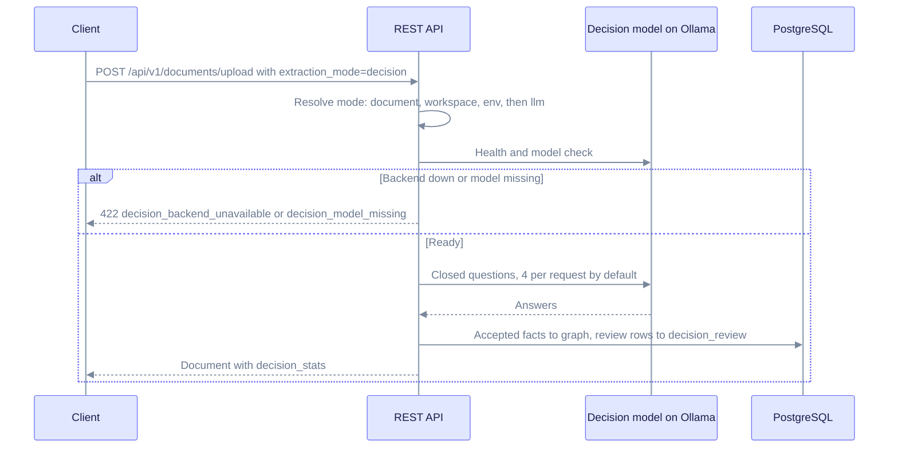
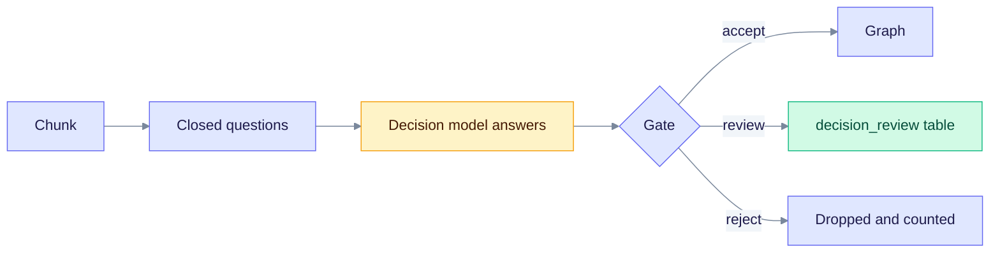

> **Preview since v0.31.0** · Current release: v0.32.2 · Schema 166 or later · Spec: [SPEC-160](../../specs/160-tev1/README.md) · Quality: [W8 report](../../specs/160-tev1/measurements/w8-report.md)

# Decision extraction

Decision extraction is a second way to build the knowledge graph. A small model answers closed questions about each chunk. It never writes free text into the graph. Only answers the gate accepts become entities and relations. The usual chat-LLM extractor stays the default.

This mode is a **preview**. Gate presets are marked **Uncalibrated** in the workspace card. It does not claim the same quality as a frontier chat model. [SPEC-001 Acc](../operations/release-and-cd.md#spec-001-lightrag-acc-before-tag) has not been re-scored for this path.

## When it fits

Use it when extraction should stay on the server, skip chat-LLM tokens, and stay repeatable. The Web UI describes it as English-only closed questions. A short English probe ([W8 report](../../specs/160-tev1/measurements/w8-report.md), two documents, one run each) found:

| Setup | Gold entities (of 11) | Gold relations (of 10) |
| ----- | ---------------------: | ---------------------: |
| Chat LLM (`gemma4`) | 11 | 9 |
| `tev1:0.8b`, balanced | 5 | 0 |
| `tev1:latest` (4B), balanced | 10 | 8 |

The 0.8B tag is the server default. Treat it as a smoke and low-memory option. For quality on that probe, use a 4B tag and the `balanced` or `recall` preset. Extra graph edges were not judged by hand, so the report makes no precision claim.

## What stays the same

Unset `EDGEQUAKE_EXTRACTION_MODE` still means **llm**. Existing documents, workspaces, and tests keep today's extractor. Merger, embeddings, and graph storage consume the same extraction result. A bad mode word is an error. A down decision backend fails the upload. Decision text is never sent to the chat LLM.

Precedence for the mode word is **document → workspace → environment → `llm`**.

## Turn it on

1. Run Ollama and pull a model: `ollama pull tev1:0.8b` (or a larger Tev1 tag).
2. Leave `EDGEQUAKE_DECISION_ENABLED` unset or set it to `1`. That makes the engine available. It does not switch the default mode to decision.
3. In the workspace card, set **Extraction mode** to **Decision**, or pick **Decision** on a single upload.

The engine talks to `http://localhost:11434` unless `EDGEQUAKE_DECISION_BASE_URL` is set. It does not follow `OLLAMA_HOST`.

`GET /api/v1/decision/status` returns 200 even when the backend is down. Its `backend` object carries `reachable`, `model_present`, and `decision_capable`. The probe stops after 3 seconds and shows the host only.

Uploads that resolve to decision and cannot run return **422**. A workspace request with an unknown mode word returns 400 instead.

| `code` | When |
| ------ | ---- |
| `invalid_extraction_mode` | Unknown word. Allowed: `inherit`, `llm`, `decision`. |
| `decision_disabled` | `EDGEQUAKE_DECISION_ENABLED=0` |
| `decision_not_activated` | Enabled is `workspace` and this workspace has not opted in |
| `decision_backend_unavailable` | The status check cannot reach the backend |
| `decision_model_missing` | The backend is up and the model is not pulled |

## Workspace and upload

Workspace create and update accept:

| Field | Meaning |
| ----- | ------- |
| `extraction_mode` | `llm`, `decision`, or `inherit` / empty / `none` to clear |
| `decision_model` | Model tag. `inherit` clears it and the server default applies |
| `decision_pack_size` | Questions per request, 1–16. `0` clears it. Default **4** |
| `decision_gate_preset` | `strict`, `balanced`, or `recall` |

File, PDF, and batch uploads take the same `extraction_mode` field. An optional `decision_gate_preset` applies to that upload. A bad word fails the whole batch before any file is stored. The choice applies to new documents. Reprocess a document to switch a document that already ran.

| Preset | Effect |
| ------ | ------ |
| `strict` | Fewer facts, each one surer |
| `balanced` | Default trade-off |
| `recall` | More facts, more items left for review |

Presets are not calibrated. The card shows **Uncalibrated** until a later measurement says otherwise.

## What enters the graph

The sequence shows one upload in decision mode. The chart after it shows what the gate does with each answer.

Read the diagram from the top. The API checks the backend before it sends any chunk, so a down backend fails the upload early.

Read the chart from the left. The model only answers closed questions. The gate sorts each answer into one of three bands.

| Band | Result |
| ---- | ------ |
| Accept | Entity or relation is written to the graph |
| Review | Kept out of the graph and stored in `decision_review` |
| Reject | Dropped and counted |

There is no review screen in this preview. The document shows the counts. `decision_stats` on the document holds `chunks`, `entities`, `relations`, `review`, `rejected`, `backend_calls`, `cache_hits`, `warnings`, `model`, and `source`. LLM documents omit these fields.

Migration **166** adds two tables:

- `decision_cache` — content-addressed answers so a retry after a crash is cheap
- `decision_review` — review-band facts, deleted with the document and the workspace

The migration is additive. Run `edgequake migrate` before serving a binary whose schema train includes 166. `EDGEQUAKE_DECISION_ENABLED=0` blocks new decision uploads. Graphs already built stay in place.

## API

| Call | Role |
| ---- | ---- |
| `GET /api/v1/decision/status?model=` | Engine activation, host, and a live probe of one model |
| `GET /api/v1/decision/models?model=` | Models on that host, each flagged `decision_capable` when the probe finished |
| Document list and detail | `extraction_mode`, `extraction_mode_source`, `decision_stats` when present |
| Workspace response | The stored fields plus `effective_extraction_mode` |

`extraction_mode_source` is `document`, `workspace`, `env`, or `default`.

## Environment

A bad value fails startup. It does not fall back.

| Variable | Default | Meaning |
| -------- | ------- | ------- |
| `EDGEQUAKE_EXTRACTION_MODE` | unset (`llm`) | Fleet default mode word |
| `EDGEQUAKE_DECISION_ENABLED` | unset (on) | `1` forces the engine on. `0` locks it off. `workspace` lets each workspace opt in |
| `EDGEQUAKE_DECISION_BACKEND` | `ollama_system_one` | `openai_logprobs` is refused at boot |
| `EDGEQUAKE_DECISION_BASE_URL` | `http://localhost:11434` | Decision Ollama URL. Does not follow `OLLAMA_HOST` |
| `EDGEQUAKE_DECISION_API_KEY` | unset | Reserved for a future logprobs backend. Never logged |
| `EDGEQUAKE_DECISION_MODEL` | `tev1:0.8b` | Default model tag |
| `EDGEQUAKE_DECISION_PACK_SIZE` | `4` | Questions per request (1–16) |
| `EDGEQUAKE_DECISION_GATE_PRESET` | `balanced` | Fleet gate preset |
| `EDGEQUAKE_DECISION_TIMEOUT_SECS` | `600` | Per-request timeout |
| `EDGEQUAKE_DECISION_KEEP_ALIVE` | `30m` | Ollama `keep_alive` so the model stays loaded |
| `EDGEQUAKE_DECISION_CACHE_TTL_DAYS` | `30` | Answer cache TTL |
| `EDGEQUAKE_DECISION_CACHE_MAX_ROWS` | `200000` | Cache rows per workspace |

Full table: [Configuration](../operations/configuration.md#decision-extraction-spec-160-preview). Copy-paste block: [`.env.example`](../../.env.example).

## Not in this preview

- The `openai_logprobs` / `llama-server` backend. Setting it refuses to boot. Use `ollama_system_one`.
- A screen to accept or reject review rows.
- Calibrated gate presets.
- A SPEC-001 Acc score for this extractor.
