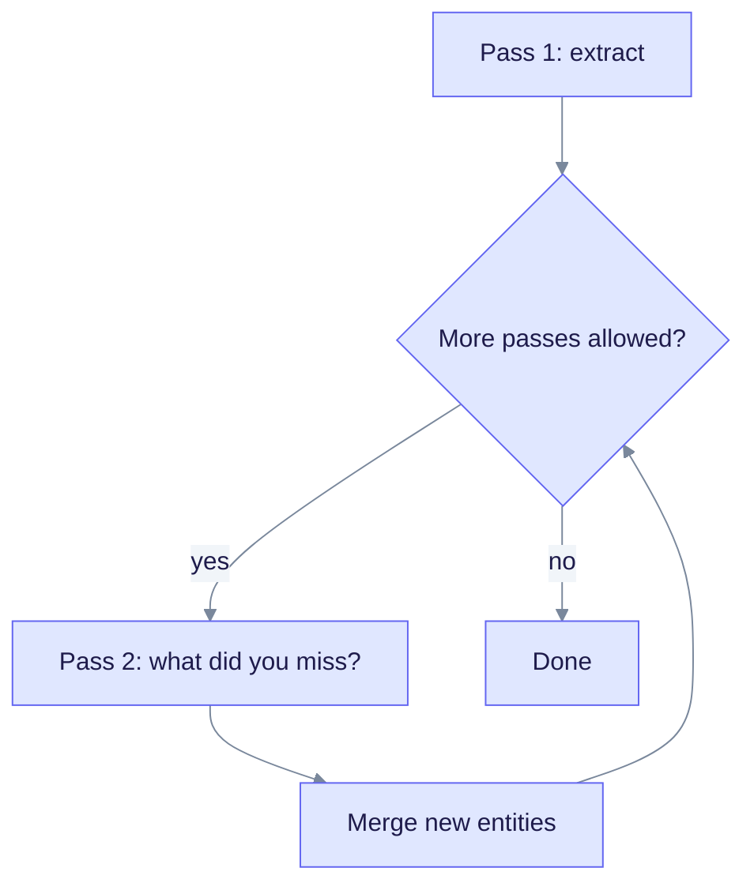
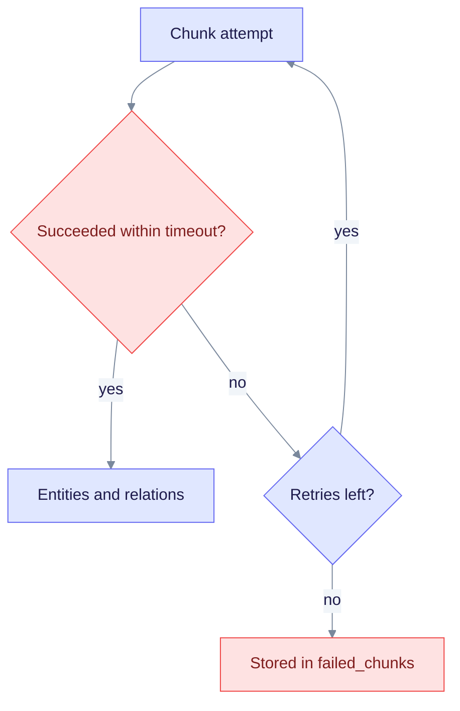

> **Released: v0.32.2** · Contract: [OpenAPI snapshot](../../edgequake_webui/openapi/openapi.snapshot.json) · Ops: [Ingestion cancel and fairness](../ingestion-cancel-and-fairness.md)

# Entity Extraction

Entity extraction is the step that reads your text and writes the knowledge graph. A language model finds the entities (people, organizations, concepts) and the relationships between them. This page is for developers who want to know what the model is asked to do and how the result is cleaned up.

## What happens to each chunk

```mermaid
%%{init: {"theme":"base","themeVariables":{"primaryColor":"#E0E7FF","primaryBorderColor":"#6366F1","primaryTextColor":"#1E1B4B","secondaryColor":"#D1FAE5","secondaryBorderColor":"#10B981","secondaryTextColor":"#064E3B","tertiaryColor":"#FEF3C7","tertiaryBorderColor":"#F59E0B","tertiaryTextColor":"#6B7A90","lineColor":"#7A889C","clusterBkg":"rgba(99,102,241,0.07)","clusterBorder":"#A5B4FC","noteBkgColor":"#FEF9C3","noteTextColor":"#422006","textColor":"#6B7A90","titleColor":"#6B7A90","signalColor":"#7A889C","signalTextColor":"#6B7A90","loopTextColor":"#6B7A90","edgeLabelBackground":"#F1F5F9","actorLineColor":"#94A3B8"}}}%%
%% eq-theme:v1
flowchart LR
    A["Text chunk"] --> B["Prompt with entity types"]
    B --> C["Model reply as JSON"]
    C --> D["Parse and repair"]
    D --> E["Normalize names"]
    E --> F["Apply type and size limits"]
    F --> G["Entities and relations"]
%% eq-classes
classDef eqLlm fill:#FEF3C7,stroke:#F59E0B,color:#451A03
class C eqLlm
```

Read the chart from the left. The model sees one chunk at a time. EdgeQuake parses the reply, fixes common formatting problems, normalizes names, and applies limits before anything is stored.

Each extracted item has:

- **Entity:** name, type, and a description based on the text.
- **Relationship:** source entity, target entity, keywords, and a description.

A model is used because it works on any domain without training data and writes useful descriptions. The cost is speed and the need for a provider. A provider can be a local one, such as Ollama.

## Entity types

The default list has 12 types:

| Type | Use for |
|------|---------|
| `PERSON` | People and characters |
| `CREATURE` | Animals and fictional creatures |
| `ORGANIZATION` | Companies, institutions, teams |
| `LOCATION` | Places and regions |
| `EVENT` | Meetings, incidents, milestones |
| `CONCEPT` | Ideas, theories |
| `METHOD` | Techniques and procedures |
| `CONTENT` | Documents, books, articles |
| `DATA` | Datasets, metrics, figures |
| `ARTIFACT` | Tools, products, systems |
| `NATURALOBJECT` | Natural objects and substances |
| `OTHER` | Anything that fits no other type |

A workspace can replace this list with `entity_types`, up to 20 entries. Use domain terms such as `PROTEIN` or `LEGAL_TERM`.

- `entity_types_strict` defaults to `true`. An unknown type is remapped to a listed type.
- Set `entity_types_strict` to `false` to keep new types as they are.
- A workspace can also restrict relation types.
- PDF figures can become entity nodes too. See [PDF processing](../deep-dives/pdf-processing.md).

## Name normalization

Before storage, every name is normalized to upper case with underscores. This makes "John Doe" and "john doe" the same node, so entities merge across documents.

| Raw name | Stored as |
|----------|-----------|
| `John Doe` | `JOHN_DOE` |
| `john doe` | `JOHN_DOE` |
| `the Company` | `COMPANY` |
| `John's team` | `JOHN_TEAM` |

The rules, in order:

1. Trim the name and apply Unicode NFC.
2. Lower-case it and drop a leading "the", "a" or "an".
3. Drop possessive endings such as `'s`.
4. Join the words with `_` and upper-case the result.

Very short numbers and opaque IDs (UUIDs, long hashes) are rejected as names. The canonical implementation is `normalize_entity_name` in `edgequake-storage`; the API calls it.

## Output format

The production extractor asks the model for a JSON object. The parser also repairs fenced, truncated or preamble-wrapped replies. A tuple format that uses `<|#|>` as the field delimiter and `<|COMPLETE|>` as the end marker exists in the `SOTAExtractor` and the hybrid parser. The API pipeline does not use it by default.

## Gleaning: a second pass

A model can miss entities. Gleaning asks it again, listing what it already found.

Read the chart from the top. Each extra pass merges what it finds, and the loop stops at the pass limit.

- Gleaning is on by default, with `max_gleaning` set to 1. The cap is 2 extra passes.
- Local providers (Ollama, LM Studio and similar) have gleaning off by default, because each pass is slow on a small machine.
- Set both per upload with `enable_gleaning` and `max_gleaning`.
- This page makes no claim about how much recall gleaning adds. Measure it on your own data.

See [Gleaning](../deep-dives/gleaning.md).

## Resilience: timeouts, retries, concurrency

Each chunk is one extraction job. Its failures are handled per chunk.

- **Timeout.** A chunk gets 180 seconds with a cloud provider and 600 seconds with a local one.
- **Retries.** A failed chunk is retried up to 3 times, starting with a 1 second delay.
- **Concurrency.** Up to 16 chunks run at once with a cloud provider, and 1 with a local one. `EDGEQUAKE_MAX_CONCURRENT_EXTRACTIONS` overrides the count, up to a hard cap of 32.
- **Failed chunks.** A chunk that still fails is stored in the `failed_chunks` table. You can list and retry it.

Read the chart from the top. A chunk either finishes or is parked for a manual retry. Chunks themselves run in parallel, as described above.

## Limits per reply

To keep one chunk from flooding the graph, a reply is capped at 40 entities and 100 rows in total by default. Change the caps with `EDGEQUAKE_MAX_EXTRACTION_ENTITIES` and `EDGEQUAKE_MAX_EXTRACTION_RECORDS`, or per upload with `extract_max_entities` and `extract_max_records`.

## Decision mode (preview)

A small local model can answer closed questions instead of running this chat-model pass. The default stays the chat-model extractor. See [Decision extraction](decision-extraction.md).

## Cancel

You can cancel a task during extraction. See [Ingestion cancel and fairness](../ingestion-cancel-and-fairness.md).

## Learn more

- [Knowledge graph](knowledge-graph.md): where the results are stored.
- [Hybrid retrieval](hybrid-retrieval.md): how queries use them.
- [LightRAG algorithm](../deep-dives/lightrag-algorithm.md)
- [Entity normalization](../deep-dives/entity-normalization.md)

## Source code

- [Extractors](https://github.com/raphaelmansuy/edgequake/tree/edgequake-main/edgequake/crates/edgequake-pipeline/src/extractor)
- [Prompts and parsers](https://github.com/raphaelmansuy/edgequake/tree/edgequake-main/edgequake/crates/edgequake-pipeline/src/prompts)
- [Name normalizer](https://github.com/raphaelmansuy/edgequake/blob/edgequake-main/edgequake/crates/edgequake-storage/src/entity_id.rs)
