> **Released: v0.32.2** · Feature IDs and code anchors: [Feature registry](../features.md)

# Feature Tour

This page lists what EdgeQuake can do today, in plain terms, with a link to learn more. It is for evaluators and new users.

```mermaid
%%{init: {"theme":"base","themeVariables":{"primaryColor":"#E0E7FF","primaryBorderColor":"#6366F1","primaryTextColor":"#1E1B4B","secondaryColor":"#D1FAE5","secondaryBorderColor":"#10B981","secondaryTextColor":"#064E3B","tertiaryColor":"#FEF3C7","tertiaryBorderColor":"#F59E0B","tertiaryTextColor":"#6B7A90","lineColor":"#7A889C","clusterBkg":"rgba(99,102,241,0.07)","clusterBorder":"#A5B4FC","noteBkgColor":"#FEF9C3","noteTextColor":"#422006","textColor":"#6B7A90","titleColor":"#6B7A90","signalColor":"#7A889C","signalTextColor":"#6B7A90","loopTextColor":"#6B7A90","edgeLabelBackground":"#F1F5F9","actorLineColor":"#94A3B8"}}}%%
%% eq-theme:v1
flowchart LR
    A["Upload: text, PDF, images"] --> B["Ingest pipeline"]
    B --> C["Knowledge graph and vectors"]
    C --> D["Six query modes"]
    D --> E["REST API, UI, MCP"]
%% eq-classes
classDef eqActor fill:#FCE7F3,stroke:#EC4899,color:#500724
class E eqActor
```

Read the chart from the left. Anything you upload goes through one pipeline into PostgreSQL. You query it through the API, the web UI or MCP.

## Knowledge graph

- **Entity extraction.** A model finds people, organizations, places, concepts and more. See [Entity extraction](entity-extraction.md).
- **Relationship mapping.** Each link carries keywords and a description.
- **Gleaning.** An optional second pass looks for missed entities. It is on by default for cloud providers and off by default for local ones. See [Gleaning](../deep-dives/gleaning.md).
- **Community detection.** Louvain clustering groups related entities. See [Community detection](../deep-dives/community-detection.md).
- **Custom entity types.** Choose a preset in the UI (General, Manufacturing, Healthcare, Legal, Research, Finance, or Blank), or define up to 20 types per workspace through the API.
- **Knowledge injection.** Add glossaries, acronyms and synonyms to a workspace. See [Knowledge injection](../tutorials/knowledge-injection.md).

## Decision extraction (preview)

A second extraction mode answers closed questions with a small local model (default `tev1:0.8b` on Ollama). Accepted answers enter the same graph. The chat-model extractor stays the default. Gate presets are uncalibrated, and this path has no SPEC-001 accuracy score. See [Decision extraction](decision-extraction.md).

## Query engine: six modes

| Mode | Best for |
|------|----------|
| `naive` | Simple fact lookups from chunk text |
| `local` | Questions about one entity and its neighbors |
| `global` | Broad, thematic questions |
| `hybrid` | Local, global and naive arms interleaved |
| `mix` (default) | Local, global and naive arms blended by weight or RRF |
| `bypass` | Model only, no retrieval |

This page gives no latency figures. Latency depends on your model, hardware and data size. See [Hybrid retrieval](hybrid-retrieval.md) and [Product limits](../product-limits.md).

## Retrieval details

- **Graph walk.** The default walk is breadth-first (`bfs`). Set `EDGEQUAKE_GRAPH_WALK=ppr` to use Personalized PageRank.
- **Bipartite entity and chunk pick.** Local, global and mix use links between entities and chunks to choose chunks.
- **HNSW readiness check.** With `EDGEQUAKE_HNSW_PARTIAL_BY_WORKSPACE` on, `/ready` fails while a vector table lacks its HNSW index. Warm the index with `POST /api/v1/admin/ann/warmup`.
- **Intent-gated arms.** `mix` and `hybrid` can skip arms that do not help the question.
- **Failed-chunk retry.** Extraction failures are stored, listed and can be retried.
- **Faithfulness sampling.** A heuristic check, plus an optional model judge (`EDGEQUAKE_FAITHFULNESS_JUDGE`).
- **Accuracy gate.** `make spec046-acc` writes a deterministic report without an API key.

Runbooks: [SPEC-046 ops runbooks](../../specs/046-graphrag-study/13-OPS-RUNBOOKS.md).

## PDF pipeline

PDFs run in two tasks: convert to Markdown, then ingest.

| Backend | What it does | Needs a model? |
|---------|--------------|----------------|
| `vision` (default) | A vision model reads each page as an image | Yes |
| `edgeparse` | Fast text extraction on the CPU | No |
| `edgeparse-ocr` | EdgeParse plus Tesseract for scanned tables | No |
| `auto` | Automatic routing between backends. Opt-in only; never the default | Depends on the route |

Tables and multi-column layouts are handled best by the vision backend. See [PDF processing](../deep-dives/pdf-processing.md).

## Production features

- **REST API.** OpenAPI 3.1, streaming responses, batch upload, health and readiness probes.
- **Multi-tenant.** Tenant and workspace isolation, enforced in PostgreSQL with row-level security.
- **Auth and audit.** Built-in login, API keys, enterprise SSO (v0.30.0) and audit logging.
- **PostgreSQL 16, 17 and 18.** With pgvector and Apache AGE.
- **Explicit schema.** Schema changes run through `edgequake migrate`. By default the server does not start while the schema is pending (`EDGEQUAKE_SCHEMA_GATE=fail`).
- **Multi-arch images.** `linux/amd64` and `linux/arm64`, published to GHCR on each release.
- **MCP.** Expose EdgeQuake to AI agents through the [Model Context Protocol server](../../mcp/README.md).
- **Web UI.** Next.js and React 19, with live progress and an interactive graph view.
- **Providers.** Ollama, OpenAI, Anthropic, LM Studio, oMLX and other OpenAI-compatible servers. See [Providers](../providers/index.md).
