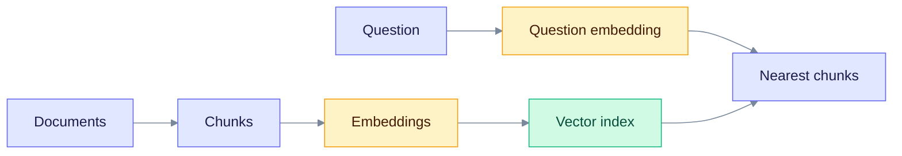
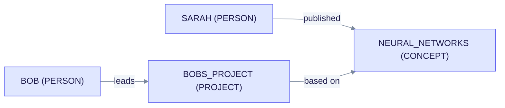
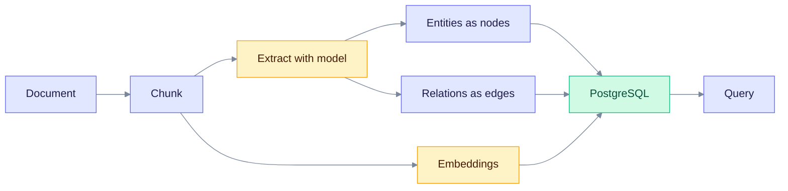

> **Released: v0.32.2** · Contract: [OpenAPI snapshot](../../edgequake_webui/openapi/openapi.snapshot.json) · Ops: [Ingestion cancel and fairness](../ingestion-cancel-and-fairness.md)

# Graph-RAG: The Foundation

Graph-RAG adds a knowledge graph to retrieval-augmented generation (RAG). A graph records how things relate, which plain vector search cannot do. This page is for readers who are new to the idea.

## What is Graph-RAG?

Graph-RAG combines two parts:

1. **RAG.** Fetch passages from your documents and give them to a language model, so its answer rests on your data.
2. **A knowledge graph.** Store the entities in those documents (people, places, concepts) as nodes, and the links between them as edges.

Relationships often matter as much as the entities. The graph keeps them.

## The problem with plain RAG

Plain RAG splits documents into chunks, turns each chunk into a vector, and returns the chunks closest to the question.

Read the chart from the left. Each chunk stands alone, so no link between chunks is stored.

Example question: "How did Sarah's research influence Bob's work?" Plain RAG may return one chunk about Sarah's paper and one about Bob's project. Neither chunk says that Bob's work builds on Sarah's. The model must guess the link.

## How a graph helps

A graph stores the link as an edge. The model can follow edges from one entity to the next.

Read the arrows as sentences. Sarah published work on neural networks. Bob's project is based on neural networks. Following both edges connects Sarah to Bob.

## How EdgeQuake does it

| Part | What it does | How |
|------|--------------|-----|
| Entity and relationship extraction | Finds entities and links in text | One model call per chunk, with an optional second pass (gleaning) |
| Knowledge graph | Stores the structure | PostgreSQL with Apache AGE |
| Vector embeddings | Finds similar text and entities | pgvector (`vector` or `halfvec`) |
| Multimodal assets | Keeps PDF figures and charts | Multimodal asset store plus vision ingest |
| Retrieval | Reads both stores | Six query modes; the default is `mix` |

Read the chart from the document. One extraction pass yields nodes and edges. Chunks, entities and relations are all embedded. Everything lands in PostgreSQL, and queries read from there.

## What you gain

| Benefit | Meaning |
|---------|---------|
| Multi-hop reasoning | Follow a chain of relationships across several steps |
| Entity disambiguation | Keep "Apple" the company apart from "apple" the fruit |
| Cross-document links | Connect facts that live in different documents |
| Richer context | Add related entities to the model's prompt |

## Learn more

- [Entity extraction](entity-extraction.md): how text becomes entities.
- [Knowledge graph](knowledge-graph.md): how the graph is stored.
- [Hybrid retrieval](hybrid-retrieval.md): how queries use both stores.
- [LightRAG algorithm](../deep-dives/lightrag-algorithm.md): the algorithm EdgeQuake follows.

## Source code

The ingest pipeline lives in [`edgequake-pipeline`](https://github.com/raphaelmansuy/edgequake/tree/edgequake-main/edgequake/crates/edgequake-pipeline/src), and the query engine lives in [`edgequake-query`](https://github.com/raphaelmansuy/edgequake/tree/edgequake-main/edgequake/crates/edgequake-query/src).
