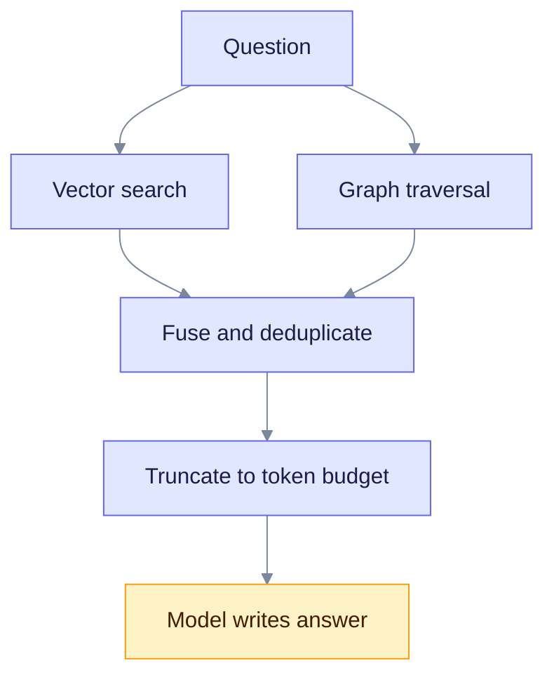
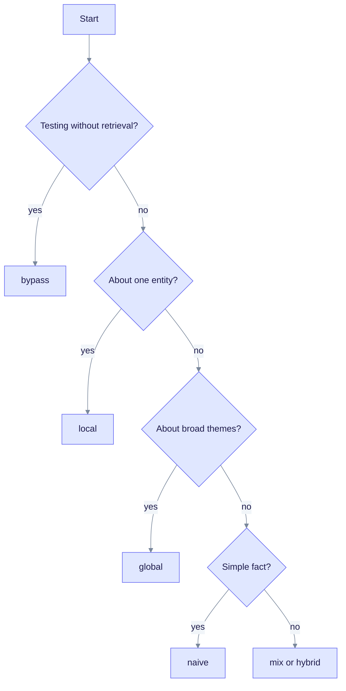

> **Released: v0.32.2** · Contract: [OpenAPI snapshot](../../edgequake_webui/openapi/openapi.snapshot.json) · Ops: [Ingestion cancel and fairness](../ingestion-cancel-and-fairness.md)

# Hybrid Retrieval

Hybrid retrieval answers a question by using vector search and the knowledge graph together. This page explains the six query modes and how to pick one. It is for developers who call the query API or tune answers.

## The idea

Vector search finds text that sounds like the question. Graph traversal follows links between entities. Each misses things the other finds, so EdgeQuake can use both.



Read the chart from the top. The two searches run side by side. Their results are merged, trimmed to fit the model's context, and sent to the model.

| Aspect | Vector search | Graph traversal |
|--------|---------------|-----------------|
| Best for | Similar meaning | Links between entities |
| Finds | Similar text chunks | Connected entities and relations |
| Misses | Indirect connections | Nuance that is not in an edge |

Example question: "What did Sarah Chen work on?" Vector search returns chunks that mention Sarah Chen. The graph adds the edge `SARAH_CHEN` researches `NEURAL_NETWORKS`. Together they give a fuller context.

## Two levels, as in LightRAG

EdgeQuake follows the LightRAG idea of two retrieval levels:

- **Low level.** Start from entities named in the question and read their direct neighbors. This fits "Who is Sarah Chen?"
- **High level.** Search relationship descriptions for broad themes. This fits "What are the main AI research themes?"

## The six query modes

Set `mode` in the request. If you leave it out, EdgeQuake uses `mix`.

| Mode | What it searches | Best for |
|------|------------------|----------|
| `naive` | Chunk vectors only | Simple facts |
| `local` | Entity vectors, then each entity's neighborhood | "Who or what is X?" |
| `global` | Relationship vectors plus graph context | "What are the themes?" |
| `hybrid` | Local, global and naive, interleaved round-robin | Multi-part questions |
| `mix` | Local, global and naive, blended by weights or rank fusion | General use (default) |
| `bypass` | Nothing; the model answers alone | Testing and debugging |

Two points differ from upstream LightRAG. EdgeQuake `hybrid` also includes the naive chunk arm. EdgeQuake `mix` blends the arms by weighted score, not round-robin. Always set `mode` explicitly when you compare systems.

### Choose a mode



Read the chart from the top and take the first branch that fits. When unsure, use `mix`.

## Fusion and truncation

After retrieval, EdgeQuake collects chunks, entities and relationships, removes duplicates, ranks them, and trims them to a token budget.

| Budget | Default |
|--------|---------|
| Entity descriptions | 6,000 tokens |
| Relationship descriptions | 8,000 tokens |
| Total context | 30,000 tokens |
| Reserved buffer | 200 tokens |
| Minimum share for chunks | 40% of the budget after the buffer |

The chunk floor stops entities and relationships from crowding out the source text. Set `EDGEQUAKE_MIN_CHUNK_BUDGET_RATIO` to change it (range 0.0 to 0.9). For `mix`, you can pass `mix_weights` in the request to change how much each arm counts.

## API example

```bash
# Explicit mode
curl -s -X POST http://localhost:8080/api/v1/query \
  -H "Content-Type: application/json" \
  -d '{"query": "Who is Sarah Chen?", "mode": "local"}' | jq -r .answer

# Default mode (mix)
curl -s -X POST http://localhost:8080/api/v1/query \
  -H "Content-Type: application/json" \
  -d '{"query": "Tell me about the research"}' | jq -r .answer
```

Use port 8090 with `make dev`. The reply has `answer`, `mode`, `sources`, `stats`, and more. Other request fields include `include_references`, `include_subgraph`, `max_results`, `enable_rerank`, `conversation_history` and `document_filter`. See [Query modes](../deep-dives/query-modes.md) and the [REST API](../api-reference/rest-api.md).

## Learn more

- [Graph-RAG](graph-rag.md): the foundation.
- [Entity extraction](entity-extraction.md): how entities are found.
- [Knowledge graph](knowledge-graph.md): how data is stored.
- [LightRAG algorithm](../deep-dives/lightrag-algorithm.md)

## Source code

- [Query engine](https://github.com/raphaelmansuy/edgequake/tree/edgequake-main/edgequake/crates/edgequake-query/src/engine_impl)
- [Query modes](https://github.com/raphaelmansuy/edgequake/blob/edgequake-main/edgequake/crates/edgequake-query/src/modes.rs)
- [Context building](https://github.com/raphaelmansuy/edgequake/blob/edgequake-main/edgequake/crates/edgequake-query/src/context.rs)
